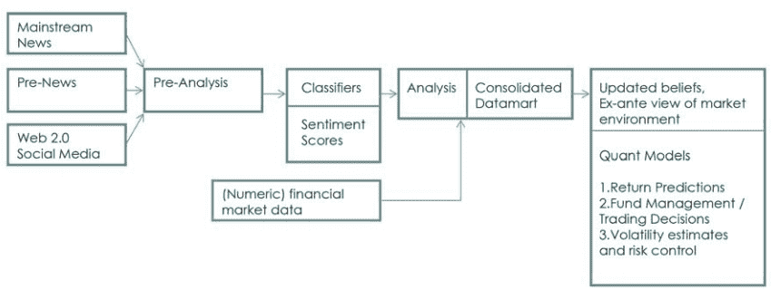
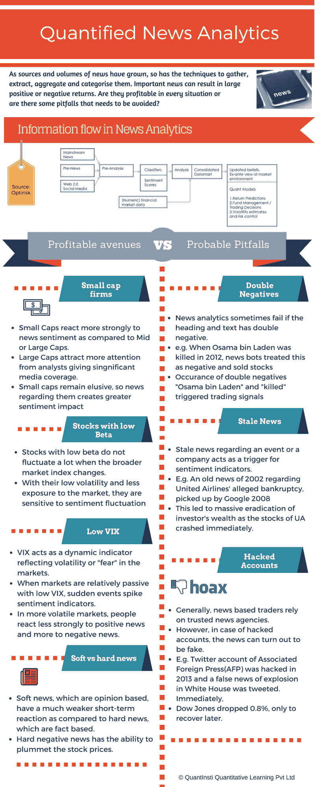

# 量化新闻分析:盈利能力与陷阱

> 原文：<https://blog.quantinsti.com/quantified-news-analytics-profitability-pitfalls/>

随着新闻来源和数量的增加，收集、提取、汇总和分类的技术也在发展。重要的新闻会带来巨大的正面或负面回报。然而，由于许多新闻来源，我们需要问一个基本问题:新闻分析是在每种情况下都有利可图，还是有一些陷阱需要避免？

### 新闻分析中的信息流

###### 来源:新闻分析在金融中的应用:回顾，OptiRisk Systems

### 定量新闻分析的盈利途径

#### 小型公司

*   与中型或大型股相比，小型股对新闻情绪的反应更为强烈。
*   大盘股吸引了更多分析师的关注，媒体也给予了大量报道。
*   小盘股仍然难以捉摸，因此有关它们的消息会对市场情绪产生更大影响

#### 贝塔系数低的股票

*   低 [beta](/asset-beta-market-beta-python/) 的股票在大盘指数变动时波动不大。
*   由于波动性较低，受市场影响较小，它们对情绪波动非常敏感

#### 低 VIX

*   [VIX](/sentiment-trading-) 作为一个动态指标，反映了市场的波动或“恐惧”。
*   当市场相对被动，VIX 较低时，突发事件会刺激情绪指标。
*   在波动性更大的市场中，人们对正面消息的反应不那么强烈，而对负面消息的反应更强烈。

#### 软新闻对硬新闻

*   与基于事实的硬新闻相比，基于观点的软新闻的短期反应要弱得多。
*   负面新闻有能力使股票价格暴跌。

### 量化新闻分析的陷阱

#### 双重否定

*   如果标题和正文有双重否定，新闻分析有时会失败。
*   例如，2012 年奥萨马·本·拉登被击毙时，新闻机器人将此视为负面消息，并抛售股票
*   “本拉登”和“被击毙”双重负面消息的出现引发了交易信号

#### 陈旧的新闻

*   关于一个事件或一家公司的陈旧新闻会触发[情绪指标](https://quantra.quantinsti.com/course/trading-using-options-sentiment-indicators)。
*   例如，2002 年一则关于联合航空公司破产的旧新闻，被谷歌 2008 搜索到
*   这导致投资者的财富大规模消失，因为联合航空的股票立即暴跌。

#### 恶作剧/假新闻

*   一般来说，基于新闻的交易者依赖可信的新闻机构。
*   然而，在帐户被黑的情况下，新闻可能被证明是假的。
*   例如，美联社(AFP)的推特账户在 2013 年遭到黑客攻击，并在推特上发布了白宫发生爆炸的虚假消息。立刻，
*   道琼斯指数下跌 0.8%，随后反弹。

### 信息图表

### 后续步骤

如果你有兴趣了解更多关于量化新闻分析如何工作以及如何基于此设计交易策略的信息，请看这个[网络研讨会](/quantitative-trading-using-sentiment-analysis-webinar/)。此外，看看我们的旗舰课程[“算法交易高管课程”](https://www.quantinsti.com/epat/)，接受培训，开始自己的算法交易。