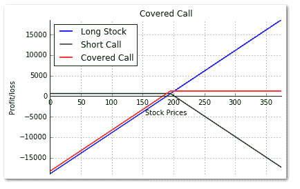
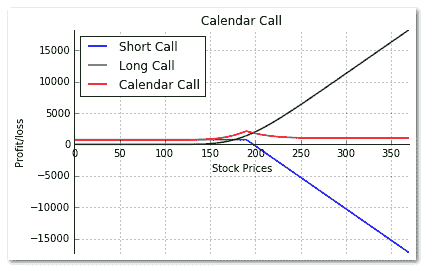

# 用 Python 编写覆盖呼叫策略

> 原文：<https://blog.quantinsti.com/write-covered-call-strategy-in-python/>

由[米林德·帕拉德卡](https://in.linkedin.com/in/milind-paradkar-b37292107)

### **简介**

衍生品市场的交易者经常行使以下权利之一:**看涨期权**或**看跌期权**。

**【买入期权】**是买卖双方之间的金融合同，据此买方有权但无义务在某一时间以某一价格(履约价格)从期权卖方处购买约定数量的金融工具。“**看跌期权**的作用正好相反。

在“**备兑买入**中，买入期权的卖方拥有相应数量的基础工具。

备兑买入是一种创收期权策略，包括两个部分:

*   购买股票
*   卖出价外(OTM)看涨期权

如果买进股票的同时卖出看涨期权，这种策略称为"**买入-卖出**"策略。

在备兑看涨期权中，交易者持有中性至看涨的观点。备兑买入是一种净借记交易，因为你支付股票，并从卖出的买入期权中获得少量溢价。

这篇博文的想法是通过一个例子来详细说明有担保的买入策略，并使用 Python 绘制其收益图。这篇文章还强调了“日历电话”,因为它是对覆盖电话策略的修改。

让我们直接举一个例子来理解备兑买入的运作、其回报以及策略中涉及的风险。

#### **备兑通话策略示例**

SBI 股票的交易价格是 50 卢比。2015 年 4 月 29 日 189。第一步:用卢比购买 100 股股票。189 Leg 2:在 2015 年 5 月 26 日卖出 195 次罢工认购价 6.30 卢比，每手 100 股

买入这两个头寸所支付的金额等于支付的股票价格减去收到的认购溢价，即卢比。18，900 卢比(股票购买)630(收到的溢价)=卢比。18,270

如果股价上涨超过 195 的看涨期权，它将被执行，股票将被出售。但是，该策略会获利，因为你被你所拥有的股票覆盖。

比方说，到期时的股票价格是卢比。200.利润由下式给出:

```
 Profit = Call premium received + ((Call strike - stock price paid) x Shares)
 Profit = Rs. 630 + ((195 – 189) x 100) = Rs. 1,230
```

如果股票跌破最初的股票买入价，你的多头头寸就处于亏损状态，但你可以从卖出看涨期权获得的看涨期权溢价中获得一些缓冲。

比方说，股票下跌，在卢比。到期时 180。发生的损失由下式给出

```
Loss = Call premium received + ((stock price at expiration - stock price paid) x Shares)
 Loss = Rs. 630 + ((180 – 189) x 100) = - Rs. 270
```

人们可以采用备兑买入策略，按月卖出买入期权，从而通过溢价的方式产生月收入。

涵盖电话的风险回报概况如下所示:

1.  最大风险-(支付的股票价格-收到的认购溢价)
2.  最高奖励-(看涨期权-支付的股票价格)+收到的看涨期权费
3.  盈亏平衡-(股票价格支付-收到的认购溢价)

#### **备兑买入回报图的 Python 代码**

下面是 Python 中多头股票、空头看涨期权和备兑看涨期权收益图的代码。

```
# Covered Call

import numpy as np
import matplotlib.pyplot as plt

s0=189 # Initial stock price 
k=195;c=6.30; # Strike price and Premium of the option
shares = 100 # Shares per lot 
sT = np.arange(0,2*s0,5) # Stock Price at expiration of the Call
# Profit/loss from long stock position
y1= (sT-s0) * shares
# Payoff from a Short Call Option
y2 = np.where(sT > k,((k - sT) + c) * shares, c * shares)
# Payoff from a Covered Call
y3 = np.where(sT > k,((k - s0) + c) * shares,((sT- s0) + c) * shares )
# Create a plot using matplotlib 
fig, ax = plt.subplots()
ax.spines['top'].set_visible(False) # Top border removed 
ax.spines['right'].set_visible(False) # Right border removed
ax.spines['bottom'].set_position('zero') # Sets the X-axis in the center
ax.tick_params(top=False, right=False) # Removes the tick-marks on the RHS

plt.plot(sT,y1,lw=1.5,label='Long Stock')
plt.plot(sT,y2,lw=1.5,label='Short Call')
plt.plot(sT,y3,lw=1.5,label='Covered Call')

plt.title('Covered Call') 
plt.xlabel('Stock Prices')
plt.ylabel('Profit/loss')

plt.grid(True)
plt.axis('tight')
plt.legend(loc=0)
plt.show()
```

我们使用 matplotlib 库来绘制图表。我们首先创建一个空的图形，并添加一个支线剧情。然后，我们删除顶部和右边框，并在中心移动 X 轴。使用 plt.plot 函数，我们绘制了多头股票、空头看涨期权和备兑看涨期权的收益。最后，我们在图表中添加标题、标签和图例。



### **日历通话策略**

日历买入是备兑买入策略的一种变体，在这种策略中，多头股票头寸被长期多头买入期权所替代。

日历拜访策略包括两个部分:

*   以接近货币执行价的价格买入长期到期看涨期权
*   卖出具有相同执行价格的短期看涨期权

有了日历看涨期权，交易者的前景从中性到看涨。这是一项净借记交易，因为买入的看涨期权比卖出的看涨期权更贵，卖出的看涨期权没有时间价值。日历看涨期权(如保险看涨期权)可以是一种创收策略，通过每月销售短期看涨期权来实现。

让我们举一个日历呼叫的例子来理解它的回报，以及策略中包含的风险。

#### **举例:**

XYZ 股票的交易价格为卢比。2015 年 5 月 2 日为 187，历史波动性为 40%，无风险利率为 8%。

第 1 阶段:购买 2015 年 7 月 28 日的 190 罢工认购权，每手 20.70 卢比，每手 100 股

第二阶段:在 2015 年 5 月 26 日卖出 190 次罢工认购价 7.50 卢比，每手 100 股

##### **1 <sup>st</sup> 场景:**

5 月到期时，股价跌至 180 卢比

长途电话价值约 8.80 卢比；损失 11.90 卢比

短期看涨期权毫无价值地到期，我们获得了 7.5 卢比的利润

总头寸–损失 4.40 卢比

##### **2 <sup>和</sup>场景:**

在 5 月到期时，股票上涨到 205 卢比

在这种情况下，股票已经上涨到执行价以上。短期看涨期权将得到行使。长通话价格约为 23.60 卢比；利润 2.90。

卖出看涨期权，获利 2.90 卢比

保持 7.50 卢比的短期溢价

短期电话在 Rs.15 卢比到期。以 205 卢比购买股票；以 190 卢比的价格出售股票——损失 15 卢比

因此，总头寸损失 4.60 卢比

#### **日历呼叫的风险回报情况如下:**

*   最大风险-限于支付的净借方
*   最大回报–(当股票价格处于执行价格时，卖空期权到期时看涨期权的价值)减去(净借方)

### **日历呼叫回报图的 Python 代码**

下面是短期买入、长期买入溢价和日历买入回报的代码。

```
# Calendar Call Strategy

import p4f
import numpy as np
from datetime import datetime
import matplotlib.pyplot as plt

s0 = 187 # Initial stock price on May 2nd, 2015
k = 190 # Strike price of the May 26th 2015 and July 28th 2015 Call Option
cs = 7.50; # Premium of the Short call on May 2nd, 2015
cl = 20.70; # Premium of the Long call on May 2nd, 2015
shares = 100 # Shares per lot 
sT = np.arange(0,2*s0,5) # Stock Price at expiration of the Call
sigma = 0.4 # Historical Volatility
r = 0.08 # Risk-free interest rate

t = datetime(2015,7,28) - datetime(2015,5,26) ; T = t.days / 365;
# Payoff from the May 26th 2015 Short Call Option at Expiration
y1 = np.where(sT > k,((k - sT) + cs) * shares, cs * shares)
# Value of the July 28th 2015 long Call Option on May 26th 2015
lc_value = p4f.bs_call(sT,k,T,r,sigma) * shares
# Payoff from the Calendar Call
y2 = y1 + (lc_value - cl)
# Create a plot using matplotlib 
fig, ax = plt.subplots()
ax.spines['top'].set_visible(False) # Top border removed 
ax.spines['right'].set_visible(False) # Right border removed
ax.spines['bottom'].set_position('zero') # Sets the X-axis in the center
ax.tick_params(top=False, right=False) # Removes the tick-marks on the RHS

plt.plot(sT,y1,lw=1.5,label='Short Call')
plt.plot(sT,lc_value,lw=1.5,label='Long Call')
plt.plot(sT,y2,lw=1.5,label='Calendar Call')

plt.title('Calendar Call') 
plt.xlabel('Stock Prices')
plt.ylabel('Profit/loss')

plt.grid(True)
plt.axis('tight')
plt.legend(loc=0)
plt.show()

```



我们使用 matplotlib 库来绘制图表。我们首先创建一个空的图形，并添加一个支线剧情。然后，我们移除顶部和右边界，并使用 plt.plot 函数将 X 轴移动到中心，我们绘制短期看涨期权、长期看涨期权溢价和日历看涨期权的收益。最后，我们在图表中添加标题、标签和图例。

如果你喜欢你所读的，请在下面的评论区给我们反馈。更多这样的策略和 python 代码，请浏览我们的[博客](/)部分。如果您正在寻找 python 代码来构建像移动平均线或移动难易程度这样的技术指标，您会在这里找到。如果你想知道是什么让 Python 成为算法交易者最喜欢的语言，我们有一个关于它的很酷的[信息图](/what-makes-python-most-preferred-language-for-algorithmic-traders/)。

### **下一步**

如果你是一名程序员或科技专业人士，想开始自己的自动化交易平台。从日常从业者的实时互动讲座中学习自动交易。算法交易高管课程涵盖统计学&计量经济学、金融计算&技术和算法&量化交易等培训模块。[现在报名](https://www.quantinsti.com/courses/epat/scholarship-test/)！

*免责声明:股票市场的所有投资和交易都有风险。在金融市场进行交易的任何决定，包括股票或期权或其他金融工具的交易，都是个人决定，只能在彻底研究后做出，包括个人风险和财务评估以及在您认为必要的范围内寻求专业帮助。本文提到的交易策略或相关信息仅供参考。*

### **下载 Python 代码**

*   备兑买入回报- Python 代码