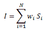
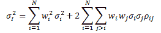

# 基于股票相关性和指数波动性的分散策略[EPAT 项目]

> 原文：<https://blog.quantinsti.com/dispersion-strategy-correlation-stocks-volatility-index/>


尼廷·阿格沃尔和 T2·贾斯比尔·辛格

本文是贾斯比尔·辛格提交并由尼廷·阿加瓦尔指导的期末项目，是 QuantInsti 算法交易(EPAT) 高管课程[的一部分。请务必查看我们的项目](https://www.quantinsti.com/epat/)[页面](https://www.quantinsti.com/category/project-work-epat/)，看看我们的学生正在构建什么。

### **简介**

本文基于股票相关性、指数波动性，使用[分散策略](https://blog.quantinsti.com/dispersion-trading-using-options/)检验交易利润。分散有助于交易者只考虑波动性(假设相关性均值回复),因此，确保通过购买或出售期货来对冲 delta 风险。在这种策略中，多头和空头都是建立在波动性的基础上的，现在有了更多的策略，最好使用利用相对价值而不是绝对价值的策略。这限制了风险资金的单向流动。

具体来说，当相关性很高时，分散交易利用指数期权相对于单个期权的过高定价。根据单个股票之间的相关值，可以通过卖出指数期权和买入指数成分期权或买入指数期权和卖出指数成分期权来交易离差。

最近几年，关于为什么离差交易有利可图，有很多假设。最广为接受的理论是市场无效理论，该理论认为期权市场的供给和需求驱动了偏离其理论价值的溢价。在 1996 年至 2005 年的研究中，这一点在 2000 年后离差交易不再盈利时得到了证明。

### **战略**

为了区分分散交易，它只是一种对冲策略，利用指数和指数成份股之间隐含波动率的相对价值差异。它涉及一个指数的空头期权头寸和一个指数成分的多头期权头寸，反之亦然。在指数上建立空头头寸或接近资金扼杀的头寸，在构成该指数的 50-60 %的股票上建立多头头寸或资金扼杀的头寸。空头头寸减轻了多头带来的风险。此外，在资金多空和资金紧缩的情况下，delta 敞口接近于零。因此，分散策略针对较大的市场波动进行对冲，并构成较低的方向性风险。

对于指数其中 W <sub>i</sub> 是指数中股票‘I’的权重。使用可以计算出指数的方差，其中σ<sub>I</sub>T6】2 为指数方差，w <sub>i</sub> 为股票在指数中的权重。σ <sub> i </sub> <sup>2</sup> 为个股方差，ρ <sub>ij</sub> 为股票 I 与股票 j 的相关性。

离差交易的利润来自于这样一个事实，即相关性均值回归，如果一个人购买了相关性，那么一只股票的已实现波动率将高于指数的已实现波动率。德里森认为，只有负相关风险溢价才有可能在分散策略中获利。但这可以通过指数期权相对于单个股票期权的过高定价来实现。因此，卖出指数期权，买入其成分的期权，并用期货合约进一步对冲，以始终保持 delta 中性，这也是一项有利可图的交易。

在整个交易过程中，买入或卖出的期权数量不变，期货头寸根据期权的 delta，通过买入或卖出期货合约进行调整。

对冲期权的利润可以通过以下方式计算:

```
P ≈ θ. (n<sup>2</sup>-1) + NV-dσ/σ
```

其中θ =时间-衰减，单位为美元；n =标准化移动；N=归一化织女星

#### 数据

分散交易策略的重点是印度银行 Nifty 指数期权及其成份股银行股。我们将 15 分钟的数据用于这一策略。

### **实施战略**

项目期间采取的步骤如下:

#### **隐含波动率计算**

为了实施这一策略，首先计算指数银行 Nifty 和银行 Nifty 股票的隐含波动率是很重要的。期权价格反映了一种工具的风险，无论是股票还是指数。期权价格传递的风险水平通常被称为隐含波动率。单一股票期权的隐含波动率只是反映了市场对该股票价格回报未来波动率的预期。然而，指数波动是由两个因素共同驱动的，即指数成分的单个 vol 和指数成分价格回报的相关性。通过计算隐含波动率，我们试图找出股票之间的相关性是高还是低。我们使用布莱克-斯科尔斯模型来计算 IV。我们需要时间来成熟，执行价格，无风险利率和当前的基础价格。由于我们使用的是当月期权，从当前价格我们确定了期权 ATM 罢工，我们有无风险利率。

#### **隐含相关性计算**

我们用隐含波动率来计算股票之间的隐含相关性。波动性之间的相关性是买入或卖出的标志。如果隐含相关性高，则有卖出指数期权和买入股票期权的迹象，反之亦然。

#### **选择选项**

对于这种策略，我们结合使用了看跌期权和看涨期权。当使用这种方法时，对冲期权是很重要的，这可以通过向银行 Nifty 指数和银行 Nifty 股票投资等量的资金来实现，以实现完美的对冲交易。时间衰减:交易在月初使用月度期权进行，并维持到到期。保持交易直到到期有助于获得卖出期权的时间衰减的好处。

#### **对冲**

这是进一步对冲使用期货合同，以保持整个过程 delta 中性。该策略的 Delta 每 15 分钟调整一次，当 delta 超过 1 时，卖出一份期货合约，当 delta 下降到-1 时，买入一份期货合约来抵消 delta。在交易过程中保持 delta 接近于零是很重要的。

#### **损益计算**

该策略的 PNL 来自两个因素，一个来自期权，另一个来自期货合约。增加期货合约以在到期时保持 delta 中性，所有头寸被平仓并计算最终利润。

### **结论**

分散交易是一种非常有利可图的策略，它在低风险的情况下提供高回报，但正确地实施该策略以获得利润是至关重要的。如果策略是自动化的，套期保值是自动计算和执行的，那么使用这种策略会更容易。利用自动化系统，可以更容易地实现跟踪策略的自动化系统，套期保值计算可以根据期权价格的变化进行调整。

阅读我们的[下一篇文章](https://blog.quantinsti.com/epat-project-automated-trading-maxime-fages-derek-wong/)，它描述了开发一个完全基于云的自动交易系统，该系统将利用均值回复或趋势跟踪执行算法。本文是作者提交的最后一个项目，作为他们在 QuantInsti[算法交易(EPAT)](https://www.quantinsti.com/) 高管课程的一部分。

免责声明:就我们学生所知，本项目中的信息是真实和完整的。所有推荐都不代表学生或 QuantInsti 的保证。学生和 QuantInsti 否认与使用这些信息有关的任何责任。 本项目提供的所有内容仅供参考，我们不保证通过使用这些指导您将获得一定的利润。