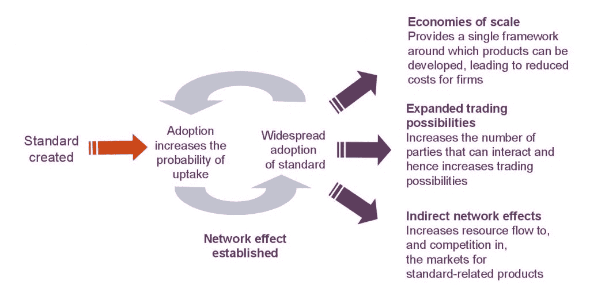

# 金融信息交换(FIX)交易协议

> 原文：<https://blog.quantinsti.com/fix-trading-protocol/>


由 [Dhanjit Das](https://www.linkedin.com/in/dhanjit-das-7ab32552)

FIX(金融信息交换)协议是近二十年来电子交易中信息交流的事实标准。1992 年，Salamon brothers 和 Fidelity Investments 发起了用于股票交易的 FIX 协议。今天，它被各种市场参与者、公司和供应商所使用。随着电子交易的出现，各种交易所和公司设计了他们自己的报文格式，因此 FIX 被看作是一种中间报文格式，一种标准化通信的通用基础手段。

## **好处**

几十年来，交易前、交易中和交易后的过程发生了显著的变化，对于不同的市场参与者和公司来说，变化更大。流程的自动化要求总体上的通信自动化，以及消息的标准化格式。

#### **连接成本**

标准消息传递协议的广泛使用降低了集成各种内部流程的成本和复杂性，因此对所有利益相关者都有利。与使用专有协议的应用程序相比，在 FIX 上维护应用程序的容易程度有了很大的提高。FIX 的使用降低了建立交易平台、自动化执行工具等的成本。只需允许从现有实现中复制即可。

#### **降低了涉及多个合作伙伴的复杂性**

如果三个人在交谈，他们使用三个人通用的语言是有意义的，同样的类比可以应用于不同市场参与者和利益相关者之间的信息交互。有了 FIX 作为标准，就更容易让多个合作伙伴参与进来，因为一个合作伙伴可以避免使用专有协议与多个公司/交易所打交道所增加的复杂性。



资料来源:Oxera

来源:Oxera

#### **可靠、降低风险、持续发展**

FIX 是一个经过充分测试、广泛使用的协议。因此保证了固定可靠性。FIX 协议有限公司是拥有权利并研究 FIX 标准发布的组织。

#### **提高服务质量**

由于通用标准协议的存在，投资管理公司将能够更容易地在经纪人之间转换。因此，增加了经纪人之间对交易服务的竞争；从而提高服务质量。

不用说，当更多的公司使用相同的消息传递协议时，好处会更大。

***一些数字……***

*   为了客观地看待 FIX 支持的影响，目前受益于该议定书的市场规模包括美国、欧洲和亚太股票市场，2008 年的年交易额为 113 万亿美元，此外还有大量新兴股票市场；政府和公司债券市场，2009 年 6 月全球流通价值为 83.9 万亿美元；交易所交易衍生品市场，2009 年 6 月在美国、欧洲和亚太地区的名义金额为 63.4 万亿美元，全球场外(OTC)衍生品市场，2008 年 12 月的名义金额为 591 万亿美元。
*   在 2000 年实施 FIX 后的六个月内，GIM 将其 OMS 升级到了 FIX 兼容版本，建立了服务器并安装了 FIX 网关，完成了测试并通过 FIX 发送订单。最初，只有一家经纪商使用 FIX，但在三年内，GIM 与 50 家或更多经纪商进行了电子通信，以处理 FIX 订单和执行，其中 13 家还处理 FIX 分配。
*   就 ACI 而言，1996 年引入了 FIX。在引入 FIX 执行能力的三年内，超过 97%的美国执行和 93%的国际执行都是使用 FIX 执行的。与此同时，在引入 FIX 兼容分配的三年内，超过 88%的美国分配和 43%的国际分配是使用 FIX 进行的。
*   NBIM 在 2002 年末采用了 FIX，并在一年内通过 FIX 从 100%的人工执行提高到 80–90%。它目前对 FIX 的使用率几乎是 100%。

### **最近的发展**

****新开放技术资源(github.com)*

2015 年 11 月 23 日，FIX Trading community 向金融行业的开发者开放了其技术标准流程。该接口托管在 [Github](https://github.com/FIXTradingCommunity) 上。几个 FIX 项目已经发布到 Github，更多项目正在进行中。

****传输独立性框架(FIXT)*

随着“传输独立性”的出现，多个应用程序消息可以通过一个信号传送。这允许通过任何合适的传输技术从消息队列、总线等使用 FIX 消息。

****快速(适用于流的修复)协议*

FAST 框架是作为低延迟解决方案开发的，它在网络上提供了优化的数据表示，从而提高了吞吐量，并使金融机构之间的通信更加高效。

****修复简单二进制编码(修复 SBE)*

FIX SBE 再次致力于更快的通信，其消息设计致力于无需复杂转换和条件逻辑的直接数据访问。它使用本机二进制数据类型，并且更喜欢支持直接访问的固定位置、固定宽度的字段。

### **消息结构**

修复是在 TCP 连接之上分层的。固定消息具有标签值对；每一对用 ASCII 字符代码 SOH (0x001)分隔，该标记用等号(=)与值分隔。每条消息都有头、体和尾。尾部是带有标签 10 的校验和。消息的 fix 版本和正文长度在头部分(分别是 8 和 9 个标签)。消息类型由标签 35 的值表示。

#### 例子

```
8=FIX.4.19=11235=049=BRKR56=INVMGR34=23552=19980604-07:58:28112=19980604-07:58:2810=157
```

```
8=FIX.4.19=15435=649=BRKR56=INVMGR34=23652=19980604-07:58:4823=11568528=N55=SPMI.MI54=227=20000044=10100.00000025=H10=159
```

### **下一步**

如果你是一名散户交易者或专业技术人员，想要建立自己的自动化交易平台，今天就开始学习算法交易吧！从基本概念开始，如[自动交易架构](https://blog.quantinsti.com/algorithmic-trading-system-architecture/)、[市场微观结构](https://blog.quantinsti.com/market-microstructure/)、[策略回溯测试系统](https://blog.quantinsti.com/backtesting/)和[订单管理系统](https://blog.quantinsti.com/automated-trading-order-management-system/)。