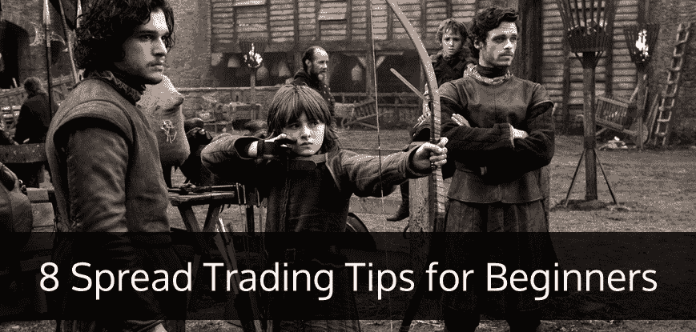
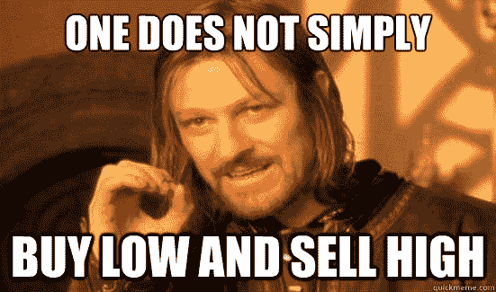
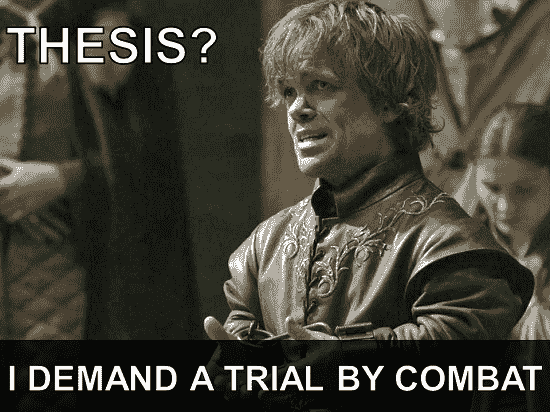

# 新手的 8 个基本差价交易技巧

> 原文：<https://blog.quantinsti.com/8-spread-trading-tips-for-beginners/>

作者:阿波瓦·辛格

差价交易允许你进行低风险的定向交易。价差头寸是通过买入和卖出相同基础证券的相同类别的相同数量的期权，但具有不同的执行价格或到期日。这里有一些给新手看交易差价的建议。

### 

### **做你的研究**

小投机者不会频繁交易价差，因为分析更复杂，因为它涉及两个合约的相对供需分析，而不仅仅是总体供需分析。尽管如此，作为一个小投机者，你会对价差非常感兴趣，因为当交易适当时，价差可以在较低的波动性下显著提高你的利润潜力。

因此，有必要对你打算交易的证券进行研究，寻找任何可能影响你交易的收益公告或任何其他关键经济数据。总是更新最新的消息和图表——永远不要仅仅依靠技术分析，基本面可以决定成败。因此，明智的做法是跟踪年度会议日期、季度报告更新、分析师评级、分红日期等。

### **票据交易**

新手在用真金白银投资之前，可以选择进行一段时间的纸上交易。这将有助于你更仔细地审视你的策略。计划好你将在哪里设置 T2 止损，为什么，计划好你将在哪里获利，为什么，看看你的策略是否能达到预期的效果。

### **小规模开始**

如果你是一个交易的初学者，或者是一个价差赌注的新手，试着从你认为你能处理的小规模开始，因为你会先犯一些错误，你的杠杆可能会对你不利。这并不是要打击你，而是要真正知道你在做什么，因为作为一个初学者，你可能会做出让你付出长期代价的决定。所以在做大之前，先用较小的量进行深入的了解和动手的现场体验是有意义的！

### **跟踪市场动向**

在一个交易时段的前 30-60 分钟，市场往往波动最大，尤其是在美国市场开盘时。在这个时间段你是否选择交易，取决于你的风险偏好。在你很了解的领域交易，因为如果你不了解你应该跟踪的公司的最新情况，或者不了解可能影响你头寸的因素，那么你只是在赌博！确保你很好地了解和理解你的细分市场。

### **低风险策略**

由于头寸的对冲性质，差价交易具有较低的波动性/风险。由于风险较低，你可以在交易所投入少得多的保证金。因此，本质上来说，价差交易比直接交易能给你提供更好的回报/风险比。

### **大型商业公司的期货差价交易**

在商品市场中，差价交易是指同时买入一份商品期货合约和卖出另一份合约。同一商品的合约可以在不同的交割月份；它们可以是两种相关的不同商品；它们可以是在两个不同地点交易的同一种商品。作为一家商业公司，你可以使用差价交易将对冲从一个合约月转移到另一个合约月。这有助于收回存货的存储和融资成本。

### **在英国免税**

在英国，价差交易被归类为赌博，赌博的收入是免税的，除非价差交易者/better 被法律( [HMRC](https://www.gov.uk/government/organisations/hm-revenue-customs) -英国税务海关总署)认定为职业赌徒，这是一个相当灰色的领域。除了差价之外，每笔交易也没有印花税和佣金。请始终注意您所在国家的贸易法规，以及可能收取的任何税费、印花税和佣金。

### **自动点差下注**

价差交易者可以将他们的[交易策略](https://blog.quantinsti.com/algorithmic-trading-strategies/)开发到交易系统中，通过减少人工干预来提高策略的性能。交易系统可以帮助消除持续的市场监控和交易情绪。市场上提供的各种免费策略开发系统可以帮助建立、回测和优化价差交易策略。因此，继续前进，通过自动化为您的战略增加额外的优势吧！

### **下一步**

你也可以开始学习流行的自动化交易策略，如' [VWAP](https://blog.quantinsti.com/vwap-strategy/) '、[指数套利](https://blog.quantinsti.com/index-arbitrage-automated-options-trading-strategy/)'、[统计套利](https://blog.quantinsti.com/statistical-arbitrage/)和'[事件驱动策略](https://blog.quantinsti.com/news-based-trading/)。我们还有一系列关于“[交易策略统计数据](https://blog.quantinsti.com/basic-statistics-for-trading-strategies-i/)”的文章，解释多个方面，即历史数据分析、分布、回归、相关性和协整。