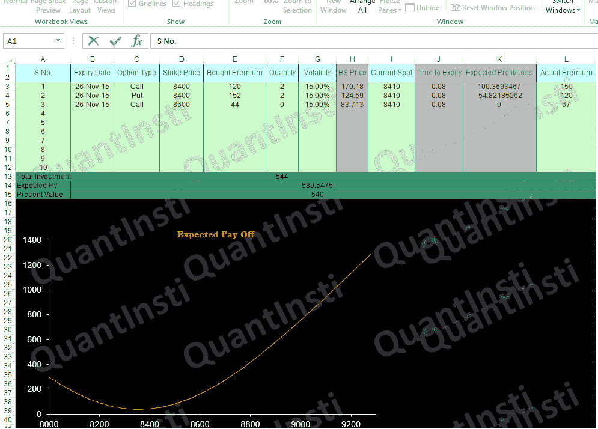
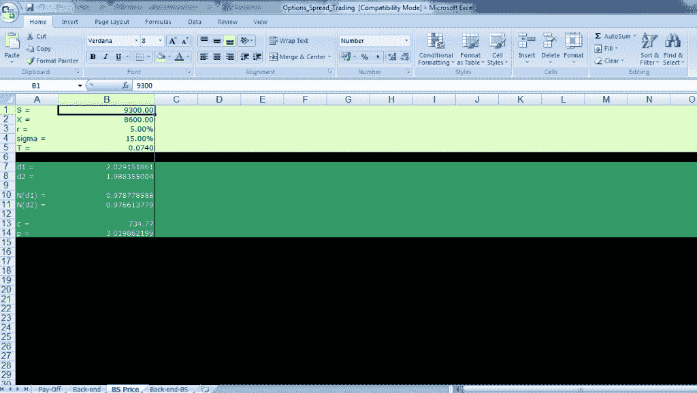
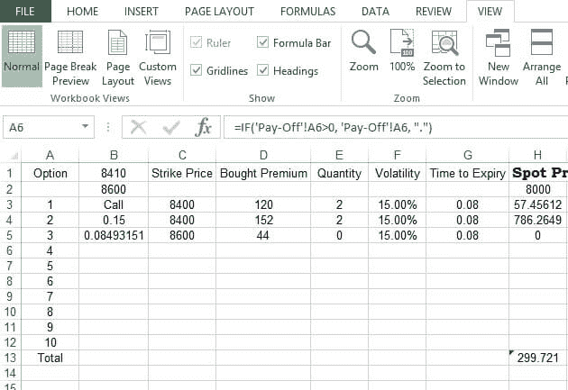
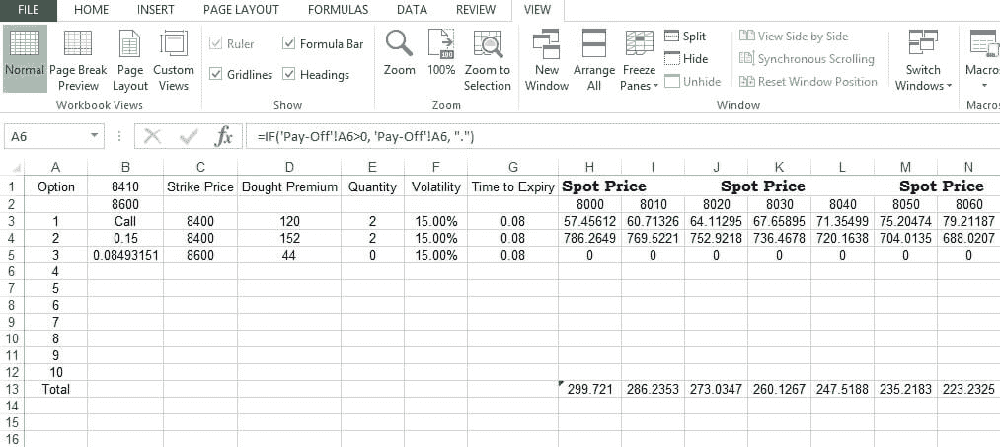

# 如何使用 Black Scholes 期权定价模型

> 原文：<https://blog.quantinsti.com/options-trading-excel-model/>


在本帖中，我们将讨论如何使用 Black Scholes 期权定价模型对期权定价进行建模，并对各种期权的组合进行建模。如果你是期权交易的新手，那么你可以查看 Quantra 上的[虚拟期权交易](https://quantra.quantinsti.com/course/options-trading-strategies-python-basic)免费课程。您可以在模型中放入任意数量的看涨和/或看跌期权，并使用内置宏(名为“BS”)来计算每个期权的基于 BS 模型的期权定价。宏指令(名为“收益”)用于绘制期权头寸相对于现货价格的整体组合的利润/损失。

名为 payroll 的 Sheet1 有一个表，我们在其中指定所有选项参数。B 列指定了期权的到期日期。列 C 指定选项类型。D 列是标的资产的执行价格。E 列显示买入期权时的溢价金额，单位为印度卢比。F 列告诉我们已经购买的期权合约的数量。G 列指定波动率，H 列指定期权的 Black Scholes 价格(由宏“BS”计算。I 列是标的资产的当前现货价格，J 列显示期权的到期时间(使用公式计算)。K 列指定期权的预期 PnL(使用公式计算)。它的计算方法是 Black Scholes 价格和支付的溢价之间的差额乘以期权合约的数量。L 列显示了当前市场上的实际溢价，即如果你想购买期权的当前溢价。

第 13 <sup>行</sup>计算总投资。由于我们以 120 和 152 的溢价购买了两份看涨期权和看跌期权，我们的总投资是 120 *2+152* 2=544。第 14 <sup>行</sup>显示预期的现值。由于市场在期权买入后发生了变动，期权的当前预期价格乘以期权合约的数量就得到预期价值。因此预期收益是 170.18*2+124.59*2 = 589.5475。

第 15 行中的现值类似地通过取当前市场中的实际溢价和期权合约数量的乘积来计算。因此现在的值是 150 *2+120* 2=540。

### **绘制收益图**

下图显示了期权组合的预期收益图。这是通过从 sheet4 中取预期收益值来完成的。稍后将详细介绍。



#### **宏中的 BS**

BS 价格单显示了使用 Black Scholes 模型的期权定价。从 Black-Scholes 期权定价模型中，我们知道不分红股票的看涨期权的价格可以写成:

```
$$C_t = S_t N(d_1) - Xe^{-r\tau} N(d_2)$$
```

不分红股票的看跌期权的价格可以写成:

```
$$P_t = Xe^{-r\tau} N (-d_2) - S_tN (-d_1)$$
```

在哪里

```
$$d_1 = \frac {{ln ( \frac {S_t} {X}) + (r + \frac {\sigma_s^2} {2}) \tau}} {{\sigma_s} {\sqrt{\tau}}}$$

$$d_1 = \frac {{ln ( \frac {S_t} {X}) + (r + \frac {\sigma_s^2} {2}) \tau}} {{\sigma_s} {\sqrt{\tau}}} = d_1 - \sigma_s \sqrt{\tau}$$

$$\tau = T - t$$
```

是正态分布的累积密度函数。

```
$$S$$
```

基础资产的当前价格

```
$$X$$
```

执行价格

```
$$r$$
```

无风险利率

```
$$\tau$$
```

到期时间

```
$$ln$$
```

天然原木

使用 Black Scholes 框架的看涨和看跌期权价值在第 13 行和第 14 行针对第 1 行到第 5 行中指定的参数进行计算。



### **定制 BS**

“后端 BS”表从 A 列到 g 列具有相同的一组支付表值。H 列以上显示第 2 <sup>行和第</sup>行的现货价格范围。您可以在单元格 H2 中更改现货价格的价格范围的起点。增量(目前为 10 点)可以从单元格 I2 开始更改，然后将其水平拖动穿过该范围。第 3 <sup>rd</sup> 行显示了指定参数和不同现货价格的 Black Scholes 看涨期权。第 4 <sup>行</sup>显示了指定参数和不同现货价格的 Black Scholes 看跌期权。请注意，虽然帖子显示了三个选项的计算，但您只需在 Sheet1 的表格中填入适当的值，就可以获得多达 10 个选项组合。对于超过 10 个选项，您可以编辑工作表和宏。

第 13 <sup>行</sup>计算期权头寸的总收益。这是期权利润和总投资之间的差额。



在这种情况下，整体期权头寸的利润是 H3 和 H4 的总和。总投资(在收益表第 13 <sup>行第</sup>行计算)544 必须从 H3 和 H4 的总和中减去，以获得最终收益。此后，对所有其他列进行类似的计算。



Sheet1 中的预期收益图是 Sheet3 中计算的总收益与基础现货价格的关系图。


有两个宏。BS 价格单中的一个，根据支付单中输入的值计算 Black Scholes 期权价格。另一个在收益表中，画出了预期收益图。请注意，支付表中的到期日设置在当前日期之后，否则 Black Scholes 价格将不会返回负时间段的数值。

你可以报名参加 Quantra 上的这个[免费在线 python 课程](https://quantra.quantinsti.com/course/options-trading-strategies-python-basic)，了解基本术语和概念，这将有助于你进行期权交易。

### **下一步**

在我们的下一篇文章中，我们已经介绍了[看涨期权价差策略](https://blog.quantinsti.com/bull-call-spread-strategy/)的基础知识，包括额外的 Python 代码和 Excel 模型，通过一个实例展示了如何实施这一策略。

*免责声明:股票市场的所有投资和交易都涉及风险。在金融市场进行交易的任何决定，包括股票或期权或其他金融工具的交易，都是个人决定，只能在彻底研究后做出，包括个人风险和财务评估以及在您认为必要的范围内寻求专业帮助。本文提到的交易策略或相关信息仅供参考。T3】*

### 下载 Excel 模型