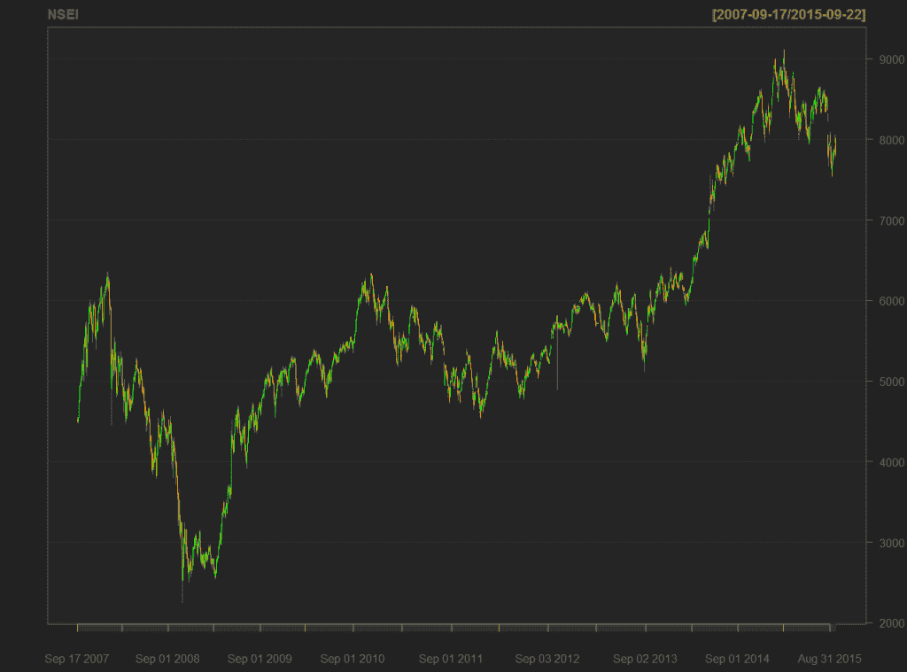
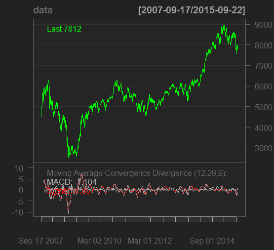
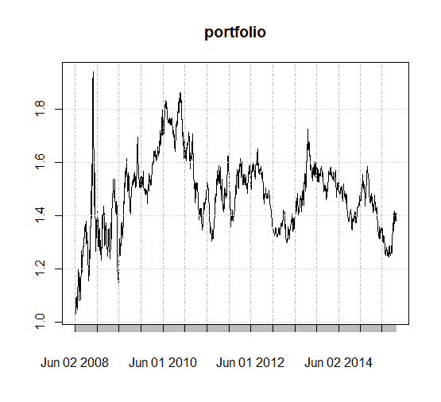
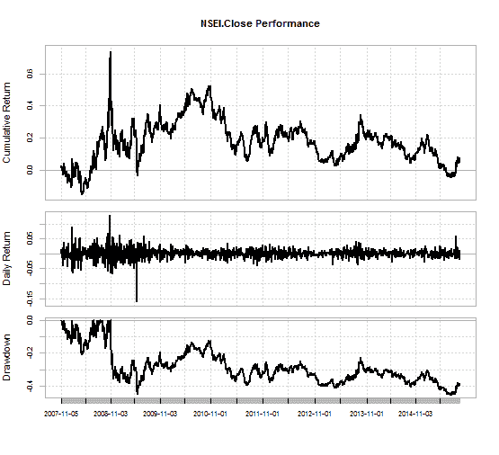

# 在 R 中使用 Quantmod 包编码的交易策略的例子

> 原文：<https://blog.quantinsti.com/an-example-of-a-trading-strategy-coded-in-r/>

在本帖中，我们将回测我们的交易策略。交易策略的回测可以分四个阶段进行。

## **获取历史数据**

quantmod 包使得从雅虎财经中提取历史数据变得非常容易。下面的一行代码获取 NSE ( Nifty)数据。

```
getSymbols("^NSEI")
```

Quantmod 提供了各种可视化数据的功能。以下命令为 NSE 数据创建图表。

```
chartSeries(NSEI, TA=NULL)
```



TA="Null "表示不使用任何技术指标。我们将很快看到技术指标在图表上的应用。

## **制定交易策略并指定规则**

下一步是选择一个[交易策略。](https://blog.quantinsti.com/algorithmic-trading-strategies/)在这个例子中，我们将选择 MACD(移动平均收敛发散度)。在移动平均线交叉策略中，计算两个平均值，一个慢速移动平均线和一个快速移动平均线。快速移动平均线和慢速移动平均线的区别叫做 MACD 线。第三平均称为信号线；还计算了 MACD 信号的 9 天指数移动平均值。如果 MACD 线穿过信号线，这是一个看涨的信号，我们做多。如果 MACD 线穿过信号线下方，这是一个熊市信号，我们做空。我们选择 NSE 数据的收盘价来计算平均值。以下命令完成了这项任务。

```
data=NSEI[,4]
```

下面的命令计算收盘价的 MACD。

```
macd = MACD(data, nFast=12, nSlow=26,nSig=9,maType=SMA, percent = FALSE)
```

人们可以根据交易要求选择不同的参数来衡量快速、慢速和信号平均线。这里我们坚持标准参数。MACD 是 quantmod 中计算[移动平均线收敛发散](https://blog.quantinsti.com/moving-average-trading-strategies/)的函数，数据是 NSE 的收盘价，nFast 是快速移动平均线，nSlow 是慢速移动平均线，maType =SMA 表示我们选择了简单移动平均线，percent =FALSE 表示我们正在计算快速移动平均线和慢速移动平均线之间的差异。将其设置为 TRUE 将返回快速移动平均线和慢速移动平均线之间的百分比差。

以下命令绘制了 NSE 收盘价和 MACD 参数的图表。

```
chartSeries(NSEI, TA="addMACD()")
```



如前所述，我们将交易信号定义如下

*   如果 MACD 信号越过信号线，我们在 NSE 做多
*   如果 MACD 信号穿过信号线下方，我们就做空 NSE

下面的命令相应地产生交易信号。我们使用滞后算子来消除前瞻偏差。

*信号=滞后(if else(MACD $ MACD<MACD $信号，-1，1))*

## **对历史数据执行策略**

我们将对 NSE 从 2007 年 9 月 17 日到 2015 年 9 月 22 日的历史数据应用此策略。交易信号应用于收盘价，以获得我们策略的回报。

```
returns = ROC(data)*signal
```

ROC 函数提供两个收盘价之间的百分比差。我们可以选择希望看到回报的持续时间。以下命令选择 2008 年 6 月 2 日和 2015 年 9 月 22 日之间的返回时间。

可以使用以下命令计算和绘制累积回报:-

```
portfolio = exp(cumsum(returns))

plot(portfolio)
```



## **评估绩效指标**

回溯测试的第 4 <sup>步是评估性能指标。R 中的性能分析包提供了一个整合的平台来观察与性能相关的参数。在 r 中可以观察到各种指标，如提款、下行风险。</sup>

以下命令提供了上述参数的摘要以及更多信息！

```
table.Drawdowns(ret, top=10)

table.DownsideRisk(ret)

charts.PerformanceSummary(ret)
```



下面是代码的简洁版本。

```
require(quantmod)
require(PerformanceAnalytics)
getSymbols('^NSEI')
chartSeries(NSEI, TA=NULL)
data=NSEI[,4]
macd = MACD(data, nFast=12, nSlow=26,nSig=9,maType=SMA,percent = FALSE)
chartSeries(data, TA='addMACD()')
signal = Lag(ifelse(macd$macd < macd$signal, -1, 1))
returns = ROC(data)*signal
returns = returns['2008-06-02/2015-09-22']
portfolio = exp(cumsum(returns))
plot(portfolio)
table.Drawdowns(returns, top=10)
table.DownsideRisk(returns)
charts.PerformanceSummary(returns)
```

## 下一步

在这篇文章中，我们展示了一个非常简单的策略，并看到了如何将一个前提分解成对事件的反应。为了使它更简单，我们添加了一个用 C++编写交易策略的例子。单击此处立即访问。除此之外，你可以查看我们博客上关于不同[量化交易策略](https://quantra.quantinsti.com/course/quantitative-trading-strategies-models)的文章。

**更新**

我们注意到一些用户在从雅虎和谷歌金融平台下载市场数据时面临挑战。如果你正在寻找市场数据的替代来源，你可以使用 [Quandl](https://www.quandl.com/) 来获得同样的信息。