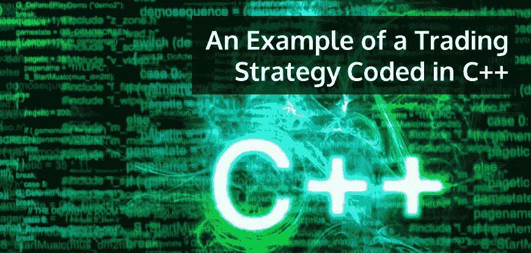

# 用 C++编写的交易策略示例

> 原文：<https://blog.quantinsti.com/an-example-of-a-trading-strategy-coded-in-c/>



任何交易策略都可以分解成一系列事件和对这些事件的反应。反应可能会变得无限复杂和多变，但战略写作本质上非常简单，就是这样。

事件的种类及其频率将取决于市场和该策略所依据的工具，但是，一般来说，大多数市场将具有以下不同的特点:

### **事件种类**

*   **市场数据变化** -这可能意味着价格变化或尺寸变化。这也可能是最后的交易价格。
*   **来自交易所的报告** -来自交易所的确认、拒绝等。
*   **订单执行** -部分或全部执行之前下达的订单。
*   **订单被发送到交易所**——在向交易所发送订单后可能需要做的一些簿记工作，可能是为了风险管理。
*   **间隔事件** -这不是一个与市场相关的事件，但更像是一些需要定期运行的逻辑。例如，蜡烛的形成。
*   **正在加载的新投资组合** -正在加载的新投资组合可能会改变已经运行的其他投资组合的风险限额，因此需要减少订单规模等。
*   **用户参数改变** -每个策略都需要一组特定的用户输入或参数，这些输入或参数定义了策略运行的框架。这可以从报价订单规模到该策略可以承受的最大风险等。这些参数中的任何一个改变都可能并且通常会保证一定量的重新计算。

### **战略**

作为练习，我们可以看一个非常简单的[量化交易策略](https://quantra.quantinsti.com/course/quantitative-trading-strategies-models)，看看我们如何将一个前提分解成对事件的反应。让我们考虑一个纯粹的[套利策略](https://blog.quantinsti.com/statistical-arbitrage/)，它本质上是基于这样一个事实，即在不同目的地报价的相同工具应该理想地具有相同的价值。如果价值差异大到足以证明在一个交易所买入而在另一个交易所卖出是合理的，我们就会这样做。假设我们想从每一笔买卖中赚取差价。所以建议的策略是在 instr1 上报价

*Buyprice = bid2-s*

*SellPrice = ask 2+s*

其中，买入价格和卖出价格分别是 instr1 上的买入订单和卖出订单的价格。

*Bid1 和 ask1 是 instr1 的价格。*

*Bid2 和 ask2 是 instr2 的价格。*

基本逻辑是始终将买入订单保持在 bid2–s，将卖出订单保持在 ask2 + s。每当买入订单被执行时，我们就在 instr2 的 bid 2 上发送卖出订单。所以实际上，

我们在 bid2–s 买入，在 bid 2 卖出= >从这笔交易中获利 s。

```
OnMarketData(tick1, tick2)

{

buyPrice = tick2.bid- s

if buyorder present in instr1

replace it to buyPrice

else

send new order at buyPrice

sellPrice = tick2.ask + s

if sellorder present in instr2

replace it to sellPrice

else

send new order at sellPrice

}

onExecution{

if buy execution happened on instr1

send sell order on instr2

else if sell execution happened on instr1

send buy order on instr2

}
```

显然，正如我们所看到的，onMarketData 逻辑只依赖于 instr2 的市场数据，而不依赖于其他数据。

类似地，one execution 逻辑依赖于 instr1 上订单的执行。

目前为止听起来不错。在一个事物瞬间发生的理想世界里，这将是完美的。但在现实世界中，我们在一定的约束下运作。一些这样的限制是

*   订单到达交易所需要有限的时间
*   交易所需要有限的时间来确认订单
*   除非订单处于已确认状态，否则无法发送替换请求。

显然，这改变了一切。考虑下面的时间线。

*T0:以价格 B1(= bid 2–s)*发送的购买订单

*T1: instr2 移动到 tick~2 (bid2-1，ask2-1)*

*T2:确认 T0* 发出的订单

*T10:工具 2 中的新市场数据*

在 T1 时，我们在 instr1 上的购买订单应该被替换为 bid 2–1–s。但是，由于订单未被确认，我们无法替换它，因此订单仍然停留在 bid 2–s，并且它一直停留在那里，直到 T10 时新的市场数据出现。请注意，回执已到达 T2。但是，我们没有更换我们的订单(它的价格是错误的),因为我们认为对 instr1 的报价只取决于 instr2 的市场数据。这意味着如果这个订单在 T3 被执行，我们将

*在 bid2-s 购买 instr 1*

以出价 2 -1 出售 instr 2 =>我们生产了 s-1(而不是 s)。

为了避免这种情况，可能还需要对确认报告做出反应。

所以新的伪代码应该是

```
onAcknowledgement()

{

If acknowledgement is for instr1

onMarketData(tick1, tick2)

}

OnMarketData(tick1, tick2)

{

buyPrice = tick2.bid- s

if buyorder present in instr1

replace it to buyPrice

else

send new order at buyPrice

sellPrice = tick2.ask + s

if sellorder present in instr2

replace it to sellPrice

else

send new order at sellPrice

}

onExecution{

if buy execution happened on instr1

send sell order on instr2

else if sell execution happened on instr1

send buy order on instr2

}
```

听起来还不错。当然，直到我们挖得更深一点。考虑下面的时间线。

*T0:以价格 B1(= bid 2–s)*发送的购买订单 O1

*T1:T0*发送的订单已确认

*T2:执行原始订单 O1。在投标 2* 时在 instr2 上发送的覆盖销售订单

*T3: instr2 订单执行。由于在 instr2* 上执行，所以未执行任何操作

*T10:工具 2 中的新市场数据。在 instr1 上发送的新购买订单 O2*

请注意，从 T2 和 T10 开始，instr1 上没有买入订单。意味着我们可能会错失良机。我们只在 T10 介入一个买入订单，因为我们正在监听的事件是 instr2 上的市场数据、instr1 的确认和 instr1 的执行。为了避免错失良机，我们将在列表中添加另一项活动。instr2 的执行。因此，我们将伪代码修改为

```
onAcknowledgement()

{

If acknowledgement is for instr1

onMarketData(tick1, tick2)

}

OnMarketData(tick1, tick2)

{

buyPrice = tick2.bid- s

if buyorder present in instr1

replace it to buyPrice

else

send new order at buyPrice

sellPrice = tick2.ask + s

if sellorder present in instr2

replace it to sellPrice

else

send new order at sellPrice

}

onExecution{

if buy execution happened on instr1

send sell order on instr2

else if sell execution happened on instr1

send buy order on instr2

else if execution is on instr2

onMarketData(tick1, tick2);

}
```

到目前为止，我们假设我们的执行完全发生或根本不发生。部分执行给我们简洁的逻辑带来了麻烦。这是因为这增加了另一个我们必须遵守的约束:

**更换时，我们要告诉交易所最后一次交易时间是什么**。最后交易时间是指每当订单改变(确认、替换、交易等)时，每个交易所分配的时间戳

这导致了下面的场景

*T0:以价格 B1(= bid 2–s)*发送的购买订单 O1

*T1:确认 T0 时发出的订单。上次交易时间更新为 T1*

T2:instr 2 的市场数据更改为 bid 2–1。发送替换请求(R1，最后交易时间为 T1)以将价格更改为 bid2-1-s

*T3:在 R1 到达交易所之前，部分执行原始订单 O1。最后交易时间在交换端更新为 T3。以投标 2 在 instr2 上发送的封面销售订单。由于订单处于未确认状态，instr1 上未发送任何更换请求。*

*T4:订单被拒绝，因为交易所认为最后交易时间是 T3，但替换请求是用 T1 发送的。*

*T10:工具 2 中的新市场数据。在 instr1* 上发送的 R2 替换请求

在 T4 和 T10 之间，instr1 上的买入订单仍然停留在 bid 2–s(而不是 bid2-1-s)。如果我们看到另一个执行，这可能会导致滑点。我们没有将其替换为正确的价格，因为我们只是对 instr2 的市场数据、instr1 的确认和执行情况做出反应。

现在，我们也可以将剔除添加到算法中。

```
onAcknowledgement()

{

If acknowledgement is for instr1

onMarketData(tick1, tick2)

}

OnMarketData(tick1, tick2)

{

buyPrice = tick2.bid- s

if buyorder present in instr1

replace it to buyPrice

else

send new order at buyPrice

sellPrice = tick2.ask + s

if sellorder present in instr2

replace it to sellPrice

else

send new order at sellPrice

}

onExecution{

if buy execution happened on instr1

send sell order on instr2

else if sell execution happened on instr1

send buy order on instr2

else if execution is on instr2

onMarketData(tick1, tick2);

}

onReject{

if reject on instr1

onMarketData(tick1, tick2)

}
```

到目前为止，我们已经做了两个非常大的假设。第一，事件一个接一个地发生，第二，我们对事件的反应是瞬间的。然而，在现实中，事件可能同时发生，例如，市场数据和订单的执行可能同时到达我们这里。这意味着该策略将并行运行两个不同的线程。同样，当我们正在处理对市场数据事件的反应时，执行可能会到来。如果并行处理事件，我们必须小心实现，因为像 buyPosition 和 sellPosition 这样的变量可能处于不一致的状态。如果您想避免多线程实现的复杂性，那么您可以始终按顺序处理事件，这样的代价就是延迟。我们将在另一篇文章中探讨多线程实现中出现的边缘情况，以及如何绕过它们。

即使在单线程实现中，我们也还没有考虑用户生成的事件，如参数更改。例如，如果用户决定改变 s 的值，我们也应该对此做出反应，而不是等待下一个市场事件来用正确的价格替换我们的报价。这篇文章的本质是介绍在实施算法交易策略之前，分解一个事件并深入挖掘逻辑流程的方法。

### **下一步**

了解如何在 R 中回溯测试您的交易策略。我们在 R 中使用 Quantmod 包编码的'[交易策略的帖子将带您一步步地获取历史数据，并在 R 中编码您的交易策略..](https://blog.quantinsti.com/an-example-of-a-trading-strategy-coded-in-r/ "Permalink to An Example Of A Trading Strategy Coded Using Quantmod Package In R")

*免责声明:股票市场的所有投资和交易都有风险。在金融市场进行交易的任何决定，包括股票或期权或其他金融工具的交易，都是个人决定，只能在彻底研究后做出，包括个人风险和财务评估以及在您认为必要的范围内寻求专业帮助。本文提到的交易策略或相关信息仅供参考。*

### **下载 C++代码**

*   C++中的交易策略代码