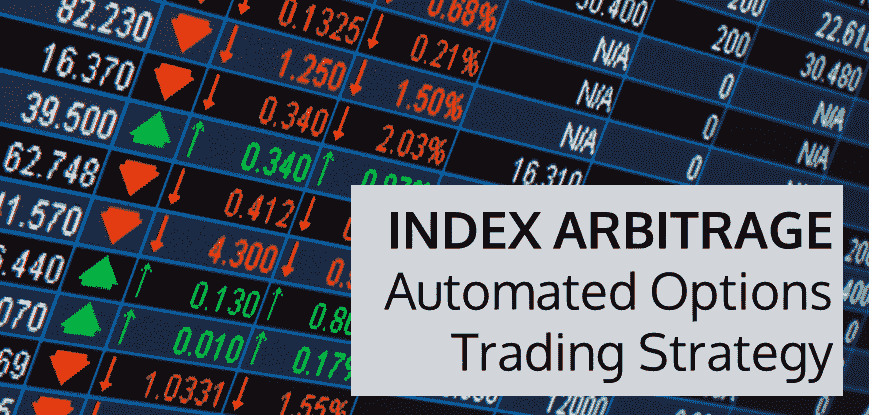
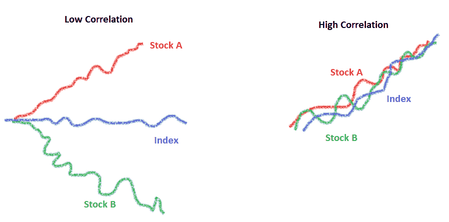
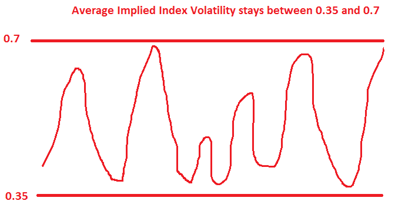

# 指数套利——一种自动化期权交易策略

> 原文：<https://blog.quantinsti.com/index-arbitrage-automated-options-trading-strategy/>

在本帖中，我们将讨论自动化套利交易(指数套利)以及在没有自动化的情况下实现这一想法的复杂性。如果你是期权交易的新手，那么你可以查看 Quantra 上的[虚拟期权交易](https://quantra.quantinsti.com/course/options-trading-strategies-python-basic)免费课程。

指数由一篮子股票组成。指数的价格取决于成份股的价格。如果所有股票的价格上涨 5%，那么指数价格也上涨 5%。

你认为在波动性的情况下也会这样吗:如果所有股票的波动性增加 5%，指数波动性也会增加 5%吗？答案是‘不一定’！指数波动取决于股票之间的相关性。让我们看看如何。

在股票 A 和股票 B 相关性较低的情况下，即使股票 A 和股票 B 的波动率都在增加，但指数波动率基本保持不变。另一方面，当相关性高时，指数的所有元素都在一起移动，因此当股票的波动性高时，指数的波动性也高。

### 股票和指数期权

用于指数期权定价的波动性取决于用于股票期权定价的波动性和股票之间的相关性。

**波动率用于给指数期权定价** =函数(**波动率用于给股票期权定价**，股票之间的相关程度)

根据市场上指数期权的价格，我们可以找到用于给指数期权定价的隐含波动率**。**

同样，根据市场上股票期权的价格，我们可以找到用于给股票期权定价的隐含波动率**。**

通过在上面的函数中插入这两个值，可以找到股票之间的平均隐含相关性水平。

### 交易我们对平均隐含相关水平的看法

如果说你当前的相关性是 0.4，你期望相关性会上升。这意味着所有股票将一起波动，因此指数波动性将相对上升。类似地，如果相关性预期下降，那么相对于股票期权，指数波动性预期下降。

当相关性预期上升时= >指数期权的波动性预期上升= >买入指数期权和卖出股票期权的权重比率。

### 我们为什么要进行自动套利交易？

1.  指数篮子的近似值

比方说，篮子里有股票 A (43%的权重)和股票 B (34%的权重)。你把它近似为 44 和 33，那么这个比例现在变成 4/3。然而，实际上一个指数中有许多股票。什么样的近似值能以最小的误差给出最小的股票规模？最重要的是，批量大小可能不同。这涉及需要自动化的复杂数学。

2.  通过合并个股和指数的希腊值计算总投资组合[希腊值](https://blog.quantinsti.com/the-greeks-in-options-delta-gamma-theta-and-vega/)。

例如，当你在指数 Nifty 篮子上交易时，你的投资组合有一个特定的 Delta、Vega 和 Gamma，用于 Nifty 和 consistent 股票，如 SBI、Reliance、TCS 等。对于净投资组合，需要计算希腊 delta、vega 和 gamma。这需要经常实时进行。

3.  随着市场的变动，头寸必须从一组期权执行转移到另一组。

为了更透彻地理解自动套利交易，你可以在这里浏览这次讨论的录音，

https://www.youtube.com/watch?v=2OqpdT9HuIU

你可以在 Quantra 上报名参加这个[免费在线 python 课程](https://quantra.quantinsti.com/course/options-trading-strategies-python-basic)，了解基本术语和概念，这将有助于你的以旧换新选择。

### 下一步

你可能也喜欢阅读关于[量化交易策略](https://quantra.quantinsti.com/course/quantitative-trading-strategies-models)的文章，比如关于统计套利的“[统计套利策略](https://blog.quantinsti.com/statistical-arbitrage/)和“[神话](https://blog.quantinsti.com/incorrect-notions-statistical-arbitrage/)，以更好地理解[套利策略](https://quantra.quantinsti.com/course/statistical-arbitrage-trading)。