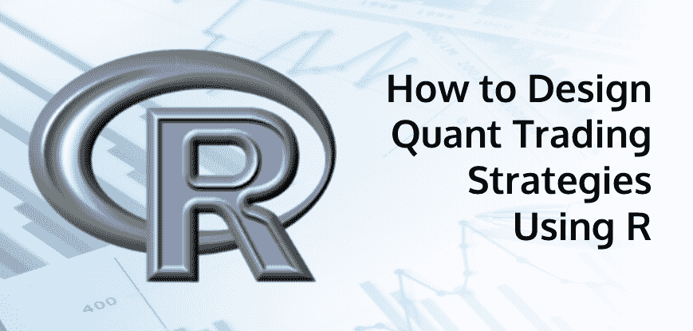
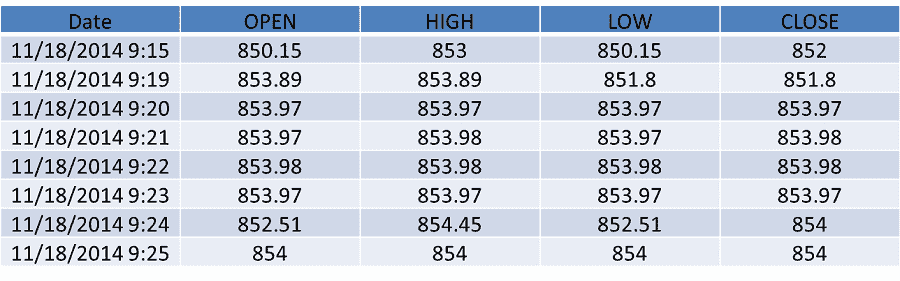
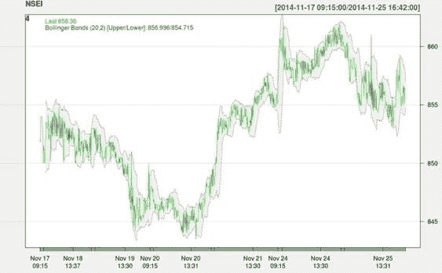
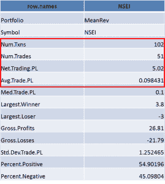

# 如何用 R 设计 Quant 交易策略？

> 原文：<https://blog.quantinsti.com/how-to-design-quant-trading-strategies-using-r/>

这篇博客简要介绍了使用 R 进行策略回溯测试的概念。在深入研究使用 R 的交易术语之前，让我们花一些时间来理解 R 是什么。r 是开源的。目前有超过 4000 个附加包，18000 多个 LinkedIn 群组成员和近 80 个 R Meetup 群组。这是一个完美的工具，用于统计分析，尤其是数据分析。CRAN 提供了一个软件包列表以及所需的基本安装。根据需要进行的分析，有许多可用的软件包。为了实现交易策略，我们将使用名为 quantstrat 的软件包。

### 任何基本交易策略的四个步骤

1.  假设形成
2.  测试
3.  改善
4.  生产

我们的假设被表述为“市场是均值回归的”。均值回归理论认为价格最终会回到平均值。第二步是测试假设，我们根据假设制定策略，并计算指标、信号和绩效指标。测试阶段可以分为三个步骤，获取数据、编写策略和分析输出。在这个例子中，我们考虑漂亮的蜜蜂。它是由高盛管理的交易所交易基金。NSE 具有巨大的仪器体积，因此我们考虑这一点。下图显示了相同的开盘价-最高价-最低价-收盘价。

我们绘制收盘价的布林线。

我们设定了一个阈值来比较价格的波动。如果价格上升/下降，我们更新阈值列。收盘价与高波段和低波段进行比较。当穿过上带时，这是卖出的信号。同样，当穿越较低波段时，是买入信号。编码部分可总结如下:-

*   添加指标
*   添加信号
*   添加规则

下图给出了该策略输出的俯视图。

因此，我们的假设，市场是均值回复是支持的。因为这是回溯测试，所以我们有空间改进交易参数，提高我们的平均回报和实现的利润。这可以通过设置不同的阈值水平、更严格的进场规则、止损等来实现。人们可以选择更多的数据进行回溯测试，使用 Bayseian 方法设置阈值，将波动性考虑在内。

一旦你对后验测试结果支持的交易策略有信心，你就可以进行实时交易了。生产环境本身是一个很大的话题，超出了本文的范围。简单来说，这包括在交易平台上写策略。

### 网络研讨会视频

https://www.youtube.com/watch?v=LkjpZ-pirGM

### 下一步

一旦你学会了使用 R 设计一个 quant 交易策略的基础，你可以看一看用 R 编码的交易策略的例子[，也可以学习一下](https://blog.quantinsti.com/an-example-of-a-trading-strategy-coded-in-r/)[如何开始使用 R](https://blog.quantinsti.com/a-guide-on-r-quantmod-package-how-to-get-started/) 中的 quantmod 包。你也可以看看我们的交互式自定进度 10 小时长的数据营课程'[在 R](https://www.quantinsti.com/courses/r/) 建模量化交易策略'