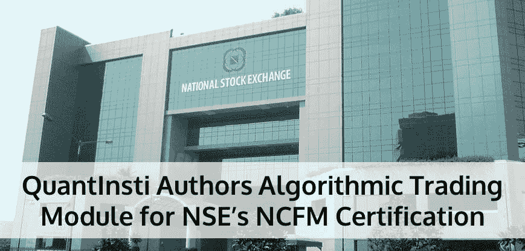

# QuantInsti 为 NSE 的 NCFM 认证设计了算法交易模块

> 原文：<https://blog.quantinsti.com/quantinsti-nse-ncfm-module/>

国家证券交易所(NSE)是覆盖全国多个城市的最大证券交易所之一。领先的机构采取主动，建立了 NSE，以提供一个现代化的全自动屏幕交易系统，覆盖全国。众所周知，NSE 带来了无与伦比的透明度、速度以及效率、市场完整性和安全性。就市场微观结构、市场惯例和交易量而言，NSE 在印度证券改革中发挥了催化作用。

金融部门有一个非常重要的方面，那就是开发一个人力资源库，在该行业的每个领域都拥有合适的技能和专业知识。为了拥有这样的熟练和专业的人员，需要向在该行业中工作的人员分配高质量的中介:

1.  遵循通常通过规章实现的行为准则
2.  拥有通过测试和认证系统获得的必要技能和知识

### 认证的必要性

随着算法交易的出现，仅在 NSE 中，算法交易就以指数级增长，占平台交易的 46%。自 2008 年 4 月 SEBI 开始允许直接市场准入以来，交易技术发展的趋势一直保持不变。

着眼于保护投资者&考虑国际经验；为了最大限度地降低因对市场缺乏了解而产生的风险，NSE 引入了认证和测试。近年来，随着市场经历了彻底的转变，出现了各种需要不同专业化和定位水平和性质的新功能。

### 关于 NCFM

NSE 在金融市场的认证；俗称 NCFM 是一个在线测试和认证计划。在金融市场运作所需的技能和实践知识受到考验。

认证考试面向各行各业想要从事算法交易或拥有算法交易平台的人。跨城市的 VSAT/租用线路网络技术允许灵活的日期、时间安排，并为候选人提供方便。

NCFM 有各种模块，涵盖广泛的垂直交易领域，即。共同基金、股票衍生品、商业银行、证券市场、银行基本面和资本市场基本面

然而，这还不够！考虑到市场和技术的指数变化，NSE 推出了另一个独特的模块，即算法交易模块

由于 QuantInsti 是亚洲算法交易教育的先驱机构，NSE 邀请 QuantInsti 开发其 NCFM 认证的算法交易模块。QuantInsti 开发的 NCFM 工作手册已经发布；其轮廓可以在这里获得[。](http://www.nseindia.com/content/ncfm/Course_outline_Algo_Trading_Module.pdf)

有鉴于此，QuantInsti 第二次与 NSE 一起成功开展了关于算法交易的[管理发展项目](https://blog.quantinsti.com/algorithmic-trading-workshop-mdp-nse-june-2015/) (MDP)。在 2014 年举行的[首届 MDP](https://blog.quantinsti.com/algorithmic-trading-workshop-mdp-nse-2014/) 中，我们的教员展示了各种自动化交易策略、工具、绩效评估技术、投资组合管理技术、规则和法规。