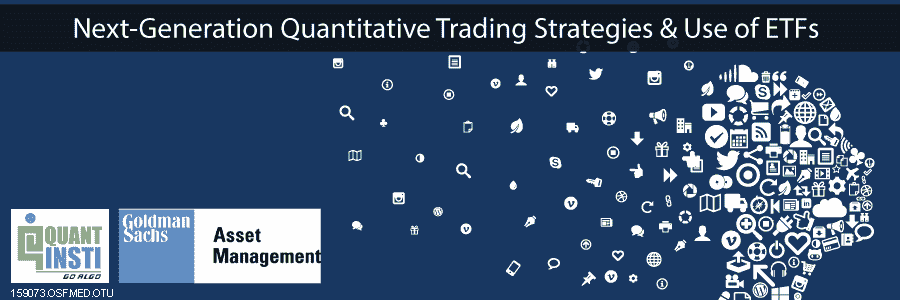

# QuantInsti &高盛资产管理研讨会

> 原文：<https://blog.quantinsti.com/quantinsti-goldman-sachs-asset-management-seminar/>

**日期**:2015 年 5 月 15 日

**地点**:BKC 孟买索菲特酒店

发言者 : Rajib Ranjan Borah、Gaurav Raizada、Radhakrishna Pendyala 和 Sameer Desai

### **活动日程**

*   **量化自动交易的消息** -晚上 7:15 到 7:45
*   ETF 中的机会 -晚上 7:45 至 8:15
*   **高频市场微观结构** -晚上 8:15 到 8:45
*   **晚餐&网络**——晚上 8:45 到 10:30

### **扬声器**

***quantin STI 量化学习有限公司的雄辩演讲者:***

**Rajib Ranjan Borah** 是 irage capital Advisory Pvt Ltd .&quantin STI Quantitative Learning Pvt Ltd .的联合创始人&董事。他在 **[上就自动化交易的量化新闻](https://blog.quantinsti.com/quantifying-news-for-automated-trading-methodology-and-profitability/)进行了发言和讨论。**

**Gaurav Raizada** 是 iRageCapital Advisory Private Ltd .的董事，负责该公司在印度的系统、性能和战略咨询业务，他还就**高频市场微观结构**发表了演讲。

***来自高盛资产管理的雄辩演讲者:***

**Radhakrishna Pendyala** 是高盛资产管理投资团队印度 ETF 业务的一员，在设计新投资产品和开展研究相关活动方面拥有丰富的经验。他在 Fidelity Investments、Modelytics 和 NumberPlus India Private Limited 拥有超过 12 年的行业经验。Radhakrishna 之前完成了 IIT 马德拉斯大学的毕业，以及印多尔 IIM 大学的研究生毕业。他还获得了纽约城市大学的金融工程硕士学位。

Sameer Desai 在资本市场拥有约 24 年的经验，涉足的领域包括机构股权销售、私人财富管理、独立财务顾问(IFA)集团、ETF 和指数化。他是高盛资产管理(印度)私人有限公司的执行董事，负责垂直股票经纪业务，其产品主要是 ETF。在收购 Benchmark Asset management India PVT . ltd .后，他加入了高盛印度资产管理公司。在加入 Benchmark Asset Management 之前，他曾担任 JM 金融服务私人有限公司和 Prabhudas Liladhar 私人有限公司的副总裁，这两家公司都是印度领先的金融服务集团。他在基准资产管理公司(Benchmark Asset Management)就指数化和 ETF 在印度各地做了无数次演讲。他来自印度孟买，专攻化学工程的聚合物技术分支，也从事管理研究。

### **事件焦点**

该活动的重点是利用新闻和市场微观结构在交易者、投资者和财富管理人员中传播关于交易技术和策略新发展的意识。它还关注了交易所交易基金中的机会。