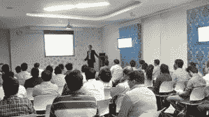

# 汤森路透关于算法和高频交易的研讨会

> 原文：<https://blog.quantinsti.com/workshop-with-thomson-reuters/>

[QuantInsti](https://www.quantinsti.com/ "QuantInsti") 和 **Thomson Reuters** 南亚成功举办了为期一天的研讨会，主题为 ***“算法和高频交易”*** 面向印度资本市场的领先国际和国内金融机构和卖方券商。

由[算法交易](https://www.quantinsti.com/courses/epat/ "Algorithmic Trading")进行；该课程非常成功地向观众介绍了高频交易中的先进概念。 [iRageCapital](http://www.iragecapital.com/ "iRage Capital") advisors 就系统架构&延迟、标准化协议、HFT 的交易策略设计方法、HFT 的风险管理以及该领域的新发展/工具等方面提供了实用见解。

该活动得到了参与者的积极响应，参与者包括来自国际和国内交易和经纪公司以及交易所**(汇丰银行、野村证券、瑞士瑞信银行、ICICI、Kotak、IDBI、Religare、大和资本、Prabhudas Leeladhar、Edelweiss、Karvy、古董经纪等)的交易和技术专业人士。**