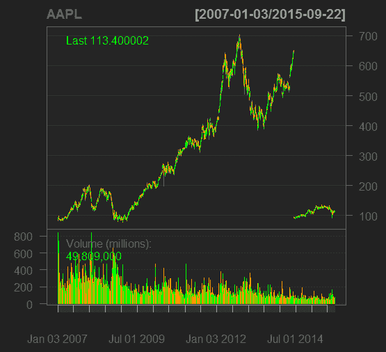
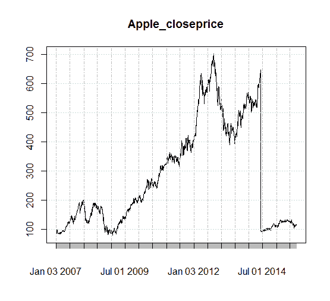
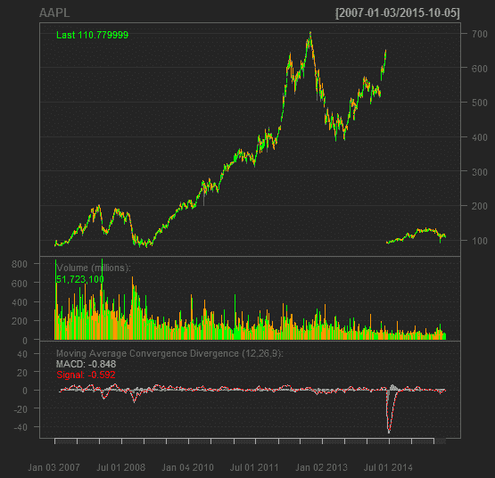
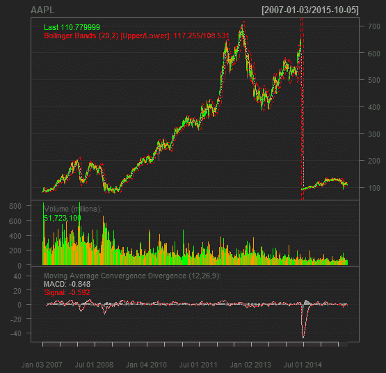
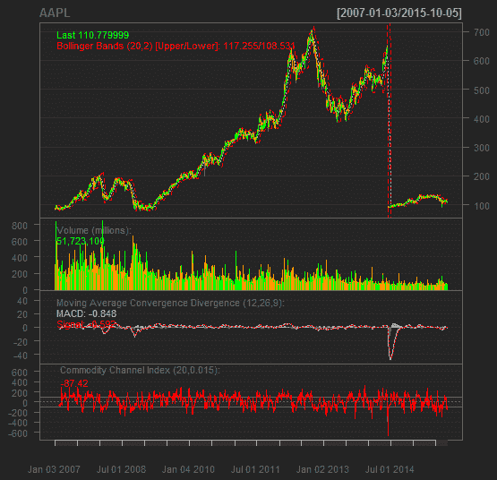
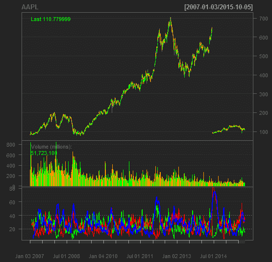
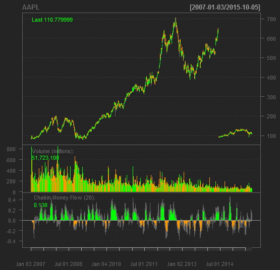

# R Quantmod 软件包指南:如何入门？

> 原文：<https://blog.quantinsti.com/a-guide-on-r-quantmod-package-how-to-get-started/>


> “为 [R](http://www.r-project.org/) 设计的 **quantmod** 软件包旨在帮助量化交易者开发、测试和部署基于统计的交易模型。”

这是一个快速原型开发环境，爱好者可以用最少的努力探索各种技术指标。它提供了 R. Quantmod 软件包中没有的图表工具，使建模更容易，分析更简单。本文旨在使用样本市场数据展示 quantmod 的一些功能。quantmod 的功能分为三个部分，下载数据、图表、技术指标和其他功能。

事不宜迟，我们将看到 quantmod 包的用法。

### **下载数据**

一旦安装了 quantmod 包并加载了库，运行下面的命令将 Apple Inc .股票的数据放入 R 控制台。

```py
getSymbols(‘AAPL’)
```

要查看数据的起点，请键入以下命令。

```py
head(AAPL) # You should see the following result.
```

```py
AAPL.Open AAPL.High AAPL.Low AAPL.Close AAPL.Volume AAPL.Adjusted

2007-01-03     86.29     86.58   81.90     83.80   309579900     11.19449

2007-01-04     84.05     85.95   83.82     85.66   211815100     11.44295

2007-01-05     85.77     86.20   84.40     85.05   208685400     11.36147

2007-01-08     85.96     86.53   85.28     85.47   199276700     11.41757

2007-01-09     86.45     92.98   85.15     92.57   837324600     12.36603

2007-01-10     94.75     97.80   93.45      97.00   738220000     12.95782
```

### **可视化图表**

quantmod 的美妙之处在于其可视化图表的能力。键入以下命令。

```py
chartSeries(AAPL, TA=NULL) # this should produce the following chart.
```


可以看到，x 轴显示的是时间段，而 y 轴显示的是 AAPL 股票的价格范围。在上面的命令中，我们设置 TA =“Null”。这意味着不包括任何技术分析参数。下面的命令产生了带有 volume 参数的相同图形。

```py
barChart(AAPL)
```



这张图和上一张图的显著区别是 AAPL 体积的表示。其余的语法是用来修饰图表外观的。

我们将选择收盘价作为参考，并以此为基础计算各项技术指标。以下命令选择苹果公司的收盘价。

```py
Apple_closeprice = Cl(AAPL) # We assign the closing price to a new variable called Apple_closeprice.

plot(Apple_closeprice) # Plotting the close price
```



绘制直方图很简单。

```py
hist(AAPL[,4]) #This command plots the histogram of closing price of apple stock.
```

![hist(AAPL[,4])](img/b66b90e8f314312eeb5ef1d42b8c6995.png)

```py
hist(NSEI[,4], main = "Apple Close") #The histogram of closing price of apple stock with the heading “Apple Close”
```

![hist(NSEI[,4], main = "Apple Close")](img/e3c909249fe4564c4f3811987d4c8f3f.png)

```py
hist(NSEI[,4], main = "Apple Close", breaks =25) # Introducing more price ranges.
```

![hist(NSEI[,4], main = "Apple Close", breaks =25)](img/5ea282cfc7f690d29a6e80446300ed97.png)

### **技术指标**

```py
chartSeries(AAPL)

addMACD() # adds moving average convergence divergence signals to the apple stock price
```



```py
addBBands() # Adds Bollinger bands to the apple stock price.
```



```py
addCCI() # Add Commodity channel index.
```



```py
addADX() #Add Directional Movement Indicator
```



```py
addCMF() #Add Chaiken Money Flow
```



同样，也可以计算出其他[技术指标](https://blog.quantinsti.com/build-technical-indicators-in-python/)。以下是 quantmod 支持的技术指标列表。

```py
addCMO # Add Chaiken Money Flow

addDEMA # Add Double Exponential Moving Average

addDPO # Add Detrended Price Oscillator

addEMA # Add Exponential Moving Average

addEnvelope # Add Price Envelope

addEVWMA # Add Exponential Volume Weigthed Moving Average

addMACD # Add Moving Average Convergence Divergence

addMomentum # Add Momentum

addROC # Add Rate of Change

addRSI # Add Relative Strength Indicator

addSAR # Add Parabolic Stop and Reverse

addSMA # Add Simple Moving Average

addSMI # Add Stocastic Momentum Index

addTRIX # Add Triple Smoothed Exponential Oscillator

addVo # Add Volume

addWMA # Add Weighted Moving Average
```

我们将看看 quantmod 的数据处理特性。我们之前看到下载的苹果数据有如下结构。

```py
AAPL.Open AAPL.High AAPL.Low AAPL.Close AAPL.Volume AAPL.Adjusted

2007-01-03     86.29     86.58   81.90     83.80   309579900     11.19449

2007-01-04     84.05     85.95   83.82     85.66   211815100     11.44295

2007-01-05     85.77     86.20   84.40     85.05   208685400     11.36147

2007-01-08     85.96     86.53   85.28     85.47   199276700     11.41757

2007-01-09     86.45     92.98   85.15     92.57   837324600     12.36603

2007-01-10     94.75    97.80   93.45     97.00   738220000     12.95782
```

### **有用的功能**

Quantmod 提供了探索数据帧特征的函数。以下命令显示保存 apple 数据的对象类型是 xts 和 zoo。

```py
class(AAPL)
```

人们想要探究提取的数据是否包含开盘价、交易量等。看看下面的命令。

```py
is.OHLC(AAPL) # Checks whether the xts data object has the open,high, low and close price?
```

输出为真，意味着数据对象包含开盘价、最高价、最低价和收盘价。

```py
has.Vo(AAPL) # Checks whether the data object has volume

seriesHi(AAPL) # To check the highest point of price.

Lag(Cl(AAPL)) #One period lag of the closing price

Next(OpCl(AAPL)) #The next periods open to close - today!

AAPL ['2007'] #Fetches all Apple’s 2007 OHLC

AAPL ['2008::'] # Apple data, from 2008 onward

dailyReturn(AAPL) # Returns by day

weeklyReturn(AAPL) # Returns by week

monthlyReturn(AAPL) # month, indexed by yearmon  daily,weekly,monthly,quarterly, and yearly

allReturns(AAPL) # note the plural
```

### **下一步**

如果你是新手，不能掌握这篇文章的所有技术方面，你可以看看一些解释基本概念的文章，比如在 R 中设计一个 quant 交易策略。你也可以看看用 R 编码的交易策略的基本[例子。](https://blog.quantinsti.com/an-example-of-a-trading-strategy-coded-in-r/)

*免责声明:股票市场的所有投资和交易都有风险。在金融市场进行交易的任何决定，包括股票或期权或其他金融工具的交易，都是个人决定，只能在彻底研究后做出，包括个人风险和财务评估以及在您认为必要的范围内寻求专业帮助。本文提到的交易策略或相关信息仅供参考。*