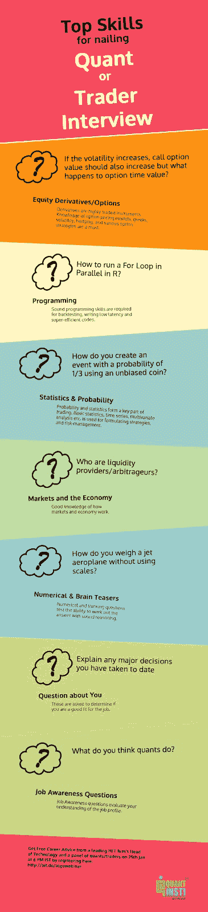

# 算法交易者 Vs 量化开发者

> 原文：<https://blog.quantinsti.com/algorithmic-trader-vs-quant-developer/>

作者[查尼卡·塔卡](https://www.linkedin.com/in/chainika-bahl-thakar-b32971155/)

这篇文章是关于分别讨论算法交易员和量化分析师，以及他们的角色结合在一起的相关性。我们已经讨论了每个角色的主要方面，例如每个角色适合的工作、薪水以及如何成功实现每个角色。

让我们详细了解一下上面提到的所有内容，因为本文涵盖了:

*   [什么是算法交易员，什么是 quant 开发者？](#what-is-an-algorithmic-trader-and-a-quant-developer)
*   [算法交易员和 quant 开发者的工资是多少？](#what-is-the-salary-of-an-algorithmic-trader-and-a-quant-developer)
*   [学历](#educational-qualifications)
*   [算法交易员和量化分析师的工作角色差异](#difference-in-the-job-roles-of-an-algorithmic-trader-and-a-quant developer)

## 什么是算法交易员，什么是 Quant 开发者？

算法交易员是设计[算法](https://quantra.quantinsti.com/glossary/Algorithm)的人，用于生成交易信号以及在金融市场下单。说到算法，可以假设每个算法都可以访问工具的当前和历史价格。买入或卖出的决定是基于算法在这些价格信息的帮助下进行的计算。该算法甚至可以将订单分成小块，在不同的时间执行，以获得尽可能好的价格。我们刚刚讨论了算法交易的核心和算法交易者的工作。

尽管如此，如果你渴望成为一名算法交易者，这本[循序渐进的指南](/learn-algorithmic-trading/)可以为你提供详细的知识。

现在，我们在本文中讨论的另一个概要文件是 quant 开发人员的。这个职业要求一个人是为量化金融和量化交易行业开发解决方案的程序员。一个 quant 开发人员精通诸如数学、高级金融、算法和 T2 数据结构等学科。定量开发人员通常最适合投资银行、对冲基金、经纪服务和金融证券公司。此外，一个定量分析师使用复杂的数学计算和[定量分析](https://www.youtube.com/watch?v=SohUND7tLNc)来创造交易算法。

如果你想了解算法交易领域的演变、含义和未来，请观看此视频:

<figure class="kg-card kg-embed-card">

[https://www.youtube.com/embed/73gr7qkQedo?feature=oembed](https://www.youtube.com/embed/73gr7qkQedo?feature=oembed)

</figure>

接下来，我们将了解一名算法交易员和一名量化开发人员的工资。

## 一个算法交易员和一个 Quant 开发者的工资是多少？

下面，我按以下方式列出了每个国家的 quant 开发人员的平均工资:

| 国家 | 平均基本工资 |
| 美国 | $112,816 |
| 印度 | 卢比 1,036,126 |
| 英国 | £63,029 |
| 加拿大 | 76 768 美元 |
| 新加坡 | 94，817 新元 |
| 香港 | 636，632 港元 |
| 澳大利亚 | 105，851 美元 |

来源:玻璃门

接下来，我提到了每个国家特定的算法交易员平均工资列表:

| 国家 | 平均基本工资 |
| 美国 | $1,24,072 |
| 印度 | 108.4 万卢比 |
| 英国 | £93,054 |
| 加拿大 | 87 525 美元 |
| 新加坡 | 16 万新元 |
| 香港 | 100 万港元 |
| 澳大利亚 | 57，538 美元 |

来源:玻璃门

现在让我们找出算法交易者和量化开发者的学历。

## 教育资格

尽管算法交易员和量化分析师都需要编程知识，但教育资格可能会有所不同，因为有抱负的算法交易员会从经济学和金融学等学科中受益更多。

然而，基本的编程知识对一个有抱负的算法交易者也很重要，因为它有助于和量化开发者保持一致。

一个有抱负的 quant 开发人员，就教育资格而言，将受益于计算机科学学位，因为这个特定的角色需要专业水平的编码知识。

quant 开发人员需要编写算法来执行算法交易员开发的交易策略。

一个有抱负的 quant 开发者，以及一个算法交易者，必须学习一门编码语言，尤其是最常见的语言，比如 Python、C++、R 和 Java。

此外，工具的知识是成为一个定量分析师所必需的，因为这些工具有助于回溯测试和最终确定交易策略。一些通用工具有[蓝移](https://blueshift.quantinsti.com/)、[量子库](https://www.quantlib.org/)和[量子库](http://www.jquantlib.org/en/latest/usersguide.html#about-jquantlib)。

<figure class="kg-card kg-image-card kg-width-full"></figure>

为了学习这些技能，你可以看看我们的博客，上面有一个由免费资源组成的列表。

完美！现在，我们将讨论算法交易员和量化分析师的工作角色有何不同。

## 算法交易员和量化分析师的工作角色不同

算法交易员和量化分析师的角色是并行的。

算法交易员负责设计策略，量化分析师负责编程或编码。

这两份工作同等重要，并且在技能方面有一些相似之处，因为他们都来自编程背景。

算法交易者的主要技能和专业知识在于交易和制定策略。一个算法交易者需要能够与 quant 开发者交流策略，以便帮助编码策略。

定量分析师不需要总是有自己的策略。他们需要理解并采用策略来完美地自动化它们。

由于工作的敏感性，算法交易员的薪酬高于量化分析师。

然而，一个算法交易者有编码的知识，以便能够回测其交易策略。回溯测试让算法交易者知道交易策略是否成功。然后，交易者可以基于一些分析来实施策略。

量化分析师需要擅长编码，能够编码算法交易者的策略，并把它们转换成算法。

这都是关于算法交易员和量化分析师的工作角色，他们都在快速发展的算法交易领域茁壮成长。

此外，据估计，算法交易领域的市场规模预计将从 2019 年的 111 亿美元增长到 2024 年的 188 亿美元。这是《经济时报》最近估计的，也表明随着时间的推移，算法交易行业将会有更多的工作机会。

如果你想成为一名算法交易者或量化开发者，可以去看看普里扬卡(算法交易者)和 T2(量化开发者)的成功故事。我们希望你能够理解他们的旅程，并在你的职业生涯中迈出下一步。

因为有几个工作机会你可以探索，请在 [QuantInsti](https://www.quantinsti.com/quant-jobs) 上随意寻找。

好吧！我们已经到了这篇文章的结尾。希望它给出了两个经常混淆的工作角色的简单知识。

## 结论

虽然算法交易者和量化分析师有某些相似之处，但是他们在每个角色上的专长有很大的不同。算法交易员更关注交易，也更关注编码，以便能够与定量分析师沟通需求。因此，两者之间的协调是创造算法交易算法的必要条件。

如果你真的想以量化交易为职业，可以通过 QuantInsti 的 EPAT 向业内最好的人学习[算法交易](https://quantra.quantinsti.com/course/getting-started-with-algorithmic-trading)。EPAT 是世界上第一个经过验证的[算法交易课程](https://www.quantinsti.com/epat)，其校友遍布 70 多个国家。

<small>免责声明:本文中提供的所有数据和信息仅供参考。QuantInsti 对本文中任何信息的准确性、完整性、现时性、适用性或有效性不做任何陈述，也不对这些信息中的任何错误、遗漏或延迟或因其显示或使用而导致的任何损失、伤害或损害承担任何责任。所有信息均按原样提供。</small>