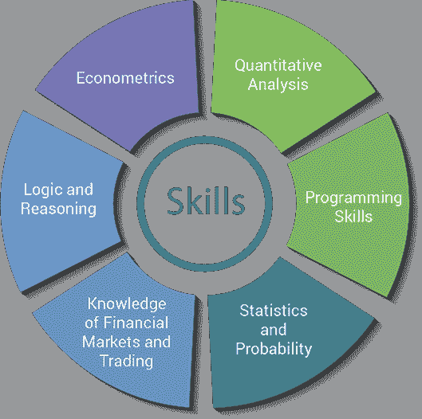
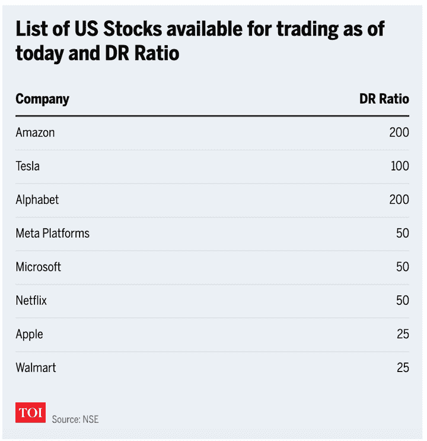

# 印度的算法交易:资源、法规和未来

> 原文：<https://blog.quantinsti.com/algorithmic-trading-india/>

由[查尼卡·塔卡](https://www.linkedin.com/in/chainika-bahl-thakar-b32971155/)

算法交易意味着使用计算机程序和软件，在没有太多人工干预的情况下(除了根据所需的交易头寸调整算法)，在证券交易所执行交易。

虽然有人批评算法交易，但普遍的共识是算法交易是交易过程不可避免的演变。在印度，目前，在 NSE 和 BSE 的⁽ ⁾ 的总订单中，约有 50%以上是通过算法下单的。

让我们了解一下印度流行的算法交易。在这篇博客中，我们将介绍:

*   [算法交易简介](#a-brief-about-algorithmic-trading)
*   [印度算法交易的历史](#history-of-algorithmic-trading-in-india)
*   [智能订单路由、高频交易和协同定位的作用](#role-of-smart-order-routing-high-frequency-trading-and-co-location-in-algorithmic-trading)
*   印度如何启动算法交易？
*   [在印度做算法交易的先决条件](#prerequisites-for-doing-algorithmic-trading-in-india)
*   [在印度学习算法交易的资源](#resources-to-learn-algorithmic-trading-in-india)
*   [印度算法交易法规](#regulations-on-algorithmic-trading-in-india)
*   [今日印度的算法交易](#algorithmic-trading-in-india-today)
*   [印度算法交易的未来](#future-of-algorithmic-trading-in-india)
*   [关于印度算法交易的常见问题](#frequently-asked-questions-about-algorithmic-trading-in-india)
    *   [谁会做算法交易？](#who-can-do-algorithmic-trading)
    *   获得任何自动化的法律批准有多繁琐？
    *   [零售交易商能否承受审批流程和基础设施成本？](#is-the-approval-process-and-infrastructure-cost-affordable-for-retail-traders)
    *   [算法交易在印度合法吗？](#is-algorithmic-trading-legal-in-india)
    *   在使用 algo 之前，你需要获得哪些批准？
    *   [在审批过程中是否保密？](#is-confidentiality-maintained-while-going-through-the-approval-process)
    *   算法交易在印度有好的回报吗？
    *   算法交易对协同定位等操纵的风险有多大？
    *   散户是否成功采用了算法交易？机构交易者对散户的竞争是否存在超高难度？
    *   印度人可以在哪些全球市场或交易所交易？

* * *

## 算法交易简介

简而言之，[算法交易](/algorithmic-trading/)是将[交易策略转化为计算机代码](https://www.youtube.com/watch?v=mrl3I4oBxNE&t=3913s)的过程，计算机代码以自动、快速、准确的方式买卖股票。

一般来说，自动交易方式更快、更准确，因此，它现在是首选，并正在迅速扩大其在新兴市场的影响力。

从技术上讲，有几种数学算法在根据当前市场数据做出交易决策，然后在金融市场发送并执行订单。

这种方法使交易不受任何情绪的影响(如恐惧、贪婪等)。)因为执行每笔交易的决定都是由计算机以系统的方式做出的。

例如，你可以设计一个简单的算法，如果苹果(AAPL)股票的当前市场价格低于 200 天的平均价格，你就购买该股票。相反，如果当前市场价格高于 200 天的平均价格，你也可以确保它出售苹果(AAPL)股票。

* * *

## 印度算法交易的历史

2008 年 4 月 3 日，印度证券交易委员会(SEBI)引入了算法交易，允许机构客户直接进入市场。

简而言之，DMA 允许经纪人向客户提供他们的基础设施，并允许他们在没有任何干预的情况下访问交易所交易系统。最初，它只提供给机构客户，而不是散户。

尽管如此，该设施降低了机构投资者的成本，并通过减少将订单发送给经纪人和发布必要指令所花费的时间，帮助更好地执行。

在 2008 年 4 月 29 日，这项设施已经成为一些全球顶级玩家注册 DMA 设施的热门。像瑞银、摩根士丹利、摩根大通和 DSP 美林这样的金融机构和 FII 公司正在等待批准。

Edelweiss Capital、India Infoline 和 Motilal Oswal Securities 等公司向证券交易所提交了申请。值得注意的是，从 2009 年 2 月 24 日起，外国机构投资者(FIIs)可以通过他们提名的投资经理使用 DMA 机制。

到 2008 年 7 月 31 日，领先的经纪公司和证券交易所正在为直接市场准入(DMA)的运作做准备。花旗、美林、摩根士丹利、JP 摩根、高盛、CLSA 和德意志证券等券商已开始对其 DMA 软件进行试运行，试图使其与证券交易所的系统同步。

* * *

## 智能订单路由、高频交易和协同定位在算法交易中的作用

算法交易包括智能订单路由、高频交易(HFT)及其下的协同定位等实践。您将看到下面详细讨论的这些实践。

### 智能订单路由

订单路由是一个将订单从最终用户传递到交易所的过程。

客户的订单可以直接送到交易所，也可以先送到经纪人那里，经纪人再把订单送到交易所。

智能订单路由是算法交易中使用的自动化流程，遵循一套执行订单的规则。智能订单路由试图实现交易的最佳执行，同时将市场影响降至最低。

### 高频交易(HFT)

高频交易是算法交易的一部分。在这里，机会是在从纳秒到毫秒的非常小的时间尺度上被寻找和利用的。

一些高频策略采用做市商类型的角色，试图保持相对中性的头寸，并在利用任何价格差异的同时证明流动性(大多数时间)。

其他策略调用时间序列分析、机器学习和人工智能的方法来预测运动，并在大量数据中分离出趋势。抛开具体的策略不谈，对 HFT 来说，监控整体库存风险并将这一信息纳入定价/交易决策始终至关重要。

### 协同定位

协同定位是位于 exchange 场所的数据中心设施，其中 exchange 的服务器位于同一网络上。它用于向贸易公司出租空间，以放置他们的服务器和其他计算硬件。

托管设施提供电源、带宽、IP 地址和冷却系统。此外，通过最大限度地减少服务器和 exchange 匹配引擎之间的传输时间，协同定位有助于减少延迟。

* * *

## 在印度如何开始算法交易？

现在让我们来讨论如何在印度开始算法交易，以及 T2 学习算法交易的一些必备资源。

让我们先从先决条件开始。

### 在印度做算法交易的先决条件

**分析技能**

对于任何一个量化交易者/开发者来说，具有分析思维是非常重要的品质，这在面试中很重要。

例如，可能会给一个候选人一个巨大的数据集，并要求他从数据中找出模式。对候选人的评估基于他们如何处理任何给定的问题，以及他们客观地证明其解决方案的能力。

**数学技能**

由于算法交易的核心围绕着算法、数据和编程，拥有合理的编程技能和对统计和微积分的基本理解对于任何一个在算法/HFT 交易的求职者来说都是很重要的。

例如，如果候选人申请一家部署低延迟战略的公司，那么这样的候选人应该具有专家级的编程水平。

**编程技巧**

对编程语言的了解( [Python for Trading](https://quantra.quantinsti.com/course/python-for-trading) )是一个额外的优势，因为它能让你独立运作。交易者倾向于学习编码的长期效果和好处，尤其是 Python。

[Python](/what-makes-python-most-preferred-language-for-algorithmic-traders/) 擅长概念化，[擅长回溯测试策略](https://quantra.quantinsti.com/course/backtesting-trading-strategies)，有很多库用于结果的验证和可视化。它也可以被公司用于不依赖于低延迟的策略。

**战略制定流程**

在设计任何策略时，重要的是要了解与该策略相关的风险和回报，以确定它是否在市场中具有优势。这是在策略的[回溯测试](/backtesting/)期间完成的。

在市场上实施策略之前，交易频率、交易工具和杠杆都需要考虑在内。

单一的策略不能保证年复一年的利润。一个人必须使用先进的数学模型和统计学来定期制定和调整策略，以保持在市场中的盈利。

要了解各种算法交易策略，可以学习[算法交易策略](/algorithmic-trading-strategies/)，范式和建模思路。

**了解金融市场**

量化交易涉及处理大型金融数据集，交易不同的工具，如股票、衍生品、外汇等。因此，即使你来自非金融技术背景，作为一个 quant 公司的开发人员，你也需要对[金融市场](/financial-markets-introduction/)有一个公平的理解。

交易公司通常会让新员工花时间在不同的部门(如量化部门、交易部门、风险管理部门)来了解市场。

除此之外，一个人必须具备专业知识。想知道更多关于所需技能的信息，请看这张关于获得量化分析师或交易者面试的[顶级技能的信息图。](/top-skills-nailing-quant-trader-interview/)

如果你对上述先决条件了如指掌，如果你想在算法交易或 HFT 公司得到一份[的工作，你只需要准备好](/chemical-engineering-algorithmic-trading-epat-success-story-arushi-roy/)[量化面试](https://quantra.quantinsti.com/course/quant-interview-questions-preparation)。

除了上面提到的，我们还可以看到一些成为算法交易者所需的一般技能，如下:

*   定量分析
*   编程技能
*   统计和概率
*   金融市场和交易知识
*   逻辑和推理
*   计量经济学

Skills for quants

向前看，让我们找出可靠的资源来学习算法交易。

### 在印度学习算法交易的资源

对于学习算法交易来说，专门针对算法交易的一些有用的课程和[书籍是很大的帮助！](/books-algorithmic-trading/)

如果你想遵循以教学为导向的学习方法，这些课程会有所帮助。另一方面，书籍可以帮助那些喜欢阅读和学习所涵盖的详细概念的人。

* * *

## 印度的算法交易法规

根据审计要求、算法交易的执行和商品市场，印度有一套特定的算法交易规则和条例。

### 审计要求

所有算法交易公司都需要通过半年度审计，审计只能由交易所网站上列出的交易所选任系统审计师(CISA 认证)进行。对于审计需求，您需要维护订单、交易、控制参数等的日志。在过去的几年里。

现在您必须知道，控制参数是印度交易所特别需要的，以了解所下订单的策略是否得到验证。

### 执行相关

以下是关于订单执行的某些合规性。首先，它坚持认为所有的订单都必须按照交易所的规定贴上唯一的标识。其次，新订单只有在对之前未执行的订单进行核算后才能执行。

对算法的任何修改都要得到交易所的批准，系统应该有足够的检查，以便在出现循环或失控的情况下终止执行。

### 特定商品市场

有一定的风险控制措施，如每日价格区间、最大订单量、[持仓](https://quantra.quantinsti.com/course/position-sizing-trading)限额等。这是应该遵守的。此外，市价订单和 IOC(立即或取消)订单将不被下单，只能下单限价订单。

迷你和微型合约不接受算法交易。此外，所有订单都应通过位于印度的会员服务器和经批准的 id 发送。这些系统不能与印度境外的任何系统或 ID 有任何链接。

会员必须确保他们的策略将流动性引入市场，并应提交一份解释该策略的文件。成员还应维护上述规定的所有日志，确保定期审计，并获得对现有战略的任何变更的批准。

* * *

## 今日印度的算法交易

印度证券交易委员会(SEBI)于 2008 年引入并允许算法交易。最初，它始于只限于机构投资者的直接市场准入(DMA)，但由于成本优势和更好的执行，交易界采用了它。

2010 年 6 月，交易所通过向经纪公司提供共址服务器“机架” [⁽ ⁾](https://economictimes.indiatimes.com/markets/stocks/news/how-algorithms-are-going-to-change-the-way-you-buy-and-sell-stocks/articleshow/85532682.cms) 租赁，在算法交易的采用方面也发挥了重要作用。服务器机架的租赁帮助经纪人提高了交易速度，并与国际市场接轨。

在当今时代，大多数领先的经纪公司和证券交易所都具备运营直接市场准入(DMA)的基础。诸如花旗、美林、摩根士丹利、JP 摩根、高盛、CLSA 和德意志证券等经纪公司都有自己的 DMA 软件来与证券交易所的系统同步。

此外，算法交易今天在印度已经变得相当先进，有更多的高频交易(HFT)公司在这个国家盛行。

* * *

## 印度算法交易的未来

算法交易 [⁽ ⁾](https://economictimes.indiatimes.com/markets/stocks/news/all-you-need-to-know-about-career-in-algo-trading-and-its-future/articleshow/91105497.cms) 在很多方面都是进步的——除了交易者获得良好回报的机会之外，算法交易更加系统化，因为它排除了人类情绪和错误的影响。这也使得市场更有效率和流动性。

那么，算法交易的[未来是什么样的？](/growth-future-algorithmic-trading/)

算法交易的未来预测 [⁽⁴⁾](https://economictimes.indiatimes.com/markets/stocks/news/all-you-need-to-know-about-career-in-algo-trading-and-its-future/articleshow/91105497.cms) 算法交易的资源将随着市场的增长而发展，变得结构化和高效。

印度市场中算法交易的渗透率为 50-60%,但也有人认为印度市场中的算法交易将继续增长。

印度的算法交易有两个预测 [⁽⁵⁾](https://analyzingalpha.com/algorithmic-trading-statistics)

*   预计 2027 年，股票可能会在算法交易市场份额中贡献 86.1 亿美元。
*   算法交易市场在 2021-2026 年间可以以 11.23%的 CAGR 增长。

* * *

## 关于印度算法交易的常见问题

以下是一些关于算法交易的常见问题:

### 谁会做算法交易？

任何精通编程语言(如 Python)的人，拥有市场交易的知识和经验，并且已经获得了进行算法交易的先决条件，都可以进行算法交易。

尽管如此，任何参与算法交易的人都必须记住这些:

*   解决系统中的任何小故障以及根据市场变化调整代码都需要不断的人工干预。
*   需要一个强大的互联网连接来保持算法交易的不间断。
*   交易者必须不断提高他们的技术技能，随着技术的进步开发算法。

### 获得任何自动化的法律批准有多繁琐？

审批过程没有那么繁琐，但如果你是散户或个人交易者，基础设施(尤其是 HFT)可能会有点棘手。此外，如果您有一个自动化代理，那么规则要求代理应该代表您接受批准。

作为个人，你作为散户不能去交易所要求批准。

### 零售贸易商能否承受审批流程和基础设施成本？

成本取决于经纪人，但从技术上讲，这并不昂贵。

### 算法交易在印度合法吗？

这个问题的简单答案是“是”。

### 在使用 algo 之前，您需要获得哪些批准？

如果你在芝加哥商品交易所、SGX 或欧洲期货交易所交易，那么所需的批准更多的是一个一致性测试，这意味着你将获得交易平台的批准。一旦获得批准，你就可以在上面编码任何策略并发出命令。

如果你在印度或泰国等地，那么你需要让你的战略获得批准，为此，你要做的是为每项战略创建一份文件，并将其发送给交易所批准。

如果你是交易所的会员，你可以直接发送，如果你不是交易所的会员，你可以通过经纪人发送。

印度的流程包括(不同的交易所可能有所不同)获得审计师签署的策略，参加模拟交易会议，然后获得交易所的演示。发布消息说你得到了交易所的批准，然后你开始交易。这是每个策略都必须遵循的规则。

### 在审批过程中是否保密？

交易所通常不太关注策略，而是更关注风险管理。

重点是你的策略不应该给市场或他们造成混乱，这是交易所的主要关注点，而不是你的策略做了什么。

他们会在一个宽泛的层面上问你这个策略，但我不认为这会让你的知识产权受到威胁。

### 算法交易在印度有好的回报吗？

算法交易的好回报完全取决于你的算法交易策略。你在市场上的经验越丰富，你的策略就越好，因此，你就能获得更好的回报。

### 算法交易对协同定位等操纵行为的风险有多大？

协同定位不是操纵。它只是提供给你的一个设施。这就好比说，如果你乘飞机旅行，与乘火车去目的地的人相比，花费更多，这是多么危险。

你越来越快，但你在为此付费，你正在得到它，所以这是一个公平的市场，你为你得到的东西付费。

对那些重视协同定位的人来说，对全球大多数交易所来说，协同定位并不昂贵，因此交易所也相当负责任。

即使在印度，您也可以获得半机架(21 台)，您可以在半机架中放置大量服务器，每月大约需要 50，000 卢比。我不是说这很便宜，但如果你交易的策略依赖于每一毫秒都很重要的协同定位，这就没那么严格了。

### 散户是否成功采用了算法交易？机构交易者对散户的竞争是否存在超高难度？

散户交易者是长期以来被剥夺了算法交易的人。但是，现在，散户交易者正在采用算法交易，因为像 TD ameritrade[⁽⁶⁾](https://www.tdameritrade.com/tools-and-platforms/web-platform/features.page)这样的公司或经纪人正在支持散户算法交易者。

据 2017 年 11 月 29 日经济时报 [⁽⁷⁾](https://economictimes.indiatimes.com/markets/stocks/news/sebi-framing-algo-trading-rules-for-retail-investors/articleshow/61841163.cms) 报道，2016 年 8 月，Sebi 是首批发布讨论文件，提议加强算法交易规则的监管机构之一。它提出了一套 7 项建议，旨在为机构投资者和散户投资者创造一个公平的竞争环境。

### 印度人可以在哪些全球市场或交易所交易？

你可以从印度购买美国的股票，还可以在国际经纪商那里拥有一个交易账户。此外，你还可以购买国际指数中的交易所交易基金。

此外，最近有 8 只美国股票 [⁽⁸⁾](https://timesofindia.indiatimes.com/business/india-business/explained-how-indian-investors-can-directly-trade-in-8-major-us-stocks-from-today-via-nse-ifsc/articleshow/89961118.cms) 可供印度交易商直接通过 NSE IFSC 进行交易。

看看下面的列表。

List of US stocks available for trading

我们整理了一些最受欢迎的由专家撰写的关于算法交易的博客。

* * *

### 结论

尽管印度不是算法交易领域的先行者，但自 SEBI 允许先进技术应用于股票市场以来，印度的受欢迎程度一直在上升。

这也产生了对算法交易软件、工具和平台的需求，交易者可以使用这些软件、工具和平台来进行金融操作。

如果你想学习算法交易的各个方面，那就去看看这个[算法交易课程](https://www.quantinsti.com/epat/)，它涵盖了统计学&计量经济学、金融计算&技术和算法&量化交易等培训模块。EPAT 旨在让你具备成为成功交易者的正确技能。

* * *

*<small>免责声明:本文提供的所有数据和信息仅供参考。QuantInsti 对本文中任何信息的准确性、完整性、现时性、适用性或有效性不做任何陈述，也不对这些信息中的任何错误、遗漏或延迟或因其显示或使用而导致的任何损失、伤害或损害负责。任何信息都不应被解释为建议，quantin STIT5 对任何监管信息不承担任何责任。所有信息均按原样提供。</small>*