# 股票市场数学:算法交易的基本概念

> 原文：<https://blog.quantinsti.com/algorithmic-trading-maths/>

由[查尼卡·塔卡](https://www.linkedin.com/in/chainika-bahl-thakar-b32971155/)

人们可能会经常思考，理解和学习股票市场数学的必要性。

*   *学数学对股市有什么需求？*
*   在哪里可以学到数学在股市中的应用？
*   *股市数学的基础是什么？*

许多人的目标是从数学的角度学习算法交易。各种数学概念，统计学，计量经济学发挥着至关重要的作用，让你的股票交易在股市中的优势。

这里有一个完整的列表，列出了关于股票市场 ath 的所有内容:

*   谁是交易者？
*   谁是定量分析师或量化分析师？
*   [为什么算法交易需要数学？](#why-does-algorithmic-trading-require-math)
*   数学何时以及如何成为交易:历史之旅
*   [股票市场的数学概念](#mathematical-concepts-for-stock-markets)
*   [描述性统计](#descriptive-statistics)
    *   [集中趋势的度量](#measure-of-central-tendency)
        *   [表示](#mean)
        *   [中位数](#median)
        *   [模式](#mode)
    *   [离散度的测量](#measure-of-dispersion)
        *   [范围](#range)
        *   [四分位偏差](#quartile-deviation)
    *   [平均绝对偏差](#mean-absolute-deviation)
        *   [差异](#variance)
        *   [标准偏差](#standard-deviation)
    *   [可视化](#visualization)
        *   [直方图](#histogram)
        *   [条形图](#bar-chart)
        *   [饼状图](#pie-chart)
        *   [折线图](#line-chart)
*   [概率论](#probability-theory)
    *   [蒙特卡洛模拟](#monte-carlo-simulation)
    *   [随机漫步](#random-walk)
*   [线性代数](#linear-algebra)
    *   [什么是线性代数？](#what-is-linear-algebra)
    *   [什么是矩阵？](#what-are-matrices)
    *   [矢量有哪些？](#what-are-the-vectors)
*   [线性回归](#linear-regression)
    *   [机器学习对创建算法有什么帮助？](#how-is-machine-learning-helpful-in-creating-algorithms)
    *   [计算线性回归](#calculating-linear-regression)
*   [微积分](#calculus)

* * *

在开始[算法交易](https://quantra.quantinsti.com/course/getting-started-with-algorithmic-trading)的数学概念之前，让我们先了解一下**在交易中是如何的势在必行。**

在此之前，让我们先来看一下**的两个重要组成部分**，即交易员和量化分析师。

* * *

## 谁是交易者？

简单来说，任何在任何[金融市场](https://en.wikipedia.org/wiki/Financial_market)买卖[金融资产](https://en.wikipedia.org/wiki/Financial_asset)的个人都是交易者。这个个人或交易者也可以代表任何其他人交易。

与投资者相比，交易者通常在更短的时间内交易。这仅仅意味着交易者短期持有资产，从短期趋势中获利。然而，投资者倾向于长期持有资产。

* * *

## 谁是量化分析师或定量分析师？

定量分析师是为金融机构设计复杂框架的人，帮助他们在金融市场上对证券进行定价和交易。Quants 有两种类型:

*   前台 quants——这些人直接向交易者提供金融证券或交易工具的价格。
*   后台定量分析师——这些定量分析师在进行彻底的研究后，验证框架并创建新的策略。

向前看，现在让我们了解更多关于算法交易及其与数学的联系。

* * *

## 为什么算法交易需要数学？

通常，当定量分析师工作时，他们会关注市场的表现。但有趣的是:

> "量化分析师如何根据[市场数据](https://quantra.quantinsti.com/course/getting-market-data)进行预测或预测？"

答案是:他们用数学来做！

更深入地说，在这个过程中，从股票市场购买数据并进行分析。然后，在这个[股票市场数据](/stock-market-data-analysis-python/)的基础上，他们得出关于股票价格变动的可能概率百分比(比如 65%或 75%等等)。

这被称为:

> “预测/预报长期或短期内股票价格的可能性”。

那些参与创建**高频交易(HFT)** 算法的人要记住在短时间内涉及大量交易。

例如，在一毫秒内，价格可能上涨或下跌，因此，在 HFT，每秒钟都有数千笔交易发生。

* * *

## 数学何时以及如何成为交易:历史之旅

直到六十年代末，数学家们才第一次进入股票交易的金融领域。

这一切都始于加利福尼亚大学的数学教授爱德华·索普，他在 1967 年出版了一本名为《战胜市场》的书。

*   在这本书中，他声称自己提供了在股票市场上赚钱的简单方法。
*   此外，这种方法/方式完全基于他设计的在 21 点击败赌场的系统。
*   据说，它变得非常有名，由于它，赌场被迫改变他们的规则，以“击败市场”。

具体来说，战胜市场的概念就是以一个价格卖出股票和债券，然后以更低的价格买回的过程。

*   这种策略变得如此流行和有效，以至于爱德华·索普创建了一个名为普林斯顿/新港合伙公司的对冲基金。
*   这个对冲基金开始统治市场，因此，它成为一个成熟的策略。
*   不久之后，一代物理学家进入了萧条的就业市场。
*   看到在华尔街可以赚到的钱的数量，他们中的许多人因此进入了金融业。

人们还注意到，在英国，苏联的解体带来了华沙条约组织科学家的大量涌入。因此，他们带来了一种新的方法，这种方法基于“分析数据”的概念，以及对充足的计算机能力有助于预测市场的理解。

*   这带来了定量分析的新概念，一位名叫吉姆·西蒙斯的数学天才因在特定领域带来足够的知识而闻名。
*   1982 年，吉姆·西蒙斯还创立了一家出色的对冲基金管理公司，名为复兴科技。

总之，这是关于“数学如何在算法交易中起飞”的简介，而且非常成功。

现在让我们转向算法交易的数学概念，这是本文的核心。

* * *

## 股票市场的数学概念

从股票交易的数学开始，必须提到数学概念在算法交易中的重要作用。让我们来看看不同数学概念的大类:

*   [描述性统计](#descriptive-statistics)
*   [概率论](#probability-theory)
*   [线性代数](#linear-algebra)
*   [线性回归](#linear-regression)
*   [微积分](#calculus)

* * *

## 描述统计学

让我们看一下描述性统计，它用简短的描述性系数来概括一个给定的数据集。这些既可以代表总体，也可以代表人口中的一个样本。

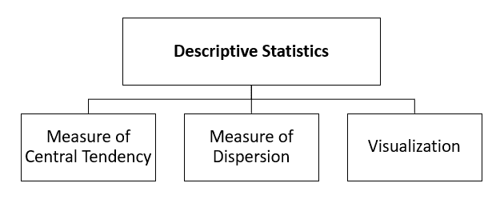

* * *

## 集中趋势的度量

这里，均值、中值和众数是集中趋势的基本度量。当从由不同值组成的数据集中提取平均值时，这些方法非常有用。让我们逐一了解每一个措施。

* * *

### 平均

这是各种数学领域中最常用的概念，简单地说，它是给定数据集的平均值。因此，如果我们在一个数据集中取 5 个数字，比如 12、13、6、7、19、21，平均值的公式为

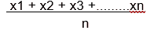

这使得:

(12 + 13 + 6 + 7 + 19 + 21)/6 = 13

此外，交易者试图在平均值(移动平均线)或[移动平均线交叉的基础上开始交易。](https://en.wikipedia.org/wiki/Moving_average_crossover)

这里，让我们根据计算时段的范围(天数)和移动平均线交叉来理解两种类型的移动平均线:

1.  **更快的移动平均线**(更短的时间段)-

快速移动平均线是在短时间内(比如过去 20 天)计算的数据集(股票价格)的平均值。

2.**较慢的移动平均线**(较长的时间段)-

一个较慢的移动平均线是一个数据集(股票价格)的平均值，它是从一个较长的时间段(比如 50 天)计算出来的。

现在，一条更快的均线和一条更慢的均线也一起到达一个[“交叉”](https://en.wikipedia.org/wiki/Moving_average_crossover)发生的位置。

根据维基百科，

> 当较快的移动平均线(即较短周期的移动平均线)与较慢的移动平均线(即较长周期的移动平均线)交叉时，就发生了交叉。换句话说，这是较短周期移动平均线穿过较长周期移动平均线的时候。”

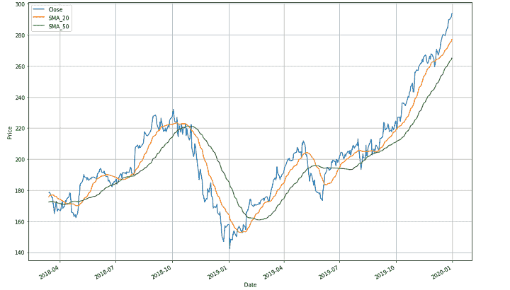

Crossover moving lines


在这里，为了更好地解释它，上面的图形图像显示了三条移动的线。蓝色的表示股票价格的总体趋势线。它被进一步分解成绿色和橙色线条。绿色表示较慢的移动平均线，橙色表示较快的移动平均线。

现在从绿线开始，(较慢的移动平均线)整条趋势线显示了股票价格在较长时间内的变化趋势。趋势线遵循之字形模式，有不同的交叉。

例如，在 2018 年 10 月和 2019 年 1 月之间有一个交叉，其中橙色线(快速移动平均线)来自上方，并在下行时穿过绿色线(慢速移动平均线)。这表明任何个人或公司都会在此时卖出股票，因为它显示了市场的低迷。

这个交叉点被称为“交汇点”。在交汇点之后，两条直线先下降，然后在一个点之后上升，形成另一个(然后是其他)交叉点。

由于图中有许多交叉点，您现在应该能够自己识别它们中的每一个。

现在，非常重要的是要注意，如果快速移动平均线越过慢速移动平均线，并在向上的方向上超越，那么“交汇点”就被认为是看涨的。

相反，如果快速移动平均线跌破慢速移动平均线，并超越下跌，则被认为是看跌。这是因为在前一种情况下，它表明在短时间内，特定股票出现了上升趋势。

然而，在后一种情况下，它显示在过去几天有下降趋势。

例如，我们将对快速移动平均线采用 20 天移动平均线，对慢速移动平均线采用 50 天移动平均线。

如果 20 天移动平均线上升并穿过 50 天移动平均线，它将显示一个[牛市](https://en.wikipedia.org/wiki/Bull_(stock_market_speculator))，因为它表明过去 20 天股票的上升趋势。

然而，如果 20 天移动平均线低于 50 天移动平均线，这将是[看跌](https://www.investopedia.com/terms/b/bearmarket.asp)，因为这意味着股票在过去 20 天下跌。

根据维基百科，

> 在股票投资中，这个交汇点用来进场(买入或卖出)或出场(卖出或买入)

简而言之，均值是一个统计指标，用于估计一段时间内公司甚至市场的股票表现。这段时间可以是几天，几个月，甚至几年。

接下来，平均值也可以借助 excel 表格进行计算，公式如下:

=平均值(B2: B6)

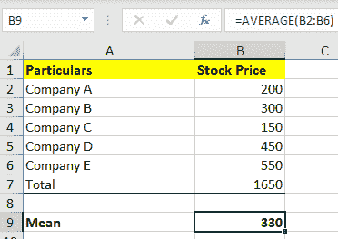

让我们理解一下上图中我们做了什么。该图显示了一段时间内(可以是几天、几个月或几年)属于一个行业的不同公司的股票市值。

现在，要得到这个行业在这个特定时间段的移动平均线(平均值)，我们需要将公式=(Average(B2: B6))应用于“平均股价”。这个公式命令 excel 计算从 B2 到 B6 的所有公司的平均股价。

当我们应用这个公式并按“回车”时，我们得到结果 330。这是计算平均值的最简单的方法之一。让我们先看看如何用 python 代码进行同样的计算。

为了进一步使用，在所有概念中，让我们假设基于苹果(AAPL)数据集的值。为了保持通用性，我们采用了苹果公司从 2018 年 12 月 26 日到 2019 年 12 月 26 日的每日股价数据。你可以从[雅虎财经**下载历史数据。**](https://finance.yahoo.com/quote/AAPL/history?p=AAPL&.tsrc=fin-srch)

**现在，为了下载苹果收盘价数据，我们将使用下面的 python 代码进行计算:**

```py
import yfinance as yf
aapl = yf.download('AAPL','2018-12-26', '2019-12-26')
```

在 python 中，为了获取收盘价的平均值，代码如下:

```py
mean = np.mean (aapl[‘Adj Close’])
print(mean)
```

输出是:330

前面我们将看到中位数如何不同于平均值，以及如何计算它。

* * *

### 中位数

有时，数据集值可能有一些处于极端的值，这可能会导致数据集的平均值描绘出不正确的画面。因此，我们使用中位数，它给出了排序数据集的中间值。

要求中位数，你得把数字按升序排列，然后求中间值。如果数据集包含偶数个值，则取中间两个值的平均值。例如，如果数字列表是:12、13、6、7、19，那么，

按升序排列，这些数字是:6，7，12，13，19

现在，我们知道总共有 5 个数字，中位数的公式是:

(n+1)/2 值。

因此，它将是 n = 5，并且

(5+1)/2 值将是 6/2=第三个值。

这里，列表中的第三个值是 12。

所以，中位数在这里变成了 **12** 。

主要是，中位数的优势在于，与平均值不同，它在数据集的极值情况下仍然非常有效，股票就是这种情况。

如果要从大型数据集计算平均值，则需要中值，在这种情况下，中值显示的是更好地代表数据集的平均值。

例如，如果数据集以 INR 值给出如下:

7.5 万，8.25 万，6 万，5 万，10 万，7 万，9 万。

计算中值需要首先将价格按升序排列，因此，按升序排列的价格为:

50,000, 60,000, 70,000, 75,000, 82,500, 90,000, 1,00,000

现在，中位数的计算将是:

因为有 7 个项目，所以中位数是(7+1)/2 个项目，这使它成为第 4 个项目。升序排列的第四项是 75，000 印度卢比。

如您所见，INR 75，000 很好地代表了数据集，因此这将是一个理想的数据集。

在金融领域，市场价格不断变化，平均值可能无法恰当地代表较大的值。在这里，平均值可能无法代表大型数据集。

因此，我们需要使用中值来找到适当代表整个数据集的值。

Excel 表格通过以下方式帮助计算中位数:

=中位数(B2:B6)

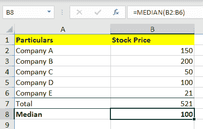

同样在中值的情况下，在上图中，我们有属于特定行业的不同公司在一段时间内(可以是几天、几个月或几年)的股价。

这里，为了得到这个行业在这个特定时期的移动平均值(中位数)，我们使用了公式=中位数(B2: B6)。这个公式向 excel 发出计算中位数的命令，当我们输入同样的值时，我们得到的结果是 100。

让我们学习如何用 python 代码进行计算。

这里的 python 代码将是:

```py
median = np.median (aapl[‘Adj Close’])
print(median)
```

输出是:100

太好了！既然你已经对平均值和中值有了一个合理的概念，现在让我们转向另一种方法。

* * *

### 方式

模式是一个非常简单的概念，因为它考虑了数据集中重复出现次数最多的数字。此外，模式也称为模式值，代表数据组中出现的最高次数。

有趣的是，像均值和中值一样，众数是代表整个数据集的值。必须指出的是，在某些情况下，一个给定的数据集中可能有一种以上的模式。并且具有两种模式的数据集将被称为双峰。

在 excel 表中，模式可以计算如下:

=模式。SNGL(B1: B5)

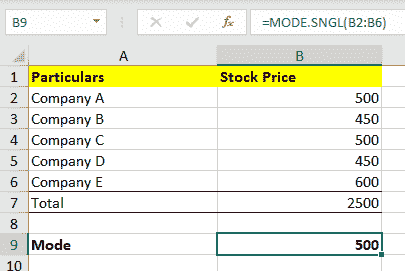

与均值和中值类似，众数也可以在 excel 表格中计算，如上图所示。比如可以在 excel 表中放入不同公司的值，用公式=Mode 取出 Mode。SNGL(B1: B5)

(B1: B5) -代表从单元格 B1 到 B5 的值

现在，如果我们取苹果从 2018 年 12 月 26 日到 2019 年 12 月 26 日的收盘价，我们会发现没有重复的值，因此收盘价模式不存在。

因此，当您尝试使用 python 中的以下代码计算模式时:

```py
import statistics
mode = statistics.mode (aapl[‘Adj Close’])
```

它将抛出以下错误:

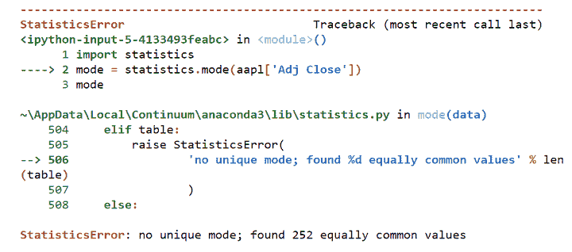

Error on calculating mode


因此，在观察收盘价时，该模式没有意义。

说到该模式的意义，当你需要取出前一个特定时间段的重复性股票价格时，它是最有帮助的。

这个时间段可以是几天、几个月甚至几年。基本上，数据的模式会帮助你了解同一股票价格在未来是否会重复。

此外，当您想要绘制直方图并可视化频率分布时，最好使用该模式。

太神奇了！这就把你带到了集中趋势测量的结尾。第二，在描述性统计列表中是对离差的度量。让我们看看另一个有趣的概念。

* * *

### 离差的度量

你会发现“离差度量”的含义就在它的标题中，因为它显示了数据在中心点周围有多分散。

它只是告诉每个数据值彼此之间的变化，这有助于给出数据分布的表示。此外，它还描述了观测值分布的同质性和异质性。

简而言之，它只是显示了整个数据与其平均值的差异。

离差的度量可以分为:

*   [范围](#range)
*   [四分位偏差](#quartile-deviation)
*   [平均绝对偏差](#mean-absolute-deviation)
*   [差异](#variance)
*   [标准偏差](#standard-deviation)

现在，让我们了解每个类别的概念。

* * *

### 范围

这是所有离差度量中最简单的，也是最容易理解的。范围仅仅意味着两个极端观察值或数据集数量之间的差异。

例如，设 X max 和 X min 是两个极端的观测值或数字。在这里，范围将是两者之间的差异。

因此，

范围= X 最大- X 最小

同样重要的是，要注意量化分析师对区间的密切跟踪。这是因为区间决定了交易的进场点和出场点。不仅是交易，范围也帮助交易者和投资者检查交易周期。

这使得投资者和交易者沉迷于区间交易策略，这仅仅意味着跟随一个特定的趋势线。

趋势线由以下因素形成:

*   高价股票(跟随上升趋势线)和
*   低价股票(跟随较低的趋势线)

在这种情况下，交易者可以在较低的趋势线买入证券，在较高的趋势线卖出以赚取利润。

因此，在 python 中，这个简单的代码将能够为您找到所需的值:

```py
aapl [‘Adj Close’].describe()
```

输出是:


让我们看看另一个衡量标准，四分位数离差是如何起作用的。

* * *

### 四分位偏差

这是将数据集分成四份的类型。它由第一个四分位数 Q1、第二个四分位数 Q2 和第三个四分位数 Q3 组成。

这里，

Q1 -是介于数据的最小值和中值(1/4)或前 25%之间的数字

Q2 -是数据的中间值还是

Q3 -是介于数据中值和最大值(3/4)或低于 25%之间的数字

n -是值的总数

四分位偏差的公式是 Q = * (Q3 - Q1)

因为，

Q1 是前 25%，Q1 的公式是- (n+1)

Q3 也是 25%，但是较低的一个，所以公式是- (n+1)

因此，四分位数偏差= * [( (n+1) - (n+1)]

使用此公式的主要优点和缺点是，它使用一半的数据来显示与平均值的离差。

您可以使用这种类型的离差度量来研究位于中间的观察值的离差。

这种类型的离差测量有助于您了解观察值的离差，从而区分不同季度的大值。

在金融领域，当您必须研究不同时间段的大量数据集(股票价格)并希望从观察值(平均值-中值)中了解离散值(价格)时，可以使用四分位数离差。

这里的 python 代码是假设一系列 10 个随机数:

```py
from numpy import percentile
# calculate quartiles
All_quartiles = percentile(aapl['Adj Close'], [25, 50, 75])
# calculate min/max
Minimum, Maximum = aapl['Adj Close'].min(), aapl['Adj Close'].max()
# print the five number summary
print(Minimum)
print(All_quartiles[0])  #1 Quartile
print(All_quartiles[1])  #2 Quartile
print(All_quartiles[2])  #3 Quartile
print(Maximum)
IQR = All_quartiles[2] - All_quartiles[0]
IQR
```

输出是:

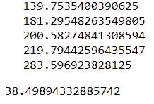

很好，向前移动，平均绝对偏差是另一个度量，前面会解释。

* * *

### 平均绝对偏差

这种类型的离差是给定数据集中的数字与其均值或中值(平均值)之间的偏差的算术平均值。

因此，

平均绝对偏差的公式为:

(D0 + D1 + D2 + D3 + D4 …Dn)/ n

这里，

n =数据集中偏差的总数，以及

D0、D1、D2、D3 是每个值与数据集中的平均值或中值或均值的偏差，Dn 表示数据集中的最终值。

为了解释平均偏差，我们将看一下下图，该图显示了数据集的“计算平均值”以及(数据集中的)每个值与平均值之间的差异。这些差异或偏差显示为 D0、D1、D2 和 D3，…..D7。

例如，如果平均值如下:

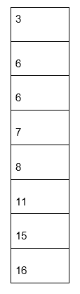

然后，将使用平均值公式计算此处的平均值:

3 + 6 + 6 + 7 + 8 + 11 + 15 + 16 / 8 = 9

当平均值为 9 时，下一步是找出每个数据值与平均值的偏差。因此，让我们计算偏差，或者让我们从每个值中减去 9，得到 D0、D1、D2、D3、D4、D5、D6、D7 和 D8，从而得到如下值:

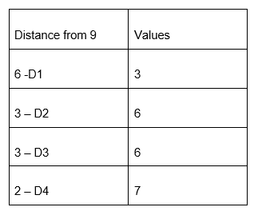

现在我们已经清楚了所有的偏差，让我们以图像的形式查看平均值和所有的偏差，以便更加清楚地了解这些偏差:

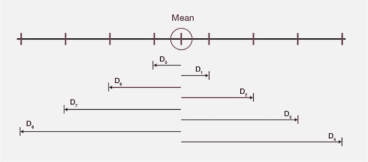

Mean deviation


因此，从一个大的数据集中，平均偏差精确地代表了观察数据值的所需值。

在 python 代码中，平均偏差的计算如下:

```py
from numpy import mean, absolute 
Mean_deviation = mean(absolute(aapl['Adj Close'] - mean(aapl['Adj Close'])))
Mean_deviation
```

产量是 26。46860 . 68686868686

值得注意的是，均值偏差有助于处理具有各种值的大型数据集，尤其是在[股票市场](https://quantra.quantinsti.com/course/stock-market-basics)中。

接下来，方差是一个相关的概念，我们会进一步解释。

* * *

### 差异

方差是一种离差度量，它表示平均值与平均值之差的平均值，与平均值偏差的方式类似，但这里的偏差是平方的。

所以，

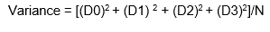

这里，N =数据集中值的数量

D0，D1，D2，D3 是数据集中每个值与平均值的偏差。

这里，从上面的例子中取值，我们简单地平方每个偏差，然后以下面的方式将偏差值的总和除以总数:

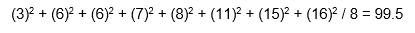

在 python 代码中，如下所示:

```py
variance = np.var (aapl['Adj Close'])
variance
```

输出 1154.50。现在让我们跳到另一个叫做标准差的指标。

* * *

### 标准偏差

简而言之，标准差是对数据集中数字分布的计算。符号(sigma)代表标准偏差，公式为:

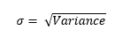

还有，

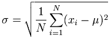

是标准差的公式。

这里，让我们取与上面两个例子中相同的值，并计算方差。因此，

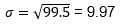

此外，在 python 代码中，可以使用 matplotlib 库计算标准偏差，如下所示:

```py
std = np.std(aapl['Adj Close'])
std
```

输出结果是:34。36360 . 38638688667

所有类型的偏差度量都可以从数据集中的观察值中得出所需的值，从而让您对变量的不同值(如价格、时间等)有一个完美的了解。

值得注意的是，平均绝对数据、方差和标准差都有助于区分给定大型数据集中的平均值。

* * *

### 形象化

可视化有助于分析人员根据有组织的数据分布做出决定。有四种这样的可视化方法，它们是:

*   [直方图](#histogram)
*   [条形图](#bar-chart)
*   [饼状图](#pie-chart)
*   [折线图](#line-chart)

* * *

**直方图**

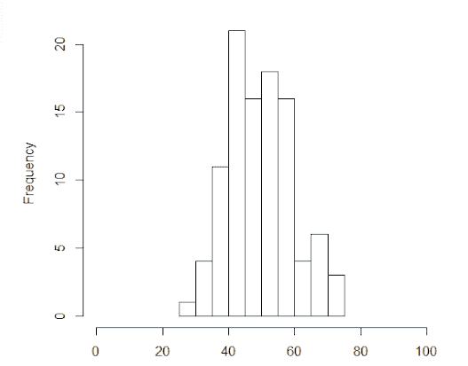

年龄组

在这里，在上面的图像中，您可以看到 x 轴(年龄组)和 y 轴(频率)上带有随机数据的直方图。由于它以概括的方式看待大量数据，因此主要用于描述单个变量。

例如，x 轴代表从 0 到 100 的年龄组，y 轴代表不同年龄组之间赶上常规眼科检查的频率。直方图显示，在 40 至 50 岁的年龄组之间，人们出现的频率最高。

由于直方图只能用于单个变量，让我们继续，看看条形图有什么不同。

* * *

**条形图**

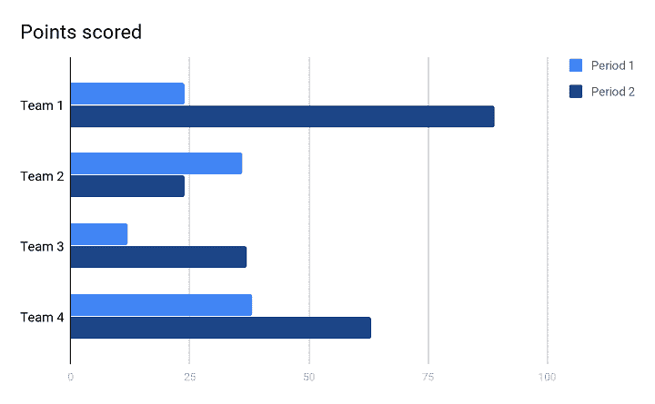

Bar chart sample


在上图中，你可以看到条形图。这种类型的可视化帮助您分析一段时间内的变量值。

举个例子，不同团队不同年份的销量。您可以看到上面的条形图显示了两年，分别为周期 1 和周期 2。

*   在第一阶段(第一年)，团队 2 和团队 4 在销售数量方面得分几乎相同。而且，第一组得分不错，但第三组得分最少。
*   在第二阶段(第二年)，团队 1 的表现优于所有其他团队，得分最高，尽管团队 4 的得分仅次于团队 1。相比较而言，第 3 队得分相当高，而第 2 队得分最低。

由于这种可视化表示可以考虑多个变量和不同的时间段，所以条形图在表示包含各种变量的大量数据时非常有用。

现在让我们先看看饼图在显示数据集中的值时是如何有用的。

* * *

**饼状图**

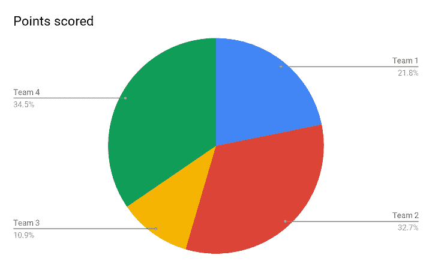

Pie chart sample


上图是一张饼图，这种表示方式有助于您显示每个变量在总数据集中所占的百分比。每当你有一个百分比形式的数据集，并且你需要以一种显示不同球队不同表现的方式来呈现它，这就是恰当的方式。

例如，在上面的饼图中，可以清楚地看到团队 2 和团队 4 的绩效相似，甚至不用看实际数字。两个队的表现都超过了其他队。此外，它表明第一组比第三组做得更好。由于饼图在视觉上非常直观，它可以帮助你得出一个恰当的结论。

再往前看，这个系列的最后一个是折线图。

* * *

**折线图**

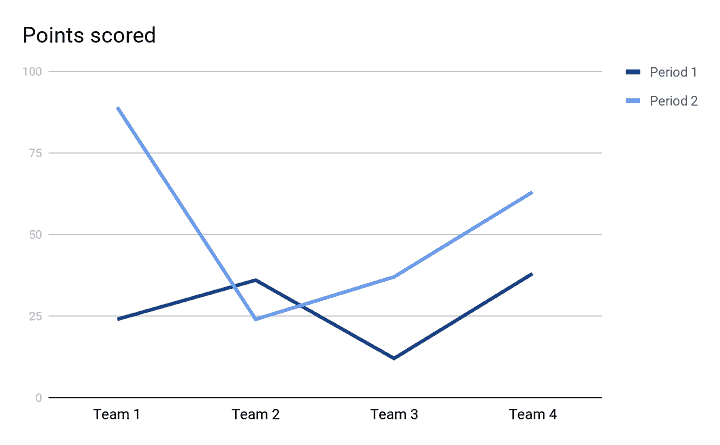

Line chart sample


有了这种表示，借助于 y 轴和 x 轴，两个变量之间的关系更加清晰。这种类型也有助于您发现上述变量之间的趋势。

在上面的折线图中，有两条趋势线形成了两个时期(或两年)4 个不同团队的直观表示。两条趋势线都有助于我们明确不同球队在两年内的表现，也更容易比较连续两年的表现。

它清楚地表明，在此期间，1 团队 2 和 4 团队表现良好。而在第二阶段，团队 1 的表现优于其他团队。

好的，随着我们对描述性统计有了更好的理解，我们可以继续其他的数学概念，它们的公式以及在算法交易中的应用。

* * *

## 概率论

现在让我们回到过去，回忆一下寻找掷骰子概率的例子。这是我们都研究过的一个发现。

给定骰子上的数字，即 1、2、3、4、5 和 6，掷出 1 的概率是 6 分之一或⅙.这种概率称为离散概率，其中有固定数量的结果。

类似地，掷出 2 的概率是 1/6，掷出 3 的概率也是 1/6，以此类推。一个[概率分布](/statistics-probability-distribution/)是一个给定事件的所有结果的列表，它以上面提到的方式与一组有限的结果一起工作。但是，如果结果很大，就要使用函数。

如果概率是离散的，我们称这个函数为概率质量函数。在骰子滚动的情况下，它将是 P(x) = 1/6，其中 x = {1，2，3，4，5，6}。

对于离散概率，有一些案例被广泛研究，以至于它们的概率分布已经标准化。让我们以**伯努利分布**为例，它考虑了我们抛硬币时得到正面或反面的概率。

我们把它的概率函数写成 px(1–p)(1–x)。这里 x 是结果，可以写成正面= 0，反面= 1。

现在，让我们从历史的角度来研究蒙特卡洛模拟,以理解它如何接近未来的可能性。

### 蒙特 卡罗模拟

据说蒙特卡罗方法是一种解决统计问题的随机方法(其中存在随机输入的抽样)。

简单来说，蒙特卡罗模拟相信通过一次又一次地对大量输入进行采样来获得任何统计问题或数据的结果分布。它还说，这样我们就可以在没有任何风险的情况下跑赢市场。

蒙特卡洛模拟的一个例子是将骰子滚动几百万次，以获得结果或可能结果的代表性分布。有这么多可能的结果，对未来实际结果的预测几乎不可能出错。理想情况下，这些测试应该高效快速地运行，这也是蒙特卡洛模拟的验证。

尽管资产价格不是通过掷骰子来决定的，但它们也类似于随机漫步。现在让我们学习一下随机漫步。

### 随机游动

随机漫步表明，股票价格的变化具有相同的分布，并且相互独立。因此，根据股票价格的过去趋势，未来价格是无法预测的。此外，它认为不承担一定的风险是不可能跑赢市场的。

回到蒙特卡洛模拟，它通过考虑广泛的可能性并假设它有助于减少不确定性来验证自己的理论。

蒙特卡洛说，问题是当只考虑一次掷骰子或一个可能的结果或更多的时候。因此，解决方案是比较多种未来可能性，并相应地定制资产和投资组合的模型。

在蒙特卡洛模拟之后，理解**贝叶斯定理**也很重要，因为它基于一些相关的过去事件来研究未来概率，因此具有可用性。

简而言之，贝叶斯定理基于可能导致相关事件发生的过去条件，展示了事件发生的可能性。

例如，假设一个 50-55 岁的特定年龄组在去年 12 月和 1 月以及去年年底记录了最多的关节炎病例。然后，我们将假设今年同样的月份，同样的年龄组可能被诊断患有关节炎。

这可以应用在概率论中，其中，基于关于股票价格的过去事件，可以预测未来的事件。

还有一个最重要的数学概念，叫做线性代数，现在我们将学习它。

* * *

## 线性代数

让我们简单了解一下线性代数。

**什么是线性代数？**

简单来说，线性代数就是由线性方程组组成的数学分支，比如 a1 x1 + ……。+ an xn = b，。这里最需要注意的是，线性代数是数据的数学，其中，矩阵和向量是数据的核心。

**什么是矩阵？**

一个或多个矩阵是以特定数量的行和列排列的数字的集合。矩阵中包含的数字可以是实数或复数，也可以是实数和复数。

例如，M 是一个 3 乘 3 的矩阵，其数字如下:

0      1      3

4      5      6

2      4      7

**矢量有哪些？**

简而言之，向量是线性代数的概念，它既有方向又有大小。

例如，V 是:

[9]

[6]

[-5]

现在，如果 X =

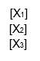

然后，

MX = V 这将成为，

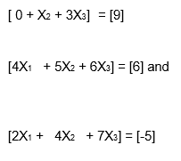


在这个箭头中，箭头的点表示方向，箭头的长度表示大小。

上面的例子一定给了你一个关于线性代数都是关于线性组合的好主意。这些组合利用了称为向量的数字列和称为矩阵的数字数组，最终会创建新的数字列和数组。

众所周知，线性代数与算法或计算有关。因此，线性代数已经被优化以满足编程语言的要求。

此外，为了提高效率，某些线性代数实现( [BLAS](https://en.wikipedia.org/wiki/Basic_Linear_Algebra_Subprograms) 和 [LAPACK](https://en.wikipedia.org/wiki/LAPACK) )以自动化的方式配置算法。这有助于程序员适应计算机系统的特定性质，如缓存大小、内核数量等。

在 python 代码中:

```py
import numpy as np
A = np.array ([[0, 1, 3], [4, 5, 6], [2, 4, 7]])
print ('rank of A:', np.linalg.matrix_rank (A))
print ('Trace of A:', np.trace (A))
print ('\Determinant of A:', np.linalg.det (A))

# Inverse of matrix A
print (“\nInverse of A:”, np.linalg.inv (A))
print (“\nMatrix A raised to power 3:\n”,
np.linalg.matrix_power(A,3)) 
```

输出是:

A 的等级:3

A: 12 的痕迹

A 的行列式:2.0000000000000004

让我们前进到算法交易中使用的另一个已知概念，叫做线性回归。

* * *

## 线性回归

谈到**线性回归，** it 是另一个有助于创建算法的主题，是一个最初在统计学中开发的模型。

线性回归是一种模拟标量因变量 y 和一个或多个解释变量(或自变量)x 之间关系的方法。

然而，尽管它是一个统计模型，但它通过显示输入和输出数值变量之间的关系来帮助[机器学习算法](https://en.wikipedia.org/wiki/Machine_learning)。

### 机器学习对创建算法有什么帮助？

机器学习意味着最初的手动干预，为机器提供执行任务的程序，随后是系统本身工作的基于自动情况的改进。

当涉及到计算统计学时，就是这样一个概念相当有帮助。计算统计学是计算机科学和数理统计之间的接口。

因此，计算统计学，也称为预测分析，对当前和历史事件进行分析，以预测未来，从而创建交易算法。

简而言之，机器学习及其预测未来事件的系统方法有助于为成功的自动化交易创建算法。

### 计算线性回归

线性回归的基本公式是:

Y = mx+b

如果你想阅读更多关于线性回归及其高级方程的内容，请参考这里的链接。

下面，您将在图表中清楚地看到 x 和 y 的表示:

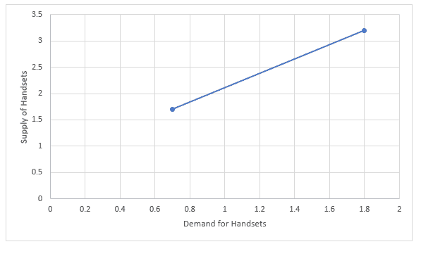

在上图中，x 轴和 y 轴都显示变量(x 和 y)。由于更多的手机销售或手机需求(x 轴)引发了手机供给(y 轴)的上升，陡峭的线就形成了。

因此，为了满足这种不断增长的需求，手机的供应量或数量也在增加。

简单来说，y =趋势线上升了多少(供应量)

x =趋势线走多远(需求)

b =的截距(直线与 y 轴相交的地方)

在线性回归中，输入值的数量(x)被组合以产生该组输入值的预测输出值(y)。基本上，输入值和输出值都是数字。

阅读更多内容，请参考博客[这里](/machine-learning-trading-predict-stock-prices-regression/)。

当我们继续前进时，让我们看看另一个叫做微积分的概念，它对于算法交易也是必不可少的。

* * *

## 结石

微积分是算法交易中的主要概念之一，实际上被称为[无穷小微积分](https://en.wikipedia.org/wiki/Infinitesimal)，意思是研究小到可以测量的数值。

总的来说，微积分是一门研究持续变化的学科，因此，对于股票市场来说非常重要，因为它们一直在经历着频繁的变化。

谈到微积分的类型，有两个宽泛的术语:

*   微分学——它计算速度和曲线斜率的瞬时变化。
*   积分——这个计算加在一起的量。

在微积分中，我们通常将特定时间段(t)内的距离(d)计算为:

d = at^2

其中 d 是距离，a 是加速度，t 是时间

现在，为了简化计算，让我们假设 a 是 5。

所以，
d = 5t^2

现在，如果时间(t)是 1 秒，并且要在这个 1 秒的时间段内计算经过的距离，那么，

d=5(1)^2 = 5 米/秒。

在这里，它显示 1 秒钟内走过的距离是 5 米。

但是，如果你想找到 1 秒的速度(当前速度)，那么你将需要一个时间的变化，这将是 t。

现在，因为它真的很少被计算，t+t 将表示 0 秒。

让我们计算 t 秒和 t 秒之间的速度，因为我们从前面的计算中知道，在 1 秒时，所经过的距离是 5m/s。

现在，使用相同的公式，我们还将发现在 0 秒(t +t)覆盖的距离:

所以，d = 5 t^2

d = 5 (t + t )^2

d = 5 (1+t )^2 m

扩展(1+t )^2，我们将得到 1+ 2t + (t)^2

这使我们得出 d = 5(1+ 2t + (t)^2 ) m

进一步求解我们会得到，d= 5 + 10t + 5(t)^2 m

得出最后的结论，

速度=距离/时间所以，在这里，速度= 5 + 10t + 5(t)^2 米/吨秒

这让我们得出结论，10 + 5t 米/秒

因为 t 被认为是小于 1 秒的值，并且速度将在小于 1 秒的时间内计算(当前速度)，所以 t 的值将接近于零。

因此，当前速度= 10m/s。

这种对连续变化的研究可以适当地用于线性代数，也可以用于概率论。在线性代数中，它可以用来寻找一组值的线性近似，在概率论中，它可以确定连续随机变量的可能性。

微积分是正态分布的一部分，也可以用来求正态分布。要阅读更多关于正态分布的内容，请阅读此处的。

厉害！这就把我们带到了量子/HFT/算法交易所需的所有基本数学概念的尽头。

* * *

## 结论

在整篇文章中，我们讨论了股票交易中数学和统计的各种主题，即股票市场数学，以及所有相关的子主题。

由于算法交易需要全面的数学概念知识，我们已经学习了各种必要的概念，即:

*   描述统计学
*   概率论
*   线性代数
*   线性回归
*   结石

在解释它们的时候，会有副标题为你提供每一个重要的、更深入的方面，以及它们在 excel 和 python 等平台上的数学方程和计算。

如果你也对发展终身技能感兴趣，这些技能会帮助你提高交易策略。在这个 [algo 交易课程](https://www.quantinsti.com/epat)中，你将接受统计学&计量经济学、编程、机器学习和量化交易方法的培训，因此你精通每一项在量化&算法交易中出类拔萃所必需的技能。现在就了解更多关于 EPAT 的课程吧！

* * *

*<small>免责声明:本文提供的所有数据和信息仅供参考。QuantInsti 对本文中任何信息的准确性、完整性、现时性、适用性或有效性不做任何陈述，也不对这些信息中的任何错误、遗漏或延迟或因其显示或使用而导致的任何损失、伤害或损害负责。所有信息均按原样提供。</small>*