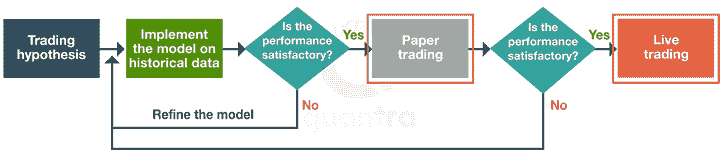

# 来自经验丰富的算法交易从业者的 7 个有用的提示

> 原文：<https://blog.quantinsti.com/algorithmic-trading-practitioners-tips/>

由[查尼卡·塔卡](https://www.linkedin.com/in/chainika-bahl-thakar-b32971155/)

拥有算法交易的经验来自于拥有所需的知识，多年的坚持以及一些尝试和错误。当您接受来自该领域有经验的个人的有用提示时，您可以更快地建立在实践知识的基础上。

作为算法交易领域的初学者，执行有利交易的实际方法是你获得理论知识后的又一个转折点。在这篇文章中，让我们看看 QuantInsti 的经验丰富的从业者在算法的帮助下进行交易时有什么建议。

来自经验丰富的算法交易员和从业者的 7 个有用的算法交易技巧:

1.  [战略范式是完整的](#strategy-paradigms-are-integral)
2.  [获得可靠的财务数据供应商](#get-a-reliable-financial-data-vendor)
3.  [交易杠杆产品要谨慎](#be-cautious-when-trading-leveraged-products)
4.  [学会系统地回测，严格地回测任何交易想法](#learn-to-backtest-systematically-and-backtest-any-trading-idea-rigorously)
5.  [现货交易前的票据交易](#paper-trade-before-trading-live)
6.  [风险管理是关键](#risk-management-is-the-key)
7.  尽可能多地阅读交易书籍，了解最新技术

* * *

## 战略范式是不可或缺的

首先也是最重要的，你需要了解[战略范例](/paradigms-of-trading-strategy-formulation/)以及为什么这些范例很重要。现场交易中的[策略开发是最关键的部分，因此，应该以有序的方式完成。](https://quantra.quantinsti.com/learning-track/machine-learning-strategy-development-live-trading)

你从交易策略的假设开始，然后做编码，然后[回溯测试](/algorithmic-trading-practitioners-tips/7%20Useful%20Tips%20From%20Experienced%20Algorithmic%20Trading%20Practitioners)，然后走前测试。这个过程以市场上的实时交易结束。

* * *

## 获得可靠的财务数据供应商

当谈到算法交易时，获得可靠的数据供应商是另一件重要的事情。金融数据供应商提供来自金融市场的数据。

供交易者和投资者使用，金融数据供应商在格式化并确保无误后为您提供[市场数据](https://quantra.quantinsti.com/course/getting-market-data)。例如，间谍数据(实时数据和历史数据)可能存在重复数据、缺失数据值等。是错误的，如果用于创建交易策略，可能会导致不精确的结果。

彭博、汤森路透和穆迪分析等公司是市场数据供应商的常见例子。

* * *

## 交易杠杆产品时要谨慎

虽然在金融市场上交易[杠杆化](https://quantra.quantinsti.com/glossary/Leverage)产品可以帮助你从总交易的借入或杠杆化部分中获利，但它也带来了损失超过你所拥有的风险。

让我们假设你在市场上持有 100，000 美元的杠杆资金，但你只有 500 美元。如果金融市场上涨，你就能满足于获利。假设市场上涨，你在市场上的头寸变成 102，000 美元。在这种情况下，除了你自己的 500 美元投资外，你将获得 1500 美元。

相反，让我们假设你发现市场下跌，你在市场上的头寸是 98，000 美元。在这种情况下，你最初的 100，000 美元的损失是 2000 美元。这清楚地表明，你不仅要承担自己 500 美元的损失，还要额外支付 1500 美元，因为经纪人通常会追加保证金。

保证金通知是由经纪人发起的。如果你的账户价值低于设定的阈值，你的经纪人会要求你在账户中存入更多资金。发生这种情况是因为经纪人试图保护自己，以防账户贬值，你无法偿还债务。

如果市场价值下跌，算法能做的最好的事情就是在你的杠杆产品上设置止损单或止损单(退出市场)，当市场价格开始下跌时，避免你遭受巨大损失。但是，当经纪人账户的市场价值下降时，最初的损失仍然存在。

在一些证券中使用杠杆，比如 ETF，比其他证券有更大的风险。ETF 有一些与之相关的成本，如费用率、税收和周转成本。除了额外的损失，交易者还需要承担这些费用的开支。

然而，你可以管理对冲基金的杠杆作用，因为对冲基金经理确切地知道什么时候使用杠杆作用，什么时候不使用，以避免遭受巨大损失。对冲基金经理通常是私人实体，并要求他们在金融市场上维持或交易的资本的最低投资。

* * *

## 学会系统地回测，严格地回测任何交易想法

交易者通常会因为没有在合理的研究和回溯测试的基础上做出交易决定而损失资金。从你的交易决策中去除情绪，并对策略或交易想法进行回测是非常重要的。回溯测试是根据历史数据测试交易假设/策略的过程。

让我们试着更好地理解这一点。假设你有一个交易假设，表明特定证券在未来两个月的正回报。这一假设是基于过去两年的正回报。

现在，检验这个假设和知道这个策略是否有效是两件主要的事情。这个假设可以通过回溯测试来验证，回溯测试意味着根据历史市场数据找出交易策略的表现。

例如，在[动量交易策略](/momentum-trading-strategies/)中，投资者在金融证券上涨时买入，在假定见顶时卖出。在这里，假设可以是在两个月的时间内资产净值的正增长。两个月后，股票将达到最高点，因为这发生在过去的一年里。

假设 NIFTY 50 所有股票的回报率预计为 3%。这个预期陈述了回报率为 3%的假设，但是为了检验这个假设，我们使用了[假设检验](/hypothesis-testing-trading-guide/)。

一个好的回溯测试人员会确保不会出现以下可能会改变你的回溯测试结果的缺点或偏见:

*   [过度拟合](https://quantra.quantinsti.com/glossary/Overfitting) -当过度拟合发生时，交易策略的回测结果显示该策略在历史数据上表现良好，但在任何新数据上都可能表现不佳。
*   [前瞻偏差](/ways-trading-strategy-fail/) -在信息实际出现在公众视野之前使用回溯测试中的信息是前瞻偏差。在回溯测试中，它会导致错误的结果。例如，如果你正在评估你的组织的季度收益报告对股票市场的影响，你将假设该报告在季度末还没有出来。
*   [生存偏差](/survivorship-bias/#:~:text=Survivorship%20bias%2C%20also%20known%20as,historical%20performance%20of%20the%20same.&text=Also%2C%20when%20the%20investor%20makes,risk%20that%20the%20investor%20bears.) -在分析历史数据时只考虑赢家而不考虑输家时出现的偏差。因此，在回溯测试极其重要的时候，要包括所有的数据。例如，一些共同基金可能在衰退中表现更好，但其他共同基金可能没有。但在下一次衰退中投资共同基金时，只考虑那些在上一次衰退中表现良好的基金，将是一种生存偏差。
*   忽略[交易成本](https://quantra.quantinsti.com/glossary/Transaction-Cost) -交易/交易成本，如佣金、税收和滑差，在对策略进行回溯测试时非常重要。将这些成本包括在内，可以真实地反映出该策略的回报。

此外，没有固定的次数，你应该回测你的策略。你可以多次调整策略。但是，不断的调整会导致过度拟合，所以确保你不要过度。

一旦你完成了回溯测试，你可以考虑你的交易策略，先进行纸上交易，然后进行现场交易。

* * *

## 现场交易前的票据交易

如果你对回溯测试策略的表现满意，那么你就可以开始纸上交易了。而一旦纸面交易结果令人满意，就可以开始现场交易了。这样，你就确保了你的策略的准确性。

**纸上交易和现场交易的流程**

<figure class="kg-card kg-image-card kg-width-wide kg-card-hascaption">

<figcaption>Source: [Paper Trading](/paper-trading/) Steps for paper trading and live trading</figcaption>

</figure>

票据交易的一些好处是:

*   在纸上交易中没有亏损的风险和压力，因为这不是真正的交易。纸上交易只是帮助你了解实际交易的结果。
*   交易者开始在实际的金融市场场景中练习交易。因此，从上市前的准备到最终的盈利或亏损，在交易过程的每个环节都可以获得良好的体验。

现在，真正的问题是"*在上线之前，你应该坚持多久？*

这个问题的答案是不要超过一个月左右，你应该进行纸上交易，因为你从现场交易中获得的经验将与从纸上交易中获得的经验非常不同。

因此，在现场交易中学到的经验对理解真实的市场场景是非常有用的，在真实的市场场景中，你的实际资金将受到威胁。然而，你必须管理实时市场的风险，我们将在下一节讨论。

推荐观看:[纸上交易如何让你成为更好的交易者](https://www.youtube.com/watch?v=URRA8jRLT0M)

* * *

## 风险管理是关键

[交易中的风险管理](/trading-risk-management/)对于承担金融市场下跌趋势所带来的损失的风险管理至关重要。这在新冠肺炎、海啸等事件中是可能的。

让我们来看看这张表，它是一个例子，说明检查你的损失是多么重要，因为每增加 5%的损失，你弥补损失所需的收益百分比就会增加。这只是意味着损失越大，就越难恢复:

| 百分比损失 | 恢复和回到平衡所需的百分比增益 |
| -5% | 5.3% |
| -10% | 11.1% |
| -15% | 17.6% |
| -20% | 25.0% |
| -25% | 33.3% |

来源:[培养基](https://medium.com/luchini-in-the-air/how-i-made-the-worst-trade-of-my-life-e3af9eda851e)。鸣谢:里沙布·米塔尔

风险管理涉及风险的识别、评估和缓解，这些风险通常在市场走势与预期相反时出现。

因此，在预测所有已知风险并为任何黑天鹅事件做好准备后，在对市场进行彻底分析的基础上设定预期非常重要。

趋势是这里最重要的因素。趋势意味着市场、资产价格或其他此类指标的总体方向或势头。趋势是由投资者的风险偏好形成的，这意味着在某些事件中的预期风险，如选举(政治事件)、利率决策(经济事件)和新技术进步(商业事件)。

这是关于金融市场的风险。另一个是[操作风险](https://quantra.quantinsti.com/glossary/Operational-Risk) (OR)，这是一个交易者由于失败的内部流程或系统/网络缺陷而面临的风险。

或涉及广泛的“非财务问题”，如:

*   计算机系统或网络架构没有更新，或者使用它们的人员不称职的技术风险。
*   缺乏结构化风险政策。
*   与过程相关的风险，如信息处理、数据传输、数据检索出错的可能性以及结果或输出的不准确性。
*   其他风险包括缺乏对风险的适当监控、员工或管理层的非自愿错误、员工或管理层欺诈或犯罪活动。
*   最后，它可能包括自然灾害、恐怖主义等造成的损失。

因此，在预测风险后，你可以投资股市，权衡你的预期风险和预期收益。

建议阅读:[投资组合&风险管理](/tag/portfolio-risk-management/)

* * *

## 尽可能多地阅读交易书籍，了解最新技术

阅读交易书籍是增加你的算法交易知识，成为专业交易者的最好方法。如果你是算法交易和量化交易的新手，看看这些免费资源来学习算法交易。

通过这些关于算法交易的[必备书籍，深入了解各种概念，如市场微观结构、统计学和计量经济学、技术分析、](/books-algorithmic-trading/)[期权交易](https://quantra.quantinsti.com/course/options-trading-strategies-python-advanced)、高级统计学、机器学习和 Python。

为了更多的学习，你可以查看这些免费的资源来学习机器学习交易充满了最新的信息和丰富的资源。

* * *

## 结论

在这篇文章中，我们的目标是涵盖经验丰富的算法交易者的基本技巧。在开始算法交易练习的时候，这 7 个技巧是简洁但最有效的。

你发现任何战略的制定都需要一个循序渐进的过程，这对于战略的制定是最重要的。然后，获得一个可靠的数据供应商和对投资保持谨慎是算法交易成功的关键。

在你在市场上执行之前，你必须进行回溯测试和纸上交易。最后但同样重要的是，尽可能多的阅读交易书籍会让你跟上形势的发展。

此外，阅读可以帮助你从算法交易领域有经验的个人那里获得很多不同的观点。

你也可以在大约 40 个小时的时间里，通过[学习课程:面向所有人的算法交易](https://quantra.quantinsti.com/learning-track/algorithmic-trading-for-everyone)，获得不同量化交易平台角色所需的基本技能，如交易员、分析师、开发人员。非常适合想要学习和使用 [Python 进行交易](/python-trading/)的交易者和 quants，学习不同的交易策略，包括[日交易](https://quantra.quantinsti.com/course/day-trading-strategies)，机器学习，ARIMA，GARCH，并使用期权定价模型。立即注册！

* * *

*<small>免责声明:本文提供的所有数据和信息仅供参考。QuantInsti 对本文中任何信息的准确性、完整性、现时性、适用性或有效性不做任何陈述，也不对这些信息中的任何错误、遗漏或延迟或因其显示或使用而导致的任何损失、伤害或损害负责。所有信息均按原样提供。</small>*