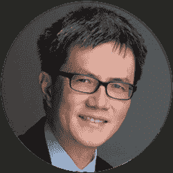

# 【问答环节】如何成为一名成功的量化分析师

> 原文：<https://blog.quantinsti.com/algorithmic-trading-week-24-september-2021/>

[https://www.youtube.com/embed/XMjsF5y3Oe4?rel=0](https://www.youtube.com/embed/XMjsF5y3Oe4?rel=0)

* * *

## 关于活动

这是一个非常难得的直接与世界著名的专家欧内斯特·陈博士交流的机会，他将回答你所有关于成为成功的量化分析师的问题。全部免费！一定要参加。

**活动将于:**进行

2021 年 9 月 24 日星期五
美国东部时间上午 9:00 | IST 时间下午 6:30 |美国东部时间晚上 9:00

* * *

## 扬声器

### **陈博士(PredictNow.ai Inc .创始人&首席执行官)**

陈博士是 PredictNow.ai Inc .的创始人兼首席执行官，也是 QTS 资本管理有限公司的管理成员。自 1997 年以来，他曾在多家投资银行(摩根士丹利、瑞士瑞信银行、Maple)和对冲基金(Mapleridge、Millennium Partners、MANE)工作。

陈博士从康奈尔大学获得物理学博士学位，在加入金融业之前，他是 IBM 人类语言技术小组的成员。他是总部位于芝加哥的投资公司 EXP Capital Management，LLC 的联合创始人和负责人。

陈博士也是《量化交易:如何建立自己的算法交易业务》(Wiley)、《算法交易:获胜策略及其基本原理》(T1)的作者，他的第三本也是最新的一本书是关于*机器交易:部署计算机算法征服市场(T3)。*

* * *

## 关于 2021 年 ALGO 交易周

在我们庆祝 QuantInsti 成立 11 周年之际，我们开始了一项新的传统——Algo 交易周。行业领袖将加入我们，通过各种教育会议分享他们的经验和智慧。对于有抱负的算法交易者和量化交易社区来说，这将是一个很好的学习机会。这是您联系您最喜爱的专家并免费获得所有问题答案的机会。