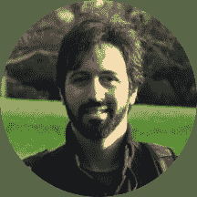
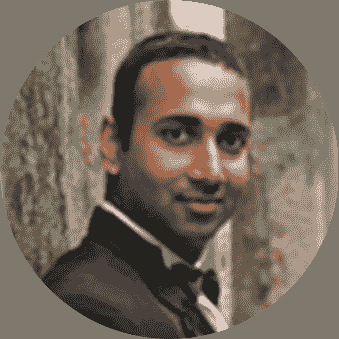

# [小组讨论]在交易中使用情绪和替代数据

> 原文：<https://blog.quantinsti.com/algorithmic-trading-week-27-september-2021/>

[https://www.youtube.com/embed/WJZELim5wqQ?rel=0](https://www.youtube.com/embed/WJZELim5wqQ?rel=0)

* * *

## 关于活动

情绪分析、[自然语言处理](https://quantra.quantinsti.com/course/natural-language-processing-trading)、替代数据——在最近的交易中，你会碰到这些术语。但是着手了解它们，研究它们，并在现实市场中实施它们才是关键。

与 Valle 博士、Mitra 教授、Campellone 博士和 Kashyap 博士一起讨论如何在交易、途径、进展、应用等方面使用情绪和替代数据，同时在短短 60 分钟内回答您对该主题的疑问。为难以置信的会议做好准备！

**活动于:**
*2021 年 9 月 27 日星期一
东部时间上午 9:30 | IST 时间晚上 7:00 |新加坡时间晚上 9:30*

* * *

## 小组成员

### Cristiano Arbex Valle 博士(OptiRisk Systems 的研究员/开发人员)

Valle 博士拥有巴西贝洛奥里藏特米纳斯吉拉斯联邦大学(UFMG)的计算机科学学士学位和运筹学硕士学位。2011 年，Valle 博士以软件工程师和研究员的身份加入了 OptiRisk。

2014 年，Valle 博士获得了布鲁内尔大学(英国)数学科学系的博士学位，研究主题为优化技术和金融建模。

瓦莱博士精通葡萄牙语(他的母语)和英语；他还精通西班牙语和法语。

### Gautam Mitra 教授(OptiRisk Systems 创始人兼博士)

BEE(JU，1962 年)，MSc(伦敦，1964 年)，PhD(伦敦，1968 年)，FBCS，FRSA，CMATH 和 FIMA。

Gautam Mitra 教授是 OptiRisk Systems 的创始人和总经理。他在运筹学领域，尤其是计算优化和建模领域，是一位国际知名的研究科学家。

他与来自欧洲、英国、美国、巴西和印度的研究人员在其专业领域建立了一个世界级的研究小组。他已经出版了五本书和一百五十多篇研究文章。他是 UCL 的校友，目前是 UCL 计算机科学系的客座教授。

2004 年，他被布鲁内尔大学授予“杰出教授”称号，以表彰他在计算优化、风险分析和建模领域的贡献。他领导了数学系(1990-2001 年)，随后创建了风险分析和优化建模应用中心(CARISMA)。他是布鲁内尔大学的名誉教授。

在 OptiRisk Systems，他指导研究，并积极推动公司发展成为金融分析领域的领导者。米特拉教授也是姊妹公司联通研讨会的创始人和主席。OptiRisk systems 和联通研习班在印度也有子公司。在印度和东南亚，两家公司都在经历一个有机增长的时期。

### Matteo Campellone 博士(Brain 执行主席)

Campellone 博士是 Brain 的联合创始人和执行主席，Brain 是一家专注于交易策略和投资决策算法开发的公司。他拥有物理学博士学位和工商管理硕士学位。

Matteo 过去的活动包括金融机构的金融建模以及工业公司的企业风险和基于价值的管理。作为一名理论物理学家，他致力于复杂系统的统计力学和非线性随机方程的研究。

### Ravi Kashyap 博士(摩根士丹利定量策略师/副总裁)

Kashyap 博士曾在纽约和香港这两个主要金融市场工作过。他曾在高盛、摩根士丹利、美林和花旗集团等金融服务公司担任产品经理和量化策略师。

他最后一个主要的行业角色是在 IHS Markit，负责亚太地区的定量产品。2017 年年中，他将职业生涯转向金融领域的学术研究。他在香港城市大学获得博士学位，研究领域是生活和金融市场中的不确定性和意外后果。

他是韩国 SolBridge 国际商学院的金融学教授，后来在新加坡 SP Jain 全球管理学院工作。

* * *

## 关于 2021 年 ALGO 交易周

在我们庆祝 QuantInsti 成立 11 周年之际，我们开始了一项新的传统——Algo 交易周。行业领袖将加入我们，通过各种教育会议分享他们的经验和智慧。对于有抱负的算法交易者和量化交易社区来说，这将是一个很好的学习机会。这是您联系您最喜爱的专家并免费获得所有问题答案的机会。

* * *

## 关于 CSAF

该证书在情绪分析和替代数据的金融(CSAF)方案是专为金融专业人士谁是寻找发展自己的职业生涯在现代金融方法使用新闻，情绪分析和替代数据。

**详情在此:** [金融(CSAF)情感分析与另类数据证书](https://www.quantinsti.com/csaf)