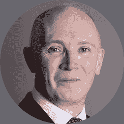
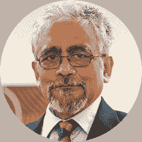
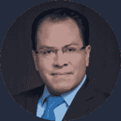

# [小组讨论]量化金融的当前趋势

> 原文：<https://blog.quantinsti.com/algorithmic-trading-week-28-september-2021/>

[https://www.youtube.com/embed/7K9W6Xrybbs?rel=0](https://www.youtube.com/embed/7K9W6Xrybbs?rel=0)

* * *

## 关于活动

正如我们所知，随着各种技术不断发展和演变交易世界，正在进行更广泛和更深入的研究，涉及金融和交易世界中数学和统计的学习、应用和使用。

在本次讨论中，我们来自全球各地的专家小组深入探讨了量化金融领域的当前趋势。他们的主题专业知识和经验在著名组织中担当重要角色，他们对该主题的想法会产生关键的见解，一定会指导您。一定要参加！

**活动举办日期:**
*2021 年 9 月 28 日星期二
东部时间上午 9:30 | IST 时间晚上 7:00 |新加坡时间晚上 9:30*

* * *

## 小组成员

### David Jessop(Columbia thread needle Investments EMEA 投资风险主管)

在任职期间，David 负责监督在 EMEA 地区管理的所有投资组合的独立投资风险管理流程。在加入该公司之前，大卫是瑞银定量研究的全球主管。

在瑞银的 17 年里，他的研究涵盖了许多主题，但特别是他专注于风险分析、投资组合构建以及最近的交叉资产因素投资/机器学习和贝叶斯技术在投资管理中的应用。

在此之前，他是花旗集团的量化营销主管。David 在 Morgan Grenfell 开始了他的职业生涯，最初是衍生品分析师，然后是量化投资组合经理。David 拥有剑桥大学三一学院的数学硕士学位。

### Debashis Guha 博士(SP Jain 全球管理学院教授兼机器学习主任)

Debashis Guha 是 S P Jain 全球管理学院机器学习主任兼商业技术研究中心主席。他在人工智能领域，尤其是其在经济和金融领域的应用方面，拥有二十多年的工作经验。

他还是一家总部位于班加罗尔的公司的创始人，该公司为全球量化对冲基金提供咨询服务。他曾担任总部位于加州的对冲基金 Big Sky Capital 的风险管理和量化交易主管，以及另一家加州对冲基金 Global Trend Capital 的合伙人。

古哈博士毕业于 IIT 大学，并在哥伦比亚大学获得博士学位。

### Richard V. Rothenberg(全球人工智能公司执行董事)

理查德是 Global A.I. Corporation 的执行董事，该公司是一家大数据和人工智能公司，为机构客户提供定量研究、数据驱动的信号和替代数据，包括对冲基金和政府。

此前，Richard 曾在数十亿美元的对冲基金和全球投资银行担任量化投资组合经理和研究员，包括德意志银行、Man investments 和其他领先机构。Richard 是劳伦斯伯克利国家实验室(世界上最大的超级计算实验室之一)的研究人员，也是国防高级研究计划局(DARPA)的顾问。

理查德是联合国贸易和发展会议可持续发展目标数据工作队成员，也是联合国科学、技术和创新专家组成员。

Richard 拥有蒙特里理工学院的经济学和计算金融学士学位，CQF 学院的量化金融证书，以及哥伦比亚大学的管理和量化金融硕士学位。

* * *

## 关于 2021 年 ALGO 交易周

在我们庆祝 QuantInsti 成立 11 周年之际，我们开始了一项新的传统——Algo 交易周。行业领袖将加入我们，通过各种教育会议分享他们的经验和智慧。对于有抱负的算法交易者和量化交易社区来说，这将是一个很好的学习机会。这是您联系您最喜爱的专家并免费获得所有问题答案的机会。