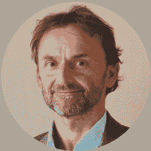

# 【问答环节】交易中的人工智能

> 原文：<https://blog.quantinsti.com/algorithmic-trading-week-29-september-2021/>

[https://www.youtube.com/embed/m976QX3XUoc?rel=0](https://www.youtube.com/embed/m976QX3XUoc?rel=0)

* * *

## 关于活动

随着技术的快速发展，人工智能正在被金融和贸易领域迅速采用，因为它在该领域具有巨大的能力和未开发的潜力。

2019 年，金融科技市场的全球人工智能价值为 26.1713 亿美元，预计到 2027 年将达到 352.301 亿美元，预测期内 CAGR 增长率为 38.4%。([来源](https://www.einnews.com/pr_news/551817144/global-ai-in-fintech-market-research-report-2021-to-2027-by-machine-learning-applications-and-regions))

我们将为您带来一个 60 分钟的专门问答环节，由著名专家 Thomas Starke 博士主讲，他将解答您关于使用、含义、应用等方面的所有疑问。人工智能在交易领域的应用。一定要注册加入到时间里来！

**活动于:**
*2021 年 9 月 29 日星期三
美国东部时间上午 5:00 | IST 时间下午 2:30 |新加坡时间下午 5:00*

* * *

## 扬声器

### Thomas Starke 博士(AAAQuants 首席执行官)

斯塔克博士拥有物理学博士学位，目前担任澳大利亚领先的自营交易公司 AAAQuants 的首席执行官，领导该公司的量化交易团队。他还在牛津大学担任高级研究员。

Starke 博士曾在专有贸易公司 Vivienne Court 和高速印刷领域的世界领导者 Memjet Australia 工作过。他曾领导劳斯莱斯公司(英国)的战略研究项目，也是微芯片设计公司 pSemi 的联合创始人。

* * *

## 关于 2021 年 ALGO 交易周

在我们庆祝 QuantInsti 成立 11 周年之际，我们开始了一项新的传统——Algo 交易周。行业领袖将加入我们，通过各种教育会议分享他们的经验和智慧。对于有抱负的算法交易者和量化交易社区来说，这将是一个很好的学习机会。这是您联系您最喜爱的专家并免费获得所有问题答案的机会。