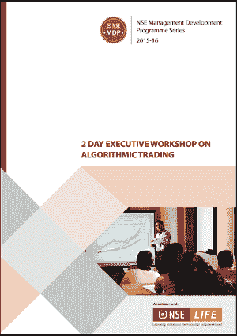
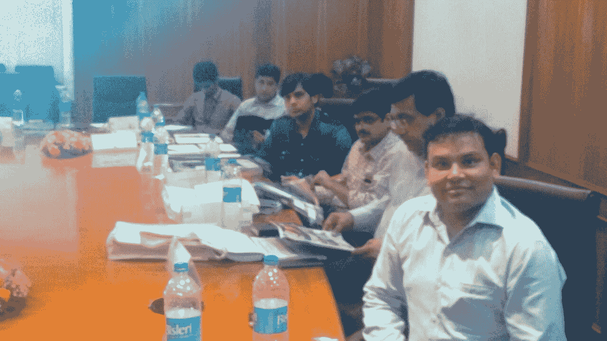
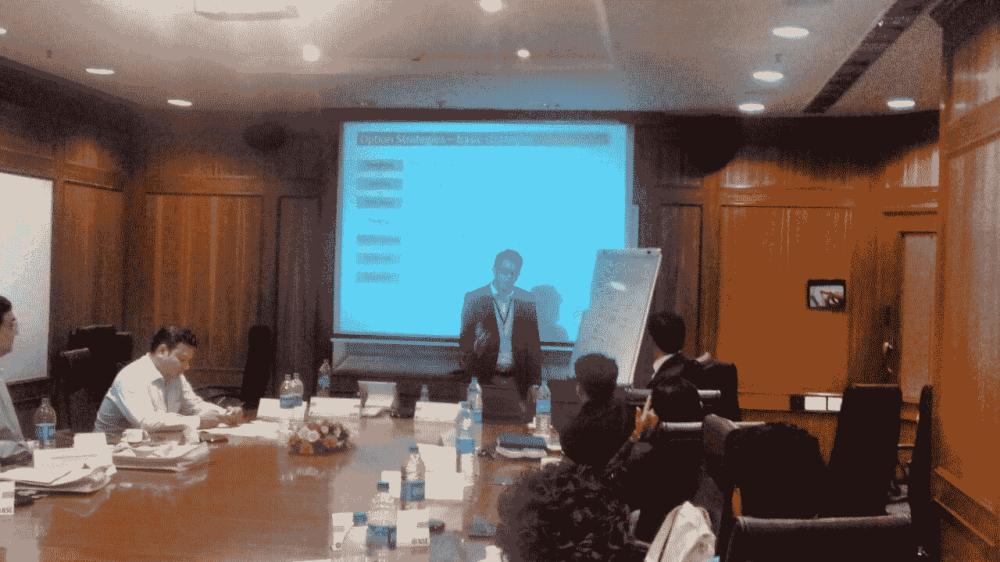
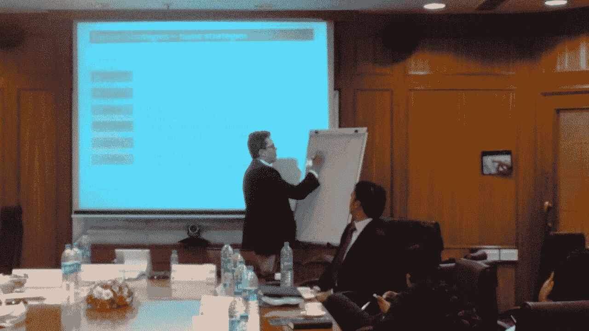
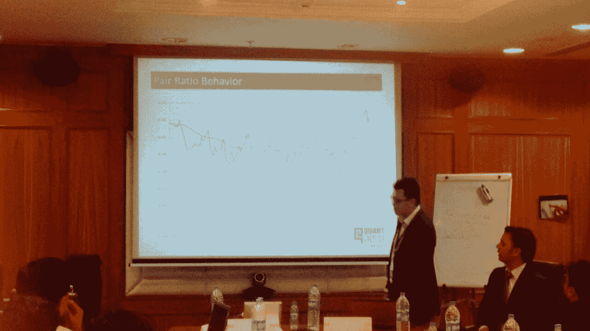
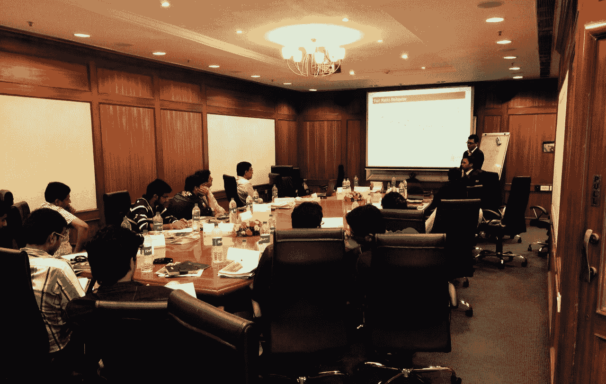
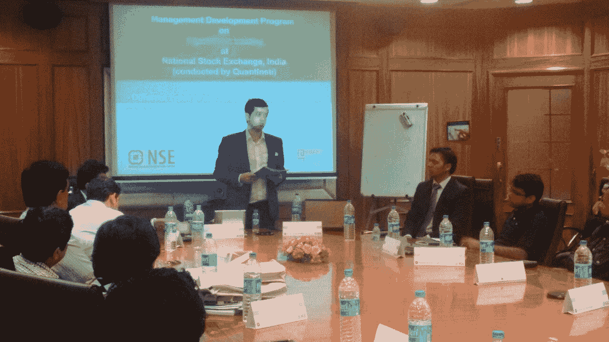

# NSE 在 MDP 举办的算法交易研讨会-2015 年 6 月

> 原文：<https://blog.quantinsti.com/algorithmic-trading-workshop-mdp-nse-june-2015/>

**T4】**

**日期**:2015 年 6 月 27 日和 28 日

**时间**:上午 10:00 至下午 5:30

**地点**:孟买 Bandra Kurla 综合大楼交易广场 C-1 座 NSE-400051

### **事件概述**

技术革新了金融市场的运作方式和金融资产的交易方式。全球市场的技术发展需要一种多维的方法来理解算法交易的重要性。

发展定量和定性算法交易技能的专业知识是必要的。这有助于我们更好地了解市场，并根据市场变化制定不同的策略。

鉴于当前的市场情景和动态，算法交易比以往任何时候都更吸引人的注意。这些概念是多方面的，适用于所有金融市场:股票、固定收益、国内或全球货币。

有鉴于此，NSE 与 QuantInsti 联合为分析师、交易商、交易员、顾问和其他市场从业者举办了一个关于算法交易的综合研讨会，作为他们管理发展计划(MDP)的一部分

### **NSE 的管理发展计划**

NSE 的 MDPs 旨在提升金融行业各级高管的竞争力。它旨在帮助专业人士在提高自身知识的同时，以个人和集体的方式在自己的岗位上发挥领导作用。NSE 的 MDP 对于渴望在其组织中担任领导角色的专业人士和经理来说至关重要。

### **QuantInsti 与神经元特异性烯醇化酶的关系**

作为亚洲学习算法交易的先驱机构，QuantInsti 的愿景是通过提供在市场中成功交易所需的正确知识、技能、工具和态度，将算法交易扩展到每一个散户和机构交易者。我们的使命是帮助世界各地的每一个交易者进入自动化交易的世界，并从技术创新中受益。

因此，我们的教师与 NSE 建立了这种联系，以便与会者可以从教师丰富的实践经验以及其他学习者的不同经验中学习。这是获得新见解以取得成功的理想平台。

 Rajib Borah 在 2014 年 NSE 的算法交易管理发展项目上

在我们之前在 MDP 的算法交易研讨会上，我们的老师已经阐明了各种自动化交易策略、工具、绩效评估技术、投资组合管理技术、规则和条例。这一次，我们的老师讨论了过去几个月交易生态系统中的新一代策略和变化。

### **为期两天的研讨会的计划内容**

| **Day 1** **Demystifying Algorithmic Trading**

*   解读行话:量化交易，算法交易，自动交易，高频交易，超高频交易
*   算法交易的演变-全球
*   算法交易的发展——印度
*   为什么要做算法交易——算法交易的好处？
*   全球和印度趋势——产量等

**System Architecture and its impact on trading performance**

*   算法交易平台的内部组件(OMS、CEP、RMS、适配器、tickStore、eventStore 等)及其交互
*   外部组件-与目的地的适配器通信、通信标准和协议(FIX 等)、TAP 服务器、multi TAP 和邀请管理
*   印度市场的技术设置-网络连接(场景、消息速率)；不同的交易环境(模拟、测试)；托管与非托管；tbt vs 快照；原生 api 与固定连接
*   构建与购买决策(“内部构建工具”与“购买现成产品”)

**Technological innovations for algorithmic trading**

*   延迟、测量延迟的方法、标准延迟基准数据
*   软件创新-低延迟代码，
*   硬件创新- cpu 亲和力与可扩展性、FPGA 与 ASIC、硬件策略、硬件配置
*   印度市场可用的工具-软件、硬件等

**Tool-box set of Algorithmic Trading**

*   统计、定量金融、计算
*   与设计算法交易策略相关的关键统计概念

**Different types of algorithmic trading strategies**

*   高频/超高频策略
*   执行策略:TWAP、VWAP、IS 等
*   阿尔法寻求策略:-做市，套利
*   不同类型的套利策略(结构性和统计性)
*   股票细分策略:指数套利、均值回归、动量、技术分析、[配对交易](https://blog.quantinsti.com/pair-trading-strategy-excel-model/)
*   期权策略:分散，波动性差价，差异互换，果冻卷，偏斜交易
*   多重交换策略:智能订单路由策略
*   基于订单簿动态的交易策略
*   不同的全球公司在做什么？

**Process of developing an algorithmic trading strategy**

*   设计和操作算法交易策略的整个生命周期
*   使用高频数据-管理分笔成交点数据库
*   规范化和清理数据
*   假设公式
*   自动化策略开发的机器学习方法

**Rules and Regulations**

*   审计流程和要求(NSE 定义)
*   SEBI 关于审计的建议
*   Exchange 审计
*   技术和系统审计
*   合规要求
*   印度交易所的战略批准流程
*   全球法规趋势

**Day 2** **Working on Algorithmic Trading Platforms - I**

*   基于算法的复杂事件处理
*   交易平台
*   使用 exchange 模拟器和测试策略

**Risk Management specific to Algorithmic Trading**

*   交易操作的风险管理-不同的风险来源，量化和设定限额的评估方法
*   自动化交易中的其他风险管理问题
*   算法交易中遇到的常见错误
*   全球算法交易所有重大失败的案例研究
*   印度交易所的风险管理要求

**Working with Quant Tools**

*   使用 R 的统计大数据分析
*   在 Excel 中使用 R

**Performance Evaluation and Portfolio Management**

*   使用夏普比率、索提诺比率、詹森阿尔法、RaROC、特雷诺比率等确定战略的盈利能力
*   利用空间理论跨战略分配资源

**Building Quant Tools**

*   为算法交易建立期权组合管理工具的实践练习

**What next**

*   交易所创新
*   竞争格局
*   新一代策略-基于机器可读新闻的策略等

**Future studies**

*   关于算法交易的书籍、学习资料和研究论文的文献综述

 |

### **扬声器**

Gaurav Raizada 是 iRageCapital Advisory Private Ltd .的董事，负责该公司在印度的系统、绩效和战略咨询业务。他曾以战略开发和执行为核心进行广泛咨询，包括交易系统开发、延迟减少、优化和交易成本分析。Kunal Kumar 在 iRageCapital Advisory 的交易策略团队工作，负责开发新策略，并对现有策略进行微调。他关注的领域扩展到流程自动化和维护交易基础设施。在此之前，他在 ICICI 银行总部的资金团队工作，帮助国际机构客户处理外汇、债券和衍生品需求。他还在 Religare Capital Markets 的投资银行部门和塔塔钢铁公司实习过。Nilesh Koshe 在 iRageCapital Advisory 的衍生品策略团队中担任量化助理。他的重点领域是使用机器学习技术的数据建模，为 algo 交易自动化交易决策。在 iRage Capital 之前，他曾在一家领先的投资银行担任衍生品策略师，为购买保险基金、养老基金等客户提供衍生品解决方案。他在亚洲和欧洲市场服务。Rajib Ranjan Borah 是 iRageCapital 的联合创始人和董事。在过去的 10 年里，他在美国、欧洲&亚洲与该行业的先驱公司如 Bloomberg LP、Optiver LLP、iRageCapital 合作，担任过与自动化交易相关的各种重要职务，从设计和交易 HFT 策略、低延迟交易技术，到为一个财团启动新的商品衍生品交易所提供策略咨询。作为国家奥林匹克决赛选手，Rajib 曾两次代表印度参加世界拼图锦标赛。

### **用于学习算法交易和量化金融的广泛课程**

完成本次研讨会后，与会者从我们的教师那里获得了许多关于自动化交易的理论和实践见解。为了学习和实施这些最佳实践和策略，你可以加入我们的算法交易 (EPAT)高管项目[。这是一个为期 6 个月的计划，在周末进行(在线和课堂)。我们还为参与者提供各种工具和测试市场数据，用于项目目的。](https://www.quantinsti.com/courses/epat/)

## **事件照片**

