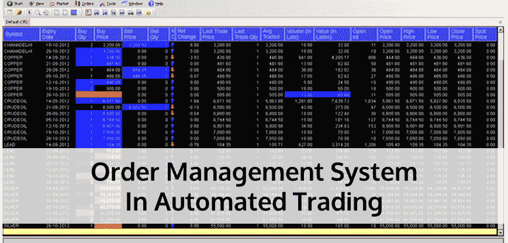
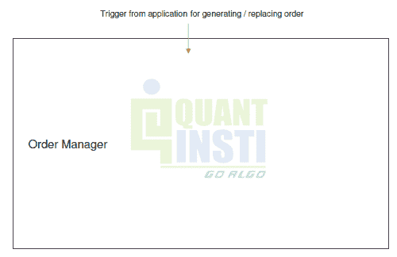
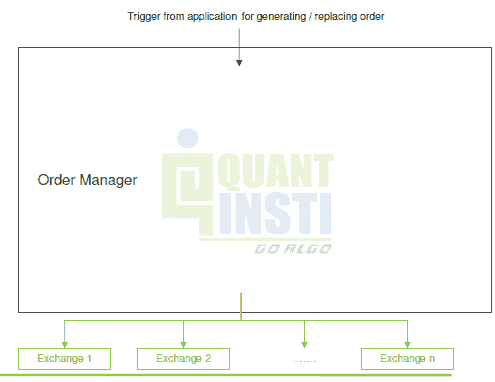
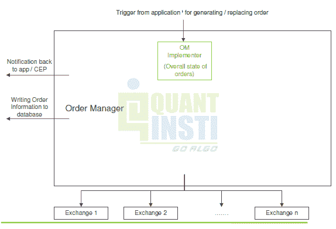
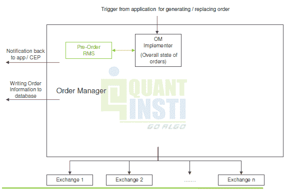
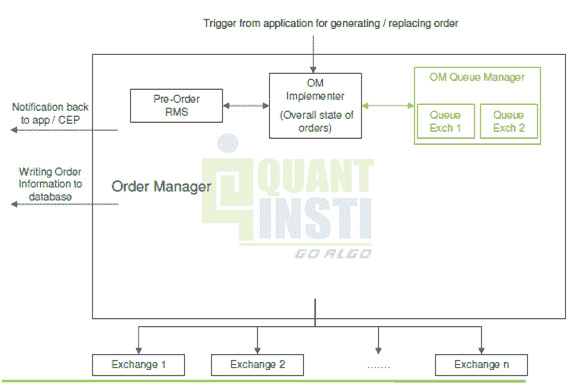
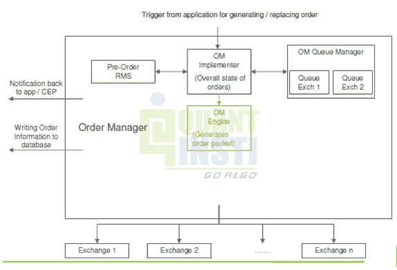
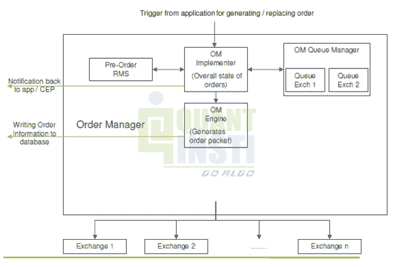
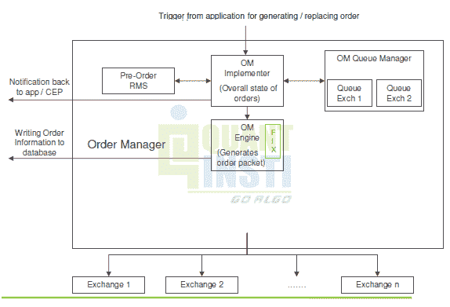
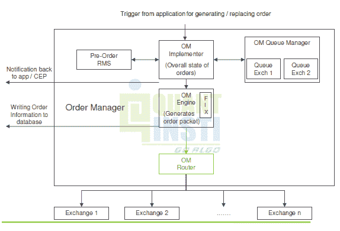

# 自动交易:订单管理系统

> 原文：<https://blog.quantinsti.com/automated-trading-order-management-system/>

雅克·儒贝尔

毕业后，我搬进了城市里的一间小而空的公寓。我的祖母，我永远不会忘记，告诉我，搬进一所新房子就像第一次见一个人，你需要选择一个房间，让它成为你的，慢慢地穿过房子，礼貌地介绍自己，这样它才能向你介绍自己。

我喜欢用同样的逻辑来看待自动交易系统的不同组成部分。有几个“房间”,如数据处理器、信号发生器和订单管理系统，我们需要通过它们来更好地理解整体结构。

本文将关注订单管理系统，因为订单是任何策略的基础，它们需要被输入并发送到正确的目的地。

### 订单输入

订单需要包含的主要信息如下:

1.  安全标识符(例如:共享代码)
2.  订单方向(多头或空头)
3.  订单规模(交易的数量)
4.  限价(例如限价单)
5.  订单类型(限额、市场、追溯、其他)
6.  订单条件(天、GTC、GTC、OPG、国际奥委会、FOK、其他)
7.  使用的算法类型(VWAP、视点、动量、统计 Arb)
8.  订单传输(经纪人、交易所、ECN、ATS。使用 API 或 FIX 网关)

该信息通常由最终用户通过 winform 输入，但对于全自动系统，不需要 winform，然而，在这两种情况下，建议将每个订单对象存储在关系数据库中以备记录。

聪明的开发人员还会在这一步建立验证，您需要确保检查是否有重大失误、违反法规/命令的情况，以及用户希望下订单的第二次确认和交易细节。

如果您正在构建一个用户提供输入的系统，您可能还希望构建一些交易前分析或交易成本分析。

### 订单路由

一旦系统捕获了一个订单，它就需要将其路由到所需的目的地，您会发现大多数场所都有自己的专有协议来处理订单，因此您的订单路由组件需要将每个订单编码成正确的格式。

### 订单编码

订单编码只是指订单对象需要的正确格式，以便另一方处理交易。一些场所将利用定制的应用程序编程接口(API)，但是发送与证券交易相关的信息的新的事实上的标准是金融信息交换(FIX)协议。(我不打算在这里展开 FIX 这本身就是一个完整的话题。)

### 订单传输

一旦订单被编码，它们需要被发送到要求的目的地。订单相关信息需要发送到场地，然后需要从场地发回关于交易的信息。

有几个适当的检查来确保订单信息被正确地发送和接收。场馆将运行各种校验和订单长度，以便 FIX 引擎可以确认收到的订单与传输的预期订单相匹配。

当修复引擎建立连接时，它会建立一个新的会话。在此会话期间发送的所有消息都由唯一的序列号标识。消息应该按顺序传递，这样，如果引擎收到标识符失序的消息，它可以发出重新发送请求。”(巴里·约翰逊，算法交易和 DMA)

交易执行后，场馆将向 OMS 提交一个包含已完成交易详细信息的填充事件。

### 

### 来自 EPAT 的课堂讲稿

除此之外，我更进了一步，加入了我在昆汀斯提 EPAT 项目中关于 OMS 的课堂笔记。以下内容直接摘自笔记，可能有助于描述这一过程:

### 订单经理

订单管理器生成并管理从系统发送到多个目的地的订单；此外，它还在发送订单前实时执行 rms。

订单管理器(OM)的输入是来自信号发生器(你的 alpha 或风险模型)的信号

OM 的输出是需要发送到交易所或其他目的地的订单

它还需要将通知发送回应用程序

以及将订单信息写入数据库

触发器由维护订单整体状态的 OM 实现者处理

它执行预购 RMS(最大订单规模、净投资组合头寸、最大交易价值等)

然后检查每个目的地的 OM 队列

如果队列是空闲的，那么它命令 OM 引擎准备一个包

这些信息被传送到应用程序，并记录到数据库中

对于固定协议目的地，订单以固定格式生成

接下来，订单路由器确定订单的目的地，并将消息转发到正确的线路

我希望这些笔记能帮助其他同学，我写这些文章的一个主要原因是，它们是我记忆所有材料的一种学习技巧。我要感谢算法交易和 DMA 的 Barry Johnson，以及提供 EPAT 程序的 QuantInsti 团队。

如果你有其他好的博文或文章推荐我们阅读，请添加到下面的评论区。

### **下一步**

如果你是一名散户交易者或专业技术人员，想要建立自己的自动化交易平台，今天就开始学习算法交易吧！从基本概念开始，如[自动化交易架构](https://blog.quantinsti.com/algorithmic-trading-system-architecture/)、[市场微观结构](https://blog.quantinsti.com/market-microstructure/)、[策略回溯测试系统](https://blog.quantinsti.com/backtesting/)和[自动化交易中的风险管理](https://blog.quantinsti.com/automated-trading-order-management-system/)。