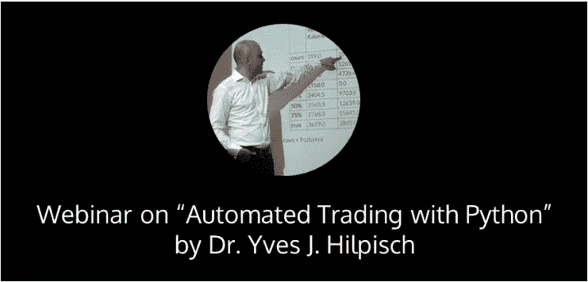

# 使用 Python 进行自动化交易

> 原文：<https://blog.quantinsti.com/automated-trading-with-python-webinar/>

### 

### **关于网上研讨会**

Python 非常适合自动化金融交易——尤其是低频和中频策略。本次网络研讨会展示了实施自动化交易方法的典型步骤是多么简单:

*   历史数据搜集
*   交易策略的回溯测试
*   使用流数据
*   实时自动交易

所有展示的例子都是基于[http://oanda.com](http://oanda.com/)的平台和 API。关于 Python 和使用的库的背景信息可以在 O'Reilly 的书 Hilpisch，Yves(2014):《Python for Finance——分析大金融数据》中找到。

### **日期和时间**

二月十日，星期三

**13:30** 中欧时间 **18:00** 印度标准时间 **20:30** 新加坡时间

### 伊夫·j·希尔皮施博士

Yves J. Hilpisch 是德国 Python Quants GmbH 的创始人和管理合伙人，也是 Python Quants LLC 的联合创始人。，纽约市。该集团提供基于 Python 的金融和衍生品分析软件，以及与 Python、开源和金融相关的咨询、开发和培训服务。Yves 还是《用 Python 进行衍生品分析》(Wiley Finance，2015)一书的作者。作为一名拥有数理金融博士学位的工商管理毕业生，他在 CQF 项目上讲授计算金融。

### **网络研讨会视频**

[https://www.youtube.com/embed/blnJn1aCfDw?rel=0](https://www.youtube.com/embed/blnJn1aCfDw?rel=0)

### **下一步**

如果你是一名程序员或科技专业人士，想开始自己的自动化交易平台。从日常从业者的实时互动讲座中学习自动交易。算法交易高管课程涵盖统计学&计量经济学、金融计算&技术和算法&量化交易等培训模块。[现在报名](https://www.quantinsti.com/courses/epat/scholarship-test/)！

您也可以查看我们的互动课程“Python for Trading ”，您将获得 Python 编码的实践经验。你可以编写自己的策略，并对其进行回溯测试，还可以获得 QuantInsti 和 MCX 的联合认证。