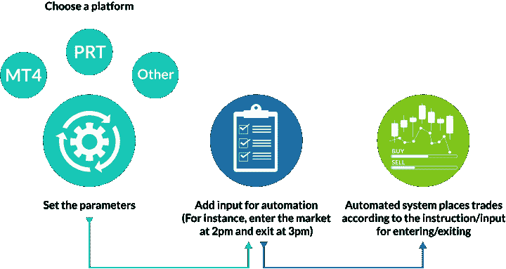

# 什么是自动交易？

> 原文：<https://blog.quantinsti.com/automated-trading/>

由[查尼卡·塔卡](https://www.linkedin.com/in/chainika-bahl-thakar-b32971155/)

由于使用自动化系统执行交易指令，自动化交易是一种速度更快的方法。凭借您在交易领域的专业知识，您可以自动化您的交易方法，而不是手动执行交易。在这篇博客中，你将学到所有关于了解和开始使用自动交易方法的知识。

博客内容包括:

*   [什么是自动化交易？](#what-is-automated-trading)
*   [自动交易的历史](#history-of-automated-trading)
*   [自动交易工作](#working-of-automated-trading)
*   [自动交易和算法交易的区别](#difference-between-automated-trading-and-algorithmic-trading)
*   [新旧经纪模式的区别](#difference-between-old-and-new-brokerage-model)
*   [自动交易和算法交易的例子](#example-of-automated-trading-and-algorithmic-trading)
*   [实行自动交易的先决条件](#prerequisites-for-practising-automated-trading)
*   [学习自动交易的资源](#resources-to-learn-automated-trading)
*   [建立自动交易系统的步骤](#steps-to-building-an-automated-trading-system)
*   [自动化交易的好处](#benefits-of-automated-trading)
*   [自动化交易的弊端](#drawbacks-of-automated-trading)

* * *

## 什么是自动交易？

自动化交易使用计算机生成交易信号，发送订单，并在有或没有人工干预的情况下使用算法管理投资组合。算法使用复杂的电子市场/平台，以类似于电子交易的方式进行交易。

* * *

## 自动化交易的历史

谈到自动化交易是如何开始的，以及它是如何变得对交易者如此有用的，让我们从一开始就一个一个地看看“自动化交易”的旅程:

*   1949 年，Richard Donchain 首次提出了自动交易系统的概念。他利用一套规则来买卖金融市场的资产。
*   然后，在 20 世纪 80 年代，基于规则的交易在交易者中流行起来，著名的交易者如约翰·亨利等开始使用基于规则的交易策略。
*   在 20 世纪 90 年代中期，自动股票交易模型的简易版本开始可供购买。这些交易模式也提高了散户投资者进入金融市场交易领域的机会。然而，在今天的时代，自动交易系统正在全球范围内管理资产。

* * *

## 自动交易的运作

自动交易以简单而系统的方式工作，完全基于交易者设置的命令/指令/参数。让我们来看看自动交易系统是如何逐步运作的:

*   为了让自动交易系统工作，首先，交易者需要一个[平台](https://tradingplatforms.com/automated/)，在这里你可以设置你的交易策略的参数。
*   然后，在交易经验的基础上，交易者将通过指令输入创建进/出头寸。
*   这些规则和条件将基于交易的时间、进场和出场的价格以及交易的数量。
*   每当条件满足时，这些算法将代表交易者进行交易。
*   例如，自动股票交易系统可以在算法的帮助下，当其 100 天移动平均线高于 250 天平均线时，购买 200 股苹果股票。
*   自动交易系统将持续监控金融市场价格、交易等。并且每当满足预定的指令/参数时将执行交易。

下图解释了自动交易系统的整个流程:

Automated trading

* * *

## 自动交易和算法交易的区别

让我们用这张表来找出自动交易和算法交易的不同之处:

| **自动交易** | **算法交易** |
| 说明不能太详细。例如，你可以自动执行一次交易，而不像用算法交易那样设置条件 | 计算机程序用于遵循一组定义的指令或规则来计算订单的价格、数量、时间和其他特征。换句话说，交易信号(买/卖决定)是基于一组指令产生的。 |
| 交易执行的范围仅限于一个金融市场，比如股票市场和一种产品，比如期货 | 算法交易有效地扩大了个人交易者的交易范围。例如，算法可以被编码以在一个以上的金融市场中执行交易，例如股票、商品、密码等。以及期货、期权等多种产品。 |
| 每当需要设置新的条件时，就需要不断的人工干预 | 几乎不需要人工干预，因为算法是一次对所有条件进行编码的 |

建议内容如下:

[算法交易书](https://www.quantinsti.com/algo-trading-ebook)

* * *

## 自动交易和算法交易的例子

在自动交易中，订单根据设定的参数和指令以电子方式执行，如上图所示。例如，自动交易不能处理关于价格、交易量等的详细指令。你的喜好。自动交易系统可以被指示在下午 2 点进入交易，在下午 3 点退出。就是这样！

然而，在算法交易的情况下，你可以通过算法创建一套规则和条件。例如，您可以创建算法，以便在价格低于 50 美元时进入交易，否则退出交易。因此，可以通过考虑价格、[头寸](https://quantra.quantinsti.com/course/position-sizing-trading)大小等细节来做出决策。

* * *

## 实行自动交易的先决条件

你可以找到学习算法交易的步骤，一步一步学习这个当代的流程。学习自动交易没有那么多先决条件，因为学习可能很难，但却是可行的。但是，在你开始练习自动交易之前，这些是先决条件:

*   市场知识
*   战略创造
*   编码经验

### 市场知识

对市场有很好的了解或者是手工交易者已经帮助你成为自动化交易者。手动交易体验很有帮助，因为自动交易要求交易者在了解市场的基础上自动执行交易订单。

例如，如果你有手工交易的经验，你将能够分析以特定价格购买特定股票是否会带来预期的回报。做出决定后，您将能够相应地自动化系统。

如果你能掌握基本知识，学习股票市场对你来说会容易得多。这个关于股票市场基础知识的免费课程旨在帮助你理解核心概念。

### 战略创造

开始自动交易的另一个先决条件是很好地了解策略创建过程。所有交易都必须以正确的策略执行(基于市场情况和股票、商品等的表现)。)以获得最佳结果。

有几个[量化交易策略和模型](https://quantra.quantinsti.com/course/quantitative-trading-strategies-models)你可以学习，以便能够为你的投资组合使用最有效的策略。

### 编码经验

良好的编码体验是自动交易的必要条件，因为这样你就可以选择通过算法自动执行所有策略。 [Python 编程](/python-programming/)被认为是当今最流行的编程语言。

通过学习 Python 编程的基础知识，你可以为你的交易之旅练习编码。此外，练习得好可以帮助你更好地规划你的自动交易策略。

* * *

## 学习自动交易的资源

通过我们的博客[学习算法交易的免费资源——编辑列表](/free-resources-list-compilation-learn-algorithmic-trading/#automated-trading)找出你可以免费获得的独家资源！

然而，为了通过付费资源学习，你必须访问我们的博客[什么是算法交易](/algorithmic-trading/)。在博客中的“如何学习算法交易”的副标题下，你将能够找到一些有用的课程和书籍(付费)。

* * *

## 建立自动交易系统的步骤

建立自己的自动交易系统确实需要在硬件、软件、自动化知识等方面进行适当的规划和执行。通过我们关于[建立算法交易平台](/setting-up-an-algo-trading-desk/)的有趣而全面的博客，你将找到建立自动化交易系统的所有必要步骤并开始行动！

* * *

## 自动化交易的好处

自动化交易是一种比人工交易更快更有效的方法。让我们来详细看看这些优势，它们是:

### 回溯测试

允许[回测](/backtesting/)，这是成功交易策略的一个重要组成部分，可带来良好的结果。当你进行回溯测试时，你会发现这个策略是否符合历史数据。在过去数据结果的帮助下，您建立的策略将针对当前数据进行验证。因此，更好的结果。

### 情感

交易时，次要情绪起很大作用。恐惧、贪婪等情绪。用手动交易的方式来推动你的交易决策。然而，在自动交易的情况下，情绪会被抑制，因为计算机系统会根据你设定的偏好来处理交易。

### 方法

在自动交易中可以看到更有纪律的方法，因为在人工交易中，由于市场波动等情况，人类并不总是可能遵循有纪律的模式。

在波动期间，手工交易者可能会基于对未来市场下跌或上涨的不正确预期做出决策。但是，有了给自动系统的交易计划或交易指令，你就可以维持一个有纪律的方法。

这种训练有素的方法可以让你用回溯测试和正确的交易策略来执行交易。

### 时间

此外，自动化交易通过快速监控市场(比任何人都可能做到的更快)为交易者节省了大量时间。这有助于在不浪费太多时间的情况下找到最佳机会。

* * *

## 自动化交易的缺点

自动交易的所有缺点如下:

### 固定

一个机械系统，有时候，肯定会卡住，不像人类。万一系统卡住了，同样的问题也需要解决。例如，一个机械系统可能会慢一点，导致行动延迟(没有按照指示在下午 2 点进入市场)。

### 监视

监控功能是自动化系统的另一个缺点，因为没有对系统的持续跟踪，您可能无法发现是否有什么需要改变。

例如，在没有监控的情况下，系统可能会继续将进入时间视为下午 2 点(根据您的指示)或任何此类特定时间。但是，您可能需要根据市场情况(您的分析/监控)更改时间

* * *

## 结论

自动化交易是一种当代实践，与传统交易相比，它让你的交易更实际。此外，与人工交易相比，自动化交易更快、更准确。

在博客中，我们讨论了一些主要概念，比如工作，以及自动化交易和算法交易之间的细微差别。

在这个 Quantra 课程中，你也可以从什么、如何、为什么、算法交易策略和建立算法交易业务的规则等基础知识开始学习算法交易。立即注册。

* * *

*<small>免责声明:本文提供的所有数据和信息仅供参考。QuantInsti 对本文中任何信息的准确性、完整性、现时性、适用性或有效性不做任何陈述，也不对这些信息中的任何错误、遗漏或延迟或因其显示或使用而导致的任何损失、伤害或损害负责。所有信息均按原样提供。</small>*