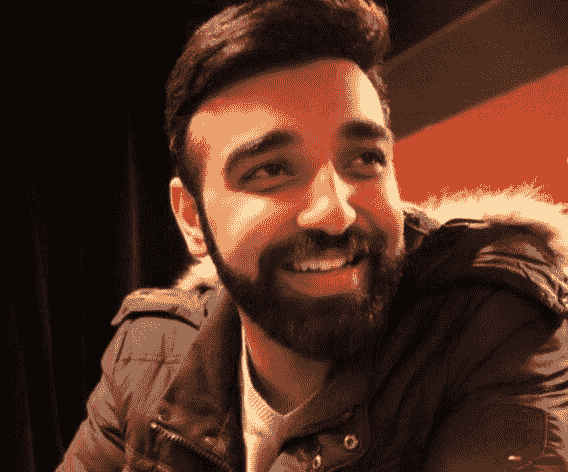

# Raghav 超越交易算法的旅程

> 原文：<https://blog.quantinsti.com/bcom-commerce-algorithmic-trading-journey-raghav/>

传达你的想法并不总是容易的。尤其是在交易的时候，你要把你的想法具体化，并把它们变成策略。

Raghav Anand 毕业于商业专业，在进入交易行业之前，他对交易有一定的了解。他也做过很多交易和技术相关的课程。他是靠自己的努力爬到顶端的，这并不容易。

这是一个值得一读到底的故事，因为 Raghav 分享了他所有的经验，学习，缺点和一些重要的交易技巧。Raghav Anand 是 EPAT 大学的校友，我们联系了他，与我们分享他进入算法交易世界的旅程。

我们的谈话是这样进行的。

* * *

## 你好，Raghav，请告诉我们你的情况！

嗨！我是 Raghav Anand，来自印度旁遮普的 Ludhiana。我毕业于孟买的纳尔西·蒙吉学院，主修金融市场。

<figure class="kg-card kg-image-card"></figure>

我热衷于弹吉他，甚至一度把它当作职业。我喜欢阅读(我一个月能读完 3 本书)，喜欢旅行、徒步旅行和公路旅行。

由于我父亲是一名有 30 年经验的股票经纪人，我一直对股票市场感兴趣。2019 年 7 月开始全职交易，过去一年开始全职交易。

我在 NSE 交易指数期权，Back-Nifty 和 Nifty 期权。我交易一些股票期权，主要是指数衍生品，主要是期权。

* * *

## 你的交易之旅如何？

我把我的成就归功于在 Ludhiana 之前在 Ajmer 的 Mayo 寄宿学校接受的教育。上学，大学，和对优秀的渴望引导我去交易。

当我毕业的时候，我想让自己与众不同。很多人做短线交易，这激励我去做。我知道我有一个投资组合，但我从未管理过它。我没有信心靠自己的交易系统生存并赚钱。

交易公司不会雇佣没有任何经验的人，所以找工作不是一个选择。我父亲坚持要我学算法交易。

我遇到了一些关于算法交易的课程，但它们都是基础的，缺乏实际应用。就在那时，我的一个朋友告诉我关于 EPAT 的课程。QuantInsti 团队解答了我所有的疑问，我参加了这个课程。

大学毕业后，我只研究了 6-8 个月的全天股市，观察模式和市场。我通过做票据交易、过程、日志和计划来运用我的 EPAT 知识。

这让我在德里的 Mansukh 证券公司找到了一份好工作。我在一个道具柜台工作，做市，大量交易，在一个很好的环境里，有很棒的人帮助我学习。

之后，我回到孟买，和几个朋友一起建立了一个交易平台。只是几个月，然后新冠肺炎袭击了。

* * *

## 新冠肺炎的情况对股票市场和你的交易有什么影响？

这个封闭季度是我交易中最好的一个季度。我所部署的系统已经给出了最好的结果。

当新冠肺炎袭击时，我被困在孟买三个月。那是一段艰难的日子，但是我的交易让我继续工作，继续活着。

从那时起，我回到了我的家，卢迪亚纳，并一直在这里。我们没有去我们的办公室，我家里没有我的基础设施，所以部署我所有的系统现场和交易不是一个很好的决定。但是，我交易只是因为我知道我所有的损失都在我的控制之下。

我父亲在他的职业生涯中从未见过这样的事情，而我只有 3-4 年的交易经验。我听从了父亲的建议，避免交易，多学习，在这段时间专注于我的方法。这一点，加上我的信念，帮助我坚持下去。

2020 年 1 月至 3 月对我来说是一个相当艰难的时期，但 3 月的 3-4 天是我恢复系统降级所需的全部时间。

* * *

## EPAT 是如何帮助你交易的？

我学过大多数与股市相关的课程，但都很主观。没有人教我如何从中赚钱。他们没有谈论量化这些知识。

我需要知道我一次交易能损失多少。

如果你说我冒 X 卢比的风险，而你最终损失了 X*100 卢比，我会抓狂的。这怎么可能呢？

在 EPAT 的经历让我大开眼界。实践学习让我的学习曲线缩短了至少 5 年。

我有股票市场的经验，但没有交易方面的经验。我是 BCom 出身，对编码毫无经验。我担心我无法应付 EPAT。

我错了。

<u>周末在线直播讲座:</u>

*   我从未想过我能听这么冗长的讲座
*   虽然工作量很大，但这一切都在如此美好的 6 个月课程中得以展现和压缩
*   工作量从未困扰过我
*   一周只有 2 节课，差不多 3-3.5 小时的课
*   即使讲座长达 6 个小时，我也不会介意，因为这是如此好的学习
*   教我们的人本身就是交易者，他们对这个主题有丰富的知识。所以这也很有帮助。

<u>EPAT 教我:</u>

*   将系统投入使用的方法
*   选择/拒绝系统时需要考虑哪些参数
*   在交易中，什么该执行，什么不该执行
*   理论上行得通的，实际上可能行不通
*   股票市场，期权，隐含波动率，期权希腊人的实际执行
*   将逻辑处理成可量化的数字，并将其付诸实践
*   实施我的想法
*   执行我的想法
*   Excel 和 Python
*   来更好地建模和设计策略
*   如何量化和预测我的策略
*   如何在市场上验证我的想法

还有更多...

<u>EPAT 改变了我准备交易计划的方式:</u>

*   如果我不知道如何测试我的逻辑，弄清楚这是否是一个长期战略，我真的什么也做不了。
*   我将不得不提前测试它至少 2-3 年。
*   2-3 年后，我会选择大量部署它。
*   部署好了，也不能保证我 3 年的努力就一定能赚钱。
*   想象一下，如果我知道它不起作用，那还有什么意义呢？
*   这就是人们在交易中亏损的原因，因为他们没有一个合理的计划。

<u>EPAT 如何改变了我:</u>

*   我是我那一批人中最年轻的一个。每个人都交易过，在加入 EPAT 之前，我从来没有敲过单。
*   我也可以从以巴提人的丰富经验中学习。
*   不管他们或我父亲以前说什么都不管用，我总是自己去检验。
*   如果它符合我的交易风格和风险参数，那么我肯定会用我的每一分钱继续交易。如果没有，那我就不会。这是我的简单规则。
*   这就是 EPAT 如何给我的生活带来了好的改变。

交易心理学对我来说也是非常重要的一部分，在 EPAT 教授的概念对我来说也是一个真正的学习曲线。

* * *

## 你对有抱负的交易者有什么话要说？

虽然我不像其他交易者那样有经验，但我想从我的经验中传达这一点:

*   即使是印度最好的交易者也不是每天都赚钱
*   你必须面对你将面临损失的事实
*   交易的对错并不重要
*   真正重要的是一段时间内你在做什么
*   有正确的方法
*   不要在没有构思和测试的情况下投资你的策略
*   对你的想法和逻辑有信心
*   你不可能每天、每周或每月都赚钱。会有离群值。
*   了解你的策略的每一个细节以及它是如何运作的
*   尽可能量化你的策略
*   规划一个好的流程和计划
*   有体面的目标
*   直到你在一个小资本的时候，翻倍的钱感觉像一块蛋糕，但是当你在一个大资本的时候，它是有挑战性的
*   改进行不通的，尝试改变它

<u>不要带压力:</u>

*   想出一个策略，让损失在你的心理压力范围内
*   为什么？这样你就不会陷入不快乐或沮丧的精神状态
*   人们觉得交易有压力的唯一原因是你承担的风险超出了你的定义范围
*   如果你准备每天损失 X 的量，你的风险也设定为 X，那么就没有理由感到紧张
*   一旦你没有压力，坚持你的计划就变得容易了
*   一旦你坚持你的工作计划，那么没有什么可以阻止你
*   成功的多少取决于每个人的努力，但至少情绪不会低落

<u>规划至关重要:</u>

我父亲教导我，做某事的计划和方法是最重要的部分，而不是结果。你只需要承担风险。钱就自动跟着来了。

坚持你的计划，对它有信心。如果你的计划是正确的，你就在正确的道路上。

一旦你做到了，没人能阻止你成为一个成功的交易者或投资者。这需要大量的时间和耐心，如果你有这种耐心，那么就没有什么能阻止你进入股市。

* * *

谢谢你和我们分享你的旅程，Raghav。你的旅程充满了许多知识和经历。这些都是非常令人难以置信的见解，我们相信对所有的学习者都非常有帮助。

我们希望你在疫情期间保重并保持安全。

在学习算法交易的过程中，你需要正确的知识和必要的技能。算法交易(EPAT)高管课程(T1)，帮助你实现你的学习目标。EPAT 是一门综合性课程，涵盖了广泛的主题。

*<small>免责声明:为了帮助那些考虑从事算法和量化交易的人，这个案例研究是根据一个学生或 QuantInsti 的 EPAT 项目的校友的个人经历整理的。案例研究仅用于说明目的，并不意味着用于投资目的。EPAT 项目完成后所取得的成果对所有人来说可能并不一致。</small>*