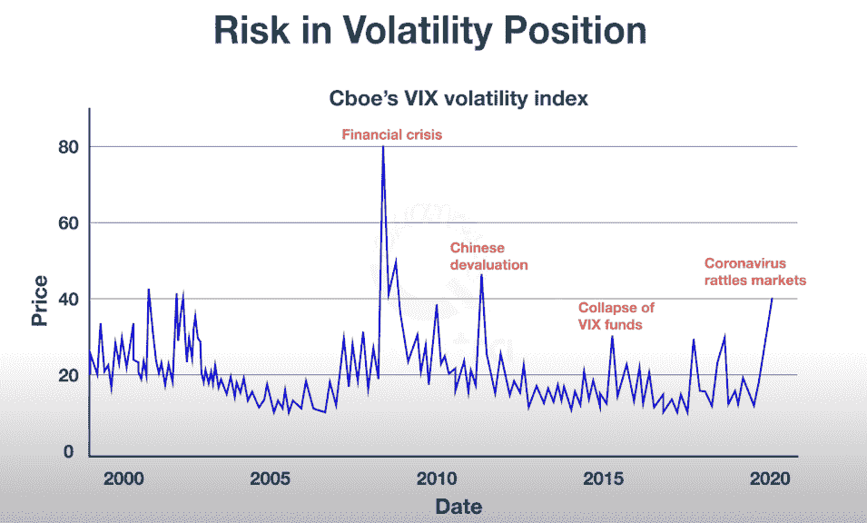
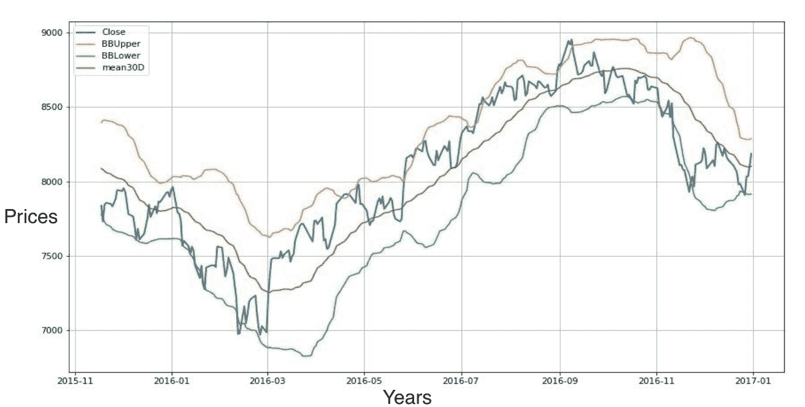
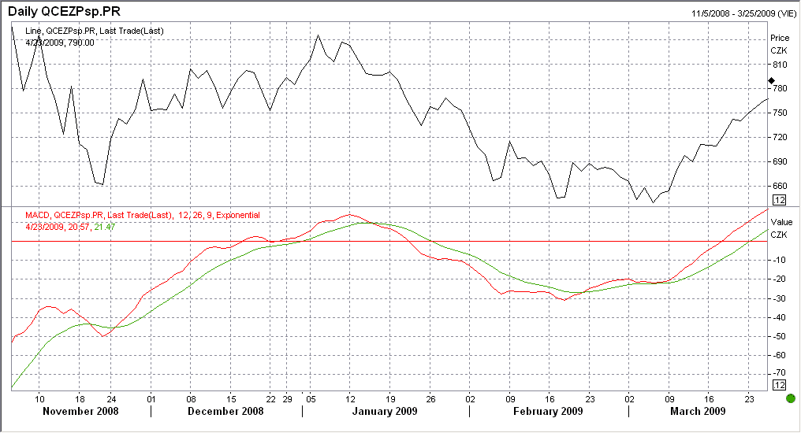
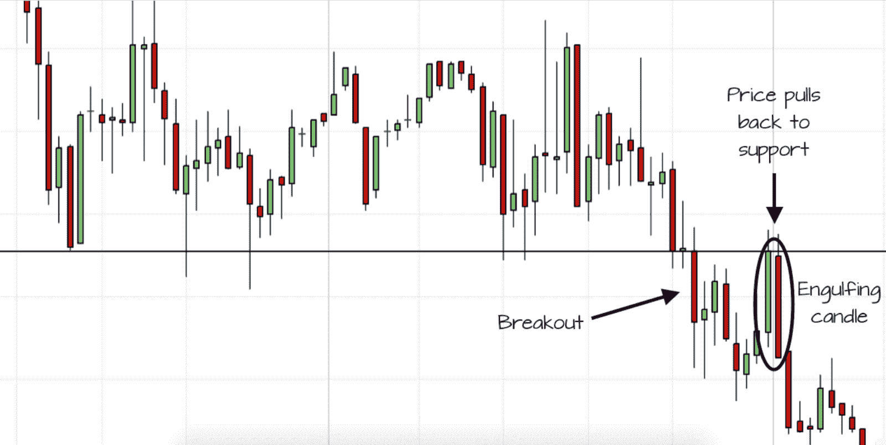
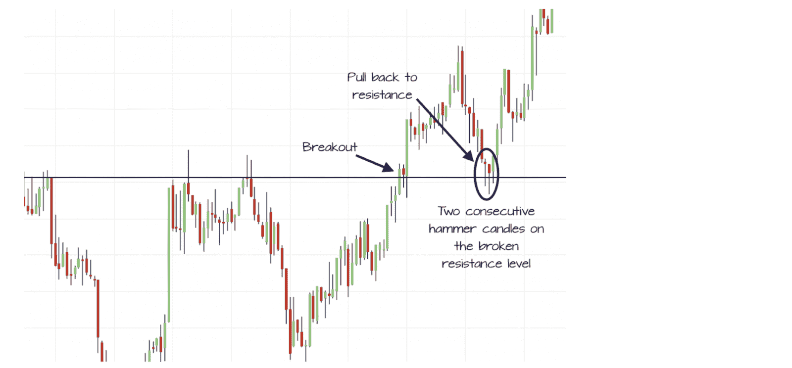

# 如何成为更好的 Quant？

> 原文：<https://blog.quantinsti.com/become-better-quant/>

由[查尼卡·塔卡](https://www.linkedin.com/in/chainika-bahl-thakar-b32971155/)

这篇文章旨在让你了解如何提升自己作为量化分析师的技能。你会发现相关的信息，有助于你更好地定期分析市场数据，并为风险管理、投资组合优化等创建算法模型。

本文涵盖:

*   谁是宽客？
*   [量化金融的相关性](#relevance-of-quantitative-finance)
*   [提升量化分析师技能的最常用方法](#most-common-ways-to-upskill-as-a-quant)
*   [在充满挑战的环境中交易](#trading-in-a-challenging-environment)

## 谁是 Quants？

定量分析师是专门应用数学和统计方法来理解和预测金融市场行为的人。量化指标的目标是用数值来代表给定的市场情况。

定量分析师需要具备数学领域的定量技能，包括多元微积分、线性代数、微分方程、概率论和统计推断。此外，它还包括计量经济学和编程语言的知识，如 C，python 等。

展望未来，让我们找出定量金融与定量分析师的相关性。

## 量化金融的相关性

[数量金融学](/quantitative-finance/#Quantitative-Finance-Important)又称数理金融学，是应用数学的一个领域，主要研究金融市场。数量金融学与金融经济学有着密切的联系，涵盖了数量学的许多金融应用，如统计学、概率论、抽样与估计、假设检验、回归、时间序列等。投资银行、衍生品交易、证券交易、风险管理和[投资组合管理](https://quantra.quantinsti.com/course/quantitative-portfolio-management)都采用了量化金融技术。

现在让我们来看看定量分析师在他们的领域中提高技能的最常见的方法。

## 提升量化分析师技能的最常见方法

作为一名定量分析师，提升你的工作技能有一些常见的方法。毫无疑问，quant 需要做以下日常工作:

*   交易策略开发
*   投资组合优化
*   风险管理
*   资产定价和管理

### 交易策略开发

制定交易策略意味着计划交易，在最有利可图的时候执行。交易策略开发中的规范是:何时进场，何时出场，进行哪些交易，每个头寸的风险资本是多少。

### 投资组合优化

投资组合优化包括通过股票、商品、期权、衍生品等投资组合来设定最佳投资组合。这样，投资者可以在市场存在风险的情况下最大化投资回报。

### 风险管理

除了使用标准的风险模型，量化分析师基本上从几种订单中选择，以最小化投资回报的风险。例如，基于投资组合损失百分比或 ATR 等指标的硬止损订单，限价订单，这意味着以不超过确定价格的价格买入，以不低于特定价格的价格卖出。有一些其他的[订单类型](/fill-kill-order/)，quant 可以执行以帮助风险管理。

### 资产定价和管理

资产定价意味着在控制投资风险的同时进行投资。无论是证券定价的投资组合优化，定量分析师都要确保投资有最大的回报。

现在，要想成为一个更好的定量分析师，或者只是想成为一个更好的定量分析师，你需要强调以下几个方面:

*   前瞻性交易
*   情况分析
*   地缘政治因素
*   替代数据

### 前瞻性交易

定量分析师需要根据各种因素预测未来的市场状况。只有合理预测未来的结果，当前的头寸才会产生有利的回报。借助[机器学习和深度学习模型](https://quantra.quantinsti.com/learning-track/machine-learning-deep-learning-in-financial-markets)，可以更好地评估这样的预测。例如，回归有助于获取数据、预处理数据、训练和测试机器。另一个例子是支持向量机模型，它也有助于创建您自己的预测算法。虽然回归模型最适合文本和图像等非结构化或半结构化数据，但回归模型是用来学习已识别的独立变量的。还有其他几种机器学习和深度学习模型可以帮助进行有收益的交易。

### 情况分析

情景分析考虑了可能影响交易者头寸的各种可能性。

这些可能性是几个能够影响市场状况的宏观经济因素。

例如，如果原油价格下跌，国内和国际市场都会受到影响。这最近发生在 2020 年 3 月，当时石油巨头沙特阿拉伯和俄罗斯之间的价格战导致油价下跌。与此同时，道琼斯指数在接下来的两天内暴跌了 1200 多点，经纪公司用数百万美元的 T2 来弥补客户的损失。

因此，定量分析师可以根据这种情况对行业或公司的影响来分析市场，并规划投资。

### 地缘政治因素

香港安全法等地缘政治因素使金融市场变得敏感。许多公司正计划将他们的基地迁出香港，以保护他们的权利。

因此，这些方面会对股票的头寸产生相当大的影响，定量分析师应该注意这些意外情况。

### 替代数据

替代数据集基本上提供了关于对投资机会的独特见解的信息。这些有助于完成投资的重要信息由公司或公司以外的来源发布/分发。定量分析师可以在分析市场状况后做出投资决策。

J.摩根大通提到，根据德勤的[消息来源](https://www2.deloitte.com/us/en/pages/financial-services/articles/infocus-adopting-alternative-data-investing.html)，资产管理公司正在投资 20-30 亿美元用于获取和处理替代数据。

例如，关于公司运输、定价、互联网活动等的信息。在 Twitter，LinkedIn 等平台上。获取信息的其他来源可以是信用卡交易、销售点交易、电子邮件收据等。

展望未来，让我们看看在充满挑战的环境中交易时需要考虑什么。

## 在充满挑战的环境中交易

为了应对像疫情这样的挑战性环境，量化分析师需要很好地配备工具，以便根据市场波动建仓。这些重要工具是:

*   VIX 指示器
*   布林线
*   MACD
*   资本资产定价模式（capital asset pricing model 的缩写）

### VIX 指示器

VIX 或波动率指数基本上是一种衡量市场波动的指标，因此也被称为“恐惧指数”。定量分析师可以用它来追踪投资者对未来动荡市场的恐惧。有了 VIX，定量分析师可以衡量市场对标准普尔 500 指数期权的推测波动性。下面是 VIX 指示器的图像，显示了指示器的外观。该指标显示 VIX 在危机发生的地方上升。例如，2008-09 年的金融危机。有了 VIX，定量分析师可以评估市场。

来源:[利用期权情绪指标进行交易](https://quantra.quantinsti.com/course/trading-using-options-sentiment-indicators)

### 布林线

布林线振荡器是基于[波动率](https://quantra.quantinsti.com/glossary/Volatility)或[标准差](https://quantra.quantinsti.com/glossary/Standard-Deviation)的[振荡器](https://quantra.quantinsti.com/glossary/Oscillators)，由三个部分组成。中间的波段是一条[移动平均线](https://quantra.quantinsti.com/glossary/Moving-Average)，其他两个波段是预先确定的，通常距离移动平均线一个标准差。

布林线涉及以下计算:

1.  中间带:30 天移动平均线
2.  高波段:中间波段+ 1 x 30 天移动标准偏差
3.  较低波段:中间波段–1 x 30 天移动标准偏差

作为定量分析师，你可以使用布林线来确定股价的波动。一旦价格的波动性发生变化，波段之间的差距也会发生变化。在波动性较大的市场中，这一差距会扩大，而在波动性较低的市场中，这一差距会缩小。当波动幅度较大时，市场不稳定。这时，定量分析师应该利用市场条件。例如，在这样的市场中，定量分析师可以帮助充分利用[期权](https://quantra.quantinsti.com/glossary/Option)。可以有多种策略来充分利用动荡的市场环境。通常在高度波动的市场中，由于基础资产价格波动，期权溢价往往定价较高。

此外，非常重要的是，完全蜡烛交叉发生。

从下面的图表中可以清楚地看到，当价格持续触及高波段时，资产通常处于[超买](https://quantra.quantinsti.com/glossary/Overbought)状态，相反，当价格定期触及低波段时，资产通常处于[超卖](https://quantra.quantinsti.com/glossary/Oversold)状态。这里，超买意味着股票定价过高，而超卖意味着股票定价过低。

这些超买和超卖的迹象不应该被解释为直接的买/卖信号。但是，它们可以是信号生成决策过程的一部分。

### MACD

移动平均线收敛背离指标是另一个工具，帮助量化指标决定市场中的最佳位置。趋同意味着趋势将会继续，而背离则表明趋势将会逆转。趋同和趋异分析要求你分析一段时间内的价格变化点。

简单来说，它需要你关注一段时间内价格的转折点。在背离中，总是存在增加的波动性，这导致了频繁的盈利机会。

MACD 能帮助你理解市场行为，从而更准确地预测未来。在 MACD 的工作中，使用了[指数移动平均线](https://quantra.quantinsti.com/glossary/Exponential-Moving-Average)和[简单移动平均线](https://quantra.quantinsti.com/glossary/Moving-Average)。让我们看看下图:

经典设置保持 EMA 为 12 和 26，而 SMA 设置为 9。你可以按原样接受它们，也可以根据交易偏好选择其他值。

使用这个振荡器，当移动平均线彼此靠近时，收敛发生。

相反，当均线离开时，就会出现背离。此外，当 12 周期均线(较短周期)高于 26 周期均线(较长周期)时，指标高于 0。然而，当较短的 12 周期均线低于较长的 26 周期均线时，它低于 0。这意味着正值表示牛市，负值表示熊市。

有了熊市的迹象，量化分析师就可以采取相应的措施。例如，在熊市的情况下，量化分析师可以利用[期货合约](https://quantra.quantinsti.com/glossary/Futures),使全球公司/对冲基金免受潜在损失。

此外，考虑鞭打是极其重要的。鞭打意味着突破支撑/阻力价格。突破可以是向下的也可以是向上的。

下面的图片会更清晰，它显示了向下突破，之后价格从突破发生的位置回到支撑位。

来源:[交易员公告](https://tradersbulletin.co.uk/whiplash-trade/#:~:text=The%20successful%20Whiplash%20Trade%20hinges,watching%20price%20action%20is%20key.)

相反，也有一个向上突破，你可以在下图中看到。

突破之后是从突破出现的位置拉回支撑位/阻力位。

来源:[交易员公告](https://tradersbulletin.co.uk/whiplash-trade/#:~:text=The%20successful%20Whiplash%20Trade%20hinges,watching%20price%20action%20is%20key.)

量化分析师还必须考虑 MACD 的这些波动，以找出市场的波动水平。在这种情况下，量化分析师必须做出明智的决定，等待价格反弹，以便进入波动较小、价格更好的市场。

## 资本资产定价模式（capital asset pricing model 的缩写）

CAPM 或[资本资产定价模型](/capital-asset-pricing-model/)是市场投资的估计回报和相关风险之间的关系。在充满挑战的市场中，定量分析师可以利用这个模型进行资产定价。如果市场风险太大，量化分析师可以通过比较投资的估计收益和风险来分析投资是否值得冒险。如果估计的风险更多，估计的收益也需要更高。

CAPM 的公式为您提供了一个估计的投资回报，让您能够决定哪个选项更有利可图:

Ra =射频+ 𝝱 * (Rm -射频)

在上面的公式中，

Ra =估计投资回报

Rf =投资的无风险回报率

𝝱 =投资金融资产的贝塔值或风险值

Rm =资本市场的平均回报率

投资于该资产的风险(𝝱)乘以市场风险溢价，即(Rm - Rf ),以获得高于投资于无风险金融资产的无风险回报的金额。

此外，将该产出与市场上任何其他金融资产的无风险投资回报率相加，将得到你因承担该风险而获得的溢价(总估计回报)。

这一切都是为了在一个充满挑战的环境中扮演一个定量分析师的角色。

作为一名定量分析师，如果你对这个职位的扩大有任何进一步的担忧，请随时查看一位成功的定量分析师的成功故事，了解他的成功之旅。

## 结论

作为一名量化分析师，每天都有重要的活动要做，这本身就很有趣。在这篇文章中，我们主要讨论了量化分析师如何提升技能，达到职业生涯的下一个最佳水平。此外，在充满挑战的环境中交易是我们在文章中讨论的另一个重要方面。

股票市场上的所有投资和交易都有风险。在金融市场进行交易的任何决定，包括股票或期权或其他金融工具的交易，都是个人决定，只能在彻底研究后做出，包括个人风险和财务评估以及在您认为必要的范围内寻求专业帮助。本文提到的交易策略或相关信息仅供参考。