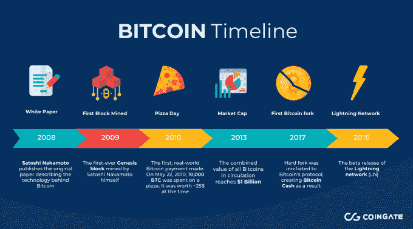
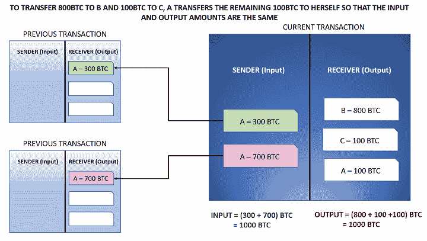
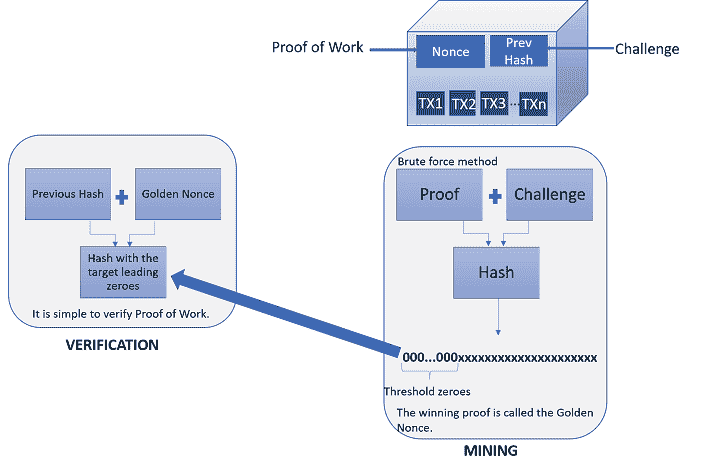
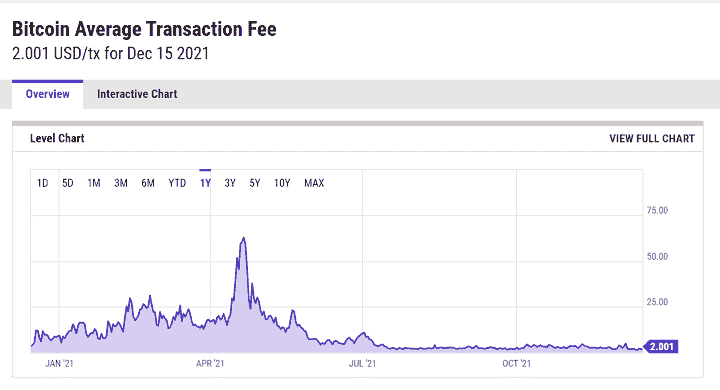
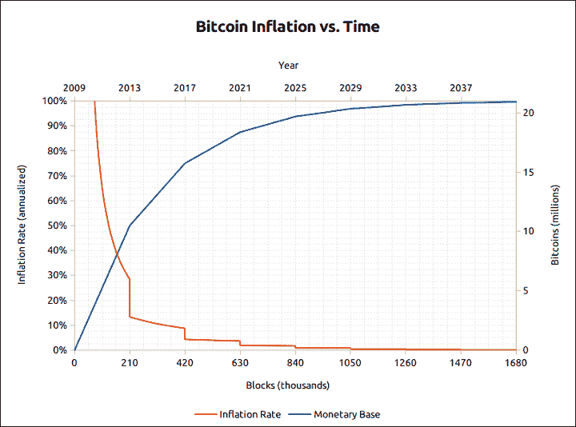

# 比特币区块链:组件、采矿、通货膨胀和算法交易

> 原文：<https://blog.quantinsti.com/bitcoin-blockchain/>

由[乌迪莎·阿洛克](http://www.linkedin.com/in/udisha-alok)

在之前的博客中，我们探索了[区块链](/blockchain/)技术及其各种组件。现在，我们进一步研究这项技术的一个具体应用，这可能是最广为人知的——比特币。比特币区块链让每个人都迷上了这项技术。

我们将讨论比特币区块链的组成部分、交易比特币的不同交易所，并看看 Python 中的比特币交易策略。所以事不宜迟，我们开始吧！

我们将讨论以下主题:

*   [比特币，第一个区块链](#bitcoin-the-first-blockchain)
*   [比特币组件](#bitcoin-components)
*   [比特币挖矿和工作证明](#bitcoin-mining-and-proof-of-work)
*   [交易费用](#transaction-fee)
*   [比特币和通货膨胀](#bitcoin-and-inflation)
*   [使用交叉策略交易比特币](#trading-bitcoin-using-a-crossover-strategy)

* * *

## 比特币，第一个区块链

很久以前，在一个由金融机构统治的由纸张、塑料货币和硬币组成的不可信的世界里，一个名叫比特币的区块链诞生了。它发誓要把世界从中央权力人物的魔掌中解放出来，并使它成为一个没有信任的世界，在这里我们可以与陌生人进行交易，而不需要任何信任。

比特币是最受欢迎的数字货币，由神秘人中本聪在 2008 年创造，但它不是第一种。Ecash 由 David Chaum 于 1983 年创建，而 [hashcash](http://www.hashcash.org/papers/hashcash.pdf) 由 Adam Back 于 1997 年提出，旨在基于工作验证方案来对抗垃圾邮件。

在 2004 年，Hal Finney 进一步将 hashcash 开发成了一个可重用的工作证明( [RPOW](https://nakamotoinstitute.org/finney/rpow/) )，这是第一个允许全世界的用户实时验证其正确性和完整性的服务器的公共实现。

尼克·萨伯(2005 年)提出的分布式加密货币[比特黄金](https://nakamotoinstitute.org/bit-gold/)和韦迪(1998 年)提出的 [b 货币](https://nakamotoinstitute.org/b-money/)的早期提议激发了比特币的诞生。其余的，正如他们所说，都是历史了。

今天存在现代形式的比特币区块链，正是这些事件造就了它现在的形式。

Bitcoin Timeline - [Source](https://wp-blog-assets.coingate.com/2019/03/Mobile3-680x378.png)

* * *

## 比特币组件

### 共享分类账

比特币区块链包含一种非常特殊的数据——关于谁向谁支付了多少钱的简单交易数据。但是，数据是以比特币的方式存储的，交易输入中的比特币数量等于其输出中的比特币数量。

每个输入指的是前一次交易，其中该交易的发送者接收硬币。因此，每次输入都将涉及跟踪每个比特币的早期交易。这个模型被称为 UTXO(未用完的事务输出)模型。

让我们使用这个简化的图表来看看 UTXO 模型是如何工作的:

Simplified Bitcoin UTXO model

在一些交易中，硬币是由系统生成(“挖掘”)的。这些交易被称为比特币基地交易，他们不会参考任何以前的交易，因为在这种情况下，硬币是凭空出现的。

每个块将有一个 coinbase 事务，它将有一个空白的“输入”。通常，每个块中的第一个事务是为 coinbase 事务保留的。

### 节点

比特币是公共区块链。这意味着任何人都可以加入比特币网络，查看整个比特币区块链。这些节点中的一些可以通过竞争“挖掘”块来进行“挖掘”以获得奖励。

### 共识算法

正如我们在之前的[博客](/blockchain/)中所讨论的，共识算法只是一个群体的决策机制。由于比特币区块链是一个拥有最多节点的公共区块链，一个共识算法变得至关重要。

这主要是为了解决以下问题:

*   防止恶意攻击
*   解决重复支出的问题
*   决定哪个节点将把下一个块添加到链中
*   确保区块链的完整性和一致性

比特币使用的共识协议是工作证明(POW)。简而言之，为了给区块链添加一个块，所有节点都要竞争解决一个密码难题。这个难题计算量很大，要花很多精力去解决它。

所以所有的节点都必须“工作”。这使得攻击者很难模仿多个节点，因为设置另一个挖掘节点的成本相当高。

解决密码难题的第一个节点可以将下一个块添加到链中，因为它显示“答案”作为其工作证明，并获得一些比特币的奖励(coinbase 交易)。在由于两个节点同时挖掘一个块而创建链的两个版本的情况下，最长的链被选为有效链。

有趣的是，中本聪开采出第一个比特币区块，奖励 50 个比特币，哈尔·芬尼(RPOW 的发明者)成为中本聪第一笔 10 个比特币的比特币交易的接受者。

Bitcoin Mining - [Source](https://static.seekingalpha.com/uploads/2021/2/25/584353-16142701594586146_origin.png)

* * *

## 比特币挖矿和工作证明

工作验证(PoW)算法设计为每 10 分钟开采一个区块。为了保证这个时限，网络为拼图设置了难度等级。

通过为块的最终散列设置目标来设置难度级别。在比特币的例子中，这意味着在块的最终散列中指定前导零的数量。

现在，每个节点都有前一个事务块和当前事务块的散列。他们需要计算 nonce(一个只使用一次的数字)，当与上述值结合时，它会生成一个带有给定数量的前导零的散列。

Simplified Proof-of-Work diagram

当一个前导零被添加到目标散列时，工作加倍，增加了问题的难度。比特币网络会自动配置问题，这样挖掘每个区块大约需要 10 分钟。

第一个找到有效随机数(黄金随机数)的矿工被奖励，随机数被广播到网络进行验证。验证后，该块被添加到比特币区块链中。

开采一个区块是一项计算量很大的工作，所以有时一群矿工会聚在一起，组成一个矿池，以增加他们开采一个区块的机会。

* * *

## 交易费用

当矿工开采一个区块时，他们会得到奖励。他们还获得交易费，这是所有交易的交易费总和。交易费激励采矿者继续通过采矿区块处理交易。否则，由于采矿成本高，他们可能不会继续开采这些区块。

在比特币网络中，并不强制要求矿商按照先到先得的原则进行交易。因此，矿工可以自由选择他们想要添加到区块中的交易。

一个块只能容纳有限数量的事务——每个块大小都有 1MB 的软限制。较高的交易费用将使交易对矿商更具吸引力。因此，与交易费用较低的区块相比，交易费用较高的区块更容易被开采并加入区块链。

请注意，交易只有在添加到区块链后才有效。你可以把它看作是一个简单的资金转移交易，除非银行确认，否则它仍处于处理阶段。

比特币交易费用取决于网络流量。如果越来越多的人使用区块链，需要确认的交易数量就会上升，从而推高交易费用。

比特币交易费用取决于网络流量。如果有更多的人使用区块链，需要确认的交易数量就会上升，从而推高交易费用。

Bitcoin Average Transaction Fee - [Source](https://ycharts.com/indicators/bitcoin_average_transaction_fee)

* * *

## 比特币和通货膨胀

中本聪将比特币设计成一种通货紧缩的加密货币。这背后的逻辑是，随着越来越多的货币不断被央行和政府添加到系统中，法定货币的供应是无限的，导致货币价值随着时间的推移而下降。这就是通货膨胀。

为了应对这一点，中本聪将创造的比特币总数限制在 2100 万个。因此，像黄金一样，比特币的供应将随着时间的推移而减少，因此变得更加稀缺，从而提高其价格。

每开采 21 万个区块后，区块奖励减半，直到 2140 年几乎为零。目前是每块 6.25 个硬币。随着大宗报酬不断减少，交易费可能是矿商的主要激励。

Bitcoin Inflation vs Time - [Source](https://www.bitcoinblockhalf.cimg/bitcoin-inflation-chart.png)

* * *

## 使用交叉策略交易比特币

由于加密货币受欢迎程度的上升，比特币在许多交易所进行交易。一些分散的交流甚至允许用户保持匿名，不要求他们透露任何个人信息。

比特币交易的一些顶级交易所包括:

*   币安
*   比特币基地交易所
*   FTX
*   Crypto.com 交易所
*   北海巨妖
*   库科恩
*   双子星座

比特币是一个波动的市场，永远有动力。在这样的市场中尝试基于动量的策略是有意义的。

我们将使用[超棒的振荡器](https://www.tradingview.com/scripts/awesomeoscillator/) (AO)技术指标为比特币建立一个[基于动量的交易策略](https://quantra.quantinsti.com/course/momentum-trading-strategies)。AO 计算短期(通常为 5)和长期(通常为 34)简单移动平均线之间的差异。

这个 SMA 是用每根棒线的中点而不是收盘价计算的。以下是该策略的代码: