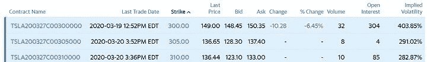

# Black Scholes 模型:公式、限制、Python 实现

> 原文：<https://blog.quantinsti.com/black-scholes-model/>

以[重香重香](https://www.linkedin.com/in/rekhit/)

布莱克·斯科尔斯模型！这个世界上有几个让世界瞩目的榜样，这是其中之一。如果我必须用简单的术语来解释，布莱克-斯科尔斯模型帮助我们找到了期权的价格，准确地说是欧式期权。如果您想了解或更新关于期权的知识，请查阅期权基础知识一文。但是为什么知道期权的价格如此重要呢？

这里举个例子。截至 3 月 21 日，特斯拉股价为 427.53 美元。现在，如果我们检查雅虎财经上的期权数据，你会发现许多期权以各种执行价格进行交易。现在让我们放大其中的三个。请注意，这些期权将于 2020 年 3 月 27 日到期。



Tesla


现在，有三种不同的执行价格，300 美元，305 美元，310 美元，期权价格分别为 149 美元，128 美元，123 美元。

你一定已经对某个策略进行了回溯测试，以预测 3 月份特斯拉的股价，所以你应该在哪个价格买入期权，以实现收益最大化。

这正是布莱克-斯科尔斯模型帮助你的地方。费希尔·布莱克和迈伦·斯克尔斯为这个模型奠定了基础，后来罗伯特·默顿对这个模型进行了研究，给出了现在在全世界流行的方程式。

让我们先来看一下本文涉及的要点:

*   [布莱克·斯科尔斯模型的假设](#assumptions-of-the-black-scholes-model)
*   [布莱克·斯科尔斯公式](#black-scholes-formula)
*   [蟒蛇皮中的黑色斯科尔斯](#black-scholes-in-python)
*   [限制](#limitations)
*   [战胜 BSM 的变种](#variants-to-overcome-bsm)

## 布莱克-斯科尔斯模型的假设

虽然 Black Scholes 模型可以简化为一个方程，但为了简化它还是做了很多牺牲。有些是为了降低复杂性，例如，假设股票不支付股息。这有助于减少寻找期权最优价格的计算。

但请记住，这并不意味着这是一个限制，并将排除所有在我们计算期权价格期间支付股息的股票。在我们用布莱克-斯科尔斯模型计算出期权价格后，我们总是可以把股息计算在内。

因此，现在让我们来看看这些假设。

### 恒定的无风险回报率

影响期权价格的因素之一是无风险收益率。我们的假设是，从我们购买期权开始到到期日，无风险回报将保持不变。它还假设你可以用这个利率轻松地借贷。这很重要的原因是，如果你发现所有的东西都保持不变，如果期权的回报率等于无风险利率，那么人们会选择无风险资产而不是期权。

### 风险资产价格的对数收益是随机游走的

在这里，我们假设市场是有效的，市场有一个漂移，这是增加，并遵循几何布朗运动。这表明，虽然我们无法准确预测标的资产的价格，但我们可以计算其预期回报。

### 不考虑股息

我们假设股票不支付任何股息，因此它的价值只取决于它的价格。

### 没有套利机会

如果我们看到期权和标的资产存在套利机会，我们会立即利用这一优势，而不必担心期权价格。因此，我们假设不存在套利机会。

### 对基础风险资产的买卖没有限制

我们假设我们可以买卖任何数量的基础资产来最大化我们的收益。以这种方式，我们不必担心我们被允许的事务数量的上限。

### 没有交易成本

很简单，这个模型没有考虑经纪费、佣金、借款费用或我们在交易期权时可能发生的任何其他交易成本。因此，当我们评估不同的选项时，我们必须小心考虑它们。

太好了！现在我们已经讨论了模型的假设，让我们进入问题的核心，即布莱克-斯科尔斯方程。

## 布莱克·斯科尔斯公式

在我们陈述公式之前，让我们试着了解一下影响期权价格的因素。现在，由于布莱克·斯科尔斯模型的假设，我们不必担心股票股息和浮动利率等复杂的细节。在推导期权价格时。但是什么会影响期权价格呢？

首先显然是基础资产的价格。进一步说，我们还想知道如果价格上涨或上涨到期权到期日会发生什么。

这就是预期回报率的来源。

与此同时，我们还必须考虑金钱的时间价值。简单来说，现在的 100 美元比一年后的 100 美元更有价值，因为你可以把这 100 美元存入银行，一年后获得一些利息。

让我们就此展开讨论。假设你可以在银行获得 4%的利率。因此，一年后，它将是 100 美元+(4/100)*(100)= 104 美元。你可以把它以公式的形式表示为(你的数量)*(1 + i%)。现在，如果你认为你将在一年内得到 104 美元，那么你只需要用它除以(1+i%)就可以得到它的现值。我们称之为贴现因子。在这种情况下，我是你能得到的利息。

就本文而言，我们不会深入探讨它的本质，但当涉及布莱克-斯科尔斯模型时，贴现因子是(e-rT)。

好吧！到目前为止，我们已经意识到期权价格会受到基础资产价格的影响。到期时间以及执行价格，即执行价格。

我们还必须考虑基础资产的波动性。为什么这很重要？

假设有两只股票，A 和 b。如果你买的是欧式看涨期权，你会关心价格在到期时能走多远，高于或低于执行价格。这可以通过找到波动率，即对数正态回报的标准差来推断。

现在让我们把它们列出来。

*   S =股票价格
*   N() =累积标准正态分布
*   K =期权的执行价格
*   t =期权到期前的时间
*   r =无风险利率
*   e=指数项，即 2.7183
*   C=期权价格

为了简单起见，我们认为基础资产是股票，股票期权是欧式看涨期权。我们使用欧式看涨期权的原因是该期权只能在到期时行使，而不能在到期前行使。

现在我们可以转到实际的公式，看起来像这样。

$$C = S*N(d_1) - K*e^{-rt}*N(d_2)$$

那么 d <sub>1</sub> 和 d <sub>2</sub> 是什么呢？

在我试图解释它之前，让我先列出这些价值。因此，

$$d_1 = \frac{ln \frac{S}{K}+(r + \frac{s^2}{2})t}{s {\sqrt t}}$$

和

$$d_1 = \frac{ln \frac{S}{K}+(r - \frac{s^2}{2})t}{s {\sqrt t}}$$

其中，s =对数回报的标准偏差

ln =自然对数

虽然这些术语的实际推导有些冗长，并且需要深入研究统计数据，但我们可以看到，我们使用的是相同的术语，更重要的是，我们采用的是股票价格和行权价格之比的自然对数。

回到主公式，我们实际上可以把它分成两部分:

第一部分，S*N(d <sub>1</sub> )是你得到的，即如果我们决定行使购买股票的权利，你得到的标的股票。

第二部分，K*e <sup>(-rt)</sup> *N(d <sub>2</sub> )是你得到那个期权要付出的。因此，行使价格，即 K 乘以贴现因子 e(-rt)，因为这是我们可以投资于无风险资产而不是购买期权的金额。

累积标准正态分布函数，即 N()给出了期望值的概率值。把它想象成一个介于 0 和 1 之间的概率值。因此，你现在应该明白为什么我们要从等式的第一部分减去第二部分来得到期权价格。

这就是期权定价模型的全部内容。你可以简单地把这些值代入等式，然后求出期权价格。并且根据不同的[期权交易策略](https://quantra.quantinsti.com/course/options-trading-strategies-python-intermediate)，可以为自己打造一个风险中性的投资组合。

好吧，等一下。当然，我们可以得到所有变量的值，但是波动性呢？你如何衡量标的资产的波动性？

嗯，你想到的第一个想法是正确的，我们查找历史价格，计算它们的对数正常回报，很容易找到波动性。然后，我们假设历史波动率将或多或少地类似于未来波动率，从而计算期权价格。

但是，还有另一种方法，这似乎是一条捷径。你看，如果你检查任何股票的期权数据，你会发现它们有十几种不同的执行价格，期权价格等。现在，我们可以使用市场认为是正确价格的期权价格，并将其作为布莱克-斯科尔斯方程中的“C ”,来计算波动率。这被称为隐含波动率。你可以看看这篇深入探讨这个概念的文章。

厉害！我们已经了解了 Black Scholes 方程如何适用于欧式看涨期权。现在让我们看看我们能否用 Python 实现这一点。

## 蟒蛇皮黑色运动鞋

如果想用 python 查找当前期权数据，可以用雅虎财经模块提取某公司的相关[期权数据](https://aroussi.com/post/download-options-data)。

```py
import yfinance as yf # Import yahoo finance module
tesla = yf.Ticker("TSLA") # Passing Tesla Inc. ticker

opt = tesla.option_chain('2022-06-17') #retreiving option chains data for 17 June 2022

```

要查看选项调用，您将输入以下代码:

```py
opt.calls
```

类似地，对于看跌期权，您可以使用以下代码:

```py
opt.puts
```

现在，我们也许可以用 Python 编写几行代码来实现这个公式，但是 Python 的伟大之处在于它对库的广泛使用。因此，我们有了 python 库， [mibian](http://code.mibian.net/) ，这使得推断期权价格变得极其容易。

python 代码很简单:

```py
BS([underlyingPrice, strikePrice, interestRate, daysToExpiration], volatility=x, callPrice=y, putPrice=z)
```

BS 函数的语法，输入为波动率以及存储基础价格、执行价格、利率和到期日的列表:

```py
c = mibian.BS([427.53, 300, 0.25, 4], volatility=60)
```

这里，我们以特斯拉为例，输入基础价格为 427.53 美元，行使或执行价格为 300 美元，无风险利率为 0.25%，到期日为 4 天。

我们把波动性数字定为 60%。

现在，如果我们需要找到特斯拉的期权看涨价格，我们只需写出以下内容:

```py
c.callPrice
```

输出是:

127.19748126

你怎么想呢?布莱克·斯科尔斯模型对吗？你为什么不试着找到另一只股票的期权看涨价格，并在评论中留下细节。

好吧！我们已经研究了这个公式以及它在 Python 中的实现。现在我们进入下一个话题，即模型的局限性。

## 限制

在我们列出 Black Scholes 模型的局限性之前，我们必须明白，这个模型的创建者在建立一个工作模型之前必须牺牲一些东西。说到这里，让我们列出限制条件:

*   波动性和无风险回报率被假定为常数，即使它在现实中是动态的。
*   股票价格被假设为随机波动，因此，由于某些因素(如收益报告、合并和收购)导致的大幅度价格波动不包含在模型中。
*   如果股票在我们计算期权价格期间支付股息，模型没有考虑股息，因此没有正确地为期权定价。
*   虽然价内和价外期权的定价是准确的，但当涉及到价外期权的定价时，它往往会大幅偏离。
*   虽然其他因素是直接观察和计算的，但波动性必须进行估计，因此可能导致不同的期权价格。

好了，我们已经了解了模型的局限性，但是有没有克服这些局限性的方法呢？或者更有效的模式。让我们在下一节看到这一点。

## 克服 BSM 的变种

布莱克-斯科尔斯模型的一个较好的替代模型是期权定价的赫斯顿模型。这个模型假设波动性不是恒定的，而是任意的。它还允许波动率均值回归，这比布莱克-斯科尔斯模型更接近真实情况。

虽然赫斯顿的模型本身值得一篇文章，但我将列出下面的等式。

$$dS = μS dt +{\sqrt v_t} S * dW_t^S$$

这里，

V <sub>t</sub> 是瞬时方差。

而且，

$$dv_t = k(θ-v_t ) dt +ξ{\sqrt v_t} * dW_t^v$$

这里，

*   ξ是波动率的波动率
*   k 是 vt 返回到 0 的速率
*   θ是长期价格差异
*   w 是 Weiner 过程，假设它是连续的随机游动

这看起来确实令人望而生畏，但它比布莱克-斯科尔斯定价模型更有效。

好吧。我们研究了布莱克·斯科尔斯模型的一个替代方案。

## 结论

布莱克·斯科尔斯模型是期权界的一个转折点，期权界终于有了建立期权投资组合的数学基础。布莱克-斯科尔斯模型也产生了许多期权对冲策略，这些策略至今仍在实施。

在本文中，我们讨论了布莱克-斯科尔斯模型的意义和公式。我们还学习了 Black Scholes 模型的 python 代码，以及如何用它来计算欧式期权的买入价格。您可以通过启动 Quantra 上的[期权交易学习轨道](https://quantra.quantinsti.com/learning-track/quantitative-approach-in-options-trading)开始交易，尝试自己的期权交易策略。

*<small>免责声明:本文提供的所有数据和信息仅供参考。QuantInsti 对本文中任何信息的准确性、完整性、现时性、适用性或有效性不做任何陈述，也不对这些信息中的任何错误、遗漏或延迟或因其显示或使用而导致的任何损失、伤害或损害承担任何责任。所有信息均按原样提供。</small>T3】*