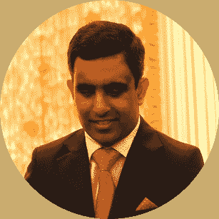

# 失明不能阻止普拉纳夫对算法交易的追求

> 原文：<https://blog.quantinsti.com/blindness-algorithmic-trading-epat-success-story-pranav-lal/>

没有视力的人可以交易吗？
*有人看不见可以学习 Algo 交易吗？*
如果我们告诉你这些问题的答案是一个响亮的是，会怎么样？

确实如此。Pranav Lal 的鼓舞人心的旅程结合了创新、卓越、勇气和永不放弃的态度。普拉纳夫天生失明，但他克服挑战和打破所有障碍的决心帮助他通过追求 EPAT 学会了算法交易，并获得了 EPAT 优秀证书。

作为一名摄影师、技术爱好者和作家，Pranav 已经取得了里程碑式的成就。他是一名 TedX 演讲者，被印度主要报纸之一《印度斯坦时报》的一篇文章特写，并接受过金特等著名媒体渠道的采访。

Pranav 毕业于商业专业，并获得了经济学、法律和会计学的荣誉，他还拥有工商管理硕士学位和 CISSP 证书。他在电信、商业解决方案、咨询服务等不同领域的工作经验融入了他 20 多年的职业生涯。这是普拉纳夫的故事。

* * *

## 你好，普拉纳夫，给我们介绍一下你自己吧！

[https://www.youtube.com/embed/XGJzz6Sjfp8?rel=0](https://www.youtube.com/embed/XGJzz6Sjfp8?rel=0)

我是[普拉纳夫拉尔](https://www.linkedin.com/in/pranavlal/)。我是安永会计师事务所的经理。我是一名自学成才的程序员，拥有工商管理硕士学位，并获得了德里大学的 BCom 荣誉学位。

我是盲人，这意味着我不能从视觉上感知事物。我出生在科威特，早产三个月，出生时失明。我的父母对我今天的成功起了至关重要的作用。

小时候，在父母的鼓励和帮助下，我上了正规学校，这使我在教育上获得了独立。我至少可以做笔记，做记录。我父母把我的书转录成电子格式。

我喜欢写作，我有自己的博客，只要时间允许，我喜欢摄影，我对技术充满热情。虽然我对金融感兴趣，但我从未想过有可能成为一名交易员，更不用说学习算法交易了。但是，今天有了 EPAT，这一切都成为可能。

* * *

## 你是一个 TEDx 演讲者，你已经使用了许多技术来帮助你看世界。你能分享一下吗？

[https://www.youtube.com/embed/Hjhx1sjQRoM?rel=0](https://www.youtube.com/embed/Hjhx1sjQRoM?rel=0)

2000 年前后，我进入了一所商学院，我们意识到，我最初在家里的电脑上记录笔记和抄写笔记的系统是行不通的。这是因为 B 校流动性很大，你要做很多独立的工作。

所以，我买了一台笔记本电脑，发现了一个名为“T0”vOICe 的软件，它是由 Peter B.L. Meijer 博士开发的，当时他在荷兰的 Phillips 工作。这非常有帮助，因为它为我打开了一个充满能力的世界，这是由技术赋予的。

为了实现捕捉视觉世界的愿望，我将一个免费的网络摄像头与声音结合起来，你瞧，当我移动摄像头时，声音发生了变化。它使我能够“看见”。该软件将图像转换成一组确定的声音，你必须戴上耳机才能获得最佳体验。你的大脑对此进行解码，并找出你在看什么。

这需要相当多的练习。这些声音和视觉场景现在有点复杂，我没有全天候佩戴硬件。虽然我能够在一定程度上观察事物，但在一些情况下，很难确定我在看什么。这个声音给了我一种弱视的感觉。

我必须找到某种方式与世界分享我所看到的，这就是摄影发生的原因。摄影最终让我把博客作为分享我的摄影和生活经历的一种方式。

* * *

## 你会如何用语言表达你这些年的旅程？

[https://www.youtube.com/embed/0NoMOsk6rHg?rel=0](https://www.youtube.com/embed/0NoMOsk6rHg?rel=0)

我有兴趣在科学和工程专业毕业，但当时的学术/机构规则不允许没有视力的人正式从事工程。

我也发现商业和贸易很有意思，所以我在德里大学攻读了商业学士学位，之后又攻读了工商管理硕士学位。我在一家教育公司找到了一份工作，然后被一家信息安全初创公司录用，接着去了电信部门。我在这些地方跨多个项目工作，获得了很多乐趣。

基于我的身体特征，我经常被定型，我意识到一份工作只能带我走这么远。我想独立。我仍然想成为。那是我 2011 年看交易的时候。我从未梦想过从事金融业。我意识到一份工作只能带我走这么远，金融可能是我应该追求的。

每个人都习惯于看图表，试图弄清楚什么是什么。人们可以用图表交易，但对我来说，这是一个非常乏味的过程。我不得不抓取一个 csv 文件，获取股票价格，将它加载到绘图引擎中，**听到**图表或者跟随烛台模式，然后做出决定。这不是一个很有希望的开始。

后来，在我父亲的帮助下，我开始探索各种媒介，并且明白了也可以通过算法进行交易。随着我探索的深入，我看到了 QuantInsti 的博客和课程。

我就是这样发现 QuantInsti 和 algo 交易的。我很惊讶地发现有人教这些东西。你的内容、课程和教学大纲很有意义，足以证明我可以去 EPAT 深造。

* * *

## 没有视觉，你可以使用一些技巧来解读屏幕。你能分享一下吗？

[https://www.youtube.com/embed/gvMvkCVUkZs?rel=0](https://www.youtube.com/embed/gvMvkCVUkZs?rel=0)

如果您有视觉障碍，我已经使用并建议您使用以下工具。

盲人使用一种叫做屏幕阅读器的软件。它们处理系统事件，大量的程序间通信被监控，等等，然后它在屏幕上输出正在发生的事情。简而言之，它描述了出现在计算机屏幕上的东西。

*   我用的是非视觉桌面访问，NVDA，这是一个窗口屏幕阅读器。
*   你有适用于 Linux 的 Orca。
*   Windows 的默认讲述人。
*   安卓对讲。
*   IOS 版的画外音等等。

有许多制图软件和网站，但你不必在 algo 交易中费心。您只需要一个漂亮的命令行、Python 代码和 C 代码，就可以让整个事情变得非常简单。当谈到算法交易时，这是另一个非常有吸引力的因素。不过，algo 交易最棒的地方在于，你在建立自己的平台。

我一直意识到，至少对我来说，最好的前进道路是拥抱技术。当这导致更多的自动化时，那真是太好了。没有比这更好的了。

* * *

## 你的一天是什么样的？

[https://www.youtube.com/embed/in93k5gIS_8?rel=0](https://www.youtube.com/embed/in93k5gIS_8?rel=0)

我在晚上进行所有的研究。第二天早上 5 点到 6 点，我做最后的检查和测试。然后，我简单地让系统运行，算法做他们的工作。

我非常喜欢 Linux 中的 at 命令，它让我可以安排这些一次性的工作。目前，它是低频交易，在适当的时间进行 2 或 3 次交易。差不多就是这样，但想法是在一段时间内提升到高频交易。

其次是我每天的锻炼，到了早上 9 点，我就在工作了。一旦我离开办公室，我会看看我的日志和评论。

我是一个早起的人，所以在周末，我尽可能早地投入 2-3 个小时认真的开发工作。我的哲学是“早点开始，早点结束，然后剩下的时间就是你的了。”

* * *

## 你积极使用机器学习，它帮助你更好地理解市场——你是如何让它成为可能的？

[https://www.youtube.com/embed/IzGHGjKcYPg?rel=0](https://www.youtube.com/embed/IzGHGjKcYPg?rel=0)

对我来说，市场研究本质上意味着，目前，简单地对股票和回溯测试策略运行机器学习模型。基于我得到的信号。我建立了一个市场的图像。我不关注新闻，就像俏皮的上下波动会因为这个或那个新闻而发生。我更感兴趣的是我的系统现在告诉我什么。

根据我的回溯测试结果，我决定买什么。一周有五天，我会去买股票，现在我正致力于进一步自动化。

我仍在研究何时销售的理想方法。’，其中有各种方法。我正在使用机器学习，因此我仍然在使用 Nifty 50，因为你可以在它上面获得最大数量的历史数据。它可以追溯到很久很久以前。

我现在还没有跳上基于新闻的交易潮流。我可能会在未来这样做，但目前我坚持价格行动，以及数字告诉我的。在编写我的软件时，我尽最大努力确保我已经输入了程序告诉我的条件——“*这是横盘，还是看涨，还是看跌，或者是怎么回事？*”。当然，我必须调整我的时间频率。时机是一个重要因素。

* * *

## 你在学习和交易中面临什么挑战？

我过去经常听 BBC，这让我对科学产生了兴趣，然而，90 年代早期的教育体系不利于我追求科学教育。我逐渐对商业产生了兴趣。

对于视力有障碍的人来说，更大的挑战是弄清楚你的住宿条件，他们是否会给你一个书写器用于考试，或者你必须得到你的书写器，等等。

尽管情况有所好转，但这仍然是一场艰苦的战斗，因为各种竞争性考试并不迎合残疾人。一些学校和大学的考试可以在电脑上进行，但许多竞争性的入学考试却不是这样。

自从我学会了编程，编码策略就不那么有挑战性了。我查阅了各种交易图表来熟悉自己。我学习了各种交易策略，现在我明白了它们到底是怎么回事。

[https://www.youtube.com/embed/_Ad0vxMx8_4?rel=0](https://www.youtube.com/embed/_Ad0vxMx8_4?rel=0)

EPAT 教职员和支持团队摇滚！

*   直接接触教职员工有助于你与教职员工进行一对一的接触，并帮助你消除所有疑虑。全体教师知识渊博、技能娴熟、经验丰富，并拥有该领域的专业知识。
*   在课程期间和课程结束后，你会得到一流的支持。如果我需要什么，支持只是一个聊天框。

即使在我的 EPAT 之旅结束后，QuantInsti 也没有放弃。QuantInsti 的终身交往承诺是真实的。我仍然得到校友组织的支持。如果没有这种支持，我会非常艰难。

* * *

## 你是通过 Prometric 进行的 EPAT 期末考试的最高分之一，你的秘诀是什么？

[https://www.youtube.com/embed/LOACaXsARvI?rel=0](https://www.youtube.com/embed/LOACaXsARvI?rel=0)

完成 EPAT 交易或成为一名成功的交易者没有秘密。你只需要做那些作业，练习编码，你必须完成这个项目。除非你做这个项目，否则你不能从课程中获得最大的价值。

因为这个项目是你学以致用的地方然后你可以在几乎每节课后继续申请，当然，这取决于你在做什么项目。

我的交易哲学是"*永不放弃！*”。但有时候，你得退后一步，盯着场上，而不是主动交易。

算法交易最棒的部分是计算机在为你做数学运算。你只需要知道它是如何工作的，它做什么。这不像在学校，你必须知道如何计算。即使你不得不自己计算一些东西，这也是一次性的工作，你只需要编码，保存它，你可以一次又一次地重复使用代码。

* * *

## 你最喜欢 EPAT 的哪个特色？

[https://www.youtube.com/embed/x8cfn4YVBic?rel=0](https://www.youtube.com/embed/x8cfn4YVBic?rel=0)

毫无疑问，EPAT 是一个非常激烈的过程。如果你和家人住在一起，除了全职工作之外还在周末学习，有时会很有挑战性。但是，只要你有正确的决心，EPAT 将帮助你用正确的方法学习，为现在和未来做好准备。

在我看来，EPAT 最大的特点是:

*   现场直播和录音讲座——EPAT 最棒的地方在于，你可以随时收听录音。这很重要。
*   **项目** -虽然我知道 QuantInsti 没有将项目工作作为认证的强制要求，但我强烈建议每个人都去做可选的项目工作，并充分利用 EPAT。
*   **解疑**——当你坐下来申请时，你说“哦！我该如何获得调整后的价格？”，“我不一定想依赖雅虎金融。我该怎么办？”，以及其他微小的东西。细节决定成败，而这正是你需要支持的地方，QuantInsti 在这段旅程中总能为你提供支持。
*   到目前为止，我还没有使用过这个位置，但我很高兴参与者和校友都可以使用它，所以我可以在需要的时候使用它。

* * *

## 你对未来有什么计划？

[https://www.youtube.com/embed/HekRa-vlgcU?rel=0](https://www.youtube.com/embed/HekRa-vlgcU?rel=0)

我必须结合我的三个爱好——“信息安全、交易和写作”。这是我必须弄清楚的事情。

更多的自动化肯定是可能的。现在，我手动购物，我想自动化整个购物过程本身。

随着我对交易的追求，我渴望建立我的交易平台。我希望进入衍生产品领域，即现金领域，产生稳定的现金流和盈利能力。这些基本要素仍然需要到位。

我希望经常旅行，这意味着要拍很多照片。接下来，我希望写更多我的经历。

* * *

## 你对那些想学习算法交易的人有什么话要说？

[https://www.youtube.com/embed/PiqXnrf6tNw?rel=0](https://www.youtube.com/embed/PiqXnrf6tNw?rel=0)

我想分享以下我所经历的，我觉得对那些希望成为这个不可思议的领域的一部分的人有益的事情。

**开始时可以接受免费数据**

现在有很多 API 和数据提供者，他们给你数据。即使不完美，从免费数据开始也很好。

**不要被编程吓倒**

编程相当简单。你所要做的就是把一个问题分解成简单的任务——这是你在任何情况下都要做的事情。学习编程语言没什么难的，和学习任何语言没什么不同。

**远离主流媒体**

当你进行算法交易时，你要相信你在模型中使用的数学和统计数据。不要沉迷于看我们受欢迎的电视频道，看图表，然后做决定。这就像驾驶飞机——看看你的仪器告诉你什么，然后不管你从输入和你的经验中学到了什么，做出相应的决定。

**给自己一点时间，它不会马上到来**

你不可能在 6 个月内成为一名医生。还有很多方面我不明白。你得给它一些集中的注意力。重要的是，学习是一生的旅程，每个人都会有不同的旅程。只要继续努力，拥抱高潮和低谷，不要让它们打断你的学习之旅。

**努力增加你的知识**

我是一个自学成才的程序员，这对我帮助很大。我在工作场所学习网络，所以我不需要任何帮助来建立我的培训基础设施。虽然我现在没有阅读资产负债表，但这是我学到的东西，今天，至少我明白了各种业务是如何运作的。

**你可以从头开始应用你的知识**

不管你受过什么教育，你都必须运用基本原则。只要你能跨领域综合知识，你就很好。你可以从头开始做算法交易。你付出了努力，因为你将学习编程和在市场中实现它的方法。

但是，如果你不知道如何编程，你将不得不投入更多的工作，当然，所有需要的材料都可以在 QuantInsti 资源中获得，并且在 EPAT 计划中有很好的结构。

祝你一切顺利！

* * *

你对你的手艺的奉献令人难以置信。你的努力和决心鼓舞人心。老实说，普拉纳夫，你正在打破陈规，你是一个灵感。

取得这些成功后，你可能学到了很多，也做了很多实验。我们相信你在 EPAT 的经历会对你如何学习交易、学习各种技能以及如何应用这些技能产生积极的影响。

我们确信你将来会取得更大的成就。你不仅对视力和身体有障碍的人，而且对我们所有人都是一个活生生的激励。谢谢你抽出时间来分享你的经历，Pranav。

你可以在这里观看我们与 Pranav 的完整讨论:

[https://www.youtube.com/embed/8jgxA1ShRhE?rel=0](https://www.youtube.com/embed/8jgxA1ShRhE?rel=0)

如果你也对发展终身技能感兴趣，这些技能会帮助你提高交易策略。在这个 [algo 交易课程](https://www.quantinsti.com/epat)中，你将接受统计学&计量经济学、编程、机器学习和量化交易方法的培训，因此你精通每一项在量化&算法交易中出类拔萃所必需的技能。现在就了解更多关于 EPAT 的课程吧！

* * *

免责声明:为了帮助那些正在考虑从事算法和量化交易的人，这个成功的故事是根据 QuantInsti EPAT 项目的学生或校友的个人经历整理的。成功案例仅用于说明目的，不用于投资目的。EPAT 方案完成后取得的成果对所有人来说可能不尽相同。T3】