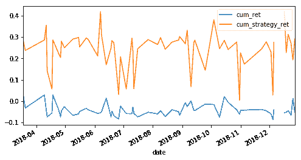
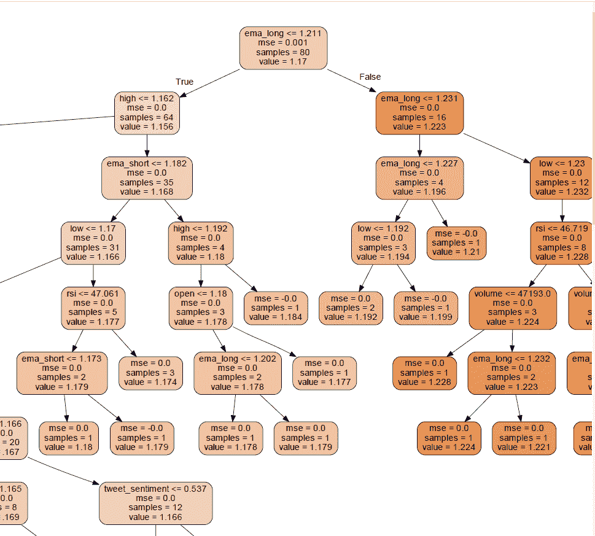
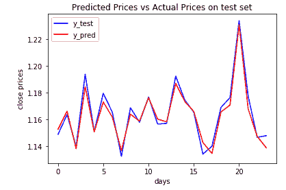
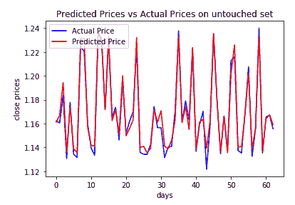

# 使用价格指标和情绪指标构建外汇交易的随机森林回归模型

> 原文：<https://blog.quantinsti.com/building-random-forest-regression-model-forex-project-christos/>

本文帮助您了解如何构建一个机器学习模型，该模型可以根据前几天的数据预测第二天的货币收盘价。

本项目中使用的完整数据文件和 python 代码也可以在本文末尾下载。

本文是作者提交的最后一个项目，作为他们在 QuantInsti 的算法交易管理课程( [EPAT](https://www.quantinsti.com/epat) )的一部分。请务必查看我们的[项目页面](/tag/epat-trading-projects/)，看看我们的学生正在构建什么。

* * *

## **关于作者**

克里斯特斯·克兰沃斯学过经济学、工商管理和信息学。他拥有 ICT 理学硕士学位以及 Udacity、Kaggle 和 Google 的多项编程和机器学习认证。克里斯特斯对人工智能、机器人、无人机和金融科技充满热情。

2019 年 7 月，他因成功完成 QuantInsti 提供的算法交易高管课程而获得卓越证书。他已经做了两年的独立外汇交易员，使用各种平台，如 MT4、EAs、QuantConnect、Blueshift 和 InteractiveBrokers。

目前，他住在希腊的约阿尼纳，教授教育机器人学，已婚，有一个孩子。

* * *

## **项目摘要**

该项目是关于建立一个机器学习模型，该模型可以根据前几天的 OHLC 数据、EMA、RSI、OBV 指标和 Twitter [情绪指标](https://quantra.quantinsti.com/course/trading-using-options-sentiment-indicators)预测第二天的货币收盘价。

它基于随机森林回归，因为它结合了树木的预测能力和避免过度拟合的好处。此外，情绪指标的引入平衡了技术分析的局限性，并从行为经济学领域提取信息。

* * *

## **简介**

我认为 ML 回归可以给出交易策略设置的见解，否则将保持隐藏，同时，它不是一个黑匣子，因为你可以评估预测并决定使用哪些。

此外，我每天交易外汇货币对，希望我可以用它来进行真正的交易。使用预测器、技术指标和情绪指标应用机器学习来预测趋势，以便创建一个考虑技术和基本面的更稳健的策略。

<u>已经采取了以下步骤</u>:

*   从可靠的外汇数据提供商获取数据。
*   下载 2 年的历史数据为 CSV 文件。
*   创建功能。
*   对问题使用随机森林模型。
*   使用交叉验证。
*   训练模型。
*   对考试进行预测。
*   根据测试和准确度分数，对预测值进行一些更改。
*   评估最终模型。

* * *

## **数据挖掘**

2 年期的欧元/美元外汇货币对。

来源:mt4 交易平台 2016-12-31 至 2018-12-31 的历史数据，每日时间段，共 524 个交易日。

* * *

## **数据分析**

TA - library 用来计算四个技术指标，均线空头和多头，RSI 和 OBV。

第二天的收盘价被用作预测目标。

GetOldTweets3 库用于获取 2016 年 12 月 31 日至 2018 年 12 月 31 日同一时期的历史推文，由于时间限制，最多 5000 条推文。

textblob 库用于获取情绪极性，数据使用每日时间范围重新采样用于平均值计算。

作为预测指标，使用了以下内容:['开盘'，'高'，'低'，'收盘'，'成交量'，'均线 _ 短'，'均线 _ 长'，'相对强弱'，' obv '，'推特 _ 情绪']

此外，我们利用了两个分裂的数据。第一组把数据分成一组训练测试和一组非训练测试。第二个交叉验证了 5 次训练集。

在初始未接触组上测试的模型的预测能力

* * *

## **主要发现**

通过使用 ML，特别是随机森林回归，使用价格数据、技术指标和情绪指标的组合作为预测器，可以构建一个相当有用的交易模型。

ML 通过找到交易的各种因素和组成部分的最佳组合来减轻交易者的负担。

从简单的买入并持有基准策略来看，多数时候 ML 策略的回报似乎更好。

**<u>注</u> :**

cum_ret:买入并持有

累积 _ 策略 _ 回报:策略回报

战略的夏普比率在回测的大部分时间里大约是 2。

**<u>一些指示性措施有</u> :**

模型得分= [0.96615782505226，0.9499368283378423，0.9793830955075918，0.946102298022616，0.9707968097158307]

预测值的重要性:[0.11186647 0.12960734 0.22891741 0.20857127 0.0023034 0.13688.1645709 0.01266

平均绝对误差:0 . 000 . 3686868668686

均方差:2.7342703703148714e-05

均方根误差:0 . 000 . 3686868686865

* * *

## **可视化模型的树**

(完整的树可以从下载中获得)

* * *

## **挑战**

以下是令人关切的主要问题:

*   Twitter 数据的收集存在问题。这 5000 条推文是 twitter API 限制、时间约束和本地计算能力之间的妥协。
*   因此，最终有用的数据量很少，无法得出可靠的结论。
*   将数据分为训练、测试、验证和样本外数据的需求进一步恶化了研究结果的统计价值。
*   很难在实时交易中训练和实现这一模型，因为我们一直需要不那么容易获得的 twitter 数据。

* * *

## **结论**

该模型具有在实际工程中应用的潜力。我们可以在下面看到训练集和未接触集的预测有多接近，并且它从基准测试中产生了更好的回报，具有令人满意的夏普比率。

当然，优化可以而且应该在上线之前完成，这包括均线周期、挑选最有用的预测指标、使用交叉等进一步的预测指标、缩放一些预测指标以及使用更深入的历史数据。

* * *

如果你想学习算法交易的各个方面，那就去看看算法交易(EPAT) 的[高管课程。该课程包括各种培训模块，让你具备在算法交易中建立一个有前途的职业生涯所需的技能。](https://www.quantinsti.com/epat/)

免责声明:就我们学生所知，本项目中的信息是真实和完整的。学生或 QuantInsti 不保证提供所有推荐。学生和 QuantInsti 否认与这些信息的使用有关的任何责任。本项目中提供的所有内容仅供参考，我们不保证通过使用该指南您将获得一定的利润。

**下载中的文件:**

*   Source.gv.pdf
*   Tweets.csv
*   Final _ Project _ 克里斯特斯 _Gklinavos_v6.html
*   Final _ Project _ 克里斯特斯 _Gklinavos_v6.ipynb
*   Forex.csv
*   Source.gv

* * *

**参考书目**

*   关于未来股票回报，单个期权波动率假笑告诉了我们什么？《金融与量化分析杂志》|剑桥核心
*   [Python 中的随机森林分类器(文章)- DataCamp](https://www.datacamp.com/community/tutorials/random-forests-classifier-python)
*   [决策森林回归- Azure 机器学习工作室|微软文档](https://docs.microsoft.com/en-us/azure/machine-learning/studio-module-reference/decision-forest-regression)
*   [(50) Azure 机器学习工作室:决策森林回归- YouTube](https://www.youtube.com/watch?v=5eiE_X6Yr7s)
*   [回归和张量流神经网络入门](https://medium.com/@rajatgupta310198/getting-started-with-neural-network-for-regression-and-tensorflow-58ad3bd75223)
*   [如何(不)使用机器学习进行时间序列预测:避免陷阱](https://towardsdatascience.com/how-not-to-use-machine-learning-for-time-series-forecasting-avoiding-the-pitfalls-19f9d7adf424)
*   [程序员实用深度学习，v3 | fast.ai 课程 v3](https://course.fast.ai/index.html)
*   [为什么随机森林不能预测趋势，如何克服这个问题？](https://medium.com/datadriveninvestor/why-wont-time-series-data-and-random-forests-work-very-well-together-3c9f7b271631)
*   [交易中的情绪分析用 R 解释](https://www.quantinsti.com/blog/sentiment-analysis-in-trading)
*   [利用自然语言处理交易商品](https://knect365.com/quantminds/article/ce6da282-1aad-484f-a0a2-cf704248c792/trading-commodities-using-natural-language-processing)
*   [利用 NLP 和深度学习预测股市](https://towardsdatascience.com/using-nlp-and-deep-learning-to-predict-the-stock-market-64eb9229e102)
*   [情绪分析——当商品交易遇上深度学习](http://www.datagenicgroup.com/sentiment-analysis-when-commodity-trading-meets-deep-learning/)
*   [机器学习交易模型中的交叉验证](https://www.quantinsti.com/blog/cross-validation-machine-learning-trading-models)
*   [Quants 和交易员的机器学习- QuantInsti](https://www.quantinsti.com/blog/overview-machine-learning-trading)
*   [机器学习在股市中是如何使用的？【公关】](https://www.quantinsti.com/blog/machine-learning-stock-market)
*   [使用回归进行股票价格预测的机器学习](https://www.quantinsti.com/blog/machine-learning-trading-predict-stock-prices-regression)
*   [2017 年最佳算法交易博客——QuantInsti——Medium](https://medium.com/@QuantInsti/best-algorithmic-trading-blogs-of-2017-dc8ce133a9fb)
*   [使用 Python 中的机器学习进行交易第 2 部分–QuantInsti–Medium](https://medium.com/@QuantInsti/trading-using-machine-learning-in-python-part-2-8d5fa84c9926)
*   [利用机器学习开发基于云的自动交易系统【EPAT 项目】](https://www.quantinsti.com/blog/epat-project-automated-trading-maxime-fages-derek-wong)
*   [自由外汇历史数据:外汇货币对](https://www.global-view.com/forex-trading-tools/forex-history/index.html)
*   [自由外汇历史数据:外汇货币对](https://www.global-view.com/forex-trading-tools/forex-history/index.html)
*   [外汇交易资源-课程、软件、指南等！](https://www.tradingheroes.com/resources/)
*   [TA-Lib](https://mrjbq7.github.io/ta-lib/func_groups/momentum_indicators.html)
*   如何在熊猫数据帧的多列上运行 Ta-Lib？-堆栈溢出
*   [在 python 第 120 期 mrjbq7/ta-lib GitHub 中使用数据帧和 TA-Lib](https://github.com/mrjbq7/ta-lib/issues/120)
*   [塔利卜。SMA Python 示例](https://www.programcreek.com/python/example/92310/talib.SMA)
*   [TA-Lib](https://mrjbq7.github.io/ta-lib/func.html)
*   [如何找到有助于您更好地进行回溯测试的外汇历史数据](https://forextester.com/data/datasources)
*   [交易策略:Python TA-Lib 技术分析](https://towardsdatascience.com/trading-strategy-technical-analysis-with-python-ta-lib-3ce9d6ce5614)
*   [3.2.4.3.2。巩 earn . together . randolorestrigressier-scikit-learn 0 . 20 . 3 documentation](https://scikit-learn.org/stable/modules/generated/sklearn.ensemble.RandomForestRegressor.html)
*   [使用 Python - GeeksforGeeks 的 Twitter 情感分析](https://www.geeksforgeeks.org/twitter-sentiment-analysis-using-python/)
*   [(51) Twitter 情感分析|使用 Tweepy 和 Textblob 的 Python 情感分析| Edureka - YouTube](https://www.youtube.com/watch?v=27P268Q7pE0)
*   [Twitter 时间轴的情感分析–Dmitry Rastorguev–Medium](https://medium.com/@dmitryrastorguev/sentiment-analysis-of-twitter-timelines-61c73eeacedf)
*   [这是推特如何看待世界:情绪分析第一部分](https://towardsdatascience.com/the-real-world-as-seen-on-twitter-sentiment-analysis-part-one-5ac2d06b63fb)
*   [如何获取 twitter 历史数据？](https://www.researchgate.net/post/how_to_get_twitter_historical_data)
*   [GitHub-Jefferson-Henri que/GetOldTweets-python:一个用 Python 编写的获取旧推文的项目，它绕过了 Twitter 官方 API 的一些限制。](https://github.com/Jefferson-Henrique/GetOldTweets-python)
*   有机
*   [GitHub-tas pinar/twitterscraper:抓取 Twitter 上的推文](https://github.com/taspinar/twitterscraper/)
*   [怎么用？第 52 期 Jefferson-Henri que/getold tweets-python GitHub](https://github.com/Jefferson-Henrique/GetOldTweets-python/issues/52)
*   [GetOldTweets3 PyPI](https://pypi.org/project/GetOldTweets3/)
*   [python -使用 Tweepy 从 Twitter 获取数据并存储在 csv 文件中-堆栈溢出](https://stackoverflow.com/questions/21865413/get-data-from-twitter-using-tweepy-and-store-in-csv-file)
*   [用 Python 读写 CSV 文件——真正的 Python](https://realpython.com/python-csv/)
*   [字符串- Python 逐行写入 CSV 堆栈溢出](https://stackoverflow.com/questions/37289951/python-write-to-csv-line-by-line)
*   [TextBlob:简化的文本处理— TextBlob 0.15.2 文档](https://textblob.readthedocs.io/en/dev/)
*   [利用 Python 进行交易的随机森林算法](/random-forest-algorithm-in-python/)
*   [胜率 85%的 RandomForest 算法交易策略——二元期权忍者](http://binary.tradingninja.com/randomforest-algorithmic-trading-strategy-with-85-winrate/)
*   [利用 Python 中的机器学习进行黄金价格预测](/gold-price-prediction-using-machine-learning-python/)
*   [推特情绪收集数据](https://vicmora.github.io/blog/2017/02/20/twitter-sentiment-gather-data)
*   [决策树](/decision-tree/)
*   [综合方法——装袋和增压](/ensemble-methods-bagging-boosting/?utm_source=newsletter&utm_medium=email&utm_campaign=newsletter_may2019)
*   [决策树的基尼指数](/gini-index/?utm_source=newsletter&utm_medium=email&utm_campaign=newsletter_may2019)
*   [使用僵尸计检测 Twitter 上的僵尸](/detecting-bots-twitter-botometer/?utm_source=newsletter&utm_medium=email&utm_campaign=newsletter_may2019)
*   [机器学习交易模型中的交叉验证](/cross-validation-machine-learning-trading-models/)
*   [sklearn.model_selection。timeseries split-scikit-learn 0 . 21 . 2 文档](https://scikit-learn.org/stable/modules/generated/sklearn.model_selection.TimeSeriesSplit.html)
*   [如何回测用于时间序列预测的机器学习模型](https://machinelearningmastery.com/backtest-machine-learning-models-time-series-forecasting/)
*   [使用 Python 和 Scikit 的随机森林算法-学习](https://stackabuse.com/random-forest-algorithm-with-python-and-scikit-learn/)
*   [在 Python 中训练/测试分割和交叉验证——走向数据科学](https://towardsdatascience.com/train-test-split-and-cross-validation-in-python-80b61beca4b6)
*   [使用技术分析和随机森林预测股票趋势](/predicting-stock-trends-technical-analysis-random-forests/?utm_source=attendee&utm_medium=email&utm_campaign=11jun2019web)