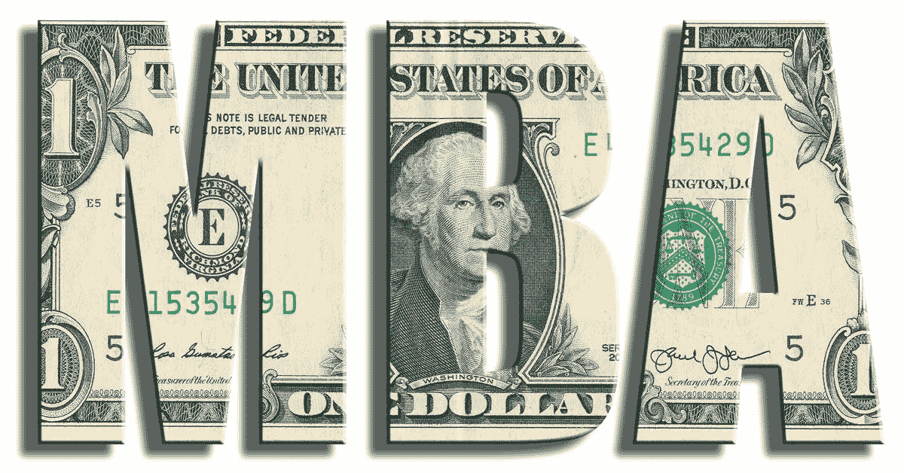

# 金融 MBA 如何成为 Quant？

> 原文：<https://blog.quantinsti.com/can-mba-finance-become-quant/>

作者[希普拉·特里帕蒂](https://www.linkedin.com/in/shipra-tripathi-5bb84520/)

自动化的影响，金融部门裁员的激增，机器人的崛起以及对我们未来的威胁，网络上这类文章的清单似乎是无穷无尽的。

但是你遇到过类似的情况吗？

你有没有因为缺少技术更好、技术更强的劳动力而面临被解雇的风险？

那你做了什么？

那些有 MBA 金融背景的人显然渴望掌握他们所选择的工作领域。选择攻读金融 MBA 意味着你擅长数字、策略和赚钱。

但是，如果经过几年的工作和卓越表现后，你又感到饱和了呢？

无论是哪种情况，预期的裁员威胁还是现有档案的饱和，都需要职业升级。

**考虑提升你的知识和职业选择？**

成为一名量化分析师。

随着金融证券变得越来越复杂，仍然有趣的是，理解[算法交易策略](/algorithmic-trading-strategies/)并负责将它们纳入算法的人。

复杂的数学和金融模型由计算机机制起草、解释并投入使用。对不仅理解为这些证券定价的复杂数学模型，而且能够增强这些模型以创造利润和降低风险的人的需求一直在稳步增长。这些人被称为定量分析师。具体来说，[量化交易策略](https://quantra.quantinsti.com/course/quantitative-trading-strategies-models)背后的人被称为量化分析师和量化交易员。

定量分析师设计并实现复杂的模型，允许金融公司对证券进行定价和交易。他们主要受雇于投资银行和对冲基金，但有时也受雇于商业银行、保险公司和管理咨询公司，此外还有金融软件和信息提供商。

### **如何成为 Quant？**

量化分析师使用编程语言来部署自主交易方法。主要的交易方法包括传统的[算法交易策略](/algorithmic-trading-strategies/)。同样的策略，你可能已经获得了敏锐的观察后，市场数据。

虽然技术被用来提取和利用数据，并将其编码成计算机可理解的语言，但我们人类才是用大脑来制定策略并以编程语言进行编码的。

适当的教育和相关的工作经验是学习新行业的基础。对于那些在 MBA 课程之前学习过数学和编程语言的人来说，学习算法交易的基础知识应该更容易。

成为算法交易员所需的技能组合——交易、金融市场和交易平台支持的编程语言方面的专业知识。Python，R 或者 Matlab。

### **金融 MBA 课程与算法交易高管课程的比较**

据报道，40%注册学习算法交易课程的参与者来自金融背景，42%的算法交易爱好者接受过技术和计算机科学教育。这两种背景的候选人更容易掌握成为量化分析师所需的额外知识。

为了了解你需要付出多少额外的努力，必须对 MBA 金融课程和 algo 交易培训课程的主题进行比较分析。

下面是 MBA 课程的介绍，这些是你在管理课程中已经涉及到的话题。

#### **金融**

*   行为金融学、**商业分析与估值**、资本支出规划与控制、**衍生品**、税务、金融建模、风险管理、**证券、**国际商业经济学、保险
*   **经济学:** **基础计量经济学**，需求与**商业预测，**企业家精神**，企业、市场与全球动态**，管理合伙企业，**银行与小额信贷**
*   **营销:**广告和促销、企业对企业营销、竞争和全球化、**、**国际营销、定价管理、定价和品牌管理、服务营销和战略营销
*   **组织行为:**自信训练、平衡计分卡、建设学习型组织、公司治理、跨文化管理、领导力影响力和权力、创造力和关系管理、**交易分析**
*   **信息系统:**管理信息系统、商业和数据通信网络、**商业智能和数据挖掘**、通过系统动力学进行商业建模、网络法律、数据结构、决策支持系统、知识产权、 **OOPS** 以及软件项目管理

MBA 课程中用粗体标记的主题也适用于算法交易。T3】

**除了这些话题之外，在建立 algo 交易平台之前，你还需要整理一些额外的信息:**

*   在算法交易模块中，向参与者介绍了统计学、期权和衍生品以及金融市场的基本原理和基本概念
*   期权定价模型和期权希腊模型及其应用
*   分散交易的概念、实施和障碍
*   设计风险管理工具，显示期权组合对不同条件的敏感性，允许交易者在不同条件下修改他/她的投资组合
*   算法交易中流行的量化交易范例，如统计套利、市场微观结构、趋势跟踪、基于动量、做市、机器学习等
*   介绍算法交易的系统架构和执行策略，用 R、Python 或 Matlab 进行基本编程以创建技术指标和回溯测试模型
*   利用时间序列分析进行波动率估计和预测，在 R
*   使用最新的软件包以不同的编程语言编写策略代码
*   建立算法交易平台的基础设施、资本、业务和监管要求

详细提供了编码和交易所需工具的初步知识。其中包括在 MS Excel 中应用[算法交易策略](/algorithmic-trading-strategies/)的模块，在预测未来股票价格和风险/奖励近似值中应用统计学。

参与者也可以选择在从业者/交易者的指导下完成一个项目，包括构思和创造交易策略。项目主题符合区域专业化和强化学习的要求。

#### **回答一些你可能有的基本问题:**

迄今为止，有多少工商管理硕士注册了 EPAT QuantInsti？

每年，大约 40%注册 EPAT 的学生来自金融和/或管理背景。

**这些 EPAT 的亚洲人目前在做什么？**

完成 EPAT 后，他们中的许多人开始自己的交易系统。根据兴趣和专长，他们中的一些人会加入金融公司的定量分析师或交易角色。

**EPAT 如何帮助 MBA 探索不同的领域？**

已经掌握了管理技能，学习量化技术对那些想在量化交易领域发展的人来说是有益的。

EPAT 的整体课程设计提供了一个探索交易和量化角色的机会。

### **下一步**

如果你想学习算法交易的各个方面，那就去看看算法交易(EPAT)中的 T2 高管课程。该课程涵盖了统计学&计量经济学、金融计算&技术和算法&定量交易等培训模块。EPAT 让你具备成为成功交易者所需的技能。[现在报名](https://www.quantinsti.com/epat/)！