# 烛台模式:如何阅读图表，交易，等等

> 原文：<https://blog.quantinsti.com/candlestick-patterns-meaning/>

由[查尼卡·塔卡](https://www.linkedin.com/in/chainika-bahl-thakar-b32971155/)和[维拉伊·巴加](https://www.linkedin.com/in/virajbhagat/)

烛台模式在定量交易策略中起着关键的作用，因为它形成简单，易于阅读。

对于使用烛台模式，你只需要对烛台是如何形成的有一个基本的了解。此外，对这些烛台的各种解读方式有所了解也很有用。

然而，如果你是烛台交易的新手，这篇博客将帮助你对烛台有一个完整的了解。让我们从本博客涵盖的基础知识开始:

*   [什么是烛台？](#what-are-candlesticks)
*   [烛台的历史](#history-of-candlesticks)
*   [烛台的解剖](#anatomy-of-candlesticks)
*   [日本烛台的品质](#qualities-of-japanese-candlesticks)
*   [蜡烛图 vs 普通价格图](#candlestick-charts-vs-normal-price-charts)
*   [烛台图案有哪些？](#what-are-candlestick-patterns)
*   [烛台图案的种类](#categories-of-candlestick-patterns)
    *   [看跌蜡烛](#bearish-candle)
    *   [看涨蜡烛](#bullish-candle)
    *   [看涨蜡烛和看跌蜡烛的区别](#difference-between-bullish-candles-and-bearish-candles)
*   [烛台展示](#representation-of-candlesticks)
*   [烛台图案的种类](#types-of-candlestick-patterns)
    *   [烛台图案列表](#list-of-candlestick-patterns)
*   [烛台模式 vs 图表模式](#candlestick-pattern-vs-chart pattern)
*   [如何读懂烛台图案？](#how-to-read-candlestick-patterns)
*   [解读烛台图案](#interpreting-the-candlestick-patterns)
*   [如何检测实际图表中的烛台模式？](#how-to-detect-the-candlestick-patterns in-actual-charts)
    *   [看涨摇摆](#bullish-swing)
    *   [看跌摇摆](#bearish-swing)
    *   [牛气的针棒](#bullish-pin-bar)
    *   [轴承销杆](#bearish-pin-bar)
    *   [内部酒吧](#inside-bar)
    *   [外栏](#outside-bar)
*   [阅读蜡烛图进行交易的好处](#benefits-of-reading-candlestick-patterns-for-trading)
*   [读取蜡烛图进行交易的缺点](#drawbacks-of-reading-candlestick-patterns-for-trading)
*   [烛台图案常见问题解答](#candlestick-pattern-faqs)

* * *

## 什么是烛台？

烛台在[量化交易](https://quantra.quantinsti.com/course/quantitative-trading-strategies-models)中用于代表可交易工具(证券、衍生品、货币等)的开盘价、最高价、最低价和收盘价。).烛台形似现实生活中的烛台，因此得名。

<figure class="kg-card kg-image-card kg-width-full">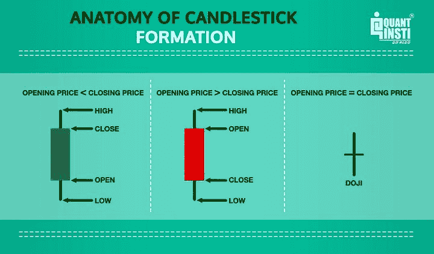</figure>

烛台以下列颜色区分:

*   白色烛台或绿色烛台:表明上升趋势
*   黑色烛台或红色烛台:表明下降趋势

烛台有各种尺寸、形状甚至颜色。这样做的原因是烛台是基于价格。由于价格不断变化，大小和形状的烛台也因其解剖性质不同。这使得他们与众不同。

这些不同的形状和大小表明了市场心理，但有时，可以非常有效地帮助你预测未来的市场方向。

* * *

## 烛台的历史

烛台是 17 世纪在日本发展起来的。这就是为什么他们也被称为日本烛台。

在他们的发明之后，日本当地人开始在交易大米时使用烛台。这一理念逐渐被不同的人和国家所接受，并不断向更好的方向发展。同样的进化导致了现在的烛台。

日本烛台被认为是在《史蒂夫·尼森的日本烛台制图技术》一书中被介绍到西方的。大约 100 年后，西方发展了棒点和图形分析。

在古代日本，这些原则适用于大米，今天它们也适用于股票。

18 世纪，来自日本坂田镇的著名大米商人宗久本马(Munehisa Homma)在多岛市场交易。对烛台的进一步研究提到了“坂田的方法”或“坂田的规则”，这是基于这个特定市场的名称。

据说 Homma 在他的一生中通过研究多年的历史数据并将它们与天气条件进行比较，开发了蜡烛图。这项研究还帮助他理解了情绪对大米交易背后的价值和定价的作用。

* * *

## 烛台的解剖

烛台的解剖一直保持着几乎相同的年代，给了我们现在的形状和意义。它由 4 个不同的值组成，即:

*   开盘价，
*   收盘价，
*   给定区间的最高价格，以及
*   给定区间内的最低价格。

它类似于折线图和条形图的组合，其中每个条形图代表一个时间间隔内的所有四条重要信息。

<figure class="kg-card kg-image-card kg-width-full">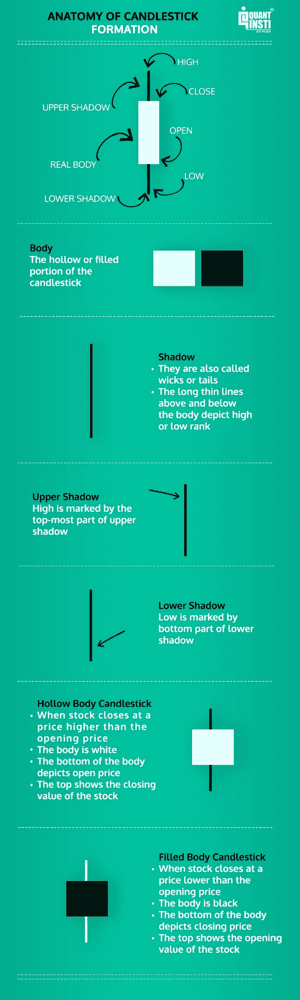</figure>

### 身体

烛台的空心或实心部分称为烛台主体。

*   多头——表示单向交易量大，买入或卖出压力大
*   小身体——表示交易量较小或买卖活动较少

### 阴影

身体上下长长的细线叫做烛台的影子。

*   上影-高由上影的最高部分来标记
*   下影线-低由下影线的底部标记

### 垂直线

蜡烛图显示并定义了价格在一条垂直线上的开盘价、收盘价、最高价和最低价。它包括以下内容:

*   上尖端-高
*   下尖-低
*   蜡烛体-打开和关闭之间的范围
*   顶端
*   底端

偶尔，你也可以观察到:

*   上阴影
*   下阴影

此外，主体由中空主体烛台或填充主体烛台表示。

### 中空体烛台

*   当股票收盘价高于开盘价时
*   身体是白色的
*   主体的底部描绘了开放的价格
*   正文的顶部显示股票的收盘价

### 实心烛台

*   当股票收盘价低于开盘价时
*   身体是黑色的
*   主体的底部描绘了收盘价
*   正文的顶部显示股票的开盘价

* * *

## 日本烛台的质量

日本烛台的质量可以列举如下:

*   它们很密集
*   它们充满了信息
*   它们表明了市场心理和买卖双方的情绪
*   它们代表了短期内的交易模式
*   有时，需要几天或几个疗程
*   它们可以用于货币价格模式和股票的技术分析
*   它们可以用于任何外汇时间框架

* * *

## 烛台图案是什么？

蜡烛图是价格变动的图形表示，通常由金融工具的开盘价、最高价、最低价和收盘价构成。这些烛台用来识别交易模式，帮助技术分析师进行交易。

此外，有时你会发现外观相似的烛台或一组相同的频繁出现，可以给你一个特定的模式，非常时期。

* * *

## 烛台图案的类别

交易分析师使用蜡烛图来识别市场转折点，他们被用来降低市场风险。此外，烛台模式可以基于两个烛台，有时甚至可以使用一系列多个烛台。

*   烛台图案分为烛台数量:一个、两个、三个及以上。
*   烛台模式分为两大类，即看涨和看跌。

### 熊市蜡烛

当身体被填满，黑色或红色，这意味着收盘低于开盘价，被称为看跌蜡烛。

这意味着下跌的价格运动导致价格下跌，因此收盘价低于开盘价。

**不同种类的牛气蜡烛**

<figure class="kg-card kg-image-card">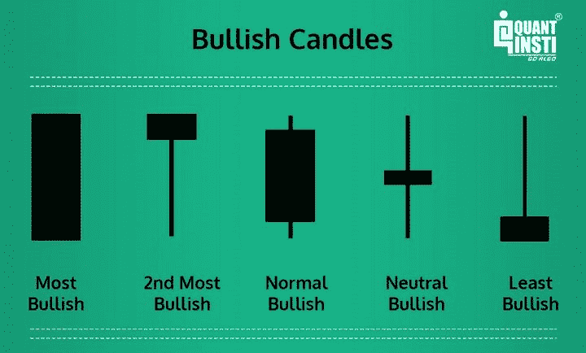</figure>

### 看涨蜡烛

如果主体是空的，是白色或绿色的，这意味着收盘高于开盘，这是一根看涨的蜡烛。

这意味着看涨的价格运动导致价格上涨，因此收盘价高于开盘价。

**不同类型的看跌蜡烛**

<figure class="kg-card kg-image-card kg-width-full">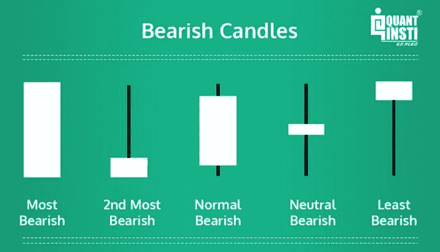</figure>

这个主体描述了当天交易的开盘价和收盘价之间的价格范围。

### 看涨蜡烛和看跌蜡烛的区别

<colgroup><col width="57"><col width="128"><col width="134"></colgroup>
| **Sr 号** | **看涨蜡烛** | **看跌蜡烛** |
| one | 最乐观 | 最悲观 |
| Two | 第二乐观 | 第二悲观 |
| three | 温和看涨 | 适度看跌 |
| four | 中性看涨 | 中性看跌 |
| five | 最不乐观 | 最不悲观 |

### 烛台的展示

身体上下的细垂直线被称为灯芯或阴影，代表交易时段的最高价和最低价。

烛台的图示如下:

*   看涨或绿色蜡烛代表力量
*   熊市或红烛代表弱势
*   购买之后通常是绿色蜡烛
*   卖出之后是一根红烛
*   你必须寻找先前的趋势。如果你看到的是看涨反转形态，那么之前的趋势应该是看跌。
*   如果你正在寻找一个熊市反转模式，那么之前的趋势应该是牛市

* * *

## 烛台图案的类型

市场上有各种各样的烛台，只有通过实践，你才能对每一种烛台有全面的了解。

我们在一个信息图中汇集了所有类型的烛台模式。这张信息图对于那些使用蜡烛线技术来监测市场走势的人和正在学习蜡烛线技术的人来说非常有用。

### 烛台图案列表

以下是烛台图案:

*   多头日
*   漫长的熊市
*   短日
*   看涨的弃婴
*   看跌的弃婴
*   熊市吞没形态
*   看涨吞没形态
*   看涨哈拉米十字
*   看跌哈拉米十字
*   穿孔图案
*   看涨哈拉米
*   看跌的哈拉米
*   看涨踢球者
*   看跌者
*   乌云覆盖
*   上层窗户
*   下部窗户
*   看涨三星
*   看跌三星
*   早上好，道吉之星
*   傍晚道吉星
*   晨星
*   晚星
*   看涨的道场明星
*   看跌多吉星
*   流星
*   看涨旋转陀螺
*   轴承旋转陀螺
*   镊子顶端
*   镊子底部
*   三个里面朝上
*   三个在外面
*   看涨三线罢工
*   看跌三线走
*   绞刑者
*   三个白人士兵
*   三只黑乌鸦
*   三个在里面
*   三人出局
*   看跌分割线
*   看涨分割线
*   下降的鹰
*   角鸽
*   向下张开的铃木
*   最后吞没顶部
*   最后吞没底部
*   匹配低电平
*   领线内
*   在领线上
*   推进线
*   两根黑色缝隙蜡烛
*   匹配低电平
*   匹配高
*   交汇线看跌
*   交汇线看涨
*   上田树缺口

<figure class="kg-card kg-image-card kg-width-full">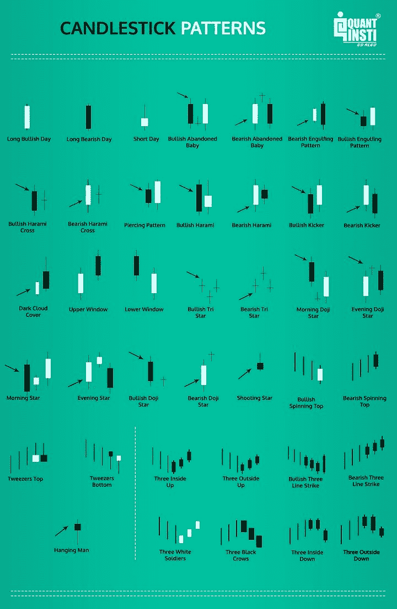</figure>

<figure class="kg-card kg-image-card kg-width-full">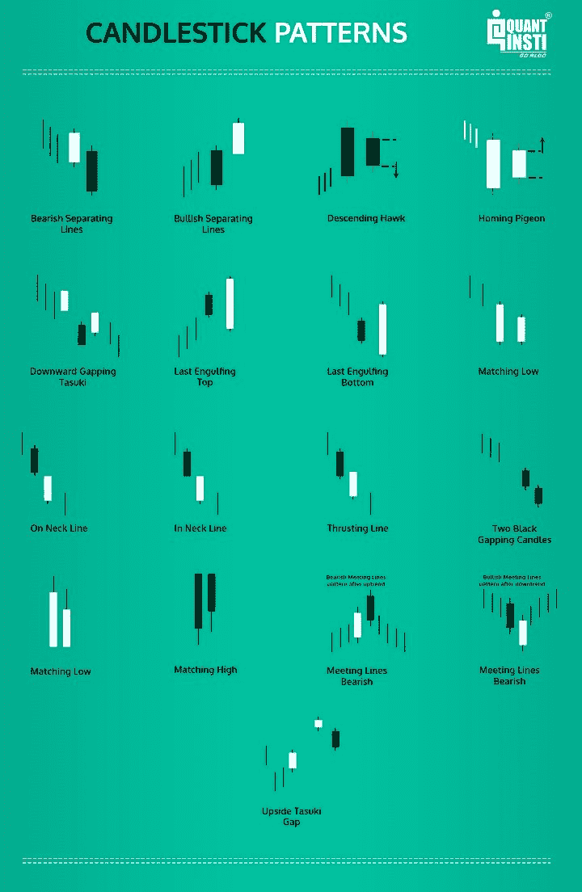</figure>

* * *

## 烛台模式与图表模式

为了让您了解它的样子，我们将使用印度国家银行的一个样本来展示它在一天中的烛台模式。

<figure class="kg-card kg-image-card kg-width-full kg-card-hascaption">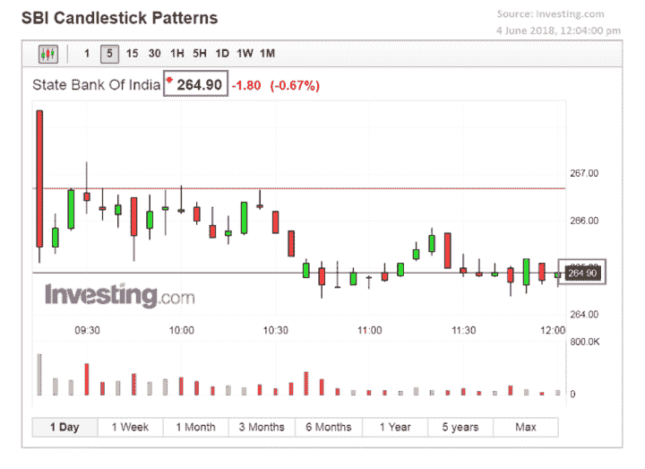

<figcaption>Candlestick pattern</figcaption>

</figure>

然而，图表模式看起来像这样:

<figure class="kg-card kg-image-card kg-width-full kg-card-hascaption">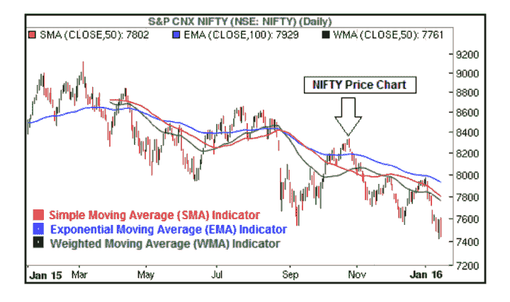

<figcaption>Chart pattern (Source: [WikiFinancepedia](https://wikifinancepedia.com/investing/trading/what-is-moving-average-in-technical-analysis-definition-examples-types-strategies-of-indicators))</figcaption>

</figure>

<colgroup><col width="128"><col width="134"></colgroup>
| **烛台图案** | **图表模式** |
| 一个或多个烛台的积累形成了烛台模式。 | 金融工具(股票、衍生工具等)的价格变化。)由于心理和基本面等方面在一段时间内导致了一个图表模式。T3】 |
| 烛台模式是在短时间内形成的。 | 图表趋势方向出现在较长的时间跨度上。T3】 |
| 进出点也是短期的。 | 该形态显示长期买卖信号。T3】 |

* * *

## 如何读懂烛台图案？

一旦你知道如何做，阅读烛台模式是很容易的。让我们找出烛台模式的解释，以及在图表中检测烛台模式。

### 解读烛台图案

你可能遇到过很多烛台图案，但你知道一些常见图案的解释吗？

以下是一些烛台和他们的解释，将有助于交易:

<figure class="kg-card kg-image-card kg-width-full">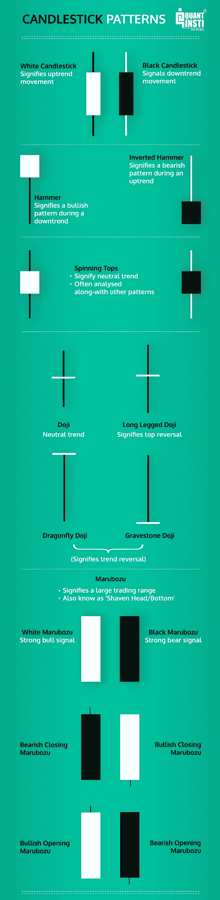</figure>

* * *

## 如何检测实际图表中的烛台模式？

日线图显示了当天的开盘价、最高价、最低价和收盘价。烛台主体(我们在上面讨论过)显示了开盘价和收盘价之间的联系。

你可以发现这些简单的烛台图案:

*   看涨摇摆
*   看跌摇摆
*   多头针棒
*   轴承销杆
*   内部酒吧
*   外部酒吧

### 看涨摇摆

看涨摆动是一个简单的三蜡烛线模式。第二根蜡烛线在三根蜡烛线中最低。这预示着价格可能上涨。

<figure class="kg-card kg-image-card">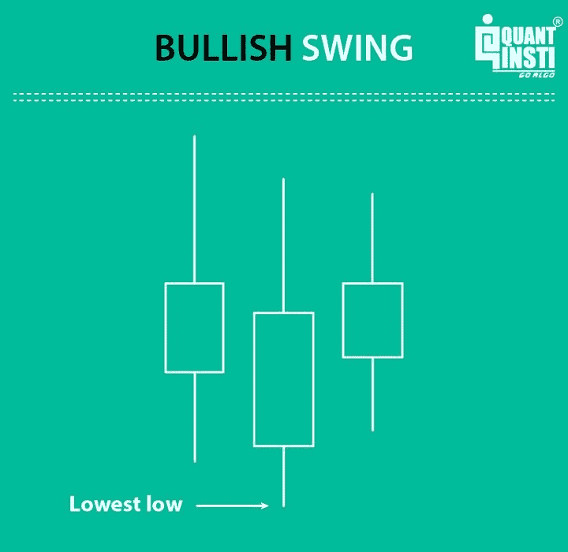</figure>

### 看跌摇摆

看跌的波动与看涨的波动相反。这也是一个 3 根蜡烛的模式，这里的第二根蜡烛有最高的高度。

<figure class="kg-card kg-image-card">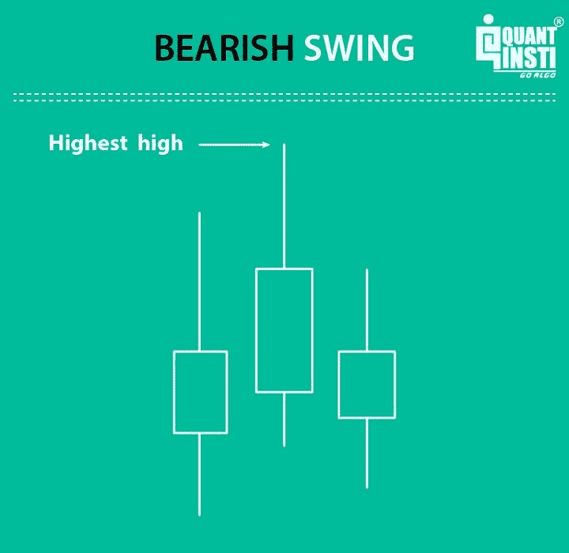</figure>

### 多头针棒

针条是非常常见的，也是最强大的模式。众所周知，针棒有很长的影子和很小的身体。

还有，针棒不仅仅是这样的蜡烛，它必须来自周围的价格行动。因此，相对于前一根蜡烛线，一根看涨的针柱必须有一个更低的低点。

“小”物体可以定义为宽度小于烛光范围除以 3 的物体。多头针棒的主体位于蜡烛的上半部分。

<figure class="kg-card kg-image-card">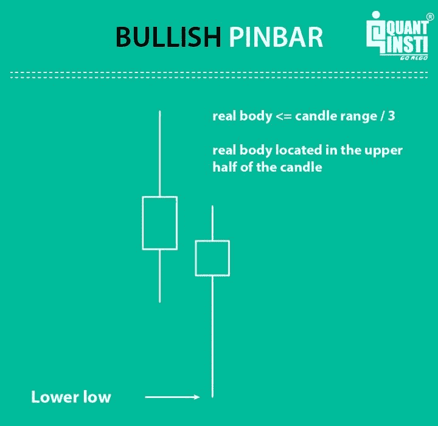</figure>

### 轴承销杆

看跌针柱与看涨针柱相似，但主体现在位于蜡烛线的下半部分，并且比之前的蜡烛线高。

<figure class="kg-card kg-image-card"></figure>

### 内部酒吧

酒吧内部是由两根蜡烛组成的图案。第二根蜡烛线包含在第一根蜡烛线的范围内。

内侧柱线显示波动性收缩，这可能是强烈方向性爆发的前奏。

<figure class="kg-card kg-image-card">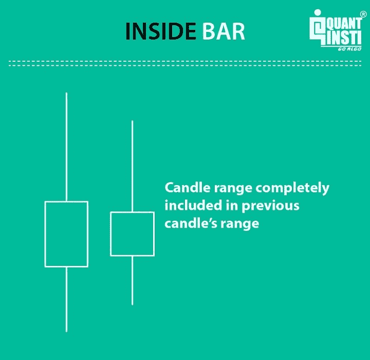</figure>

### 外部酒吧

外侧杠与内侧杠相反。蜡烛范围包括之前的整个蜡烛。

<figure class="kg-card kg-image-card">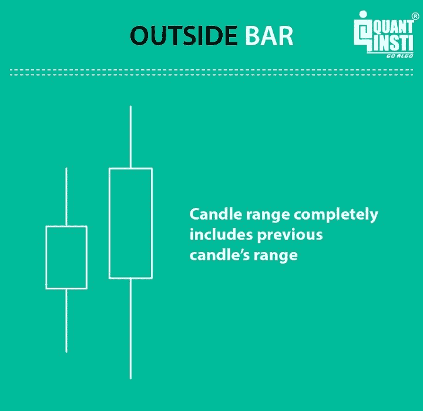</figure>

* * *

## 阅读烛台模式对交易的好处

阅读烛台模式的好处可以列举如下:

### 蜡烛图详细描绘了市场

蜡烛图向我们详细展示了发生在资产上的价格行为。在少量的及时使用后，蜡烛图模式分析可以在交易者的日常生活中发挥不可或缺的作用。在 Quantra 课程中详细学习[价格行动交易策略](https://quantra.quantinsti.com/course/price-action-trading-strategies)。

### 使用蜡烛图进行情绪分析更容易

金融工具在市场上的价格变动通常是在贪婪、恐惧和希望等情绪的影响下做出的决定。

有了烛台模式，你可以成功地解读市场的变化，而不会让情绪干扰。这也被称为投资者情绪。蜡烛图通过显示买家和卖家之间的互动来做到这一点，这通常反映在价格运动中。

### 更容易理解

烛台模式在视觉上提供了一套清晰而简单的模式，非常准确。通过使用蜡烛图，结合一些基本的技术分析，你可以很容易地发现市场中出现的模式。同样，当你交易时，你可以从这些模式中获利。

### 为什么交易中使用烛台

除此之外，这些也是交易中使用烛台的原因:

*   它们很容易理解
*   模式很容易识别
*   它们可以与其他指标结合使用
*   与提供最少信息的传统图表相比，提供对市场中发生的事和发生的事以及买方和卖方之间的互动的更详细的描述
*   它们让我们了解投资者的情绪和由市场决定的价值
*   蜡烛的颜色和长度有助于一眼判断市场是熊市(走弱)还是牛市(上涨)
*   他们很早就指出市场的转折点，并估计市场的方向
*   总的来说，烛台提供了独特的见解
*   它们显示了在其他类型的图表中看不到的反转模式
*   它们可以用于各种市场
*   烛台模式在预测市场趋势方面非常准确

* * *

## 阅读蜡烛图交易的缺点

阅读蜡烛图交易的缺点可以列举如下:

### 烛台在每个时间段看起来都不一样

一个烛台模式可能在一个时间段看起来很完美，但在另一个时间段也可能完全相反。这使得我们很难百分之百地相信烛台模式的信息。因此，它会对交易者决定和执行交易产生怀疑。如果烛台有足够的大小，它可能会出现在多个时间框架中，但这种情况并不常见。

### 烛台模式在较高频率上的不可靠性

在高频时，如一分钟，数据会有很多蜡烛图，但大量的价格波动会使交易变得非常困难。这可能会影响您交易时的风险管理实践。

### 拉后指标

在技术分析中，烛台模式通常被认为是一个滞后指标，因为你需要等到蜡烛结束后才能交易。这有很多缺点，最重要的是滞后指标只记录结果，所以它给交易者留下了决定或推测下一步价格走势的空间。

* * *

## 烛台模式常见问题

**问:为什么烛台有不同的形状和大小？**
答:烛台是以价格为基础的。由于价格不断变化，大小和形状的烛台也因其解剖不同，使他们不同。这些不同的形状和大小表明了市场心理，但在帮助人们预测未来市场方向方面非常有效。

**问:什么是丸博祖？**
答:丸博祖的意思是“剃光了”。他们是没有任何阴影的烛台。

问:什么是多奇？
答:多奇的意思是“成型不熟练”。他们是没有身体的烛台。

问:哈拉米是什么？
答:哈拉米的意思是“怀孕”。Harami 是由两个烛台组成的烛台图案，即一个大烛台(母亲)和一个小烛台(婴儿)，因此得名。

问:人们可以依赖烛台图案吗？
答:能否依靠烛台图案是交易者的个人选择。烛台模式对于那些在短时间内跟踪市场的交易者来说更方便。例如，大多数日内交易者发现依靠烛台模式很方便。

* * *

### 结论

烛台模式是预测价格的最有趣和最简单的方式，为你创造独特的交易策略。虽然有很多烛台模式可供你参考，但阅读和解释烛台模式的微妙实践可以帮助你更有效地预测和设计策略。

烛台模式是全世界交易者使用的预测技术之一。烛台图表用于股票市场和外汇市场等。

烛台的知识证明是无价的。人们可以了解烛台，通过一些努力，人们可以快速记住烛台图案，并在短时间内应用这些知识。

探索我们关于 [Python for trading](https://quantra.quantinsti.com/course/python-for-trading) 的课程，以便利用 Python 编码让你的烛台模式读起来更方便。计算机语言可以帮助你编码，以便对你的烛台模式进行回溯测试，用于数据分析和生成交易信号。

* * *

****注:原帖已于 2022 年 8 月 22 日***对*进行了修改，以确保准确性和时效性。****

* * *

*<small>免责声明:股票市场的所有投资和交易都涉及风险。在金融市场进行交易的任何决定，包括股票或期权或其他金融工具的交易，都是个人决定，只能在彻底研究后做出，包括个人风险和财务评估以及在您认为必要的范围内寻求专业帮助。本文提到的交易策略或相关信息仅供参考。</small>T3】*