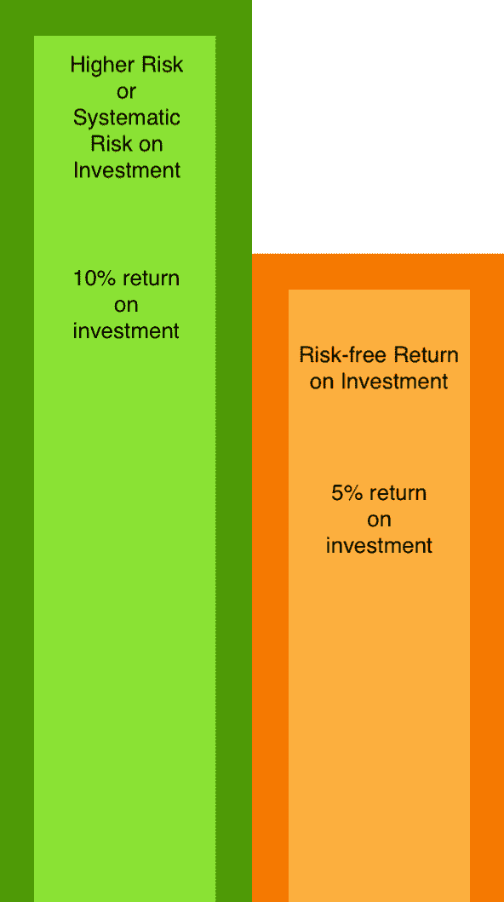

# 资本资产定价模型

> 原文：<https://blog.quantinsti.com/capital-asset-pricing-model/>

由[查尼卡·塔卡](https://www.linkedin.com/in/chainika-bahl-thakar-b32971155/)

CAPM 或资本资产定价模型起源于 1964 年，是财务管理中极其重要的一部分，也是一个易于理解和应用的模型。该模型关注的是资产回报率对整个股票市场面临的风险的敏感性，这种风险被称为系统性风险。

它考虑了几个假设，并显示了投资特定资产的风险如何定义投资者从中获得的回报。这种风险与承担风险所获得的溢价之间的关系是 CAPM 的核心。然而，围绕本文所涉及的模型还有其他一些概念。

此外，在同一个模型中，风险的计算对于正确估计该风险的回报或溢价至关重要。除了这个模型，还有其他模型，我们将讨论资产定价。在本文中，我们将介绍:

*   [资本资产定价模型及其运作](#CAPM-Working)
*   [资本资产定价模型的用途和假设](#uses-Assumptions)
*   你如何计算贝塔系数，什么是资本安全市场线？
*   [该模式的两个主要优势和两个局限性](#Benefits-Limitations)
*   [资产定价的其他因素模型](#Models-Asset-Pricing)

## 资本资产定价模型及其运作

资本资产定价模型是一个非常有用的模型，它可以帮助你公平地理解投资的估计回报与其风险或系统风险之间的关系。

现在，**系统风险**是指你在市场上的某项投资中可能承担的风险。这种多样化风险的一些例子是战争、衰退等。然而，这个模型假设有特定种类的金融资产可以获得零风险回报。

在这样的时候，这个模型给你在你的[投资组合](https://quantra.quantinsti.com/glossary/Portfolio)中分散资产的决策权。这种资产多样化有助于[对冲](https://quantra.quantinsti.com/glossary/Hedging)特定金融资产的投资风险。

因此，系统性回报风险高于无风险投资回报。这个模型告诉你投资是否值得冒险。

在上图中，可以清楚地看到，您有两个选项，分别是:

*   没有风险的无风险投资回报，估计投资回报的 5%

或者

*   投资的系统风险，风险较高，但投资的估计回报也较高(与无风险回报相比)，为 10%。

要在这两个选项中做出选择，CAPM 模型就派上了用场。

现在让我们来看看 CAPM 的公式，它给出了一个估计的投资回报，让你能够决定哪个选择更有利可图。公式是:

R =射频+ 𝝱 * (Rm -射频)

在上面的公式中，

Ra =估计投资回报

Rf =投资的无风险回报率

𝝱 =投资金融资产的贝塔值或风险值

Rm =资本市场的平均回报率

因此，上面的公式计算投资的估计回报率，目的是给你一个投资风险资产的**回报率的估计。通过应用上面的公式，你将能够找到这个估计值。**

在该公式中，投资于该资产的风险(𝝱)乘以市场风险溢价，即(Rm - Rf ),以获得高于投资于无风险金融资产的无风险回报的金额。

此外，将市场上任何其他金融资产的无风险投资回报率与产出相加，将会给你带来因承担该风险而获得的**溢价**(估计总回报)。

总之，这个估计是为了帮助你在投资高风险金融资产时获得更高的收益率。

举个例子，

假设资产 XYZ 为以下情况:

射频= 3%

Rm = 10%

= 0.75

通过使用 CAPM，资产 XYZ 的收益率为:

Ra = 0.03 + [0.75 * (0.10 - 0.03)]

0.0825 = 8.25%

如果一个投资者希望他/她的投资有 10%的回报，那么根据 CAPM 模型，他/她不应该在 XYZ 投资。但是，如果投资者寻求的回报率低于 8.25%，比如说 7%，那么投资 XYZ 会更好。

说到类型，这个模型涵盖了两种类型的风险，它们是:

*   系统风险
*   非系统性风险

创建资本资产模型的金融经济学家威廉·夏普(William Sharpe)提到了这两种风险。他认为任何投资都有两种类型的风险，并以此开始了这个模型。

### 系统风险

这意味着市场风险总是伴随着投资，并冲击整个股票市场。例如，在经济衰退的情况下，投资股票市场必然比其他时候风险更大。在这样的时候，这个模型帮助你决定哪些股票会更有利可图或风险更小。

### 非系统性风险

这种类型的风险被称为“特定风险”，因为它与单个股票相关。这种风险与整体市场走势无关。因此，这种风险与市场上某一特定股票有关，这种股票会因为任何商业失败而降临到投资者头上。

重要的是要明白，特定的或非系统的风险可以通过优化投资组合来处理。这是现代投资组合理论中提到的一个相关观察。

然而，在系统性风险的情况下，投资组合的优化有所帮助，但相对来说比在非系统性风险中的帮助要小。正如我们上面提到的，导致系统性风险的因素将整个市场纳入其范围。因此，对投资者影响最大的是系统风险。这就是这个模型如何专注于管理系统性风险。

现在，让我们看看 CAPM 的假设和用途。

## 资本资产定价模型的用途和假设

在这里，我们将看到 CAPM 存在的众所周知的假设，以及该模型在不同领域的应用。

由于假设对任何模型都很重要，资本资产模型也基于创建该模型的经济学家 William Sharpe 提到的一些假设:

*   投资者的多样化投资组合
*   单周期交易
*   无风险收益率
*   完美资本市场的存在

### 投资者的多样化投资组合

这意味着投资者只需要投资组合中系统风险的回报，因为非系统风险可以很容易地分散。因此，该模型忽略了非系统风险。

### 单周期交易

模型中假设了一个标准持有期，以使不同股票的回报具有可比性。因此，所有股票的持有期为一年。这样做是因为持有期为 5 个月的股票不能与持有期为 12 个月的股票相比较。

### 无风险收益率

这一假设表明，投资者可以在无风险回报率下借贷。这个假设是由现代投资组合理论做出的，这个模型也是从这个理论中衍生出来的。

### 完美资本市场的存在

根据这一假设，所有的股票都被正确地估价，它们的回报率也将被准确地估计出来。一个完美的资本市场意味着没有税收和成本；投资者很容易获得完美的信息，而且市场上有大量的交易者。

好了。让我们转到 CAPM 的实施/使用。

由于资本资产定价模型提供了对股票定价的洞察并确定了预期回报，因此它在以下方面有其**实现/使用**:

*   投资管理
*   企业融资

### 投资管理

CAPM 是许多投资者的重要工具，尤其是投资组合经理。这是可能的，因为 CAPM 通过考虑股票投资的 Beta 值或风险值来提供预期或估计的投资回报。这种估计有助于理解投资哪些股票，不投资哪些股票。因此，在市场上涨的情况下，投资者可以通过这种方式投资于高贝塔证券(贝塔系数大于 1)。然而，他们可以投资低贝塔证券(贝塔系数小于 1)，以防市场预期下跌或正在下跌。

正如我们在第一节“ [CAPM 和它的工作](/capital-asset-pricing-model/#CAPM-Working)”中讨论的那样，它在投资管理方面的工作是简单明了的。

### 企业融资

在公司金融中，这个模型有很大的重要性，因为它建议将股权成本作为特定公司股票的最低预期回报。这种权益成本只不过是公司支付给股东的投资股票(风险较高的股票)的回报。这种股票的预期收益反过来就是股东投资公司股权基金的[机会成本](https://en.wikipedia.org/wiki/Opportunity_cost)。

因此，简单地说，资本资产模型帮助公司或使用股票基金的企业获得估计的回报率。在此估计的基础上，公司向公司股东提供回报率。现在，由于该公司已经得到了一个估值，它必须至少赚取其资金中基于股权部分的成本，否则股票价格肯定会在市场上下跌。

相反，如果公司发现很难赚取股本成本，它就不能继续持有股份或股东的资金。这很重要，因为这样一来，股东就不用承担机会成本了。此外，股东可以投资于金融市场上的其他股票，他们希望在相同的风险水平下获得相同的预期回报。现在，一个重要的观察是，这个权益成本很难找到，除非我们在这里使用 CAPM。

让我们看看如何使用资本资产定价模型计算权益成本，也称为加权平均资本成本(WACC)。

**权益成本或 WACC**

现在，WACC 或权益成本的公式有助于确定，在特定的时间内，你到底能期望多少回报。让我们看一个例子。这里，为了帮助你理解 CAPM 是如何帮助计算权益成本的，我们将以 XYZ 公司为例，就像我们在解释 CAMP 时一样。权益成本的公式为:

权益成本=今天的现金流/(1+ra)t

所以，我们使用了下面的例子。

假设您的公司 XYZ 有以下变量:

ra =？

射频= 3%

rm = 10%

βa = 0.75

通过使用 CAPM，资产 XYZ 的收益率为:

ra = 0.03 + [0.75 * (0.10 - 0.03)]

0.0825 = ra

现在，向前看，8.25%是资产的预期回报率，你可以通过这个百分比来计算和决定股权成本。让我们假设一笔 1000 美元的现金流在 XYZ 完成。但是，由于现金今天更有价值，我们将在 2 年后计算其价值。

今天投资的现金-1000 美元

权益成本(考虑现金贴现值)-1000 美元/(1+ra)t = 1000 美元/(1+0.0825)t = 1000 美元/(1+0.0825)2

= $853.9

因此，853.9 美元是你当前时间段现金流的未来值。这给了你估计，以便你决定你的股权成本低于这个计算。

现在让我们来看看如何计算贝塔系数，资本安全市场线意味着什么。

## 你如何计算贝塔系数，什么是资本安全市场线？

正如资本资产定价模型所表明的，贝塔系数是衡量股票风险的唯一重要变量。这是通过找出股票在市场上的[波动率](https://quantra.quantinsti.com/glossary/Volatility)来实现的。这意味着该模型将特定股票的向上或向下运动与整个股票市场的向上或向下运动进行比较。

因此，如果一只股票的价格以与市场相同的方式或围绕整个股票市场移动，那么这只股票的贝塔系数为 1。Beta 值大于 1 的股票将被视为风险较高的股票，小于 1 的股票将被视为风险较低的股票。这意味着风险较高的股票必须提供市场风险溢价，或者简单地说，与风险较低的股票或无风险资产相比，回报率更高。

因此，Beta 表明，比无风险投资风险更高的投资应该能够获得高于无风险投资回报的溢价(额外回报)。

在了解了 Beta 是投资市场中特定资产的计算风险量之后，现在让我们看看如何用 Python 计算 Beta。