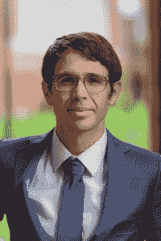

# 实现和成长:从 CFA 特许持有人到算法交易员

> 原文：<https://blog.quantinsti.com/cfa-charterholder-algorithmic-trader/>

人们经常会因为一些狭隘的观念而阻碍他们的职业和专业发展。这阻止了他们去追求他们喜欢做的事情。

有许多非凡的故事展示了一个来自完全不同背景的人是如何做到的，但对某件事有兴趣却常常能做到。值得注意的是，如果他是 CFA 持有人，并且仍然追随他的愿望[学习算法交易](https://blog.quantinsti.com/learn-algorithmic-trading)，特别是增长他的技能，迎合他成为其中一员的愿望。

我所指的人不是别人，正是 **[托德施耐德](https://www.linkedin.com/in/todschneider/)** 。

CFA 特许持有人。作为特许金融分析师称号持有者(CFA 特许)，Tod 被认为是全球投资管理知名职业的一部分。

Tod 是一名投资分析硕士，拥有相关行业经验的决策技能，他还在美国俄亥俄州哥伦布市建立了自己的公司 ' *施耐德咨询有限责任公司*。目前，他是美国俄亥俄州俄亥俄州立大学费希尔商学院的高级讲师。

以下是他进入算法和量化交易世界的一瞥——这是一段激励你不断学习、不断成长、不断追求你一生中想做的事情的旅程。

### **我们与托德·施奈德的对话**

嗨，托德！告诉我们你自己的情况

嗨，我是托德·施奈德。我一生都在投资并热衷于投资。我的父亲是一名兽医(已退休)，但一直沉浸在市场研究和投资中。在他的带领下，我从 1994 年开始分享我对投资的热情。

你什么时候觉得有必要学习算法交易？

我读过关于量化交易和算法交易的书(Thorp，Simons，Woodriff ),但是我想自己去发现——通过实践。

在 EPAT 之前，你面临着哪些挑战？是什么促使你去解决它们？

作为一个拥有长期视野的自由投资者，我想知道量化领域将如何增加我的过程的价值。此外，我想提高我的情商，更好地理解我交易的另一面。解决这些问题的唯一方法是努力工作并付诸实践。

你能分享一下你考虑用来自学算法交易的可能选项吗？

我考虑了几个不同的项目(大学/在线课程)。

这里学到的知识对你有什么帮助？

我继续尝试，并在学习 Python 的过程中获得了新的乐趣。编程以难以表达的方式拓展了你的大脑，但如果我必须简洁地说，编程提高了你解决问题的能力。

你拥有一家咨询公司，并且是俄亥俄州立大学费舍尔商学院的高级讲师。EPAT 认证对你现在的工作有什么帮助？

作为一名教师，我觉得有责任调查商业前景，让我的学生为职业机会做好准备。EPAT 帮助我在 quant 和 Python/Pandas 和 context 方面打下了基础。

告诉我们你在 EPAT 的经历吧！

太棒了。鉴于我的金融/会计背景，准备工作和前几节课都很简单。我在 Excel 讲座中感到舒适和自信，但当谈到 Python 讲座时，我却像是在用消防水管喝水。我努力学习，尽我最大的努力完成工作和家庭责任(期末考试花了我 10 多个小时)。有时时差很难适应，但我非常兴奋地得知，有些晚上我无法入睡(直到我取得进展或弄明白)。

你会对那些在算法交易中面临类似挑战的人说些什么？

我读了一本很棒的书，名为《你是如何知道 T1 的》，它引发了我对我所知道的一切的不安。如果你想知道 quant 是如何工作的，交易的另一方在想什么，你必须自己去发现。

对 EPAT 的有志之士有什么建议吗？

正如我年幼的女儿教导我的那样:**要冷酷无情**。

对于一个拥有算法交易基础知识和统计学知识的人来说，托德获得了 EPAT **优秀证书**，这帮助他探索创造交易算法、机器学习，并将在 EPAT 学到的技能应用到自己的交易中。

有了正确的技能、指导和支持，你就可以成为算法交易领域不断增长的一部分。算法交易高管课程 (EPAT)就是这么做的。它的综合课程包括培训模块，如统计学&计量经济学、金融计算&技术和算法&量化交易，让你成为一名成功的交易者。在这里了解更多**。**

***免责声明:为了帮助那些正在考虑从事算法和量化交易的人，本案例研究是根据 quantin STI EPAT 项目的学生或校友的个人经历整理的。案例研究仅用于说明目的，并不意味着用于投资目的。EPAT 项目完成后取得的结果对所有人来说可能并不一致。***