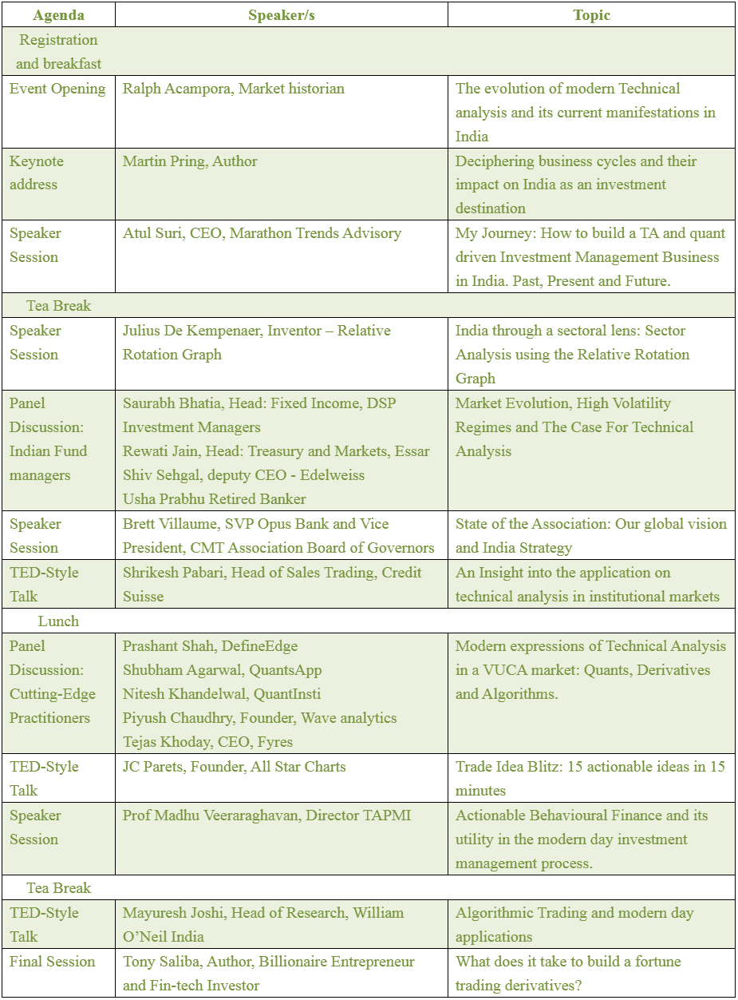

# 2019 年 CMT 协会印度峰会，孟买

> 原文：<https://blog.quantinsti.com/cmt-association-india-summit-2019-mumbai/>

## 关于活动

自从 18 世纪日本大阪大米市场出现交易以来，交易者已经认识到价格是市场参与者行为和个人证券需求的信息宝库。复杂的数据可视化、算法交易策略和量化方法都继续依赖于数百年前技术人员首先理解的市场基本原则。

在首届印度峰会上，您将花一整天的时间向世界领先的资产管理、研究和交易技术分析从业者学习和交流。了解如何观察、计算和捕捉持续的市场异常，如趋势、动量和均值回归，以在多资产投资组合中产生 alpha 并降低风险。

* * *

查看 Nitesh Khandelwal(quantin STI 联合创始人兼首席执行官)和 for ma ch heda(CMT)之间的对话，其中 Nitesh 讨论了他的技术分析背景，他是如何进入技术学科的，以及他即将在 2019 年 CMT 协会印度峰会上发表的演讲。

[https://www.youtube.com/embed/Cl9N-YhLQzg?rel=0](https://www.youtube.com/embed/Cl9N-YhLQzg?rel=0)

* * *

## 概观

技术分析提供了其现代解释(如定量金融、算法交易和行为金融)所依据的首要原则。成功的数据科学家和定量方法的倡导者不断努力加深他们对统计方法和支撑市场行为的行为偏差的理解。现代学者认为技术分析是弥补内在价值和市场价格之间差距的手段。

此次峰会将金融界最著名的人物聚集在同一个平台上，作为量化金融的年轻明星，从而提升了围绕当代量化方法的对话。它为市场参与者创造了一个与行业中最优秀的人才交流的机会，并学习可操作的流程来增强他们的想法产生、投资管理和风险缓解流程。

## 为什么要参与

### 扬声器

可以说，在印度的技术分析中，从未出现过如此杰出的演讲者。像 Ralph Acampora 和 Martin Pring 这样的活着的传奇人物，衍生品交易亿万富翁和科技企业家 Anthony Saliba，JC Parets，社交媒体最受关注的分析印度 TA 图标，如 Atul Suri，Shiv Sehgal，以及年轻的明星，如 Piyush Chaudhry，Shubham Agarwal 和 QuantInsti 自己的 Nitesh Khandelwal 一起创造了一个独一无二的知识节日。完整的发言人名单和议程大纲见下表。

### 前所未有的访问

演讲者将全天出席峰会，让与会者在会议期间和会议结束后都能深入了解他们

### 网络机会

各种资产类别的机构基金经理、金融科技企业家、各银行的部门和机构负责人、经纪商、衍生品部门、共同基金、投资者、学者等等，为每一个认真的市场参与者提供了一些东西。

## 议程和议题

**以下是此次活动的一些片段:**

> 在由我们自己的首席执行官 [@niteshkh](https://twitter.com/niteshkh?ref_src=twsrc%5Etfw) 主持的小组讨论会上， [@piyushchaudhry](https://twitter.com/piyushchaudhry?ref_src=twsrc%5Etfw) 、[、【shubham_quant](https://twitter.com/shubham_quant?ref_src=twsrc%5Etfw) 、[、【tejaskhoday】、](https://twitter.com/tejaskhoday?ref_src=twsrc%5Etfw) [@Prashantshah267](https://twitter.com/Prashantshah267?ref_src=twsrc%5Etfw) 分享的真知灼见让 CMT 印度峰会的观众欣喜若狂。[# cmtindiasummit 19](https://twitter.com/hashtag/cmtindiasummit19?src=hash&ref_src=twsrc%5Etfw)[@ CMT association](https://twitter.com/CMTAssociation?ref_src=twsrc%5Etfw)[# goal go](https://twitter.com/hashtag/goalgo?src=hash&ref_src=twsrc%5Etfw)[pic.twitter.com/1nDLR838Uh](https://t.co/1nDLR838Uh)
> 
> — QuantInsti (@QuantInsti) [November 25, 2019](https://twitter.com/QuantInsti/status/1198963892140920832?ref_src=twsrc%5Etfw)

