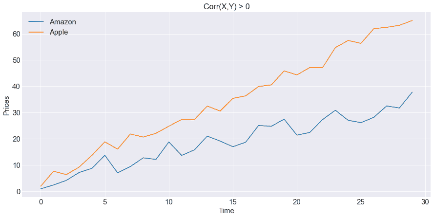
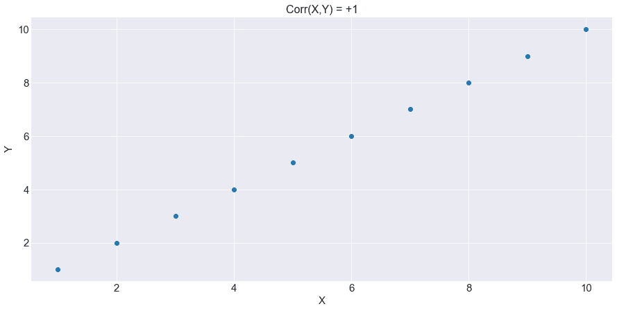
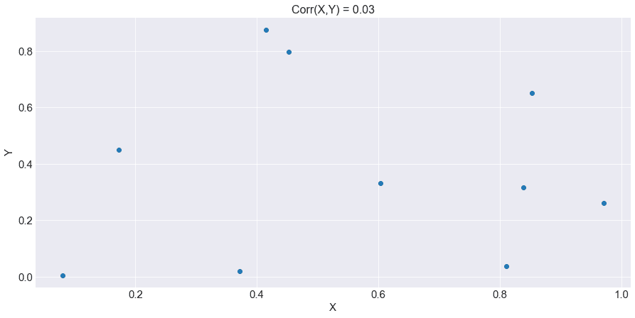
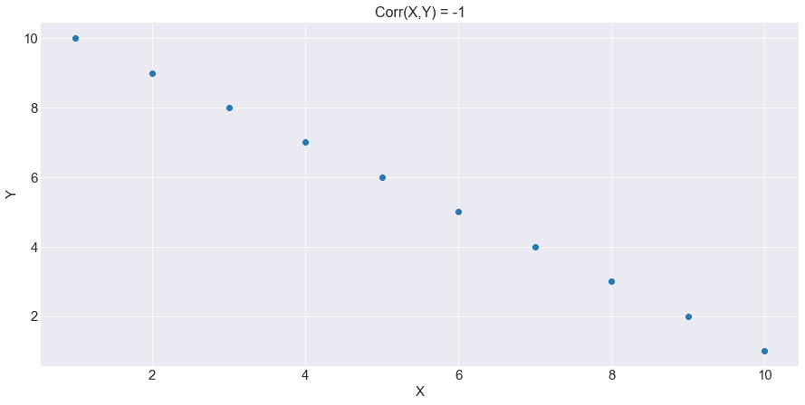
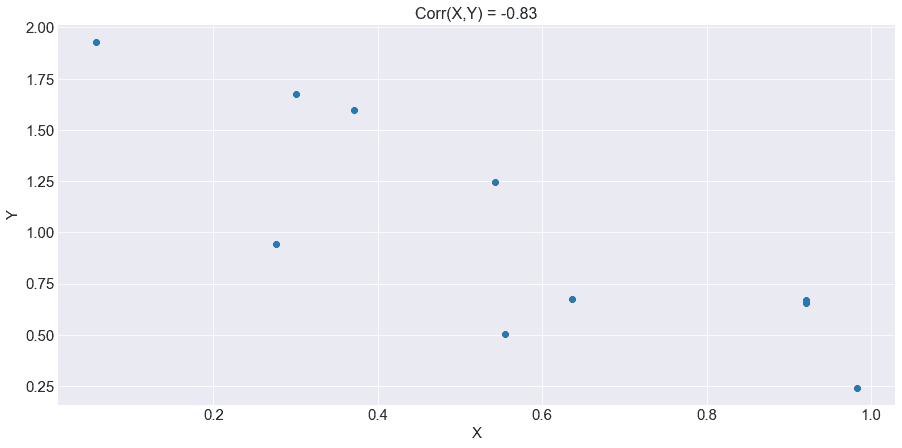
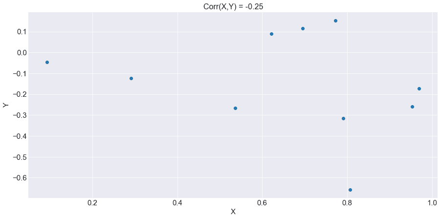
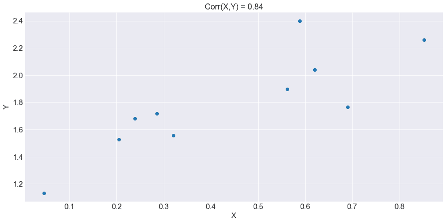
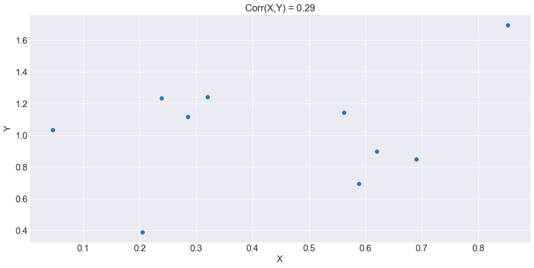

# 协方差和相关性:简介、公式、计算等等

> 原文：<https://blog.quantinsti.com/covariance-correlation/>

何塞·卡洛斯·冈萨雷斯·田中

让我们多了解你一点。你认为你需要在拳击场上看一场“协方差 vs 相关性”的比赛，这样你才能在它们之间做出正确的选择吗？

*   你是金融市场的初学者吗，想知道基本概念以便开始交易吗？
*   你知道原油是如何与美元、欧元或日元一起波动的吗？
*   你知道当世界陷入衰退时，黄金价格和利率是如何变化的吗？

无论你在行业中的地位如何，或者你有什么疑问，这篇简单易懂的文章将带你了解这两个概念:从定义和公式到交易应用，你也将准备好正确分析重要金融变量之间的关系。

所以，坐在舒适的座位上，喝杯咖啡，享受这种学习体验吧！

*   [什么是协方差？](#what-is-covariance)
*   [什么是相关性？](#what-is-correlation)
*   [协方差和相关有什么区别？](#what-are-the-differences-between-covariance-and-correlation)
*   [如何计算协方差和相关性？](#how-to-calculate-covariance-and-correlation)
*   [协方差和相关性的重要性](#importance-of-covariance-and-correlation)
*   [协方差和相关性的交易应用](#trading-applications-of-covariance-and-correlation)
*   [协方差和相关性简单练习例题](#covariance-and-correlation-simple-exercise-examples)
*   [Python 中的协方差和相关性计算示例](#covariance-and-correlation-computation-examples-in-python)

* * *

## 什么是协方差？

协方差是一种统计测量，其定义如下:它测量两个变量之间线性关联的方向。

有了这个解释，你就开始想象我们是你的老师，你举手说:“*老师，我不明白。*

别担心！让我们简化一下:它测量两个变量之间的同步方向。换句话说，你有两个变量的数据，协方差衡量这两个变量是同向还是反向移动。

我们说正协方差，如果两个变量同向变动:如果一个股票价格上涨，那么另一个股票价格也会上涨。我们说负协方差，当一个股票价格上涨，另一个股票价格向相反的方向，意思是，下跌。

关于“线性联想”这几个字，后面你就明白重点了。所以，是的，协方差可以是正的，也可以是负的。

假设我们有四种股票价格的数据:

*   亚马逊，
*   苹果，
*   沃尔玛，还有
*   微软。

在顶部，你可以看到一个正的协方差图:当亚马逊的股价上涨时，苹果的股价也朝着同样的正方向上涨。在底部，你可以看到，当微软向下移动时，沃尔玛则相反，向上移动，这意味着它们之间存在负协方差。

**问题:** *如果变量 A 和 B 有一个正的协方差，那么我们是否应该解释为每当变量 A 的值变高时，B 也“总是”变高？”*

不总是。这种直接或反向的同步也可能是强的或弱的。如果正负协方差的绝对值很大，那么我们说同步性很强，如果很小，我们说同步性很弱。

什么是强同步或弱同步？

我们能说的是，一个大的正协方差，或者说一个强的正同步性，意味着，大多数时候，两个变量会朝着同一个正方向运动。

负协方差也是如此:如果我们有两个变量的大的负协方差值，就绝对值而言，这意味着我们期望看到，大多数时候，两个变量的运动方向相反。

现在有了更清晰的定义，你有了一个推论和两个问题来测试你的知识:

1.  *协方差衡量的是两个变量之间的强关系还是弱关系？*
2.  两个变量之间能有完美的正向或反向同步吗？

对于这些问题，让我们带你去我们的另一个重要概念叫做相关性。

* * *

## 什么是相关性？

你可能会停下来，喝一口咖啡，然后对自己说:“【to】哦，这里有另一个定义，它包含了大量的信息！

嘿！完全不用担心！实际上，相关性也有类似的定义。先正式放一放。相关性衡量两个变量之间的线性关联程度。

我们知道，你很惊讶，又问:“*我们还有‘线性联想’这几个字吗？*

嘿！别急，我们以后再谈这个。现在，我们可以说:当协方差度量同步运动的方向时，相关性不仅度量同步运动的方向，还度量这种关系方向的程度，或“**强度**”。

我们稍后会看到这种“力量”是什么样子的。现在，让我们在下面表达这两个概念之间的区别:

* * *

## 协方差和相关有什么区别？

| **协方差** | **相关性** |
| 衡量一件事 | 衡量两件事 |
| 无限范围 | 有限范围 |
| 它有测量单位 | 无测量单位 |
| 可扩展值 | 不可伸缩值 |

### 区别#1:协方差衡量一件事，而相关性衡量两件事。

如上所述，协方差只测量两个变量的同步运动的方向。相关性不仅衡量关系的方向，还衡量这种关系的强度。

那么，亚马逊和苹果的股价同向或反向移动的效果如何呢？

你现在有两个技术工具来回答这个问题:

*   要找出两个变量是同向还是反向运动，可以使用协方差函数或相关函数。
*   关于这种正向或反向关系“有多好”，你需要用后者来回答这个问题。

### 区别#2:协方差和相关值范围不同。

协方差可以有一个无穷大的正值或无穷大的负值，取值范围是整个实数范围。然而，相关值范围仅在-1 和+1 之间。

所以你关于完美同步的问题可以在这里得到回答:因为协方差可以有任何实值，我们不能用这个统计量来评价两个变量之间完美的线性关联。

处理这个问题的最好方法是相关性。如果变量 A 和 B 的相关值为+1，你可以毫无疑问地说两个变量“总是”朝同一个方向运动。值为-1 的相关性也是如此:你可以毫无疑问地说，两个变量“总是”向相反的方向移动。

在这里你可以理解第一个区别。当相关性在-1 和 1 之间时，同步分别不是完全负的或正的。最后但并非最不重要的是，关于这种差异，我们必须说，几乎不可能看到现实世界中的变量具有恰好等于+1 或-1 的相关性。

### 区别#3:协方差和相关性有不同的度量单位。

你以后会从数学上理解它。现在，我们可以说协方差的度量单位是两个变量度量单位的乘积。

例如，如果你有亚马逊和苹果的两种股票价格，它们都以美元为度量单位，那么协方差的度量单位就是:美元乘以美元，也就是美元的平方。

然而，相关性根本没有任何度量单位。还不赶紧着急！啜饮你的咖啡，再等一会儿，就能完全理解这一点。

### 差异#4:如果变量的比例不同，协方差的值可能会改变，相关性不受此影响。

让我们举个例子来理解这种区别。你有两个股票价格，亚马逊和苹果，然后你计算它们的协方差和相关性，结果分别是“a”和“b”。

接下来，您决定将两个股票价格乘以 1000，并再次计算它们的协方差和相关性，结果得到值“c”和“d”。你会发现一件有趣的事情:

*   协方差“a”不同于协方差“c ”,
*   相关性“b”等于相关性“d”。

当您缩放一个或两个变量时，协方差的值会相应地改变。然而，相关性不受标度变化的影响。

* * *

## 如何计算协方差和相关性？

到目前为止，我们已经向你们解释了所有关于它们的概念和性质。但是从现在开始，你会对数学公式有更好的掌握。

首先，你必须区分什么是[总体](https://quantra.quantinsti.com/glossary/Population)和[样本](https://quantra.quantinsti.com/glossary/Sample)数据。一旦您熟悉了这两个概念，让我们从公式的演示开始:

我们从协方差开始。

**人口协方差:**

$$ \sigma_{X,Y}^{2} = \frac{\sum_{i=1}^{N}\Bigl(X_{i}-\overline{X}\Bigr)\Bigl(Y_{i}-\overline{Y}\Bigr)}{N} $$Where:
\( \sigma_{X,Y}^{2} \): Population Covariance between variables \(X\) and \(Y\).
\(X_{i}\): The \(i^{th}\) observation of the \(X\) variable.
\(\overline{X}\): The mean value of variable \(X\).
\(Y_{i}\): The \(i^{th}\) observation of the \(Y\) variable.
\(\overline{Y}\): The mean value of variable \(Y\).
\(N\): Total number of observations for variable \(X\) o \(Y\).

**样本协方差:**

$$ S_{X,Y}^{2} = \frac{\sum_{i=1}^{N}\Bigl(X_{i}-\overline{X}\Bigr)\Bigl(Y_{i}-\overline{Y}\Bigr)}{N-1} $$Where:
\( S_{X,Y}^{2} \): Sample Covariance between variables \(X\) and \(Y\). The other variables are the same as for the Population Covariance

那么，简单地说，我们如何解释协方差公式呢？这么说吧:协方差是一种度量，我们将分别由(Xi-X)和(Yi-Y)给出的 X 和 Y 的均值的每个偏差相乘，然后我们将所有这些乘积求和并除以 n

类似于变量方差的[公式](https://quantra.quantinsti.com/glossary/Variance)吧？嗯，两个公式几乎是相似的，唯一的区别是，在方差公式中，你看到的是与均方的偏差，对于协方差，你看不到平方偏差。

但是方差公式也可以写成:

$$ \sigma_{X,Y}^{2} = \frac{\sum_{i=1}^{N}\Bigl(X_{i}-\overline{X}\Bigr)^2}{N}=\frac{\sum_{i=1}^{N}\Bigl(X_{i}-\overline{X}\Bigr)\Bigl(X_{i}-\overline{X}\Bigr)}{N} $$

你明白了吗？方差和协方差公式实际上是相同的；不同之处在于第二个括号，它由第二个变量的偏差代替。方差指的是单个变量，协方差指的是两个变量，这就是为什么它被称为“协”方差。

样本协方差与总体方差相同，但我们用被除数除以 N-1，而不是 N。这种差异的解释可以在本[博客](/standard-deviation/#:~:text=normal%20distribution%20here.-,Standard%20deviation%20for%20sample%20data%20%2D%20Bessel%27s%20correction,-When%20calculating%20the)的“样本数据的标准偏差——贝塞尔的修正”部分找到。

如你所料，X 用 X 单位表示，Y 用 Y 单位表示。因为协方差公式是这两个变量的乘积，所以它将采用 XY 测量单位。

现在让我们来看看相关公式:

\( \rho_{X,Y} = \frac{\sum_{i=1}^{N}\Bigl(X_{i}-\overline{X}\Bigr)\Bigl(Y_{i}-\overline{Y}\Bigr)}{\sqrt{\biggl(\sum_{i=1}^{N}\Bigl(X_{i}-\overline{X}\Bigr)^2\biggr)\biggl(\sum_{i=1}^{N}\Bigl(Y_{i}-\overline{Y}\Bigr)^2\biggr)}} = \frac{\sum_{i=1}^{N}\Bigl(X_{i}-\overline{X}\Bigr)\Bigl(Y_{i}-\overline{Y}\Bigr)}{\sqrt{\biggl(\sum_{i=1}^{N}\Bigl(X_{i}-\overline{X}\Bigr)^2\biggr)}\sqrt{\biggl(\sum_{i=1}^{N}\Bigl(Y_{i}-\overline{Y}\Bigr)^2\biggr)}}\)$$ \rho_{X,Y} = \frac{Cov(X,Y)}{\sigma_X\:\sigma_Y} $$Where:
\( \rho_{X,Y} \): Correlation between variables \(X\) and \(Y\).
\(Cov(X,Y)\): Covariance between \(X\) and \(Y\).
\(\sigma_X\): Standard Deviation of variable \(X\).
\(\sigma_Y\): Standard Deviation of variable \(Y\).

那么，我们如何用简单的语言解释这个公式呢？你已经知道了被除数，关于除数，如果你能记住方差公式，你就能知道除数是两个变量 X 和 y 的标准差的乘积。

所以我们可以说相关性是协方差除以两个变量的标准差。你可能会认为协方差和标准差有除数“N”或“N-1”，所以你可能会认为我们写错了第一个公式。

别担心，让我们让你看看约数发生了什么:

\( \rho_{X，y } =∞\)

\( \rho_{X，y } =∞\)

\( \rho_{X，y } = \frac{\sum_{i=1}^{n}\bigl(x_{i}-\overline{x}\bigr)\bigl(y_{i}-\overline{y}\bigr)}{\sqrt{\biggl(\sum_{i=1}^{n}\bigl(x_{i}-\overline{x}\bigr)^2\biggr)}\sqrt{\biggl(\sum_{i=1}^{n}\bigl(y_{i}-\overline{y}\bigr)^2\biggr)}} \)

$$ \rho_{X,Y} = \frac{Cov(X,Y)}{\sigma_X\:\sigma_Y} $$

现在你明白了吗？协方差和标准偏差的除数相互抵消。此外，如前所述，被除数的度量单位是 X 和 y 两个度量单位的乘积。除数的度量单位也是 X 和 y 两个标准差的乘积。

因此，由于被除数和除数具有相同的 XY 测量单位，所以它们相互抵消，从而得到没有测量单位的相关值。现在你能理解之前解释的区别了吧？

此外，你现在可以理解区别#4 了。为什么？因为协方差以 XY 测量单位结束，所以无论何时改变两个变量中任何一个的比例，除数的测量单位也会随之改变。

同时，由于相关公式没有度量单位，所以您可以对这两个变量中的任何一个进行的标度更改都不会影响-1 和 1 之间的相关范围。

我们已经了解了所有这些解释，现在你可能会问:

* * *

## 协方差和相关性的重要性

好吧，你现在问这个重要的问题。答案在于经济学和金融学的本质。作为经济学的一个重要组成部分，金融是关于市场的，在这个市场中，经济主体从一个或多个市场中买卖资产。

在市场内部或市场之间，由于每天都有相同的代理人进行交易，资产可以与任何其他资产以相同或相反的方向移动。

资产价格根据代理人的行为、市场条件等而变化。如果有一个人买了 100 股苹果股票，或者有一群人因为银行挤兑而卖出他们的银行股票，那么每个人的交易不仅会对资产本身产生影响，还会对其他股票或其他市场产生影响。

市场是相互关联的，因此相关性和协方差是金融市场研究的重要组成部分。如果市场或金融资产不是相互关联的，我们就不需要考虑协同运动。

你现在不仅知道这两个概念的含义，而且知道它们为什么重要。我们达到了我们的主要目的。

所以，现在，你想交易，对吗？
*你已经准备好检查苹果和亚马逊股票价格的相关性，现在你准备好按下你的经纪人平台上的买入和卖出按钮开始投资。*你不是吗？

不要！等一下！在你做决定之前，让我们向你解释一下协方差和相关性在交易和投资中的实际应用。

* * *

## 协方差和相关性的交易应用

### 交易应用#1:投资组合波动性计算

当你开始投资多只股票时，你必须考虑你的投资组合的波动表现如何。只有当你完全理解了协方差和相关性是如何工作的，才可能计算出这个投资组合的波动性。

所以，请不要按购买键。你可以在 Quantra 上查看我们的[投资组合管理](https://quantra.quantinsti.com/course/quantitative-portfolio-management)课程，了解更多。再等一会儿，让我们向你解释更多。

### 交易应用#2:统计套利

每当你进入统计套利，你必须理解相关性和协整的定义。统计套利不利用相关性，但是理解这两个概念之间的区别非常重要。

我们关于统计套利交易的课程会解释这一切。*我们可以猜测，你现在想要开始按下买入和卖出按钮进行套利，对吗？*我们告诉过你，再等等！

### 交易应用#3:回归估计中的相关变量

在两个或多个变量之间进行回归的主要条件之一是拥有不相关的独立变量。所以，既然你已经知道了相关性的含义，现在你就能够在回归估计中出现违反这一条件的情况下纠正问题。你可以通过这门关于[用机器学习进行交易:回归](https://quantra.quantinsti.com/course/trading-with-machine-learning-regression)的课程来扩展你关于这个话题的知识。

### 交易应用#4:预测资产价格的相关性

你看，金融资产价格，与受控物理实验中的变量相反，往往会随着时间的推移而经历[状态变化](/regime-changes-webinar-michael-harris-8-october-2020/)。因此，如果你使用 2021 年的数据计算美国 2 年期国债收益率与联邦基金利率的相关性，那么 2022 年的这个值不一定是相同的。

随着时间的推移，相关性可能会有很大变化，这通常发生在不利的经济冲击或经济或金融危机中。使用相关性来预测你的下一个交易信号时要小心！

### 交易应用#5:预测资产价格回报的 ARMA 模型

那么，你听说过自回归移动平均(ARMA)模型吗？该模型试图用通过回归模型计算的过去收益估计值来预测资产价格收益，其中回归误差的[移动平均值](/moving-average-trading-strategies/)也很重要。

在这里你会了解到什么是[自协方差和自相关](/autocorrelation-autocovariance/)函数。所以为了理解这两个概念，你必须先理解这篇文章的两个概念。

自相关函数是什么样的？

请记住，相关函数是基于两个变量计算的，也请记住，ARMA 模型试图用以前的收益来预测资产价格收益。因此，如果你说这些回报可以称为 rt，那么，自相关函数可以表示为:

$$ \rho_{r_{t},r_{(t-1)}} = \frac{Cov(r_{t},r_{(t-1)})}{\sigma_{r_{t}}\:\sigma_{r_{(t-1)}}} $$

你想知道更多吗？在 Quantra 中获取关于[时间序列分析](https://quantra.quantinsti.com/course/financial-time-series-analysis-trading)的精彩课程。

### 交易应用#6:因果关系和相关性不是一回事

这是更多的交易知识，所以要注意这一点。因果关系意味着苹果股价的变动会导致亚马逊股价的变动。但是，我们这里所说的“原因”是什么意思呢？嗯，因果关系甚至在经济学中被哲学地讨论。哲学讨论到现在还没有结束。让我给你举个例子，这样你能更好地理解它。

想象一下，我们有纽约市每月的雨水量，也有纽约市每月的 GDP。你计算它们之间的相关性，得到的值是 0.95。

你可以说:*“哦，真有趣！那么，我可以说，每当这个城市下大雨时，这将导致纽约的 GDP 增加。”*没有！你不能说大量的雨水‘导致’了 GDP 的增长；或者相反，GDP 的增长会导致城市雨水的增加。

相关性只是意味着你可以找到这两个变量之间的同步模式，但这并不意味着雨水和 GDP 之间存在经济因果关系。

所以，当你作为交易者谈论相关性时，你必须记住这个概念不一定等同于因果关系。换句话说:

> 因果关系总是意味着相关，但相关并不总是意味着因果关系。

### 交易应用#7:相关性程式化事实

这也是融入你的背景知识的重要信息。当你想交易一些金融资产时，考虑一些全球相关性是很重要的。

在这里，我们向您呈现一些程式化的事实，当您想用这些资产进行交易时，请记住这些事实:

*   原油和货币:每当原油价格下跌，俄罗斯、加拿大、委内瑞拉或沙特阿拉伯等原油净出口国的货币就会下跌。然而，每当原油价格下跌时，像日本这样的原油净进口国往往会看到自己的货币升值。
*   **逃向优质资产:**每当世界某个重要国家或地区发生金融动荡时，比如 1997 年亚洲金融危机，投资者往往会将资金撤出这些高收益国家，购买美国国债。这一行动使得受影响国家的货币对美元大幅贬值，美国国债往往会大幅升值。因此，在亚洲危机中，亚洲国家的货币与美国债券价格之间存在负相关关系。
*   股票-债券负相关关系:例如，每当美国经济开始繁荣时，投资者就会重新配置他们的投资组合。他们大量投资风险更高的资产，减少对美国国债的投资。当经济进入衰退时，情况正好相反，固定收益投资增加，股票投资减少。股票和债券之间的这种负相关关系是世界各国的共同特征。
*   **黄金时变相关性:**当世界投资者更倾向于投资风险资产时，黄金与美国股市的正相关性增加。当他们变得更加厌恶风险时，由于全球经济衰退，黄金与美国股市成反比。
*   黄金和通货膨胀:当全球通货膨胀上升时，投资者倾向于增加黄金的投资组合配置，这意味着黄金和通货膨胀之间的相关性是正的。黄金具有对冲通货膨胀的作用。当通货膨胀超过预期时，贵金属会维持你的购买力。
*   **黄金和美国利率:**当美国看到其利率上升时，这意味着经济状况良好。这使得全球投资者将他们的资源分配给风险更高的资产。因此，黄金在这个时期开始贬值。我们可以说黄金和美国利率一直是负相关的。
*   **地缘政治与黄金:**每当出现影响全球的不利地缘政治冲击时，金价往往会上涨，因为这种贵金属充当了“避风港”的角色。
*   **收益-波动率相关性:**当股价下跌时，公司的负债权益比率会增加，进而使其股价收益波动率增加。股票价格收益与其波动性之间的这种负相关关系被称为“杠杆效应”。当你交易股票并想要模拟波动性时，你应该考虑这种对你的估计的影响，以便捕捉负相关。

* * *

## 协方差和相关性简单练习题

### 如何计算协方差？

你现在准备好了，对吗？好了，先说一个简单的例子。假设我们有两个资产价格，微软和特斯拉，我们有每只股票 5 天的数据。

下面我们将数据以表格的形式呈现如下:

| 日期\库存 | 微软 | 特斯拉 |
| 第一天 | Two hundred and forty | Eight hundred and fifty |
| 第二天 | Two hundred and sixty-five | eight hundred |
| 第三天 | Two hundred and fifty-five | Eight hundred and twenty |
| 第四天 | Two hundred and eighty | Eight hundred and seventy |
| 第五天 | Three hundred and one | Nine hundred |

由于我们有样本而不是总体数据，我们将使用样本协方差和相关函数。首先，我们知道我们有 5 个观测值，这就是为什么我们的 N 变量是 5。

然后，我们必须计算每只股票的平均值。我们会帮你的，这两个平均值分别是:微软 268.2，特斯拉 848。接下来，我们必须计算每个观察值与平均值的偏差，必须对每个股票进行计算:

| 日期\库存 | 微软 | 特斯拉 | 微软偏离平均值 | 特斯拉偏离平均值 |
| 第一天 | Two hundred and forty | Eight hundred and fifty | -28.2 | Two |
| 第二天 | Two hundred and sixty-five | eight hundred | -3.2 | -48 |
| 第三天 | Two hundred and fifty-five | Eight hundred and twenty | -13.2 | -28 |
| 第四天 | Two hundred and eighty | Eight hundred and seventy | Eleven point eight | Twenty-two |
| 第五天 | Three hundred and one | Nine hundred | Thirty-two point eight | fifty-two |

完成后，您可以将每个日期的两个偏差相乘，然后将所有乘法结果相加，得到协方差公式的被除数:

| 微软对平均值的偏离 | 特斯拉偏离均值 | 两个偏差的乘积 |
| -28.2 | Two | -56.2 |
| -3.2 | -48 | One hundred and fifty-three point six |
| -13.2 | -28 | Three hundred and sixty-nine point six |
| Eleven point eight | Twenty-two | Two hundred and fifty-nine point six |
| Thirty-two point eight | fifty-two | One thousand seven hundred and five point six |
|   | 协方差红利 | Two thousand four hundred and thirty-two |

**计算协方差缺少什么？**

你差不多完成了。你有了被除数，却没有除数。除数就是观察总数减一。所以让我们用(N - 1)除协方差被除数:

\( Cov(Microsoft,Tesla) = \frac{2432}{5-1} = \frac{2432}{4} \)
\( Cov(Microsoft,Tesla) = 608 \)

还记得定义吗？协方差衡量的是微软和特斯拉之间的同步运动的方向。那么从这个值中我们可以得到什么样的解读呢？我们可以说，因为 608 是一个正数，我们得出结论，这两个股票价格之间存在正的同步性。

现在你问我，微软和特斯拉之间的这种同步有多“强”？这可以用相关系数来回答。

### 相关系数怎么算？

一旦我们有了协方差值，你可以从上面记住，我们只需要微软和特斯拉的标准差。我们会用这些价值观来帮助你。微软和特斯拉的标准差分别为 23.42 和 39.62。所以应用这个公式，我们得到:

\( Cov(Microsoft,Tesla) = \frac{2432}{23.42*39.62} = \frac{2432}{928.15} \)
\( Cov(Microsoft,Tesla) = 0.66 \)

如果我们选择 0.5 作为阈值来决定相关值是接近 1 还是接近 0，这取决于研究人员，因为 0.66 大于 0.5，我们可以说微软和特斯拉之间的同步是积极的，也是强有力的。

### 在相关性定义中，我们所说的“线性关联度”是什么意思？

之前，我们向你解释过，相关性衡量两个变量之间的线性关联程度。这个解释是统计学教科书中的正式定义。

你怎么能以一种简单的理解来面对这种解释？
现在就这么办。

我们知道相关性的取值范围在-1 到+1 之间。也可能是零，对吧？让我们将这两种极端情况和一种接近于零的情况绘制成散点图:

如您所见，当相关性完全为+1 或-1 时，散点图本身就像一条线。这意味着变量 A 和 B 都有线性关系或线性关联。

如果相关性接近 1，你可以说，如果你画一条贯穿这些值的线，你会得到这条斜率为正的线。如果相关性接近-1，并且如果您绘制一条贯穿这些值的直线，您将得到一条斜率为负的直线。随着该值从 1 减小到 0，这种线性关联变得不太明显，同样，该值从-1 增大到 0。

相关性等于零或非常接近零意味着两个变量之间完全没有相关性，您还会看到这个相关值几乎是一个随机散点图。

使用我们上面的相关性定义，正相关性的强度可以理解为公式值从零趋向于+1。负相关的强度可以理解为从零到-1 的公式值。

让我们用图表来看看弱相关性或强相关性是如何表现的:

你已经看到了完全负相关的样子。现在你可以从上面的图表中看到强相关和弱相关可能是什么样子。上图显示负相关为-0.83，下图显示相关等于-0.25。

正如你所看到的，当值接近-1 时，你可以说这种负相关性很强。但是当相关性趋近于零时，在图形中看不清楚线性关联，我们也说这种负相关性弱。

接下来，让我们看看正相关的例子。上图显示了 0.84 的正相关性，下图显示了等于 0.29 的相关性。正如你所看到的，当值接近 1 时，你可以说这种正相关性很强。

但是当相关性趋近于零时，在图形中看不清楚线性关联，我们也说这种正相关性弱。

我们在上面的图表中展示了零相关的情况。现在，你可能会问我们，难道没有其他形式的不相关吗？

让我们看看另一张图表:

正如你所看到的，X 和 Y 之间的相关性为零，它同时具有正负线性关联。因此，有两种类型的相关等于零的图形:

*   随机散点图，以及
*   非线性散点图。

* * *

### 什么是好的协方差和相关值？

看到上一张图或者之前的图，你可能会问自己这个问题。你一定知道答案，所以我们在这里解释一下。实际上，对于所有情况下的协方差和相关函数，没有“好的”或“完美的”值。

例如，对于投资组合管理，股票协方差为负是一个很好的值，因此你可以在资产之间进行更好的分散。对于回归估计中的独立变量，您认为它们的相关性接近零是一个好值。

对于 ARMA 模型，您会希望自相关函数不为零，以确认模型的构建适合股票价格回报。

正如你所看到的，我们的协方差或相关性公式的好值取决于你在寻找什么:它取决于交易者或研究人员，也取决于你谈论的话题。

* * *

## Python 中的协方差和相关性计算示例

现在让我们利用真实世界的数据来计算我们的主要编程语言 Python 中的这两个重要概念:

### Python 中如何计算协方差和相关性

让我们下载微软和特斯拉的股价，用它们来进行计算:

我们首先建立环境来完成工作。如果你没有“yfinance”库，不要忘记安装它: