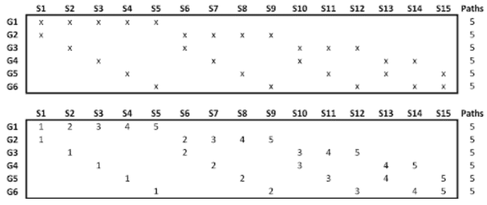

# 财务中的交叉验证:清除、禁运、组合

> 原文：<https://blog.quantinsti.com/cross-validation-embargo-purging-combinatorial/>

亚历克斯·里贝罗·卡斯特罗

交叉验证(CV)并不是一个新颖的话题，但是根据我作为数据科学家和前台从业者的经验，它是一个经常被低估和误用的统计工具。我相信，如果用适当的统计方法来处理，无数糟糕的交易想法本可以被抛弃。因此，这篇博客既是一个警示故事，也是对金融领域现代 CV 方法的快速参考。

我们将讨论以下主题:

*   [尴尬的](#embargoing)
*   [吹扫](#purging)
*   [通过交叉验证进行回测](#backtesting-through-cross-validation)
*   [组合清除交叉验证](#combinatorial-purged-cross-validation)
*   [Python 中组合清除交叉验证的例子](#example-of-combinatorial-purged-cross-validation-in-python)

机器学习中的交叉验证之前已经讨论过了，我想在这里把重点放在作为[回溯测试](/backtesting/)工具的交叉验证上。我还会提到金融领域交叉验证(CV)的一些陷阱，特别是在数据泄露和数据偷窥方面。

概括地说，CV 是一个重采样工具，旨在分配精确度的测量值(例如:偏差、方差、置信区间、预测误差等)。)到样本估计(例如:模型性能、夏普值等)。CV 是统计学中的一个老概念，随着现代计算机和机器学习的出现，它的时代似乎又回来了。

在金融领域，CV 在处理高噪声对信号的影响，以及减轻策略过度拟合导致的虚假结果方面变得尤为重要。我还应该说，CV 不仅仅限于 ML 交易模型，还可以应用于通过数据挖掘创建的基于规则的策略。

## 封（港）

我将在 CV 的上下文中交替使用这两个术语(数据泄漏和数据峰值)。这里指的是信息有意无意跨褶皱泄露的情况。当您的模型或策略包含需要大量回顾历史数据的指标时，这一点非常重要。

让我们用一个具体的例子来说明。为了具体起见，假设

*   你的模型或策略取决于一个指标，比如 63 天(或 3 个营业月)后的实际波动率
*   你的折叠是按时间顺序排列的，以 1 年为单位
*   您当前的测试或样本外折叠是第 4 年

示意性地，褶皱看起来像这样:| - 1 - || - 2 - || - 3 - |(| - 4 - |)| - 5 - |

在第 4 年和第 5 年之间，第 5 年早期计算的波动性需要的信息只能在 OOS 折叠中获得。(折叠 3 和折叠 4 之间没有问题，因为折叠 4 中所需的信息已经可用。)

处理这种意外数据泄露的一种常见方法是使用 De Prado 所说的**清除**和**禁止**。用专业术语来说，这包括去除受影响褶皱边界附近的一些数据点，但这两个过程之间有细微的区别。

还有比我在这里提到的更多的东西，因为在德普拉多的术语中，每个标记的数据点都有两个时间:交易时间和事件时间。我在上面的例子中建议的特定类型的数据删除是禁运的一个例子。(它发生在吹扫之前。)在我们的具体示例中，我将从 fold (5)中删除前 63 天左右的时间。

寓意:要意识到你的特征的时间依赖性。

## 清洗

在我们讨论清除之前，我们需要谈谈金融中的事件时间。本质上，这意味着在一个[金融时间序列](https://quantra.quantinsti.com/course/financial-time-series-analysis-trading)中的任何标记数据点都有一个交易时间和一个事件时间。事件时间通常表示资产的未来市值达到某一水平的时间，如止损或获利价格。在实践中，这意味着标签变得依赖于路径，并且需要小心，以便在计算标签时我们不会偷窥样本外折叠。

举一个具体的例子，假设我们试图建立一个 ML 模型，根据各种数据源预测 IBM 价格在未来 5 个工作日内是否会上涨或下跌至少 50 个基点。这些波动的规模是根据 IBM 股票最近的实际波动水平估算的。一个常见的标记方案是:如果股价波动超过 50 个基点，则为+1；如果股价绝对值波动小于 50 个基点，则为 0；如果股价下跌超过 50 个基点，则为-1。

接下来，让我们假设我们典型的交易期限是 1 周。你今天进入一个头寸，一周后平仓。然而在实践中，大多数人会在交易中设置止损或止盈水平，这样如果达到这两个水平，他们就可以提前退出交易。关键是，要按市值计价交易，你需要观察未来 5 天或未来 5 个基点的价格路径(你可以提前退出)。

在标记过程中，我们必须注意删除测试文件夹中事件时间与交易时间重叠的数据。这个过程称为净化。

在实践中，首先禁止数据集，然后清除它。可以通过在训练折叠之前增加测试折叠的事件时间来实现禁运。(详见德普拉多。)

**寓意** : 注意交易和事件之间的价格路径(如交易期限结束、止损、止盈等。)

关于金融领域标签建设的更多深入信息，我推荐 Quantra 的[金融数据科学&特征工程](https://www.youtube.com/watch?v=hvflqHTWXVs)介绍视频。

## 通过交叉验证进行回溯测试

一旦你制定了一个策略，不管是基于规则还是基于 ML，是时候对它进行回溯测试了。第一次，你获得了 0.5 的夏普比率(SR)，并且对你的结果不满意，你决定调整你的策略。也许，你告诉自己应该对第一个指标使用不同的阈值水平，看看会发生什么，或者对另一个 ML 超参数使用更高的值。

也许我也应该尝试不同的进出时间。最终，在多次反复调整这个或那个参数之后，您最终得到了一个“完美的”参数组合和一个夏普比率为 2.0 的策略。

**不可思议！现在你可以交易了。**

然而，在现场交易中，你的表现发生了变化:你基本上失败了，亏损了。哪里出了问题？

我用这个虚构的例子来说明过度适应策略的概念，并说明 CV 在什么地方可以派上用场，来帮助你评估你的结果的统计意义。

您可以使用相同的过程将数据分割成多个折叠，或许可以重复上述相同的过程来校准 IS 折叠中的参数，并对 OOS 折叠中的策略进行回溯测试。

您选择的参数在 Is 折叠中是否稳健？

你在 OOS 弯的表现强劲吗？

如果是这样，你就有更多的统计数据证明你的策略是正确的。(否则，你就是在瞎猜，作为量化投资者，我们不应该给事后批评留有余地。)

这个练习也能让你抛弃一些不可靠的交易参数，因为它们在后验测试中的突出表现可能是由于过度拟合。

我们在机器交易领域的大多数人都熟悉 ML 策略的 CV，但是如上所述，它也可以用于基于规则的策略。CV 启发的回溯测试的一个积极结果是，你可以获得你所研究的整个市场历史的真实表现评估——不管是 5 年的时间窗(对于日交易者),还是高频交易者 1 周的数据。

寓意:回溯测试不是一种研究工具。避免多重回溯测试中的选择偏差，因为你会错误地从随机的历史模式中获利。(相当多的金融研究仍然是由回溯测试驱动的。)

例如，De Prado 在[AFML]中就如何防止回测过度拟合提出了各种建议:

1.为整个资产类别或投资领域开发模型，而不是特定的证券

2.应用集成技术作为既防止过度拟合又减少预测误差方差的手段(参见 Quantra 关于[交易树](https://quantra.quantinsti.com/course/decision-trees-analysis-trading-ernest-chan)的课程)

3.在你的研究完成之前不要进行回溯测试

4.用各种“假设”情景对你的策略进行压力测试

5.如果回溯测试没有发现一个有利可图的策略，从头开始。

这需要更多的纪律和适当的技能，但它可能会让你免受许多挫折和浪费金钱。

## 组合清除交叉验证

金融学中标准 CV 方法的一个主要缺点是 CV 只测试单一路径。在没有市场模拟器的情况下，一种替代方法是使用一些组合技巧来生成多个回溯测试路径。

<figure class="kg-card kg-image-card kg-width-full"></figure>

对于博客的这一部分，我将提供一些 Python 代码，说明如何使用所谓的组合清除交叉验证从 1 条历史路径中构建 5 条回溯测试路径。(见上图。)我这里用一个具体的例子。

## Python 中组合清除交叉验证的示例

我们将首先下载所需的库