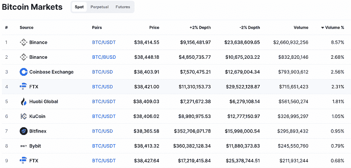

# 加密套利:概述，交易策略，机会，等等

> 原文：<https://blog.quantinsti.com/crypto-arbitration/>

苏莱曼·埃姆雷·耶希尔

加密货币套利是一个有趣的概念，具有有利的结果，但对于加密市场中的套利机会，交易者必须知道更多。在这个博客中找到一切。

我们涵盖:

*   [什么是套利？](#what-is-arbitrage)
*   [加密货币是如何交易的？](#how-are-cryptocurrencies-traded)
*   [什么是加密货币套利？](#what-is-cryptocurrency-arbitrage)
*   [市场上为什么会出现加密货币套利机会？](#why-do-cryptocurrency-arbitrage-opportunities-occur-in-the-market)
*   [如何识别加密货币套利机会](#how-to-identify-cryptocurrency-arbitrage-opportunities)
*   [加密货币市场的套利机会类型](#types-of-arbitrage-opportunities-in-the-cryptocurrency-market)
*   [如何开始加密货币套利交易？](#how-to-begin-cryptocurrency-arbitrage-trading)
*   [加密货币套利的优势](#advantages-of-cryptocurrency-arbitrage)
*   [加密货币套利的弊端](#drawbacks-of-cryptocurrency-arbitrage)

* * *

## 什么是套利？

套利意味着捕捉一种资产在不同市场之间的价格差异带来的利润机会。

假设一个资产 X 在两个市场交易，市场 A 和市场 B。如果它在市场 A 以 100 交易，在市场 B 以 105 交易，一个人可以享受无风险的 5%的利润机会，不包括交易成本。

在潜入加密货币套利之前，我们先来了解一下加密货币是如何交易的。

* * *

## 加密货币是如何交易的？

加密货币大多在集中交易所交易。用户可以出价或要求他们想要交易的加密货币，一旦特定的买卖订单匹配，买方和卖方之间就可以实现资产交换。

基于这一逻辑，加密货币在全球范围内全天候交易。相同的加密货币在数千家不同的交易所交易。

例如，您可以在下面看到 BTC 的一些交易市场:

Source: [Coinmarketcap](https://coinmarketcap.com/currencies/bitcoin/markets/)

* * *

## 什么是加密货币套利？

加密货币套利是通过同时从一个交易所购买加密货币并以略高的价格在另一个交易所出售来获利。

如果你在上面的比特币市场列表中查看价格一栏，不同交易所的价格会略有差异。尽管这些微小的差异无法吸收交易成本，但在高度波动时期，你可以体验净套利机会。

* * *

## 为什么市场上会出现加密货币套利机会？

如前所述，加密货币在全球数千家交易所进行交易。它们以不同的法定货币交易，也以主要的加密货币交易。

有几个原因导致不同市场之间的套利机会。

### 当地对法定货币转移的限制

一些国家限制资本流出该国，导致当地加密货币投资者被禁止进入该国以外的加密货币市场。这导致了当地加密货币交易所的供需失衡。

这种情况最著名的例子就是泡菜溢价。在韩国，加密货币投资者受到严格的资本管制，外国加密货币投资者不得在当地的加密货币交易所交易。因此，该国的加密货币价格偏离了其他加密货币市场。

下图显示了这种偏差。正如你所看到的，大多数时候，比特币在韩国的价格比其他市场更贵，这种情况在加密货币投资者中被称为“泡菜溢价”。

Source: [CryptoQuant](https://cryptoquant.com/asset/btc/chart/market-data/korea-premium-index?window=DAY&sma=0&ema=0&priceScale=linear&metricScale=linear&chartStyle=line). Green-Red Line: Korea Premium Index, Black Line: BTC Price in USD

### 价格的突然变化

历史证明，加密货币容易出现高价格波动。价格可以在同一天内上下浮动 20%。有时，手动下单的交易员可能无法取消订单。

此外，由于加密货币交易所之间的流动性差异，一些加密交易所对这些价格波动的反应可能会稍慢或稍快。

例如，当加密货币价格开始下降时，非流动性交易所的市场订单将导致价格下跌更严重，这可能会产生套利机会。

### 交易和转移成本

有时候虽然没有限制，没有高波动的环境，但是因为交易成本的原因，还是可以看到价格的差异。

你可能会认为，虽然价格之间存在差异，但这并不意味着存在套利机会。然而，加密货币交易所中的每个人的交易成本并不相同。

对于产生高交易量的投资者来说，加密货币交易所的交易成本通常要低得多。因此，这些价格差异对他们来说是微小的套利机会。

* * *

## 如何识别加密货币套利机会

从广义上讲，你可以通过两种方式识别套利机会，人工计算和自动筛选。

考虑到交易所和加密货币对的数量，手动计算在这里似乎不是一个选项。

识别加密货币套利机会的最佳方法是创建一个加密货币套利机器人，因为这些套利机会出现的时间非常短。

然而，这不足以捕捉套利机会。你需要在你运营的交易所同时拥有法定货币和加密货币，因为你不知道在套利机会出现的情况下，你将是哪个交易所的买方或卖方。

加密货币市场最大的好处之一是市场数据是免费的，每个人都可以通过 API 访问交易所的实时数据。你甚至不需要从头开始创建算法来连接交易所的服务器并获取实时数据。

大多数加密货币交易所都有现成的客户端软件包，使您可以通过调用软件包中的函数来获取实时数据、发送订单和检查账户余额。

例如，你可以在这里找到币安的 python 包。为了能够使用这个软件包，首先，您需要通过在计算机的终端或命令行中写入以下命令来安装它:

**“pip 安装币安-连接器”**

现在，您可以获得实时和历史数据，并使用 python 下订单。例如，使用“klines”函数获取烛台数据: