# 基于数据抽取技术的加密货币交易策略

> 原文：<https://blog.quantinsti.com/cryptocurrencies-data-strategy/>

由[瓦伦·迪瓦卡](https://www.linkedin.com/in/varun-divakar-b862a667/)

有许多来源可以获取网络上各种加密货币的数据。Quandl、Coinmarketcap、Poloniex 等来源。大多数都有 API 或。他们提供 csv 功能。您可以使用它来获取数据。今天，我们将看到如何使用 python 以一分钟的分辨率获取这些数据。

在这篇博客中，我使用 python 库 coinmarketcap 从网站[这里](https://coinmarketcap.com/)获取数据

<figure class="kg-card kg-image-card kg-width-full"></figure>

我还将讨论如何将数据保存在 dataframe 和 csv 中。最后，我解释了一个简单的策略来交易硬币。

首先，让我们导入必要的库

<figure class="kg-card kg-image-card">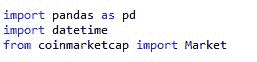</figure>

#### 您可以 pip 安装上述所有库:

pip 安装熊猫

pip 安装日期时间

pip 安装 coinmarketcap

接下来，我们将使用上面的市场函数获取数据。然后我们会把各种加密货币的名称列出来，保存在一个名为 coins_list 的列表中。

<figure class="kg-card kg-image-card kg-width-full">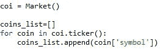</figure>

让我们把这个列表打印出来，看看里面所有的名字。

<figure class="kg-card kg-image-card kg-width-full">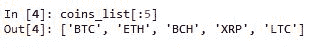</figure>

我们在这个列表上总共有 1121 种货币。

<figure class="kg-card kg-image-card kg-width-full">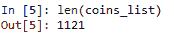</figure>

接下来，我们将获取开始时间并保存它。这是我们将运行该脚本的时间。

<figure class="kg-card kg-image-card kg-width-full">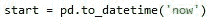</figure>

接下来，我们创建两个名为 usd *price 和 usd* vol 的字典，它们将用于存储所有 1121 枚硬币的数据。

<figure class="kg-card kg-image-card">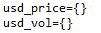</figure>

假设我想获得接下来 3 分钟的数据，那么让我们将这个时间保存为变量‘t’。

<figure class="kg-card kg-image-card">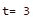</figure>

此后，我将每分钟 ping coinmarketcap 站点以获取数据，然后将其保存为 dataframe。我将在接下来的 t 分钟内继续这样做。

<figure class="kg-card kg-image-card">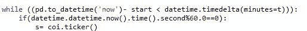</figure>

在这之后，我们创建两个字典，将硬币名称作为它们的键，美元价格和交易量作为它们的值。我们将这些值添加到相应的字典 usd *price 和 usd* vol 中，并将获取数据的时间作为它们的键。

<figure class="kg-card kg-image-card kg-width-full">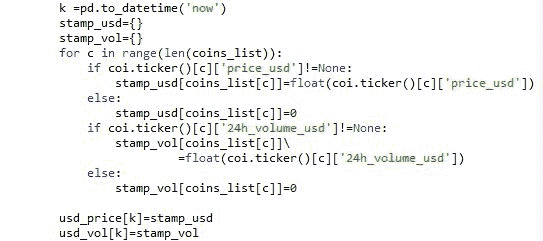</figure>

之后，我们将计算循环遍历所有货币所用的时间。这一点很重要，当运行时间超过 1 分钟时，下一次数据获取将在下一分钟发生。因此，如果我们的数据处理需要更多的时间，我们可能需要删除一些不重要或不被我们跟踪的货币，以使数据连续。

<figure class="kg-card kg-image-card">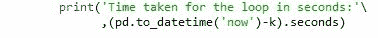</figure>

我现在将详细解释这一点。如果您一直运行该代码，输出将如下所示。

<figure class="kg-card kg-image-card kg-width-full">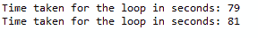</figure>

您可以打印两个字典 usd *vol 和 usd* price 来查看数据的样子。

如果我们将这些数据转换成数据帧以便更好地查看:

<figure class="kg-card kg-image-card">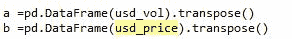</figure>

现在，打印数据帧“a”

<figure class="kg-card kg-image-card kg-width-full">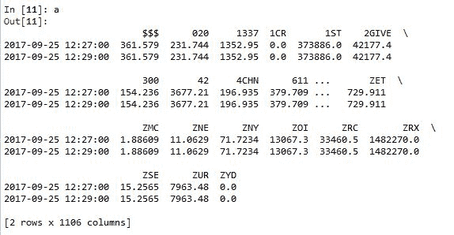</figure>

现在，观察左边的时间戳，它有 2 分钟的时间增量，这是因为当我们编写代码时，我们指定每当一分钟结束时都应该获取数据。因为，我们观察到循环时间超过一分钟，所以数据是在这之后的一分钟开始时获取的。因此，我们需要减少交易的货币。

完成后，我们可以将这些数据保存在 excel 中，以便进一步进行回溯测试。

<figure class="kg-card kg-image-card kg-width-full">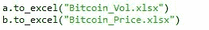</figure>

一旦有了初始数据，就可以简单地将每分钟获取的数据追加到这个数据中。

#### 加密货币交易策略:

在像[比特币](https://www.cloudwards.net/what-is-bitcoin/)这样波动性很大的市场，顺势交易是明智的。但这并不意味着一些经过深思熟虑和平衡的均值回归策略，如多空投资组合、IndexArb(创建自己的指数)等，不能应用于比特币。要了解这些策略，你可以查看我们的课程，由 E. P. Chan 博士撰写的[均值回复策略](https://quantra.quantinsti.com/course/python-mean-reversion-strategies-ernest-chan)。

在这里，我使用了一个简单的“从众”策略。这种策略的基本前提是，当市场高度波动时，通过观察交易发生的方向来跟踪市场的现有趋势是有利可图的。我们之前保存在数据框“b”中的成交量数据将有助于从假突破中筛选出真正的突破。我们将一根蜡烛线的交易量与过去 n 根蜡烛线的平均值进行比较，以检查价格的突然上涨是否与交易量的增加有关。如果是这样，那么我们假设这是一个真正的突破，沿着运动的方向交易。相反，如果交易量小于平均交易量，但回报大于过去“n”回报的标准差，那么我们认为这是假突破，逆着运动方向交易。

现在来谈谈策略。首先，让我们导入必要的库。

<figure class="kg-card kg-image-card kg-width-full">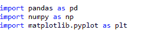</figure>

接下来，我们导入之前存储的数据。

<figure class="kg-card kg-image-card kg-width-full">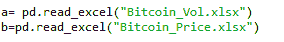</figure>

让我们从所有货币中选择一个符号进行交易，并将其保存为变量' s'。(尝试一些流动性货币，如 BTC、瑞士法郎等，因为策略取决于交易量)

<figure class="kg-card kg-image-card kg-width-full">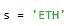</figure>

接下来，我们创建一个数据帧“data ”,它保存“s”的价格和数量信息。

<figure class="kg-card kg-image-card kg-width-full">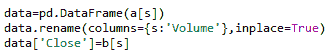</figure>

接下来，我们决定时间段来计算回报和平均交易量的标准差。

在这种情况下，我假设这个窗口是 30。

<figure class="kg-card kg-image-card kg-width-full">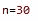</figure>

为了应用这个策略，我们需要知道回报率，所以让我们先计算一下，然后计算回报率和平均交易量的标准差。

<figure class="kg-card kg-image-card kg-width-full">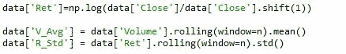</figure>

接下来，我们生成名为“Signal”的列，然后计算回报大于/小于观察到的标准偏差且成交量也高于观察到的平均成交量的信号。根据我们的基本假设，我们假设这是真实的信号。也就是说，市场是以成交量来支撑这一走势的。

<figure class="kg-card kg-image-card kg-width-full">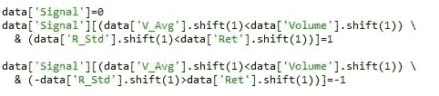</figure>

接下来，我们创造反转信号，只要突破没有相应的交易量增加，我们就逆市场趋势而动。

<figure class="kg-card kg-image-card kg-width-full">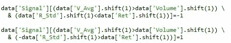</figure>

在此之后，我们创建一个新的数据帧，只保存交替的信号，并丢弃其余的信号。我们这样做是为了减少交易噪音。本质上，我们持有一个位置，直到产生一个反信号。一旦我们准备好了新的信号，我们就可以计算策略的回报。

<figure class="kg-card kg-image-card kg-width-full">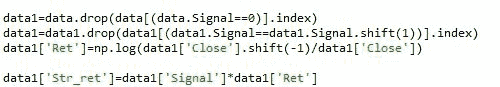</figure>

这里我们用不同于前面的方法计算回报，因为这个回报是我们根据过去的数据生成的信号执行头寸时得到的回报。这个回报会告诉你进场点之后的市场行为。

最后，我们将绘制策略回报的累计和，以直观显示策略的绩效。

<figure class="kg-card kg-image-card kg-width-full"></figure>

<figure class="kg-card kg-image-card kg-width-full">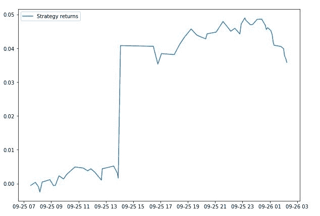</figure>

这是一个简单的策略，不建议在没有适当的风险管理的情况下用于交易。在上图中，我们成功地捕捉到了一个突破。如果你想大幅减少交易次数，我们可以尝试增加时间周期或增加信号的标准差倍数。我在 ETH(以太坊)上尝试过同样的策略，结果很有希望。

<figure class="kg-card kg-image-card kg-width-full">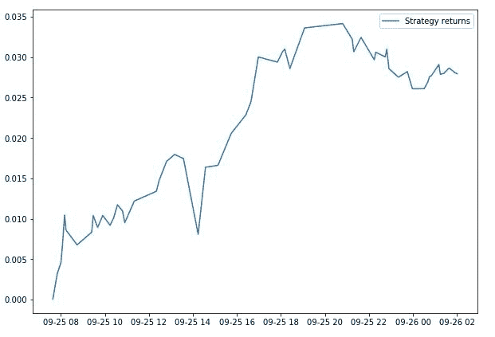</figure>

这种策略只是为了向算法交易的新手演示，在没有适当的风险管理之前不应该交易。

### **下一步**

在我们的后“[9 大加密货币交易平台](/top-9-cryptocurrency-trading-platforms/)”中，详细介绍了国际市场交易商使用的一些最佳加密货币交易平台。

*免责声明:股票市场的所有投资和交易都有风险。在金融市场进行交易的任何决定，包括股票或期权或其他金融工具的交易，都是个人决定，只能在彻底研究后做出，包括个人风险和财务评估以及在您认为必要的范围内寻求专业帮助。本文提到的交易策略或相关信息仅供参考。*

### **下载 Python 代码**

*   加密货币交易策略- Python 代码