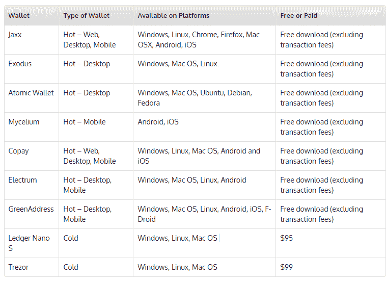

# 加密货币钱包-初学者指南

> 原文：<https://blog.quantinsti.com/cryptocurrency-wallets-beginners-guide/>

作者:[沙古塔·塔西尔达](https://www.linkedin.com/in/shaguftatahsildar/)

这篇博客解释了什么是加密货币钱包以及如何使用它们。它涵盖了从加密钱包的功能到使用它们的风险，还列出了最流行的加密钱包及其功能。 **<u>话题覆盖</u> :**

*   [什么是加密货币？](#What-are-Cryptocurrencies?)
*   [什么是加密货币钱包？](#cryptocurrency-wallet)
*   [加密货币钱包是如何工作的？](#wallet-working)
*   [加密货币钱包的种类](#wallet-types)
*   [选择加密货币钱包前需要考虑的参数](#parameters-wallet)
*   [使用加密货币钱包的风险](#wallet-risks)
*   [流行的加密货币钱包](#popular-wallets)

从物物交换体系开始到黄金，再到纸币，现在我们已经到了加密货币时代。随着超过 1300 种加密货币的出现，探索这个领域是绝对必要的。但是为什么加密货币会如此受欢迎呢？为了理解这一点，让我们首先了解加密货币实际上是什么！

### **什么是加密货币？**

让我们把这个词分解一下来理解它。“Crypto”通常指加密技术，它涉及使用加密技术来保护不同实体之间的交易，而 currency 则指货币。因此，[加密货币](https://quantra.quantinsti.com/course/crypto-trading-strategies-intermediate)是一种通过加密进行保护的货币，可以在实体之间基于[区块链技术](https://blog.quantinsti.com/will-blockchain-change-stock-markets)进行数字或虚拟交易。就像我们有在线钱包来存储我们的数字货币一样，我们需要特殊的钱包来存储、发送或交易加密货币。

### **什么是加密货币钱包？**

如果一个人希望存储、使用、出售或购买加密货币，加密货币钱包是必要的。我们知道，加密货币使用加密机制来保护交易。由于这个原因，它涉及到使用私钥和公钥。但是这些是什么？公钥充当个人的账户标识符，而私钥充当使用加密货币所需的密码，类似于 ATM pin。发送者将需要接收者的公钥来向他发送加密货币，并且接收者将能够通过使用私钥来访问和使用这些加密货币。必须保护私钥，以避免诸如黑客攻击、窃取加密货币等欺诈行为。加密货币钱包用于存储这些密钥，使用这些密钥进行加密货币交易。加密钱包显示钱包中加密货币的数量，从而使人们能够监控余额。

### **加密货币钱包是如何工作的？**

与允许用真实货币或美元和欧元等货币买卖加密货币的[加密货币交易所](https://blog.quantinsti.com/top-9-cryptocurrency-trading-platforms/)不同，加密钱包用于存储、发送和接收加密货币(一些加密钱包可能内置了加密货币与真实货币之间的转换交易所)。一旦你从交易所购买了加密货币，它就会存储在你在交易所的账户中。但是，不建议将加密货币存储在交易所提供的钱包中，因为在这种情况下，交易所将拥有您的私钥，而不是您。因此，您可以将它转移到您自己的加密钱包中，以获得对您所拥有的加密货币的控制权。为此，您需要首先在您的钱包上生成一个公钥和一个私钥，然后您可以使用这个公钥地址将您的加密货币从交易所转移到您的钱包。完成后，您就可以轻松地执行交易，使用其他帐户的公钥向其发送加密货币，并通过与发送者共享您的公钥向您的帐户接收加密货币。公钥的作用类似于电子邮件地址，它是特定帐户的标识符。另一方面，私钥就像一个密码，你可以用它来访问你的个人电子邮件帐户。私钥用于访问您的加密货币，这就是为什么绝对有必要保持它的安全和秘密，以避免黑客攻击，盗窃和其他攻击。

### **加密货币钱包的种类**

密码可以大致分为两种类型，热钱包和冷钱包。这两种类型的主要区别在于，热钱包是连接到互联网或在线的，而数据是以离线模式存储在冷钱包中的。这些钱包又可以分为以下几类:

*   **桌面钱包(热门钱包)**

就像我们安装任何其他软件一样，这些软件被安装并存储在计算机和笔记本电脑上。然而，桌面钱包有受到计算机病毒或恶意软件影响的风险，因此总是推荐使用防病毒软件和强大的防火墙。一些例子是出埃及记，Jaxx，Electrum 等。

*   **手机钱包(热门钱包)**

这些钱包基本上是移动应用程序，可以在任何移动设备上轻松下载。这些软件比桌面软件更容易使用，也更轻便。一些移动应用程序可能也有其桌面或网络版本。移动钱包的几个例子是菌丝体，Coinomi，绿色地址等。

*   **网络钱包(热门钱包)**

这些钱包是作为加密货币交易的在线平台提供的，可以通过谷歌 Chrome、Mozilla Firefox 等网络浏览器访问。这些钱包风险更大，因为它们连接到互联网，在线存储你的私人密钥，很容易受到黑客攻击和在线攻击。一些可用的网络钱包有比特币基地、BitGo、Copay 等。

*   **纸质钱包(冷钱包)**

纸钱包指的是你的公钥和私钥的物理拷贝，它可能只是一张纸。这也指通过软件生成的私有和公共密钥的任何打印副本。它被认为是最安全的钱包之一，因为它不容易在网上丢失你的私人钥匙。它也可以由 QR 码组成，可以在执行任何交易时使用。

*   **硬件钱包(冷钱包)**

像 USB 这样的设备符合硬件钱包的条件。由于私钥和公钥物理上存储在一些硬件设备中，它们提供了更高的安全性，因为它们不太容易受到在线攻击，因此是最安全的选择。这些可以通过电脑连接，并与在线软件一起使用。

### **选择加密货币钱包前需要考虑的参数**

*   **支持的硬币**

您可以根据钱包支持的硬币或加密货币以及您可能有兴趣交易的硬币来选择钱包。每个钱包都支持或验证某些类型的加密货币的交易，如比特币、以太坊、Ripple 等。一些钱包也可能只针对一种加密货币，并允许只涉及该加密货币的交易。

*   **交易成本**

这是选择加密货币钱包的最重要的决定因素之一。交易费用因钱包而异，因此在开始使用钱包之前必须了解交易费用。交易成本可以是固定的、动态的或用户定义的。固定成本可以直接以特定金额给出(例如:0.0005 BTC)，也可以指定为百分比，具体取决于您的交易金额(例如:交易金额的 5%)，动态成本可能取决于网络拥塞、矿工可用性等因素。并且将相应地变化。用户自定义交易费用由用户根据交易的紧急程度决定；用户设定的交易成本越低，完成交易所需的时间就越长，反之亦然。

*   **匿名**

使用加密货币的最大优势之一是其底层技术；区块链，为加密货币用户提供匿名性。但实际上是不可能追踪任何身份的吗？即使您的身份与您在区块链上的公开地址没有直接联系，有人也可以跟踪到您的公开地址的交易，并使用该地址识别您的 IP 地址，最终追踪到您的身份。因此，钱包可以提供为不同的交易生成多个公共地址的能力，使得很难使用不同的公共地址来跟踪那个人的身份。

*   **备份功能**

如果您丢失了私钥，您将面临丢失全部数据和存储的加密货币的风险，因为如果没有私钥，您将无法访问它们。有些钱包具有备份功能，以防万一你丢失了私人钥匙等数据。某些钱包提供使用密码恢复数据等功能。

*   **分层确定性钱包**

我们已经讨论了与在区块链上获得匿名相关的问题，并且还提到了一种解决方案，即生成用于交易的多个公共地址。分级确定性加密钱包或 HD 加密钱包是能够使用一系列计算来创建多个私有和公共地址的钱包，从而在区块链上保护您的隐私。它们还提供了一种功能，通过使用种子短语(将您的私钥转换为一系列单词)来帮助找回丢失的加密钱包。

### **使用加密货币钱包的风险**

*   **欺骗**

欺骗是指恶意软件试图在发送者不知情的情况下更改发送者的地址，从而使一个人在加密钱包中将加密货币交易到错误的地址。由于缺乏安全协议，加密钱包可能容易受到这种攻击，这使得绝对有必要检查加密钱包提供的安全程度。

*   **遗失加密钱包**

丢失钱包会导致个人公钥和私钥的丢失，这反过来意味着丢失您存储的加密货币。在你的私钥被加密或保护的情况下，任何人都不可能破解你的私钥，因为它有 2^256 的可能性。然而，如果你的私钥被其他人知道，那么就有可能访问和使用你存储的加密货币。

*   **集中式结构**

由于所有公共地址都存储在区块链上，黑客跟踪公共地址上的交易变得更加容易，这使得黑客能够识别大量的地址，从而使这些公共地址成为易受攻击的目标。

*   **交易费用**

如前所述，交易成本在选择加密钱包时发挥着巨大的作用，因为一些钱包收取高达 50%的交易费。忽视这些细节可能会导致不可逆转的巨大损失。

*   **冲销付款**

由于这些支付是不可逆的，因此输入正确的收款人公共地址至关重要，因为支付一旦完成就无法撤销，并且在加密钱包中输入错误地址的情况下可能会导致损失。

### **流行的加密货币钱包**

*   [**Jaxx**T3】](https://jaxx.io/)

**支持的加密货币:**BTC ETC，ETH，LTC 等更多在此列出。

**功能:**——可在 Windows、Linux、Chrome、Firefox、Mac OSX、Android、iOS 等多个平台上使用。-允许通过 Shapeshift 在比特币、以太和 DAO 之间转换。-不在中央服务器上存储用户钱包的详细信息，从而提供更高的安全性。

*   [**出埃及记**](https://www.exodus.io/)

**支持的加密货币:** BTC、LTC、ETH、DASH、XRP、[更多](https://support.exodus.io/article/96-exodus-wallet-roadmap)。

**特点:** -内置兑换将 altcoins 转换为比特币-直观易用的界面-加密私钥，安全性更高。-可在 Windows、Mac OS 和 Linux 上使用。

*   [**原子钱包**](https://atomicwallet.io/)

**支持的加密货币:** BTC，ETH，XRP，XMR 还有很多[更多](https://atomicwallet.io/assets)。

**功能:** -称为原子交换的内置交换功能-由于加密的私钥，安全性更高-目前可在 Windows，Mac OS，Ubuntu，Debian，Fedora 上使用，并很快推出 Android 和 iOS 的移动钱包。-能够通过 Changelly 和 ShapeShift 购买美元和欧元加密货币。

*   [**菌丝体**](https://wallet.mycelium.com/)

**支持的加密货币:** BTC

**特点:** -极大的安全性，因为硬币存储在本地钱包中，第三方无法访问。-可以与 Trezor 或 Ledger 等冷存储选项集成-提供五种不同类型的帐户，如 HD、Bit ID、单地址、“仅观看”帐户和硬件帐户。你可以在这里阅读更多关于他们[的信息。-提供一个名为“菌丝体本地交易者”的分散式面对面交易平台，实现买卖双方之间的交易，并根据交易计算信誉等级。-这是一款可在 Android 和 iOS 上使用的移动加密钱包。](https://wallet.mycelium.com/service.html)

*   [**共付额**](https://copay.io/)

****支持的加密货币:**BCH BTC**

****功能:** -多签名钱包，具有共享钱包的功能。-允许安全的应用内钱包生成和备份，因为它是一个分层确定性(HD)加密钱包。-安全存放多个不同的钱包。-在 Windows、Linux、Mac OS、Android 和 iOS 上可用**

*   **[**驻极体**](https://electrum.org/#home)**

****支持的加密货币:** BTC**

****功能:** -加密私钥-可用冷存储-可在 Windows、Mac OS、Linux、Android 上使用-支持第三方插件、Multisig 服务等。**

*   **[**格林地址**](https://greenaddress.it)**

****支持的加密货币:** BTC**

****特点:** -它是一个 HD(分级确定性钱包)从而提供良好的安全性。-可在 Windows、Mac OS、Linux、Android、iOS 和 F-Droid 上使用。-即时交易确认。-双重认证带来更高的安全性。-允许创建纸质钱包备份。**

*   **[**莱杰纳米 S**T3】](https://www.ledger.com/products/ledger-nano-s)**

****支持的加密货币:** BTC、BCH、ETH、LTC 和[更多](https://www.ledger.com/pages/supported-crypto-assets)。**

****特点:** - HD multisig 硬件加密钱包。-紧凑型 USB 加密钱包。-支持第三方应用程序-兼容 Windows、Linux 和 Mac OS。-使用 24 字恢复短语轻松备份和恢复**

*   **[**存储库**](https://trezor.io/)**

****支持的加密货币:** BTC、瑞士联邦理工学院、XRP、BCH 和[更多](https://trezor.io/coins/)。**

****特点:** -允许离线存储的硬件钱包。-由于有 12-24 个单词的恢复短语，因此很容易访问。-能够生成许多公共地址。-兼容 Windows、Linux 和 Mac OS。**

****

**我们已经在这个博客中介绍了与加密钱包相关的主要概念。然而，围绕加密货币的话题有很多误解。[这门](https://quantra.quantinsti.com/course/crypto-trading-strategies-intermediate)课程解释了一切，从加密货币的基础知识和加密钱包的工作原理到开发和回溯测试[加密货币交易](https://quantra.quantinsti.com/course/crypto-trading-strategies-advanced)策略，如 [Ichimoku 云策略](https://blog.quantinsti.com/ichimoku-cloud-trading-strategy)。**

***免责声明:本文中关于加密货币的任何信息仅用于传达一般信息。本文不提供投资、法律、税务等。建议。您不应将本文中的任何信息视为就加密货币使用、法律事务、投资、税收、加密货币开采、交易所使用、钱包使用等做出任何特定决定的呼吁。我们强烈建议向您自己的财务、投资、税务或法律顾问寻求建议。QuantInsti 和本文作者均不对因依赖本文发布或链接的信息而导致的任何损失、损害或不便承担责任。***