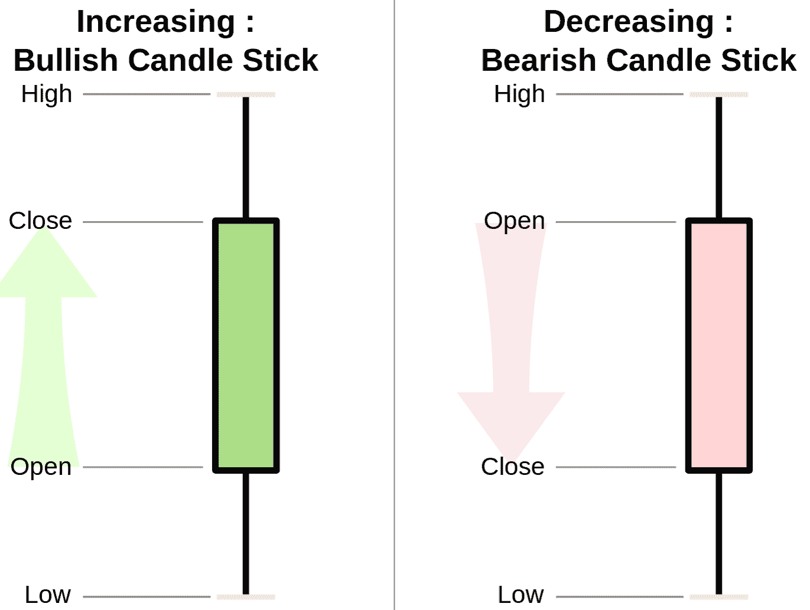

# 初学者指南:如何进行日内交易？

> 原文：<https://blog.quantinsti.com/day-trading/>

由[查尼卡·塔卡](https://www.linkedin.com/in/chainika-bahl-thakar-b32971155/)

在这篇文章中，我们将详细讨论日内交易实践。虽然日内交易原则可能很简单，但要使你的策略更好确实需要时间和努力。

如果你是金融市场新手，我们建议你先了解金融市场的[基础知识。](/financial-markets-introduction/)

让我们在这篇 covers:‌的文章中找出作为日内交易者交易的必要方面

*   什么是日内交易？
*   [新手日交易](#day-trading-as-a-beginner)
*   [什么都可以交易？](#what-all-can-be-traded)
*   [最佳日交易股票的特征](#characteristics-of-the-best-day-trading-stocks)
*   [日内交易策略](#day-trading-strategies)

## 什么是日内交易？

日间交易指的是在同一个交易日内买卖金融工具的证券投机行为。在日交易中，为了避免在非交易时间由于不可预见的事件而可能发生的损失风险，所有头寸都必须在当天市场关闭前平仓。例如，日交易者可以避免当天收盘价和第二天开盘价之间的价格差距，这可能会影响决策。

现在让我们来看看适合新手的日间交易练习。

## 作为初学者的日内交易

任何领域的初学者都需要尽可能多地收集该领域的知识。虽然可以从经验中获得很多，但我们将讨论这些信息，这可能有助于您作为初学者顺利完成您的旅程。该信息与以下几点有关:

*   先决条件
*   技能
*   需要考虑的事项
*   阅读蜡烛图
*   风险和资金管理
*   订单类型

### 先决条件

有一些先决条件，每天交易者在开始练习时必须检查，因为这些是帮助你有效操作的要素。这些是:

*   个人电脑
*   经纪人
*   Demat 帐户
*   可靠的互联网连接

**PC**

PC 的技术规格应该是有利的，例如 RAM 和操作系统。此外，由于分析市场很重要，每天的金融市场分析屏幕应该看起来很舒服。

**经纪人**

你必须为你的日内交易选择正确的经纪人，在我们关于[算法交易指南](/algorithmic-trading-retail-traders/#Brokers-Algorithmic-Trading)的博客文章中，我们有一份来自印度、美国、英国、欧盟和加拿大的可靠经纪人名单。您可以查看这里提到的代理和 API。

**Demat 账户**

如果您不是通过经纪人进行交易，您可以在您的银行合作伙伴处开立 Demat 账户。这是因为经纪人会为你提供这样的设施。

**可靠的互联网连接**

一个可靠的互联网连接是日内交易的最重要的先决条件之一，因为你不希望你的互联网服务器在你交易过程中出现故障。

### 技能

拥有一套技能不仅对日内交易者是非常重要的，对任何领域的专业人士也是如此。

进行交易通常需要一些技能，但要想成功地进行日间交易，你需要具备以下条件，才能顺利进行交易:

*   交易/金融市场知识
*   快速做出决策，以便抓住市场机会
*   执行交易策略的数学技巧
*   预测和分析市场趋势的知识
*   风险管理和资金管理的专业知识
*   资产管理技能
*   决定交易策略的计划技巧

### 需要考虑的事项

日内交易本身带来了很多作为初学者需要注意的事情。首先，让我们讨论一些简单但非常有用的事情，你可以在从事日内交易时注意:

*   只交易最适量的钱
*   被告知
*   保住你的日常工作
*   有足够的时间跟踪市场

**只交易最佳金额的资金**

你必须用那些不会让你失去财富或让你陷入债务的钱来交易，因为一旦亏损，你将无力偿还。

你不能在每笔交易中冒险投入太多资金。你需要知道你交易的仓位大小。

这里的[仓位大小](https://quantra.quantinsti.com/course/position-sizing-trading)意味着你在交易中持有的股票数量。在决定股票数量之前，你必须考虑作为投资者的账户规模和风险承受能力。这样，你可以在进场时设置止损价格。

通常，风险资金/交易风险=最佳头寸规模

风险资金是你能够承担风险的金额，交易风险是市场交易的总体风险。

**被通知**

在你开始日内交易之前，你必须具备最大化收益所需的知识。你必须充分了解你计划交易的股票的走势，以及[股市](https://quantra.quantinsti.com/course/stock-market-basics)中任何可能影响股价的不太可能发生的事件的最新消息。

为了保持消息灵通，应该随时查看业绩公告，因为这样，投资者可以在分析上一季度或年度业绩后投资证券。通过这种方式，日间交易员可以在分析公司提供的财务补充/披露后，分析股票回报的可行性。可以评估回报率指标，如 RoE(股本回报率)、股息支付率、运营效率、P/E 比率等，以便做出明智的决策。

另一个重要的获得信息的方法是在交易中借助情绪分析。通过分析新闻和推文描绘的情绪，你可以创建这样的交易策略，这将有助于你获利。情感分析最好可以通过各种机器学习技术来完成，比如[自然语言处理](https://quantra.quantinsti.com/course/natural-language-processing-trading)，分类和支持向量机。然后，可以使用 VADER 等技术计算情感得分。这在我们的[交易情绪分析学习课程](https://quantra.quantinsti.com/learning-track/sentiment-analysis-trading)中有很好的解释。

**保住你的日常工作**

作为初学者，你可能不会很快熟悉股市的所有涨跌。开始的时候，你可能运气不错，可以在市场上维持下去。这种可能性更大，尤其是在有利的市场环境下。虽然，在市场形势不利的情况下，你的策略实际上会受到考验。看完了市场的所有涨跌，如果你觉得你可以全职交易下去，那就暴跌吧。

**有足够的时间跟踪市场**

在日内交易中，你需要投入的最重要的事情就是你的时间。这段时间用来跟踪市场，寻找合适的机会。因为这些机会在交易时间的任何时候都会出现，所以你需要保持警惕。

### 阅读蜡烛图

阅读[蜡烛图](/candlestick-patterns-meaning/)是这里的另一个重要话题。当你日内交易时，你必须知道烛台上不同的点是什么意思。如你所见，在下图中，有两个烛台。一个看涨，一个看跌烛台。让我们找出方法。

<figure class="kg-card kg-image-card"></figure>

[维基媒体公社](https://commons.wikimedia.org/wiki/File:Candlestick_chart_scheme_03-en.svg)

每个点描述了:

*   高价意味着在此期间交易的最高价格。
*   低价意味着交易的最低价格。
*   开盘价描绘了蜡烛线形成后的第一个交易价格。如果价格与前一天的收盘价相比呈上升趋势，蜡烛将变成绿色/蓝色。另一方面，如果价格下跌，蜡烛会变红。
*   收盘价意味着蜡烛线形成期间的最后交易价格。如果收盘价低于开盘价，蜡烛就会变红。反之，如果收盘价高于开盘价，蜡烛线将变成蓝色/绿色。

左图显示了看涨的烛台，描绘了开盘价高于前一天的收盘价。然而，右边的图像显示了一个看跌的烛台，描绘了一天结束时的收盘价低于开盘价。

### 风险和资金管理

风险和资金管理是交易中最重要的两件事，日内交易者需要具备同样的知识。

在这里，我们将讨论一些重要的交易领域的事情，可能有助于获利日交易实践:

**票据交易**

由于[纸交易](/paper-trading/)是一种使用虚拟货币的交易行为，所以参与纸交易是最安全的。所谓虚拟货币，我们指的是不能在现实世界中交易，但可以用来进行纸面交易的货币。纸面交易平台要么是技术公司，要么是由[在线经纪商](https://money.com/best-online-stock-trading/)提供的演示交易功能。它们或者以虚拟游戏的形式提供纸面交易，或者以一般的方式提供纸面交易账户，作为对真实交易账户的补充。

**目标利润分析**

你还必须做一个目标利润分析，而日间交易，这意味着找出估计的业务活动，以执行，以赚取目标金额的利润。

找出目标利润分析的公式:

SpQ = VeQ + Fe +Tp

这里，

Sp =单位销售价格

Q =在此期间生产或销售的数量

Ve =制造和销售每单位产品的可变费用

Fe =固定费用总额

Tp =目标利润

**保证金杠杆**

通常，日内交易者也可以利用[保证金](https://en.wikipedia.org/wiki/Margin_(finance))杠杆。

保证金是投资者要求存入交易对手(经纪人或交易所)的抵押品，用于覆盖交易对手在金融市场可能面临的风险。

另一方面，杠杆意味着投资者在经纪人或交易所的帮助下卖空或购买高于保证金的证券。在这里，[卖空](https://quantra.quantinsti.com/course/short-selling-in-trading)意味着投资者如果认为标的资产的价格在未来会下跌时所使用的策略。在美国，投资者可以以 2:1 的比例(最高)进行初始杠杆操作，这是[法规 T](https://en.wikipedia.org/wiki/Regulation_T) 所允许的。要了解详细信息，你也可以看看我们关于[算法交易规则-美国](/algo-trading-regulations-us/)的博客文章。

但是，如果你使用保证金杠杆，就会有追加保证金的风险，我们接下来会讨论这一点。

**追加保证金通知**

在保证金杠杆的情况下，交易者可能有[保证金通知](https://en.wikipedia.org/wiki/Margin_calls)的风险。经纪人在估计市场风险后，不断修正担保证券的价值。追缴保证金意味着，每当担保证券的市场价值低于修订后的保证金时，需要将投资者方的额外资金纳入保证金账户。

例如，如果投资者持有的投资组合贬值到低于经纪人的保证金要求，那么就要追加保证金。因此，投资者可以选择存入保证金或清算现有资产。

因此，你必须在一天结束时检查你能承受的损失后，再决定要杠杆的保证金数额。

**订单类型**

接下来，您必须了解订单类型，并根据您的偏好决定要选择的订单类型。

你不能冒险超出你当天的既定上限。一旦你达到上限，你需要停止交易。

例如，如果你输的钱超过了你赢的钱，那你就彻底输了。例如，如果你在盈利的一天赚了 200 美元，在亏损的一天，你的亏损不能超过 200 美元。

为了确保您最终不会损失超出您承受能力的资金，让我们来看看几种订单类型，它们是:

*   市场定购单
*   限价订单
*   止损单
*   限价止损单
*   括号顺序

**市场订单**

在市价单中，交易者或投资者指示经纪人或交易目的地立即以市场上的最佳时价买入或卖出股票。因此，当订单执行的确定性优先于执行价格时，使用市价订单。

例如，一个投资者下单购买 1000 股 XYZ 股票，而最佳报价是每股 3 美元。如果先执行其他订单，投资者的市价订单可能会以更高的价格执行。

**限价单**

限价订单是以特定或更好的价格买入或卖出股票的[订单](https://quantra.quantinsti.com/glossary/order)。买入限价单只能以限价或更低的价格执行，卖出限价单只能以限价或更高的价格执行。如果获得一个特定的价格比成交更重要，限价单是合适的。

例如，一个投资者想以不超过 70 美元的价格购买一只 ABC 股票，这只股票目前的交易价格是 75 美元。投资者发出限价单，以 70 美元的价格购买 ABC 的股票。如果 ABC 股票价格跌至 70 美元或以下，订单将被执行。如果价格从未降至 70 美元或以下，订单将不会执行。下限价单有风险；如果股票跌到 71 美元，之后又涨到 100 美元。投资者可能会错过从 71 美元涨到 29 美元的机会。

**止损单**

止损单是在股票价格达到指定价格(称为止损价)时买入或卖出股票的订单。止损价格不是止损单的保证执行价格。止损价格是导致止损单成为市价单的触发器。

例如，假设你以每股 50 美元的价格购买了 XYZ 的股票，你担心它会下跌，如果价格跌至每股 45 美元以下，你可以使用止损单卖出，以保护自己免受更大的损失。风险在于，如果价格下跌非常快，并且在你之前已经有其他订单，股票最终可能会以低于 45 美元的价格卖出。

**限价止蚀单**

投资者可以通过设置止损限价单来避免订单以意外价格执行的风险。止损限价单结合了止损和限价单的特点。一旦达到止损价格，止损限价单就会变成限价单，以指定的价格执行。

例如，假设你以每股 50 美元的价格购买了 XYZ 股票。你不想每股损失超过 5 美元，所以你设置了 45 美元的止损限价单。如果股价跌至 45 美元，止损价格就会触发限价单，在 45 美元卖出。如果价格迅速跌至 45 美元以下，限价将确保你不会以更低的价格出售。限价单只会在股价再次达到 45 美元时执行。

**括号顺序**

支架订单旨在投资者可以通过将一个订单与两个相反的订单“支架”在一起来限制他们的损失并锁定利润。

买入挂单:买入挂单由通常高于买入挂单价格的卖出限价挂单和通常低于买入挂单价格的卖出止损挂单组成。这使得投资者可以通过上涨锁定利润，限制下跌损失。

卖出委托单:卖出委托单由一个较高价格的买入止损委托单和一个较低价格的买入限价委托单组成。

例如，如果你以 50 美元的价格买入一只股票，以 55 美元的价格卖出限价单，以 45 美元的价格卖出止损单。如果价格上升到 55 美元或下降到 45 美元，头寸将被卖出。交易者要么通过限价单获得 5 美元的收益，要么通过止损单遭受 5 美元的损失。

接下来，让我们讨论一下在金融市场上可以交易什么。

## 什么都可以交易？

在我们之前关于金融市场简介的文章中，我们已经详细介绍了在交易所交易的内容。在这里，我们列出了一些你可以交易的市场，并简要解释了它们。

作为日内交易者，你可以探索如下市场:

*   外汇
*   股票
*   加密货币
*   商品
*   结合

### 外汇

外汇市场是世界上最受欢迎和最具流动性的市场。在这个市场上，你可以用印度卢比、英镑、美元和欧元等货币进行交易。

通过我们免费的[外汇交易课程](https://quantra.quantinsti.com/course/forex-trading-python-basics)，学习创建和回溯测试您在外汇市场的交易策略。

此外，这里有一个简短的视频，解释如何使用 Python 进行外汇交易:

<figure class="kg-card kg-embed-card">

[https://www.youtube.com/embed/mWA4a4Afezc?feature=oembed](https://www.youtube.com/embed/mWA4a4Afezc?feature=oembed)

</figure>

### 股票

股票市场为你提供了投资属于同一行业或不同行业的不同公司股票的机会。你可以投资常规和杠杆 ETF、期货和股票期权。

如果你想了解更多关于如何选择股票进行日内交易的信息，你必须观看下面这段来自 Quantra 的视频:

<figure class="kg-card kg-embed-card">

[https://www.youtube.com/embed/TJni2fxrEMY?feature=oembed](https://www.youtube.com/embed/TJni2fxrEMY?feature=oembed)

</figure>

‌ ‌

### 加密货币

第三个市场是加密货币市场。投资这个市场会给你带来大量交易比特币和以太坊等加密货币的机会。

为了更好地了解加密市场，您可以选择 Quantra 上的这三个课程:

*   [量子加密货币交易](https://quantra.quantinsti.com/learning-track/cryptocurrency-trading-for-quants)
*   [中级课程](https://quantra.quantinsti.com/course/crypto-trading-strategies-intermediate)
*   [加密交易策略:高级](https://quantra.quantinsti.com/course/crypto-trading-strategies-advanced)

您还可以从本博客中获得一些关于印度加密货币市场之旅的知识。

### 期货

投资[期货合约](https://quantra.quantinsti.com/glossary/Futures)是日间交易的另一个选择。

### 商品

最后但并非最不重要的是商品交易。在日内交易中，你可以投资石油和天然气、农产品、金属、矿产等商品。此外，你可以在商品市场投资从黄金到可可的任何东西。如果你想了解这个话题，你可以参考我们关于商品市场的详细博客。

### 结合

债券是固定收益证券，公司或政府(称为债券发行人)通过它向投资者(称为债券持有人)筹集债务。

有不同类型的债券，如不支付利息的债券(零息债券)、可在指定到期日之前赎回的债券(T2)、可赎回债券(T3)、可转换为公司股票的债券(T4 可转换债券(T5))等。大多数公司或政府债券在交易所公开交易，其他的在场外交易。

接下来，让我们看看最好的日交易股票具有哪些特征。

## 最佳日交易股票的特征

在寻找最好的日内交易股票时，你必须知道使它们适合日内交易的特征。这些特征是:

*   跟踪良好的股票
*   良好的音量
*   中等至高波动性

### 跟踪良好的股票

一只被你很好跟踪的股票，在各种因素的背景下，比如波动性、价格变化触发因素等，都会是你熟悉的股票。

### 良好的音量

高交易量的股票会带来流动性，而流动性是一个让你，作为一个交易者，在不影响价格的情况下买卖股票的因素。市场上的高交易量意味着一段时间内交易的股票数量。例如，10 笔 100 股的交易与 100 笔 10 股的交易相同。这是因为总共交易了 100 股。由于每天交易的股票数量可以在网上查到，人们可以很容易地跟踪交易量。

### 中等至高波动性

价格波动很大的股票被认为是波动性很大的股票，因此适合日内交易。

日内交易者必须分析股票，跟踪其走势。一旦你熟悉了股票市场的过程，你的知识将帮助你根据股票过去的表现来决定何时买入和卖出。

现在，我们将讨论日内交易策略。

## 日内交易策略

在选择了日内交易的内容后，你还必须选择正确的策略，以便从交易中获得最大收益。你可以专注于一个特定的策略，也可以选择不同策略的组合。在这里，你会发现简明的交易策略的解释。

在我们的一篇博客文章中，我们详细介绍了所有的交易策略。在我们的 [algo 交易策略文章](/algorithmic-trading-strategies/)中，你可以随意探索和了解它们。

让我们在这里简单地找出流行的交易策略，你会在课程中找到细节。这些战略是:

*   动量交易策略
*   黄牛策略
*   滴答策略

这一系列视频是 QuantInsti 专门为算法交易(EPAT)管理课程的学生进行的讨论表的记录。

[https://www.youtube.com/embed/0ZWqH6l8v40?rel=0](https://www.youtube.com/embed/0ZWqH6l8v40?rel=0)

### 动量交易策略

动量原理表明，如果证券在向上移动，那么它将继续向同一方向移动。

同样，如果它在向下运动，那么它也会向同一个方向运动。您可以通过两种方式利用动量，即[时间序列](https://quantra.quantinsti.com/glossary/Time-Series)动量和截面动量。这两种方法在[动量交易策略课程](https://quantra.quantinsti.com/course/momentum-trading-strategies)中都有详细解释。

### 黄牛策略

刷单是一种交易策略，交易者在很短的时间内持有一个头寸，以便能够获得少量利润。实施这种策略的交易者被称为黄牛党。他们希望在每笔交易中获得小利润，随着交易次数的增加，这些小利润会累积成一大笔钱。黄牛党就像做市商一样，希望以[的买入价](https://quantra.quantinsti.com/glossary/Bid-Price)买入，以[的要价](https://quantra.quantinsti.com/glossary/Ask-Price)卖出，以获取买卖差价。

### 滴答策略

分笔成交点是衡量证券价格最小上下波动的指标。分笔成交点也可以指一种证券在不同交易中的价格变化。

如果一笔交易的价格比上次交易的价格高出一个点或更多，这就叫做上涨。

类似地，如果一笔交易的价格比上次交易的价格低了一个点或更多，那么它被称为下跌点。

比如说；如果最小报价单位是 0.01 美元，股票从 10 美元涨到 10.01 美元，那么它将被视为上涨。相反，如果从 10 美元涨到 9.99 美元，那就是下跌。

此外，如果股票的报价单位大小为 0.1 美元，当前价格为 10 美元，则相关价格可以移动到 10.1 美元、10.2 美元或 9.9 美元、9.8 美元，但不能移动到 10.05 美元或 9.95 美元，因为它不符合 0.1 美元的报价单位大小。

现在，滴答作响的策略是从买卖价差中获利。这意味着你以高于最佳出价的价格买入，以低于最佳出价的价格卖出，以实现收益最大化。

另外，看看这段视频，了解日内交易策略的介绍:

<figure class="kg-card kg-embed-card">

[https://www.youtube.com/embed/K3Q_tR30ZIc?feature=oembed](https://www.youtube.com/embed/K3Q_tR30ZIc?feature=oembed)

</figure>

要深入研究，你可以报名参加 Quantra 上的[日交易策略课程](https://quantra.quantinsti.com/course/day-trading-strategies)，这是专门为初学者提供的知识。

## 结论

在这篇文章中，我们介绍了日内交易的基础知识，以及新手需要了解的内容。作为初学者，你可以获得一些关于日内交易实践和日内交易者如何运作的知识。全面了解可以帮助新手在日内交易中承担计算好的风险。‌

*<small>免责声明:股票市场的所有投资和交易都涉及风险。在金融市场进行交易的任何决定，包括股票或期权或其他金融工具的交易，都是个人决定，只能在彻底研究后做出，包括个人风险和财务评估以及在您认为必要的范围内寻求专业帮助。本文提到的交易策略或相关信息仅供参考。</small>T3】*