# 使用 Python 中的张量流的深度学习-人工神经网络

> 原文：<https://blog.quantinsti.com/deep-learning-artificial-neural-network-tensorflow-python/>

由 [Umesh Palai](https://my.linkedin.com/in/umesh-palai-56042818)

在这篇文章中，我们将通过使用张量流和用 python 预测股票价格来开发一种称为深度学习(人工神经网络)的机器学习技术。在本文的最后，你将学习如何使用张量流建立人工神经网络，以及如何使用神经网络的预测来编码策略。

**系统需求:Python 3.6**

如果你是神经网络的新手，想了解它们的工作原理，我建议你在建立神经网络之前浏览以下博客。

[用于股票价格预测的神经网络的工作](/working-neural-networks-stock-price-prediction/)

[训练用于股票价格预测的神经网络](/training-neural-networks-for-stock-price-prediction/)

### **编码策略**

#### **导入库**

我们将从导入所有库开始。请注意，如果下面的库还没有安装，您需要在导入之前先在 anaconda 提示符下安装。

**TensorFlow** 是一个开源软件库，用于跨一系列任务的数据流编程。它是一个符号数学库，用于机器学习应用，如[深度学习](/deep-learning-finance/)神经网络。[维基](https://en.wikipedia.org/wiki/TensorFlow)。

Numpy 是一个科学计算的基础包，我们将使用这个库来计算我们的数据集。使用别名 np 导入该库。

**Pandas** 将帮助我们使用强大的 dataframe 对象，它将在 Python 中构建人工[神经网络的整个代码中使用。](/neural-network-python/)

Scikit-learn 是一个免费的 Python 编程语言的机器学习库。它具有各种分类、[回归](https://quantra.quantinsti.com/course/trading-with-machine-learning-regression target=)和聚类算法，包括[支持向量机](https://quantra.quantinsti.com/course/trading-machine-learning-classification-svm)。[维基百科](https://en.wikipedia.org/wiki/Scikit-learn)

Matplotlib 是一个 Python 2D 绘图库，它以多种硬拷贝格式和跨平台的交互环境生成出版物质量数据

**塔利布**是一个技术分析库，将用于计算 RSI 和 Williams %R。这些将用作训练我们的人工神经网络的特征。我们可以使用这个库添加更多的特性。

#### **导入数据集**

我们将使用 2000 年 1 月 1 日至 2018 年 8 月 30 日期间在 NSE 交易的塔塔汽车股票的每日 OHLC 数据。我们首先导入数据集。CSV 文件命名为“塔塔汽车”。“NS.csv”保存在您计算机的个人驱动器中。这是使用 pandas 库完成的，数据存储在名为 dataset 的数据帧中。然后，我们使用 dropna()函数删除数据集中缺失的值。我们仅从该数据集中选择 OHLC 数据，该数据集中还包含日期、调整后收盘和成交量数据。我们将仅使用 OHLC 值构建输入要素。

请注意，您也可以从我的 github 下载这些数据。

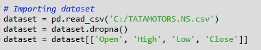

#### **准备数据集**

然后，我们准备各种输入特征，人工神经网络将使用这些特征来训练自己进行预测。请注意，我只限于以下 8 个功能，但是你应该创建更多的，以获得更准确的结果。

*   高价减去低价
*   收盘减去开盘价
*   三天移动平均线
*   十天移动平均线
*   30 天移动平均线
*   5 天期间的标准偏差
*   相对强度指数
*   威廉姆斯%R

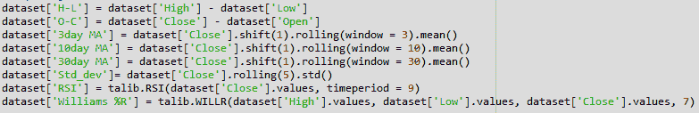

然后，我们将输出值定义为价格上涨，这是一个二进制变量，当明天的收盘价大于今天的收盘价时，存储 1。

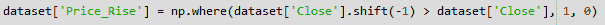

接下来，我们使用 dropna()函数删除所有存储 NaN 值的行。

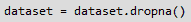

接下来，我们从“数据集”中移除所有 OHLC 数据，仅在名为“数据”的新数据框中保留“8 个输入要素”和“输出”。

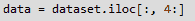

接下来，我们将 data 中的所有数据设为 np.array。

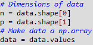

#### **分割数据集**

接下来，我们将整个数据集分成训练数据和测试数据。从 2000 年 1 月 1 日开始，训练数据包含总数据集的前 80%,测试数据包含数据集的剩余 20%。数据没有被打乱，而是按顺序切片。

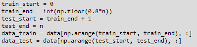

#### **缩放数据&建筑 X，Y**

数据预处理的另一个重要步骤是标准化数据集。此过程会使所有输入要素的平均值等于零，并将它们的方差转换为 1。这确保了在训练模型时不会因为所有输入要素的不同比例而产生偏差。如果不这样做，神经网络可能会混淆，并对那些平均值比其他特征高的特征给予较高的权重。此外，网络神经元(如 tanh 或 sigmoid)的最常见激活函数分别定义在[-1，1]或[0，1]区间上。如今，校正线性单位(ReLU)激活是普遍使用的激活，其在可能激活值的轴上是无界的。但是，我们将调整投入和目标。我们将使用 sklearn 的 MinMaxScaler 进行缩放。我们用 MinMaxScalerr()函数实例化变量 sc。之后，我们使用“先拟合后变换”函数训练和测试数据集。

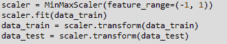

然后，我们将训练和测试数据集分成 X *训练，y* 训练& X *测试，y* 测试。这从数据*训练和数据*测试中选择目标和预测值。价格上涨的目标(y *train & y* test)位于数据 *train/test 的最后一列，从第 1 列到第 8 列数据* train/test 的 8 个特征(X train & X *test)的预测值。整个数据集将如下所示。*

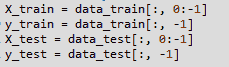

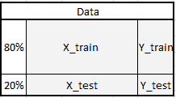

这是任何机器学习算法的基本部分，模型使用训练数据来得出模型的权重。测试数据集用于查看模型如何处理将输入模型的新数据。测试数据集还有输出的实际值，这有助于我们理解模型的效率。既然数据集已经准备好了，我们可以继续使用 TensorFlow 库构建人工神经网络。

### **构建人工神经网络**

#### **输入，隐藏&输出图层**

该模型由三个主要构件组成。输入层、隐藏层和输出层。输入层是 8 个要素。在输入层之后有 3 个隐藏层。第一个隐藏层包含 512 个神经元。后续隐藏层的大小总是前一层的一半，这意味着第二个隐藏层包含 256 个神经元，最后第三个隐藏层包含 128 个神经元。在 3 个隐藏层之后是输出层。Net 是由张量流交互分离产生的。

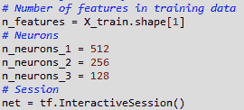

#### **占位符&变量**

[人工神经网络](https://quantra.quantinsti.com/course/neural-networks-deep-learning-trading-ernest-chan)从占位符开始。为了适应我们的模型，我们需要两个占位符:X 包含网络的输入(T = t 时股票的特征), Y 包含网络的输出(T+1 时股票的运动)。占位符的形状对应于 None，n_features，其中[None]表示输入是二维矩阵，输出是一维向量。理解神经网络需要哪些输入和输出维度以正确设计它是至关重要的。none 参数表示此时我们还不知道每批中流过神经网络图的观察值的数量，因此我们保持 if 灵活性。我们稍后将定义控制每个训练批次的观察数量的可变批次大小。

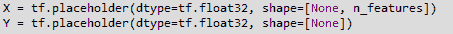

除了占位符，变量是张量流宇宙的另一个基石。占位符用于存储图形中的输入和目标数据，而变量用作图形中的灵活容器，允许在图形执行过程中改变。这里**权重和偏差**被表示为变量，以便在训练期间适应。在模型训练之前，需要初始化变量。

#### **初始值设定项**

初始化器用于在训练前初始化网络变量。由于使用数值优化技术来训练神经网络，因此优化问题的起点是找到潜在问题的良好解决方案的关键因素之一。张量流中有不同的初始化器，每一个都有不同的初始化方法。这里，我们将使用两个变量权重&偏差的 TF . variance*scaling*initializer()作为默认初始化策略之一。

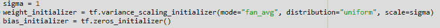

#### **设计网络架构**

在设计网络架构时，首先我们需要了解输入层、隐藏层和输出层之间所需的可变维度。在多层感知器(MLP)的情况下，我们在这里使用的网络类型，前一层的第二维是当前层的第一维的权重矩阵。这意味着每一层都将其输出作为输入传递给下一层。偏差维度等于当前层的权重矩阵的第二维度，其对应于该层中神经元的数量。

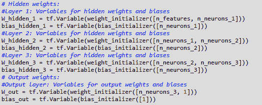

在定义了所需的权重和偏差变量之后，需要指定网络拓扑、网络架构。因此，占位符(数据)和变量(权重和偏差)需要组合成一个顺序矩阵乘法系统。此外，网络的隐藏层通过激活函数进行变换。激活函数是网络架构的重要元素，因为它们给系统引入了非线性。有许多可能的激活函数，其中最常见的是整流线性单元(ReLU ),它将在此模型中使用。

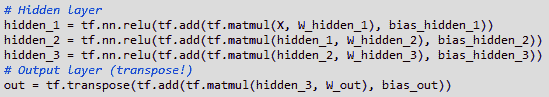

#### **成本函数**

我们使用成本函数来优化模型。成本函数用于生成网络预测和实际观察到的训练目标之间的偏差度量。对于回归问题，通常使用均方误差(MSE)函数。MSE 计算预测值和目标值之间的均方差。

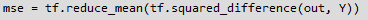

#### **优化器**

优化器负责必要的计算，这些计算用于在训练期间调整网络的权重和偏差变量。这些计算调用梯度的计算，该梯度指示在训练期间权重和偏差必须改变的方向，以便最小化网络的成本函数。开发稳定和快速的优化器是神经网络和深度学习研究的一个主要领域。

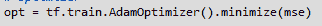

在这个模型中，我们使用 Adam(自适应矩估计)优化器，它是随机梯度下降的扩展，是深度学习开发中的默认优化器之一。

#### **拟合神经网络**

现在，我们需要使我们创建的神经网络适合我们的训练数据集。在定义了网络的占位符、变量、初始化器、成本函数和优化器之后，需要训练模型。通常，这是通过小批量训练来完成的。在小批量训练期间，从训练数据中抽取 n = batch *大小的随机数据样本，并输入网络。训练数据集被分成 n / batch* 大小的批次，这些批次被顺序输入到网络中。此时，占位符 X 和 Y 开始发挥作用。它们存储输入和目标数据，并将它们作为输入和目标呈现给网络。

X 的一个采样数据批次流经网络，直到它到达输出层。在那里，TensorFlow 将模型预测与当前批次中实际观察到的目标 Y 进行比较。之后，TensorFlow 执行优化步骤并更新网络参数，与所选的学习方案相对应。更新重量和偏差后，对下一批进行采样，重复该过程。该过程继续进行，直到所有批次都被呈现给网络。所有批次的一次完整扫描称为一个时期。一旦达到最大次数或者用户定义的另一个停止标准适用，网络的训练就停止。当 epoch 达到 10 时，我们停止训练网络。

有了这个，我们的人工神经网络就编译好了，可以做预测了。

### **预测股票的走势**

既然已经编译了神经网络，我们可以使用 predict()方法进行预测。我们将 X *test 作为参数传递，并将结果存储在一个名为 pred 的变量中。然后，我们将 pred 数据转换为 dataframe，并保存在另一个名为 y* pred 的变量中。然后我们通过存储条件 y pred > 0.5，将 y *pred 转换为存储二进制值。现在，变量 y_pred 根据预测值是大于还是小于 0.5 来存储 True 或 False。*

接下来，我们在 dataframe 数据集中创建一个具有列标题“y *pred”的新列，并将 NaN 值存储在该列中。然后，我们将 y* pred 的值存储到这个新列中，从测试数据集的行开始。这是通过使用 iloc 方法对数据帧进行切片来实现的，如下面的代码所示。然后，我们从 dataset 中删除所有 NaN 值，并将它们存储在名为 trade_dataset 的新数据帧中。

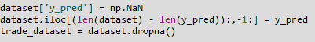

### **计算策略返回**

现在我们有了股票运动的预测值。我们可以计算这个策略的收益。当 y 的预测值为真时，我们将持有多头头寸，当预测信号为假时，我们将持有空头头寸。

我们首先计算如果在今天结束时做多，并在第二天结束时平仓，该策略将获得的回报。我们首先在 trade_dataset 中创建一个名为“Tomorrows Returns”的新列，并在其中存储一个值 0。我们使用十进制符号来表示浮点值将存储在这个新列中。接下来，我们在其中存储今天的对数回报，即今天收盘价除以昨天收盘价的对数。接下来，我们将这些值向上移动一个元素，以便根据今天的价格存储明天的回报。

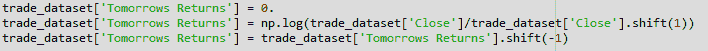

接下来，我们将计算策略回报。我们在标题“Strategy *Returns”下创建一个新列，并用值 0 初始化它。以指示存储浮点值。通过使用 np.where()函数，如果“y* pred”列中的值存储为 True(长位置)，则我们将存储“Tomorrows Returns”列中的值，否则我们将存储“Tomorrows Returns”列中的值的负值(短位置)；“策略回报”一栏。

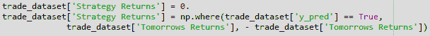

我们现在计算市场和策略的累积回报。这些值是使用 cumsum()函数计算的。

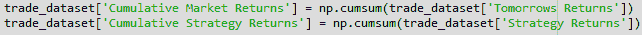

### **绘制收益图**

现在，我们将绘制市场回报和我们的策略回报，以直观显示我们的策略在市场中的表现。然后，我们使用存储在 dataframe trade_dataset 中的累积值，使用 plot 函数绘制市场回报和策略回报的图表。然后，我们分别使用 legend()和 show()函数创建图例并显示绘图。下面显示的图是代码的输出。绿线代表使用该策略产生的回报，红线代表市场回报。

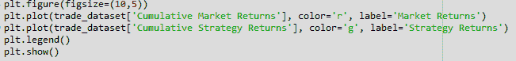

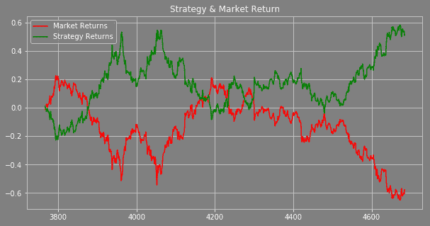

### **结论**

这个项目的目标是让你了解如何使用 python 中的 tensorflow 建立一个人工神经网络并预测股票价格。目的不是让你得到好的回报。你可以通过各种方式优化这个模型，以获得良好的策略回报。

我的建议是，当你在建立人工神经网络或任何其他最有效的深度学习模型时，使用超过 100，000 个数据点。这个模型是根据每日价格开发的，目的是让您了解如何构建模型。建议使用分钟或分笔成交点数据来训练模型。

现在你可以用 Python 建立自己的人工神经网络，并开始利用机器的能力和智能进行交易。

您也可以从 [my github a/c](https://github.com/umeshpalai/Algorithmic-trading) 下载 pyhon 代码和数据集

### **下一步**

*免责声明:股票市场的所有投资和交易都有风险。在金融市场进行交易的任何决定，包括股票或期权或其他金融工具的交易，都是个人决定，只能在彻底研究后做出，包括个人风险和财务评估以及在您认为必要的范围内寻求专业帮助。本文提到的交易策略或相关信息仅供参考。*

### **下载数据文件**

*   使用 Python 中的张量流的深度学习-人工神经网络