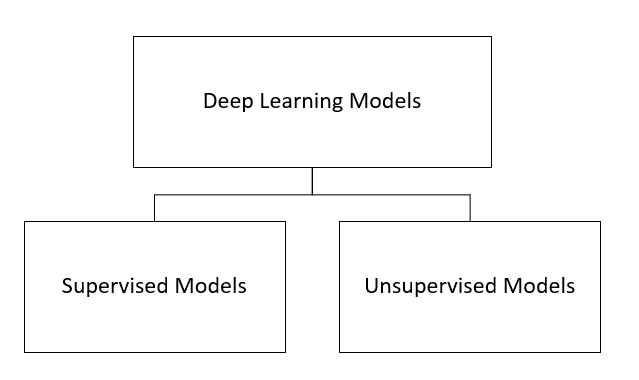
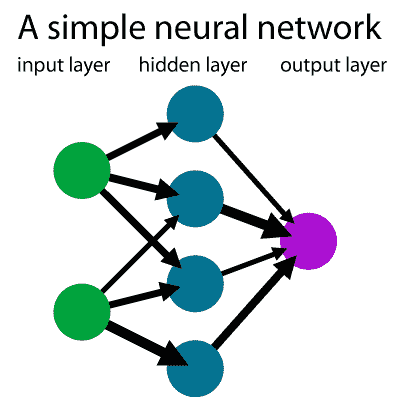
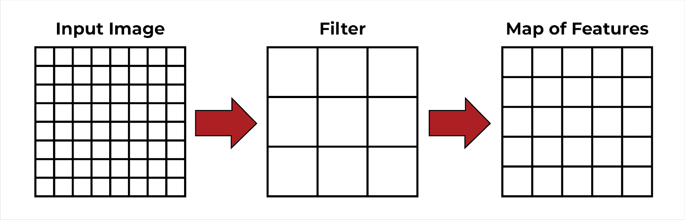
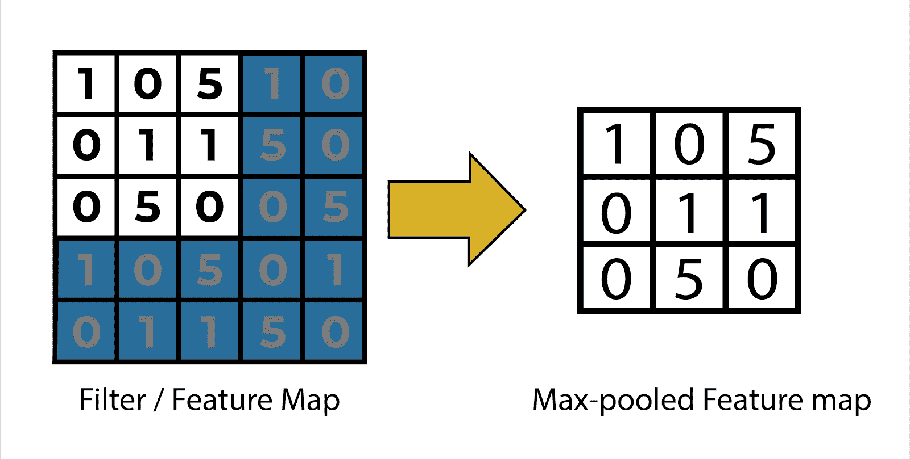
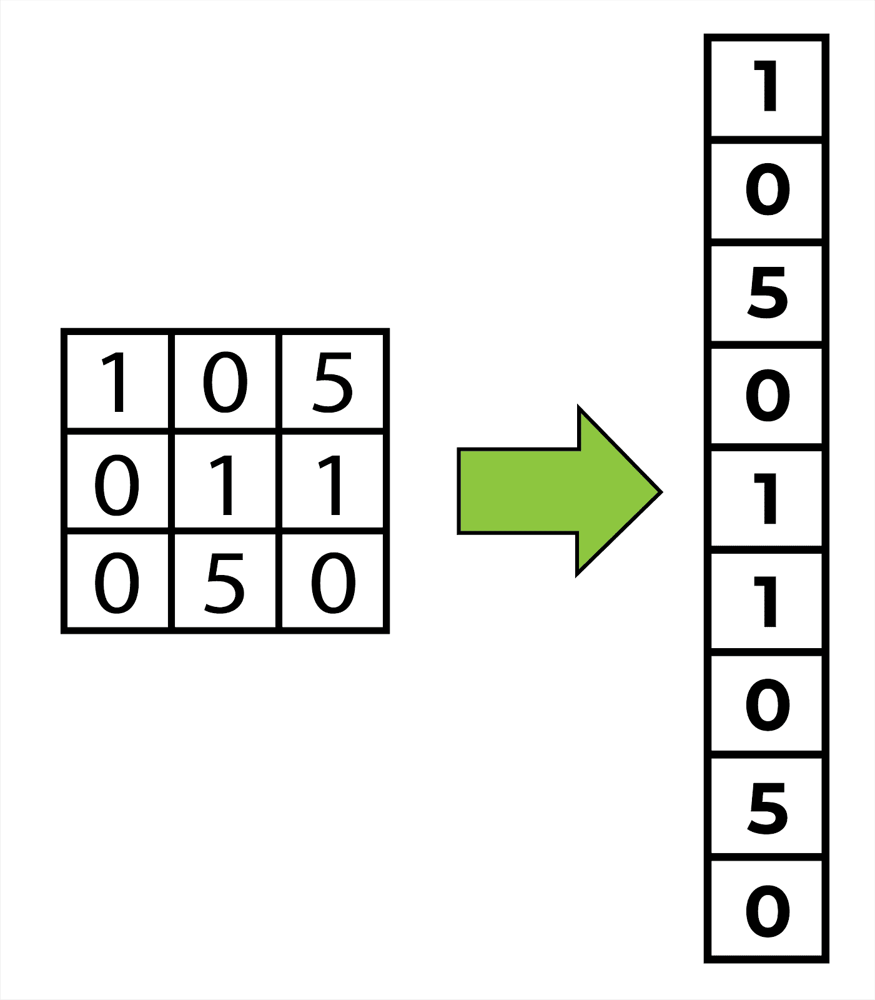
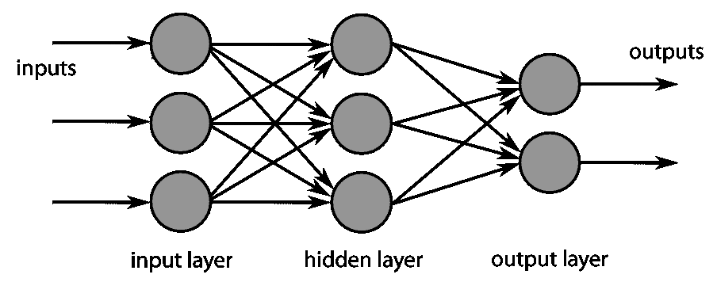
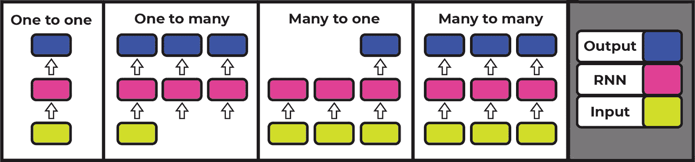
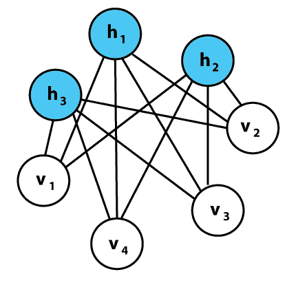
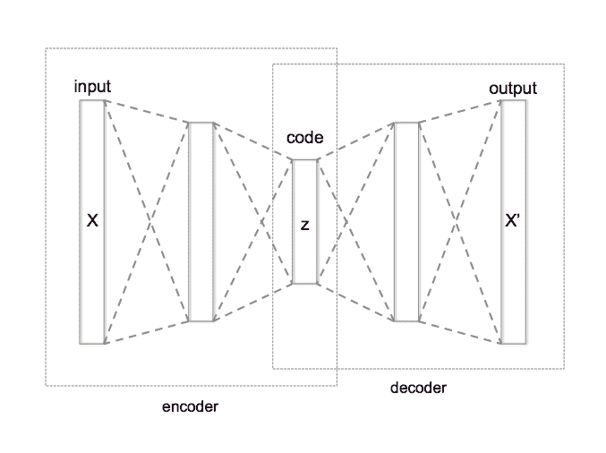

# 金融领域的深度学习

> 原文：<https://blog.quantinsti.com/deep-learning-finance/>

深度学习在金融领域发挥着重要作用，这也是我们在本文中讨论它的原因。简单来说，深度学习是[机器学习](https://quantra.quantinsti.com/glossary/Machine-Learning)的一个子领域。由于他们处理的问题不同，他们的能力也各不相同。

让我们看看这篇文章将涵盖什么:

*   [深度学习概述](#Overview-Deep-Learning)
*   [深度学习在金融领域的应用](#Uses-Finance)
*   [深度学习的模型](#Models-Deep-Learning)
*   [深度学习在金融中的应用](#Application-Deep-Learning)
*   [深度学习在金融领域的前景如何？](#Future-Deep-Learning)

[T2】](https://quantra.quantinsti.com/course/neural-networks-deep-learning-trading-ernest-chan)

首先，我们将看到深度学习的概念在一个结构中得到解释，它是这个结构的一部分。

## 深度学习概述

深度学习是人工智能的一部分，它甚至可以为极其复杂的输入提供输出。

下面，我们以流程图的方式进行了可视化表示，以了解深度学习究竟在哪里发挥作用:

主要是，你可以在上图中看到，由机器学习、深度学习和神经网络组成的是人工智能(AI)。

那么我们先来了解一下**人工智能**的含义。用简单的话来解释，AI 是一个广泛的概念，它意味着所有由机器学习的最初是人类行为的概念。更简单地说，人工智能是任何显示人类思维特征的机器，如合理化、学习和解决问题。

然后是**机器学习** 的[概念，涉及算法和统计模型的研究。基于这项研究，机器或系统执行特定的任务，不需要任何明确的指令。这是因为机器依赖于从过去学到的模式和推论。](/machine-learning-basics/)

第三，也是更深层次的概念是**深度学习**。这个概念被称为深度学习，因为它利用了大量的数据或可用信息的复杂性。有了这些信息，深度学习模型就足以识别错误，并在没有人工干预的情况下自行纠正它们。由于[机器学习](https://quantra.quantinsti.com/course/introduction-to-machine-learning-for-trading)没有使用如此深入的信息，在没有人类参与的情况下，它无法识别和纠正错误。

另一个概念是 **[神经网络](https://quantra.quantinsti.com/course/neural-networks-deep-learning-trading-ernest-chan)** ，它是机器学习的一部分，简单地说就是机器能够以与人类解决各种任务相同的方式处理信息的概念。因此，这是一个模仿生物神经网络的[人工神经网络](https://en.wikipedia.org/wiki/Neural_network)的概念。

现在，**深度神经网络**是人工神经网络的一个组织，它帮助对极其复杂的输入进行输出。深度神经网络起着重要的作用，因为它们处理极其复杂的输入以提供适当的输出。

在这里阅读更多关于深度神经网络[的内容。](/introduction-deep-learning-neural-network/#working)

现在来看金融，人工智能作为一个整体在金融行业应用很多。例如，它有助于识别问题，如异常借记卡使用或账户中的巨额存款。这样，人工智能作为一个整体概念有助于将人们从欺诈活动中解救出来。此外，人工智能还用于根据市场中的各种因素，通过更有组织和更快的决策来使交易更容易和更好。

好吧！此外，让我们转向深度学习在金融领域的应用。

## 深度学习在金融领域的应用

正如我们上面提到的，深度学习是一个处理复杂输入并基于它们提供输出的概念。此外，它还有自我修正的潜力，因为它被设计得足够高效，不需要人工干预。因此，在数据被记录之后，该系统从它自己的成功和失败中学习。

在金融界，人工智能，或者更准确地说，深度学习，可以应用于几个重要领域。因此，让我们来看看深度学习的重要应用领域:

*   股票市场预测
*   过程自动化
*   分析交易策略
*   金融安全
*   机器人顾问
*   贷款申请评估
*   信用卡客户研究

### 股票市场预测

基于历史数据和当前市场状况的不同参数，深度学习中的神经网络预测股票价值。随着深度学习详细使用数据，并考虑隐藏层，预测的准确性会提高。因此，观察到利用深度学习，预测精度是最大的。

### 过程自动化

这项技术通过提供呼叫中心自动化、文书工作自动化和员工培训游戏化等来帮助处理流程。

### 分析交易策略

由于深度学习的算法可以同时分析成千上万的数据源，所以它比人类快得多。基于这样的分析，形成的交易策略，获利要多得多。

### 金融安全

在线交易的激增也增加了欺诈活动的发生率。随着深度学习算法在检测欺诈方面的出色表现，金融安全正在同时实现。

### 机器人咨询

机器人顾问只不过是为客户提供金融工具建议的算法。例如，推荐保险设施等金融产品，以及[投资组合管理](https://quantra.quantinsti.com/course/portfolio-management-machine-learning)，即管理各种投资机会中的资产。

### 贷款申请评估

深度学习中的深度神经网络帮助银行根据学习到的批准和拒绝申请的模式来决定是否批准贷款申请。

### 信用卡客户研究

由于银行需要他们的客户利用他们的信用卡，深度学习系统有助于找到这样的客户。因此，为了识别正确的客户，该系统提供了更多有意义的问题，以放在信用卡申请上。

我们已经提到了具有深度学习的自动化已被证明是有益的大多数领域，但还有许多其他领域，如信贷审批、业务失败预测、银行盗窃等。

有几家顶级公司，如 CRISIL、Titan、JP 摩根大通、BNY 梅洛、Swiggy 等，都在使用深度学习来实现系统自动化。

此外，我们将看到深度学习的模型以及每个模型的意义。

## 深度学习的模型

将模型大致分类，有两种类型，即**监督模型**和**非监督模型**。这两个模型都经过不同的训练，并且具有各种不同的特征。

让我们首先取**个监督模型，**个监督模型，其中用特定数据集的例子进行训练。这些模型是:

*   经典神经网络
*   卷积神经网络
*   递归神经网络

### 经典神经网络

经典神经网络也称为多层感知器或感知器模型。这个模型是美国心理学家在 1958 年创造的。它也可以被称为一个简单的神经网络。这在本质上是奇异的，并且适应于具有一系列输入的基本二进制模式，以模拟人脑的学习模式。它的基本条件是由 2 层以上组成。

正如你所看到的，它只有一个带有几个隐藏层的输入层和一个输出层。

### 卷积神经网络

这是继经典神经网络之后的一个高级版本，因为它是为处理和计算数据输出方面的更高复杂性而设计的。

由于这些神经网络主要是为图像数据而构建的，它们应该最适合图像分类，但逐渐地，它们也能够处理非图像数据。

现在让我们讨论如何为图像建立卷积神经网络。因此，对于模型的构建，您首先将输入数据导入到模型中，这要经过五个步骤:

Steps for Building a CNN Image

*   输入图像——基本上，输入数据被视为一幅图像(以像素为单位)。
*   特征检测器和特征图-检测器基本上是图像特征的标识符。这些也被称为过滤器。特征地图由特征检测器或过滤器收集的信息组成。

Feature Detectors

*   Max-Pooling -它使模型能够识别修改后的图像。因此，图像可以翻转、镜像、颠倒等。最大池有助于卷积网络通过获取不同区域的矩阵来识别图像的所有细节。这使得网络注意到它们都是同一图像的细节。

Max-Pooling

*   展平——在这一步中，数据被展平到一个数组中，以便模型能够读取它。现在，详细信息从矩阵转换或展平为垂直列。此后，输入通过人工神经网络进行进一步处理。

Flattening

*   完全连接——这是数据的隐藏层，然后将它考虑在内。这叫全连通数据层，和人工神经网络中的隐藏数据是一样的。在该步骤中，还进行误差函数的计算，该误差函数在人工神经网络中被称为损失函数。

Full Connection

### 递归神经网络

“递归神经网络”是六种神经网络中的一种，它以顺序的方式考虑数据。这种类型记住序列中的前一个信息，并有助于在序列的后面解释相同的元素。

例如，对文本的解释，它由单词或字符按顺序组成，以使读者理解它们的意图。

为了更好地理解递归神经网络，让我们看看视觉表示，并理解它支持的输入和输出类型:

Recurrent Neural Networks

好的，上面的图像显示:

*   一对一

这是从固定大小的输入到固定大小的输出处理信息的基本模式。例如，将图像分类到一个类别中。

*   一对多

这意味着处理一个信息并向显示器提供多于一个单词的输出。例如，将一幅图像作为输入，创建一个带有一句话的标题作为输出。

*   多对一

在这种情况下，输入作为一个单词的句子，被分类为积极或消极的情绪表达。随后输出需要预测下一个字符。例如，顺序输入(一个句子)和固定大小输出一个单词。

*   多对多

这意味着序列输入导致序列输出，但是输出被修改。例如，机器翻译，它导致机器将英语输入翻译成法语。

*   多对多

这是另一种类型的序列输入，它作为序列输出输出并被同步。例如，视频分类，其中视频的每一帧都被标记。

既然你现在已经清楚了深度学习的监督模型，让我们继续前进到**非监督模型。**这些模型只有给定的输入数据，没有任何可学习的设定输出。这些模型是:

*   自组织地图
*   玻尔兹曼机器
*   自动编码器

### 自组织地图

som 包含[无监督的](https://quantra.quantinsti.com/course/unsupervised-learning-trading)数据，通常会减少模型中随机变量的数量。在自组织映射中，输出维度通常是二维的。因此，如果我们有 2 个以上的输入特征，输出将下降到 2 维。在这种情况下，每个连接输入和输出节点的突触都有一个权重。现在，最近的节点被称为 BMU 或最佳匹配单元，SOM 将其权重移动到更接近 BMU 的位置。节点离 BMU 越近，其权重变化越大。

### 玻尔兹曼机器

现在，您一定已经注意到，在以前的模型中，所有的模型都朝着一个特定的方向，即从输入到隐藏层再到输出。即使是 SOM，作为一个无监督模型，也与监督模型中的所有其他模型走向相同的方向。

但是，波尔兹曼机器的情况就不一样了，因为它们不遵循特定的方向。正如您在下面模型的可视化表示中所看到的，所有节点都以圆形相互连接。

这里，

h ->隐藏层

v->视觉层

之所以如此，是因为玻尔兹曼机器可以生成模型的所有参数，而不是固定的输入。该模型被称为随机模型，而其他模型是确定性模型。

### 自动编码器

自动编码器基本上是简单的算法，用于显示与输入相同的输出。这种机制压缩输入数据，然后从中重构输出。

例如，作为输入的图像帮助系统学习特定的图形或结构。

因此，输入被压缩成几个类别。在自动编码中，数据在以下函数的帮助下被压缩:

*   数据特定，这意味着该系统一旦用人脸训练过，就不能很好地处理建筑物的图像。
*   自我表现者，即，如果有适当数量的数据用于训练，那么系统将在该特定类型的输入上保持良好表现。

在下面的视觉表示中，输入 X 是图像输入，在系统中编码器和解码器的帮助下，它呈现输出 X’。这里，输出与输入相同，因为系统存储了相同的特定特征。

在当今时代，用于数据可视化的自动编码的两个概念被称为[数据去噪](https://en.wikipedia.org/wiki/Autoencoder#Regularized_Autoencoders)和[降维](https://en.wikipedia.org/wiki/Autoencoder#Dimensionality_Reduction)，是已知的最佳实际应用。

好了，现在让我们来看看深度学习在金融领域的 python 代码应用。

## 深度学习在金融中的应用

在下面的代码中，我们试图使用一组特征来预测市场运动的方向。因为它可能是上升趋势，也可能是下降趋势，这是一个二元分类问题。