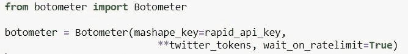
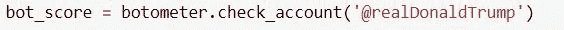
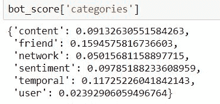
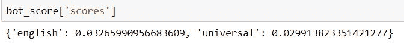
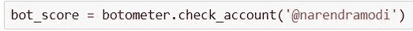
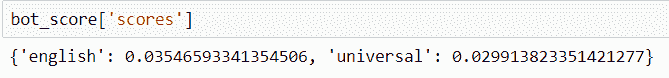
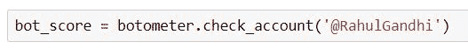
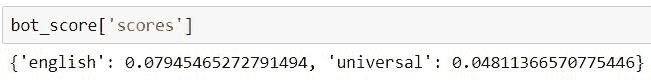

# 使用测辐射热计检测 twitter 上的机器人

> 原文：<https://blog.quantinsti.com/detecting-bots-twitter-botometer/>

由[瓦伦·迪瓦卡](https://www.linkedin.com/in/varun-divakar-b862a667/)

在这篇博客中，我们将了解什么是机器人，以及它们如何扭曲你的交易策略中使用的情绪分析。我们将讨论以下主题:

*   为什么我们要识别一个机器人？
*   [验光仪](#botometer)
*   [在 Twitter 上识别机器人](#identifybots)

当我们根据市场情绪进行交易时，我们需要从 Twitter、路透社、彭博和 Webhosie 等新闻来源获取数据。虽然阅读完整的文章并评估他们的情绪可能很困难，但估计一条推文的情绪并不复杂。

但在你评估一条推文的情绪之前，你需要知道这条推文是机器人的自动回复还是人类发出的。

你可能会问为什么这是相关的？

### 为什么我们要识别一个机器人？

这是相关的，因为你需要知道机器人在做什么，这反过来会告诉你 Twitter 上特定股票的情绪是如何被操纵的。当我们计算特定股票的 Twitter 情绪时，我们会识别并删除那些由 bot 用户发出的推文。这将给予真实的情感而不被操纵。当与其他技术指标一起使用时，这种真实情绪可以成为一个非常强大的指标，用来预测趋势的顶部和底部。

#### 辐射热测定器

在 python 中，我们使用名为 botometer 的库来了解特定的 tweet 是否是由机器人发出的。botometer 库使用一种机器学习算法，该算法在数万个带标签的数据上进行训练。该算法的输出是 0 到 1 范围内的概率，其中 1 表示 twitter 帐户由机器人管理。

Botometer API 将用户 id 作为输入，然后提取与该用户相关的 1200 个特征来计算分数。Botometer 对以下类别给出单独的分数:

1.  网络功能
2.  用户功能
3.  朋友功能
4.  时间特征
5.  内容特征
6.  情感特征

让我们来讨论其中的一些特性。

#### 网络功能

用户的网络特征包括用户过去发推的转发、提及和标签信息。

例如，如果用户只转发那些特定句柄的推文，那么该用户很可能是一个机器人。

#### 用户功能

这包含特定于用户的信息，如用户名、语言、位置、帐户创建日期等。，一般来说，僵尸工具不包含这些信息。如果他们这样做，那将是一些胡言乱语。

#### 时间特征

类别时间特征分析推文率、推文和转发的时间模式等。例如，如果该帐户在相同的时间间隔内发布推文，那么它很可能是一个机器人。

#### 选举推特:识别机器人

目前，印度正在进行大选。而且推特上有很多机器人支持他们的政党。知道哪些推文是由机器人发出的很重要。但在此之前，让我们检查一下 botometer 是否正常工作。让我们以一个已知的 twitter 处理真正的政治领导人，并检查它是否预测正确。

首先，我们使用如下所示的 pip install 安装 botometer 库，然后实例化一个 botometer 对象。

！pip 安装 botometer

现在，让我们试试美国总统唐纳德·特朗普先生的已知手柄，看看 botometer 会说什么。

**@realDonaldTrump** 是美国总统的推特账号。获取该句柄的 bot 分数后，我们可以使用以下命令打印并检查它。

所有的机器人得分值在 0-1 的范围内都非常低，这表明用户很可能是人类。我们还可以使用下面的命令获得最终的分数或总数。

由于多安德·特朗普先生的大多数推文都是英文的，我们可以将英文 0.03 分(0-1 分)视为最终指标。一般来说，我们认为超过 0.6 的分数表明一个帐户被机器人控制。因此，如果你们中的任何人怀疑@realDonaldTrump 账户发出的推文是否真的是总统本人发出的，那么这些分数现在应该可以解决这个疑问了。

现在让我们回到印度大选，看看两位顶级候选人的推特账号表现如何。

首先，让我们来分析一下印度现任总理纳伦德·莫迪。他的推特账号是**@纳伦德拉莫迪**

他的机器人分数是

由于纳伦德拉·莫迪先生的一些推文是印地语，我们需要考虑这种情况下的普遍分数。其再次非常低，指示人类用户。

现在让我们对主要反对党总理候选人拉胡尔·甘地先生进行同样的测试。

 

同样，这里的分数很少表示人类用户。这个练习的目的是检查由 botometer 所做的预测的健全性，它们看起来显然是令人满意的和预期的。

但是我们还没有确定这些领导人的机器人追随者。我们可以通过使用 tweepy 库导入 Twitter IDs，然后在每个 Twitter IDs 上运行 botometer 检查来做到这一点。分离机器人和计算市场情绪的过程似乎是一项非常困难的任务，但通过适当的预处理，它可以很容易地完成。在我们关于交易中的[情绪分析](https://quantra.quantinsti.com/course/sentiment-analysis-in-trading)的新课程中，我们将向您展示如何使用条件语句获取与股票相关的推文，然后执行预处理以识别和删除不相关的推文。然后，我们产生市场情绪，并在此基础上制定交易策略。

### **结论**

botometer 库是专门为分析 Twitter feed 而构建的。在 twitter 数据被用于创建交易策略之前，它是 Twitter 数据预处理中非常重要的库。衡量市场情绪是一项非常困难的任务，它需要各种来源的数据。所有的数据不能以同样的方式处理。所以，你需要开发新的技术来预处理来自博客和新闻文章的数据。

报名参加我们的新课程: [**交易中的情绪分析**](https://quantra.quantinsti.com/course/sentiment-analysis-in-trading) ，您可以学习如何预处理不同类型的数据以及情绪分析中涉及的其他重要步骤

### **建议读数**

*   情绪分析在交易中的应用:它在哪里起作用？
*   [建立趋势跟踪策略的五个指标](https://blog.quantinsti.com/indicators-build-trend-following-strategy)

*免责声明:股票市场的所有投资和交易都有风险。在金融市场进行交易的任何决定，包括股票或期权或其他金融工具的交易，都是个人决定，只能在彻底研究后做出，包括个人风险和财务评估以及在您认为必要的范围内寻求专业帮助。本文提到的交易策略或相关信息仅供参考。*