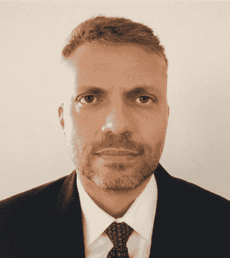

# 博士，开发人员，经理，教授和算法交易员-路易斯博士的故事

> 原文：<https://blog.quantinsti.com/developer-manager-professor-algo-trader-epat-success-story-luiz-guedes/>

如果我们告诉你一个人，他不仅接受了科学教育，进入了软件行业，然后进入了金融行业，现在还学习了算法交易，你会相信我们吗？

如果我们说他也学会了三种武术呢？

难以置信？这正是路易斯博士的故事。

Luiz 博士拥有 PUC/里约 pontifíCIA Universidade católica do Rio de Rio de Janeiro/Rio 的计算机科学博士学位、IME 的计算机系统硕士学位和计算机工程师学位。此外，他拥有 FGV 瓦加斯基金会的工商管理硕士学位。

他总是在不断地寻求克服自己，成为一个更好的人——不仅在智力上，而且作为一个人。他说，学习让他变得更好，帮助他理解世界是如何运转的，并给他一个探索新机会的机会。

我们联系了路易斯博士，这是他与我们分享的他的生活故事。

* * *

## 嗨，路易斯博士，给我们介绍一下你自己

<figure class="kg-card kg-image-card"></figure>

嗨！我的名字是路易斯·古德斯。我是一名计算机工程师，拥有计算机科学学位，是巴西里约热内卢军事学院的教授。

26 年前，我获得博士学位后，从事软件开发工作，后来，我获得了工商管理硕士学位，并为科技公司工作。我做了 30 年的软件开发人员，现在是 Occam Brasil gesto de Recursos 的资产经理和定量分析主管。

我喜欢武术，练过跆拳道，是合气道黑带，现在在练咏春。几年前，我的父亲心脏病发作，大约在那个时候，我意识到我需要努力保持健康。

那时，我喜欢让·克劳德·云顿的电影，这让我对学习武术产生了兴趣，从 1996 年开始学习跆拳道。

我热爱外语，我学过汉语、韩语和日语。总的来说，我知道超过 6 种语言。

* * *

## 从科学到金融，再到现在的算法交易——这是怎么发生的？

我妈妈说，

> 那些更优秀的人总会有一席之地。

所以，我总是努力变得更好。我不能做我不知道的事。所以，当我读 MBA 的时候，尽管我发现这些知识很有趣，但我不能应用它们。

在巴西，有一句谚语，

> 人们总是会成长到顶峰，然后就会跌倒。

我觉得这是真的，因此，尽管我很喜欢这个管理职位，但我还是决定不做了。我没有不愉快的感觉。

我对金融的兴趣是大约三年前通过我的哥哥产生的，他对比特币非常好奇。慢慢地，我也开始交易比特币。6 个月后，我意识到这不值得大肆宣传。所以，我去了股票市场，开始自学。

我总是通过各种量化网站和各种在线内容不断寻找学习算法交易。我仍然总是在网上寻找参考资料。

我开始学习技术分析，研究技术指标。那时我还不知道 Python，但是如果我使用 C 和 C++的话。我还为我的交易创造了一个 algo 交易机器人。

我注意到:

*   虽然技术分析很有趣，但有时它不起作用
*   有很多事情我不明白
*   有些我不知道为什么会发生

我意识到我需要很多知识:

*   关于市场
*   市场背后发生了什么
*   对图表的理解

我相信正规学习，因为尽管我自己学习过，自己研究过，但拥有结构化的知识对于避免信息差距非常重要。

这对你的知识和理解至关重要。这就是我当初开始修技术分析课程的原因，但都是徒劳。

因此，我一直在寻找有用的学习资源，就在那时，我发现了 QuantInsti 的白皮书和博客。此后不久，我浏览了 EPAT 的教学大纲，意识到这正是我要找的内容。

我可以回答我一直在问的所有问题。我终于有了一个可以问我问题的人，而不必再继续寻找答案了。

我心想，这看起来很有趣，我可以自己从中赚钱。我只用了一天时间就报名参加了 EPAT 项目！

我之前工作的软件开发公司被另一家公司收购了，公司的方向也变了。所以，我不得不搬家。我可能会跳槽到同一行业的另一家公司，或者干脆跳槽到一个新的行业。

我喜欢交易，写软件和做分析。所以，我和一个朋友谈了这件事。他的朋友在银行和市场工作，所以也许他可以把我介绍给他们。这正是我即将完成 EPAT 课程的时候。

就在那时，我被介绍给了三家公司！如果我没有参加 EPAT 的课程，我肯定能胜任这份工作。EPAT 让我的快速职业转变成为可能，并为我提供了新的机会。从 EPAT 毕业后，我现在在一家做投资基金的资产管理公司做量化分析师。

我一直认为交易是我退休后会做的事情，但我现在仍然在做。

* * *

## EPAT 是如何为你的专业知识增值的？

EPAT 课程有三大支柱——计算机编程、金融和数学。这三个领域之间的平衡以及这种知识的混合方式使其更有意义和可操作性。我们可以在工作、交易或投资中使用这些知识。

我相信这才是真正打动我的地方！我觉得这是 EPAT 课程最大的好处和优势！

我以前的知识只和计算机科学有关，而且我有非常好的工科基础。但是我在金融方面有知识空白，我没有应用我所拥有的知识。这是我在 EPAT 期间做的事情。

在参加 EPAT 课程之前，我不知道交易中有一些东西。交易需要很多知识，尤其是当你投资股票的时候。

人们需要意识到:

*   事情应该如何发展
*   事情不应该怎样发展
*   风险管理
*   理解统计数据背后的数学
*   如何获得对你有利的概率等。

现场讲座:我以前参加过的所有课程都有预先录制的课程，而 EPAT 讲座提供了一种人情味，这是我所欣赏的。我发现现场课堂讲课非常有趣。

解决我的疑问:我提出的任何问题都很快得到了解答。我学到了很多我甚至不知道存在过的东西。在与我的 EPAT 团队联系时，我注意到 EPAT 有来自科学、数学、计算机科学和许多其他领域的参与者！

在 EPAT，我学到了很多现在对我有帮助的东西，特别是如何创造更好的交易算法。我学会了如何编写更好的 Algo 交易软件。我会在课堂上学习 Python，练习它，然后在我的系统上尝试。这帮助我找到了如何在交易中使用它的方法，我意识到这对我来说简单多了。这种实践学习是第一个直接的好处。

哦，我喜欢这些作业！他们对我来说是无价的。他们几乎是我所寻找的一切，来扩展我的边界。

项目工作:当我的 EPAT 项目工作被指派一名导师时，最初我有点担心导师是否知道我想做的事情，以及与之相关的话题。但是，令我惊讶的是，他们知道的比我做的多得多！所以，我的恐惧很快就消失了。

* * *

## 分享一个你最喜欢的 EPAT 特色！

师资力量、内容、平台——都非常好。

有像欧内斯特·陈博士、托马斯·斯塔克博士、尤安·辛克莱博士这样令人难以置信的教授上课，以及完整的师资基础是令人难以置信的。他们拥有的知识是杰出的，就好像他们是为此而生的。

即使在他们的讲座结束后，教员们也总是乐意回答你的问题和疑虑。我会和他们联系，给他们发问题，他们总是迅速回复我的问题，并给我的项目提供有用的建议。所以，对我来说，教师是 EPAT 最好的特色。

课程设置真的很好，平台完美无瑕，工作起来像新机器一样！

* * *

## 你给 Algo 交易爱好者的建议。

**继续成长！**

在攻读 MBA 期间，我发现学习管理比应用概念更有趣。今天，当我在团队项目中工作时，或者当我必须与人打交道或帮助他们时，这些知识对我很有帮助。

当我为支付行业开发技术时，我并不了解数据科学。所以，我做了一些数据科学方面的认证，我发现这真的很有趣。今天，它对我的背景帮助很大。学什么都没有浪费。

**继续努力！**

即使是在跳 EPAT 舞的时候，每周我都努力练习我所学的内容。如果我今天能或者不能练习我的编码，下周我会再试一次。我一直在努力。我发现做一点点事情比什么都不做要多得多。所以，继续努力。

人们为我会说 7 种语言而鼓掌，并对我是如何做到的感到震惊。但是这些年来，这对我来说是一种渐进的成长。你也可以的！

**继续学习！**

如果你知道一些东西，或者即使你对算法交易一无所知，EPAT 是一个很好的起点。当你成为全球 EPAT 校友社区的一员时，你可以终身学习。

您可以随时查看课程的最新进展，并通过最新的 EPAT 讲座获取最新的市场内容。

我只是一个金融初学者，因为我有计算机科学的背景。但是，我的金融和交易知识，以及技能，来自 EPAT 的课程，而且它们还在增长。

人们年轻时就开始在金融市场工作。50 多岁的我很难找到一份工作，相比之下，今天在这个领域刚刚起步的人。市场害怕雇佣老年人。

你可能有很多经验，很多技能和很多知识，但你可能会因为没有坚持学习而错过一个好的工作机会。所以，继续学习。首先，EPAT 是个好地方。

* * *

感谢您抽出时间与我们交谈，路易斯博士。得知你这些年来取得的成就和成功，我们感到很惊讶，我们希望你能有所成就。最美好的祝愿！

如果你也想用终生的技能来武装自己，这将永远帮助你提升你的交易策略。这门 [algo 交易课程](https://www.quantinsti.com/epat)的主题包括统计学和计量经济学、金融计算和技术、机器学习，确保你精通在交易领域取得成功所需的每一项技能。现在就来看看 EPAT 吧！

* * *

免责声明:为了帮助那些正在考虑从事算法和量化交易的人，这个成功的故事是根据 QuantInsti EPAT 项目的学生或校友的个人经历整理的。成功案例仅用于说明目的，不用于投资目的。EPAT 方案完成后取得的成果对所有人来说可能不尽相同。T3】