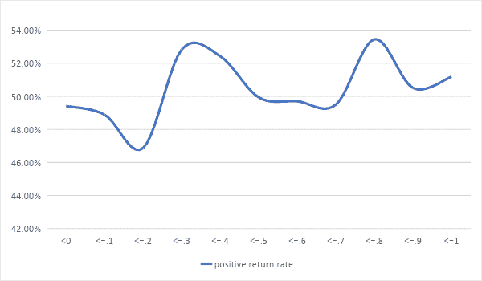
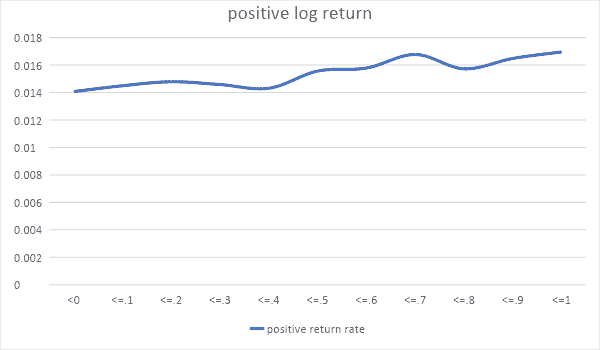
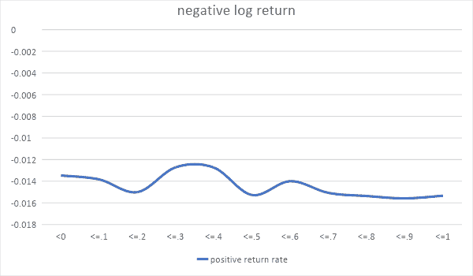
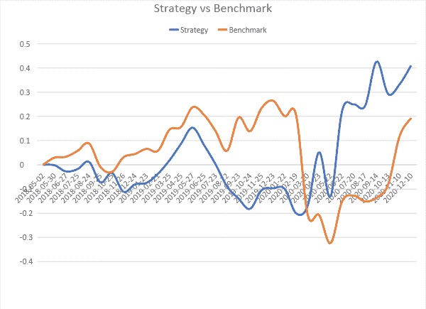

# 使用神经网络的动态资产分配

> 原文：<https://blog.quantinsti.com/dynamic-asset-allocation-neural-networks-project-mrinal-mahajan/>

该项目旨在通过利用一组动态线性神经网络模型的每日回报预测，为包括 nifty 银行指数在内的股票建立资产配置策略。

神经网络模型是动态的，并且在每个交易日结束时每天更新，以对市场和股票趋势的变化做出反应。除此之外，模型的线性使得结果易于解释。

本项目中使用的完整数据文件和 python 代码也可以在本文末尾下载。

本文是作者提交的最后一个项目，作为他在 QuantInsti 的算法交易管理课程( [EPAT](https://www.quantinsti.com/epat) )的一部分。请务必查看我们的[项目页面](/tag/epat-trading-projects/)，看看我们的学生正在构建什么。

* * *

## 关于作者

<figure class="kg-card kg-image-card"></figure>

Mrinal Mahajan 毕业于 IIT 坎普尔大学机械工程专业。

交易和投资是他一直着迷的事情，为了在这一领域发展，他从全球风险专业人士协会(GARP)获得了金融风险管理(FRM)的许可。

过去 3 年，他一直在分析领域工作，曾为一些美国最大的银行工作。他目前在信用卡欺诈风险建模领域与一家领先的美国银行合作。

作为获得交易实践经验的下一步，他决定利用他的分析技能来开发一些有利可图且需要最少监控的东西。

就在那时，他萌生了这个项目的想法，在 Quantinsti 团队的指导下，他得以实施这个项目。

* * *

## 定义问题陈述

根据昨天的数据，预测股票价格从今天收盘到第二天收盘的百分比变化。

简而言之，如果我们可以获得每日频率的数据，那么基于昨天(d-1)数据中创建的变量，我们希望预测第二天(d+1)和今天(d)收盘时的价格变化百分比。

根据预测，我们可以知道，如果我们在今天收盘时买入股票，明天是否会盈利。

根据模型结果，我们希望制定一个资产分配策略，该策略可以利用 BTST(今天买明天卖)功能，与各种经纪人的当天交易相比，该功能的交易成本相对较低。

* * *

## 逼近解

### 第 1 部分-模型开发

我们创建了以下一组动态神经网络模型

1.  概率预测器——确定正回报的概率
2.  正回报预测器–仅针对正回报实例训练的模型，用于预测回报的正对数值
3.  负回报预测器-仅在负回报实例上训练的模型，预测回报的负对数值

在这里，对数收益被用作因变量，而不是百分比收益或价格变化，以保持序列的平稳性。

*   发展数据–2010 年至 2015 年
*   验证数据–2016 年至 2018 年 4 月
*   过时数据–2018 年 5 月至 2020 年 12 月

股票的历史数据如下所示

| **银行/公司名称** | **符号** | **在漂亮银行的权重** | **数据来自** |
| HDFC 银行有限公司 | hdfc 银行 | 28.39% | 01-01-2010 |
| ICICI 银行有限公司 | ICICIBANK | 19.48% | 01-01-2010 |
| Kotak Mahindra 银行有限公司 | 科塔银行 | 16.31% | 01-01-2010 |
| Axis 银行有限公司 | 轴心银行 | 14.95% | 01-01-2010 |
| 印度国家银行 | SBIN | 9.56% | 01-01-2010 |
| 兴业银行股份有限公司。 | 工业银行 | 4.37% | 01-01-2010 |
| 班丹银行有限公司 | 班德汉银行 | 2.58% | 27-03-2018 |
| 联邦银行有限公司 | 联邦银行 | 1.33% | 01-01-2010 |
| RBL 银行有限公司 | rbl 银行 | 1.06% | 31-08-2016 |
| IDFC 第一银行有限公司 | IDFCFIRSTB | 0.85% | 06-11-2015 |
| 旁遮普国家银行 | PNB | 0.46% | 01-01-2010 |
| 巴罗达银行 | 班克 boarda | 0.66% | 01-10-2010 |

### **第二部分-战略**

该策略的目的是每天在 12 只银行股之间分配现金流入和出售任何现有头寸产生的可用现金。

执行该策略的程序如下

1.  从概率模型中获得第二天正回报(未来回报)的概率(p)。
2.  从确定性回报模型中获得正的和负的对数回报，并将对数值转换为百分比。假设正百分比回报是 **m** ，负百分比回报是 **n** 。
3.  将预期收益(e)计算为 p*m+(1-p)n .将预期收益转换为 log 并除以最近 5 天 log 收益的波动率(标准差)得到一个比值。让我们称这个比率为夏普。
4.  将夏普修改为最小值(0，夏普)。对于夏普值为 0 的股票，如果持有预期损失(根据预期回报计算)/[到目前为止的利润]的比例，则卖出该股票，如果利润为正，则卖出该股票的所有股票。
5.  对于夏普比率为正的股票，按其夏普比率分配出售股票获得的现金和实际现金。

### 第 3 部分-风险管理

对每只股票的投资应用 20%的止损，即如果一只股票现有头寸的市场价值低于投资价值的 80%,则卖出该股票的所有股票。

* * *

## 模型开发

作为模型输入而创建的变量如下

| **变量** | **尺寸** | **描述** |
| 返回 _1d | 过去的回报 | 前 1 天日志返回 |
| 返回 _2d | 过去的回报 | 最近 2 天日志返回 |
| 返回 _3d | 过去的回报 | 最近 3 天日志返回 |
| return_4d | 过去的回报 | 最近 4 天日志返回 |
| return_5d | 过去的回报 | 最近 5 天日志返回 |
| return_6d | 过去的回报 | 最近 6 天日志返回 |
| return_7d | 过去的回报 | 过去 7 天的日志返回 |
| 返回 _8d | 过去的回报 | 过去 8 天的日志返回 |
| return_9d | 过去的回报 | 最近 9 天日志返回 |
| return_10d | 过去的回报 | 最近 10 天日志返回 |
| 打开 _ 更改 | 变化 | 记录最后一天打开的更改 |
| 高 _ 变化 | 变化 | 记录最后一天的高点变化 |
| 低 _ 变化 | 变化 | 记录最后一天的下限变化 |
| 范围 _ 变化 | 变化 | 记录前一天高低范围的变化 |
| 体积 _ 变化 | 变化 | 记录前一天的卷更改 |
| 挥发性 5 | 波动性 | 过去 5 天日志回报的标准偏差 |
| 挥发性 20 | 波动性 | 过去 20 天日志回报的标准偏差 |
| MA5 _ 比率 | 比率 | 最后一天接近最后 5 天移动平均值的比率 |
| MA20 _ 比率 | 比率 | 最后一天接近最后 20 天移动平均值的比率 |
| 高 5 _ 比率 | 比率 | 最后一天接近最后 5 天高点的比率 |
| 低 5 _ 比率 | 比率 | 过去 5 天的最低价格与最后一天收盘价格的比率 |
| 高 20 _ 比率 | 比率 | 最后一天接近最后 20 天高点的比率 |
| Low20_ratio | 比率 | 过去 20 天的最低价格与最后一天收盘价格的比率 |
| return_1d_nifty | 过去回报俏皮 | nifty bank 最近 1 天的日志回报 |
| return_2d_nifty | 过去回报俏皮 | nifty bank 最近两天的日志回报 |
| return_3d_nifty | 过去回报俏皮 | nifty bank 最近 3 天的日志回报 |
| return_4d_nifty | 过去回报俏皮 | nifty bank 最近 4 天的日志回报 |
| 返回 _5d_nifty | 过去回报俏皮 | nifty bank 最近 5 天的日志回报 |
| return_6d_nifty | 过去回报俏皮 | nifty bank 最近 6 天的日志回报 |
| return_7d_nifty | 过去回报俏皮 | nifty bank 最近 7 天的日志回报 |
| return_8d_nifty | 过去回报俏皮 | nifty bank 最近 8 天的日志回报 |
| return_9d_nifty | 过去回报俏皮 | nifty bank 最近 9 天的日志回报 |
| return_10d_nifty | 过去回报俏皮 | nifty bank 的最近 10 天日志回报 |
| MA5 _ 比率 _ 俏皮 | 漂亮的比率 | nifty bank 的最后一天接近最后 5 天移动平均值的比率 |
| MA20 _ 比率 _ 俏皮 | 漂亮的比率 | nifty bank 最后一天接近最后 20 天移动平均值的比率 |
| 高 5 _ 比率 _ 俏皮 | 漂亮的比率 | nifty bank 的最后一天接近最后 5 天高点的比率 |
| 低 5 _ 比率 _ 俏皮 | 漂亮的比率 | nifty 银行的最近 5 天低点与最近一天收盘的比率 |
| 高 20 _ 比率 _ 俏皮 | 漂亮的比率 | nifty bank 的最后一天接近最后 20 天高点的比率 |
| 低 20 _ 比率 _ 俏皮 | 漂亮的比率 | nifty 银行的最近 20 天低点与最近一天收盘的比率 |
| 挥发性 5_nifty | 波动俏皮 | nifty bank 过去 5 天日志回报的标准差 |
| 波动性 20_nifty | 波动俏皮 | nifty bank 过去 20 天日志回报的标准差 |
| 布林 5 _ 比率 | 布林格 | (价格-布林下轨)/(布林上轨-布林下轨)在过去 5 天 |
| 布林 20 _ 比率 | 布林格 | (价格-布林下轨)/(布林上轨-布林下轨)在过去 20 天 |
| ADX5 | 动量指示器 | 5 天内的平均方向移动指数 |
| RSI5 | 动量指示器 | 5 天内的相对强度指数 |
| ADX20 | 动量指示器 | 20 天内的平均方向移动指数 |
| RSI20 | 动量指示器 | 20 天的相对强度指数 |
| 相互关系 | 巧妙的关联 | 最近 10 天的回报与最近 10 天的回报的相关性 |

首先创建一个公共输入数据集。然后，我们继续分析 3 个用例的可变趋势——概率、正回报和负回报模型。

例如，我们在下面展示了 3 个模型中相关变量的趋势。

### 模型 1 -概率模型趋势

<figure class="kg-card kg-image-card kg-width-full"></figure>

### 模型 2 -正回报模型趋势

<figure class="kg-card kg-image-card kg-width-full"></figure>

这一趋势表明了这样一种假设，即对于价格的上行，股票与市场的相关性越高，回报越高。

### 模型 3 -负回报模型趋势

<figure class="kg-card kg-image-card kg-width-full"></figure>

趋势表明，总体而言，随着相关性的增加，对股价的负面影响也会增加。

在可视化趋势后，我们使用高级分析技术(如方差膨胀、变量聚类和反向选择)以及趋势的基本直观可视化，对每个模型进行了变量缩减。

注意:模型开发的代码和资源可以在博客的末尾找到。

在变量分析和简化之后，以下变量被用作模型的输入。

### 概率预测模型

| **变量** | **描述** |
| 返回 _1d | 前 1 天日志返回 |
| 返回 _3d | 最近 3 天日志返回 |
| return_5d | 最近 5 天日志返回 |
| return_10d | 最近 10 天日志返回 |
| 打开 _ 更改 | 记录最后一天打开的更改 |
| 高 _ 变化 | 记录最后一天的高点变化 |
| 低 _ 变化 | 记录最后一天的下限变化 |
| 体积 _ 变化 | 记录前一天的卷更改 |
| MA5 _ 比率 | 最后一天接近最后 5 天移动平均值的比率 |
| MA20 _ 比率 | 最后一天接近最后 20 天移动平均值的比率 |
| 低 5 _ 比率 | 过去 5 天的最低价格与最后一天收盘价格的比率 |
| 高 20 _ 比率 | 最后一天接近最后 20 天高点的比率 |
| 布林 5 _ 比率 | (价格-布林下轨)/(布林上轨-布林下轨)在过去 5 天 |
| 布林 20 _ 比率 | (价格-布林下轨)/(布林上轨-布林下轨)在过去 20 天 |
| RSI5 | 5 天内的相对强度指数 |
| RSI20 | 20 天的相对强度指数 |
| return_1d_nifty | nifty 的最近 1 天日志返回 |
| return_2d_nifty | nifty 的最近 2 天日志返回 |
| return_3d_nifty | nifty 的最近 3 天日志返回 |
| return_4d_nifty | nifty 的最近 4 天日志返回 |
| return_8d_nifty | nifty 的最近 8 天日志返回 |
| return_10d_nifty | nifty 的最近 10 天日志返回 |
| MA5 _ 比率 _ 俏皮 | nifty bank 的最后一天接近最后 5 天移动平均值的比率 |
| 高 20 _ 比率 _ 俏皮 | nifty bank 的最后一天接近最后 20 天高点的比率 |
| 低 20 _ 比率 _ 俏皮 | nifty 银行的最近 20 天低点与最近一天收盘的比率 |
| 电压 20_nifty | nifty bank 过去 20 天日志回报的标准差 |

### 正回报预测模型

| **变量** | **描述** |
| 返回 _1d | 前 1 天日志返回 |
| 返回 _2d | 最近 2 天日志返回 |
| 返回 _3d | 最近 3 天日志返回 |
| return_4d | 最近 4 天日志返回 |
| 打开 _ 更改 | 记录最后一天打开的更改 |
| 体积 _ 变化 | 记录前一天的卷更改 |
| 电压 5 | 过去 5 天日志回报的标准偏差 |
| 电压 20 | 过去 20 天日志回报的标准偏差 |
| MA5 _ 比率 | 最后一天接近最后 5 天移动平均值的比率 |
| 高 5 _ 比率 | 最后一天接近最后 5 天高点的比率 |
| 低 5 _ 比率 | 过去 5 天的最低价格与最后一天收盘价格的比率 |
| 高 20 _ 比率 | 最后一天接近最后 20 天高点的比率 |
| ADX20 | 20 天内的平均方向移动指数 |
| RSI20 | 20 天的相对强度指数 |
| return_1d_nifty | nifty 的最近 1 天日志返回 |
| return_2d_nifty | nifty 的最近 2 天日志返回 |
| return_3d_nifty | nifty 的最近 3 天日志返回 |
| return_4d_nifty | nifty 的最近 4 天日志返回 |
| return_9d_nifty | nifty 的最近 9 天日志返回 |
| return_10d_nifty | nifty 的最近 10 天日志返回 |
| MA5 _ 比率 _ 俏皮 | nifty bank 的最后一天接近最后 5 天移动平均值的比率 |
| 低 5 _ 比率 _ 俏皮 | nifty 银行的最近 5 天低点与最近一天收盘的比率 |
| 高 20 _ 比率 _ 俏皮 | nifty bank 的最后一天接近最后 20 天高点的比率 |
| 低 20 _ 比率 _ 俏皮 | nifty 银行的最近 20 天低点与最近一天收盘的比率 |
| 电压 5_nifty | nifty bank 过去 5 天日志回报的标准差 |
| 电压 20_nifty | nifty bank 过去 20 天日志回报的标准差 |
| 相互关系 | 最近 10 天的回报与最近 10 天的回报的相关性 |

### 负收益预测模型

| **变量** | **描述** |
| 返回 _1d | 前 1 天日志返回 |
| 返回 _2d | 最近 2 天日志返回 |
| 返回 _3d | 最近 3 天日志返回 |
| 高 _ 变化 | 记录最后一天的高点变化 |
| 电压 5 | 过去 5 天日志回报的标准偏差 |
| 电压 20 | 过去 20 天日志回报的标准偏差 |
| MA20 _ 比率 | 最后一天接近最后 20 天移动平均值的比率 |
| 低 5 _ 比率 | 过去 5 天的最低价格与最后一天收盘价格的比率 |
| 高 20 _ 比率 | 最后一天接近最后 20 天高点的比率 |
| RSI20 | 20 天的相对强度指数 |
| return_1d_nifty | nifty 的最近 1 天日志返回 |
| return_2d_nifty | nifty 的最近 2 天日志返回 |
| return_3d_nifty | nifty 的最近 3 天日志返回 |
| return_4d_nifty | nifty 的最近 4 天日志返回 |
| 返回 _5d_nifty | nifty 的最近 5 天日志返回 |
| return_9d_nifty | nifty 的最近 9 天日志返回 |
| 高 5 _ 比率 _ 俏皮 | nifty bank 的最后一天接近最后 5 天高点的比率 |
| 低 5 _ 比率 _ 俏皮 | nifty 银行的最近 5 天低点与最近一天收盘的比率 |
| 高 20 _ 比率 _ 俏皮 | nifty bank 的最后一天接近最后 20 天高点的比率 |
| 低 20 _ 比率 _ 俏皮 | nifty 银行的最近 20 天低点与最近一天收盘的比率 |
| 电压 5_nifty | nifty bank 过去 5 天日志回报的标准差 |
| 电压 20_nifty | nifty bank 过去 20 天日志回报的标准差 |
| 相互关系 | 最近 10 天的回报与最近 10 天的回报的相关性 |

使用给定的变量，开发具有收敛架构的线性[神经网络](https://quantra.quantinsti.com/course/neural-networks-deep-learning-trading-ernest-chan)模型。收敛架构是这样的，在下一个隐藏层，节点的数量是当前层的一半。

**例如:**在概率模型中有 26 个输入，即在输入层有 26 个节点，然后在第一隐藏层有 13 个节点，在第二隐藏层有 6 个节点，在第三隐藏层有 3 个节点，最后在输出层有一个节点。

在这种情况下，所有隐藏层节点都具有线性函数，只有输出层具有 sigmoid 函数。在正负收益模型中，包括输出在内的所有节点都是线性激活的。

用于训练模型的开发数据来自 2010-2015–5 年。

每个模型的静态方程系数如下

### 概率预测模型

比值对数(p/1-p)的线性方程

| **变量** | **描述** |
| 返回 _1d | 前 1 天日志返回 |
| 返回 _3d | 最近 3 天日志返回 |
| return_5d | 最近 5 天日志返回 |
| return_10d | 最近 10 天日志返回 |
| 打开 _ 更改 | 记录最后一天打开的更改 |
| 高 _ 变化 | 记录最后一天的高点变化 |
| 低 _ 变化 | 记录最后一天的下限变化 |
| 体积 _ 变化 | 记录前一天的卷更改 |
| MA5 _ 比率 | 最后一天接近最后 5 天移动平均值的比率 |
| MA20 _ 比率 | 最后一天接近最后 20 天移动平均值的比率 |
| 低 5 _ 比率 | 过去 5 天的最低价格与最后一天收盘价格的比率 |
| 高 20 _ 比率 | 最后一天接近最后 20 天高点的比率 |
| 布林 5 _ 比率 | (价格-布林下轨)/(布林上轨-布林下轨)在过去 5 天 |
| 布林 20 _ 比率 | (价格-布林下轨)/(布林上轨-布林下轨)在过去 20 天 |
| RSI5 | 5 天内的相对强度指数 |
| RSI20 | 20 天的相对强度指数 |
| return_1d_nifty | nifty 的最近 1 天日志返回 |
| return_2d_nifty | nifty 的最近 2 天日志返回 |
| return_3d_nifty | nifty 的最近 3 天日志返回 |
| return_4d_nifty | nifty 的最近 4 天日志返回 |
| return_8d_nifty | nifty 的最近 8 天日志返回 |
| return_10d_nifty | nifty 的最近 10 天日志返回 |
| MA5 _ 比率 _ 俏皮 | nifty bank 的最后一天接近最后 5 天移动平均值的比率 |
| 高 20 _ 比率 _ 俏皮 | nifty bank 的最后一天接近最后 20 天高点的比率 |
| 低 20 _ 比率 _ 俏皮 | nifty 银行的最近 20 天低点与最近一天收盘的比率 |
| 电压 20_nifty | nifty bank 过去 20 天日志回报的标准差 |

### 正回报模型

对数收益的线性方程

| **变量** | **描述** | **系数** |
| 返回 _1d | 前 1 天日志返回 | 0.112714604 |
| 返回 _2d | 最近 2 天日志返回 | 0.076917067 |
| 返回 _3d | 最近 3 天日志返回 | 0.137521163 |
| return_4d | 最近 4 天日志返回 | 0.139919728 |
| 打开 _ 更改 | 记录最后一天打开的更改 | 0.044385113 |
| 体积 _ 变化 | 记录前一天的卷更改 | 0.00109395 |
| 电压 5 | 过去 5 天日志回报的标准偏差 | -0.00038334 |
| 电压 20 | 过去 20 天日志回报的标准偏差 | 0.056020129 |
| MA5 _ 比率 | 最后一天接近最后 5 天移动平均值的比率 | 0.314374059 |
| 高 5 _ 比率 | 最后一天接近最后 5 天高点的比率 | 0.315460533 |
| 低 5 _ 比率 | 过去 5 天的最低价格与最后一天收盘价格的比率 | 0.204366401 |
| 高 20 _ 比率 | 最后一天接近最后 20 天高点的比率 | 0.133332253 |
| ADX20 | 20 天内的平均方向移动指数 | 0.001150683 |
| RSI20 | 20 天的相对强度指数 | 0.01172027 |
| return_1d_nifty | nifty 的最近 1 天日志返回 | 0.267879993 |
| return_2d_nifty | nifty 的最近 2 天日志返回 | 0.193813279 |
| return_3d_nifty | nifty 的最近 3 天日志返回 | 0.161507115 |
| return_4d_nifty | nifty 的最近 4 天日志返回 | 0.104044914 |
| return_9d_nifty | nifty 的最近 9 天日志返回 | 0.039391026 |
| return_10d_nifty | nifty 的最近 10 天日志返回 | 0.029924326 |
| MA5 _ 比率 _ 俏皮 | nifty bank 的最后一天接近最后 5 天移动平均值的比率 | 0.247091874 |
| 低 5 _ 比率 _ 俏皮 | nifty 银行的最近 5 天低点与最近一天收盘的比率 | 0.047915675 |
| 高 20 _ 比率 _ 俏皮 | nifty bank 的最后一天接近最后 20 天高点的比率 | 0.018904656 |
| 低 20 _ 比率 _ 俏皮 | nifty 银行的最近 20 天低点与最近一天收盘的比率 | 0.055917718 |
| 电压 5_nifty | nifty bank 过去 5 天日志回报的标准差 | 0.097226188 |
| 电压 20_nifty | nifty bank 过去 20 天日志回报的标准差 | 0.048495531 |
| 相互关系 | 最近 10 天的回报与最近 10 天的回报的相关性 | 0.001289934 |
| 拦截 |  | -0.232171148 |

### 负收益模型

对数收益的线性方程

| **变量** | **描述** | **系数** |
| 返回 _1d | 前 1 天日志返回 | 0.124469906 |
| 返回 _2d | 最近 2 天日志返回 | 0.094707593 |
| 返回 _3d | 最近 3 天日志返回 | 0.098002963 |
| 高 _ 变化 | 记录最后一天的高点变化 | 0.061372437 |
| 电压 5 | 过去 5 天日志回报的标准偏差 | 0.489989489 |
| 电压 20 | 过去 20 天日志回报的标准偏差 | 0.461109012 |
| MA20 _ 比率 | 最后一天接近最后 20 天移动平均值的比率 | 0.143796369 |
| 低 5 _ 比率 | 过去 5 天的最低价格与最后一天收盘价格的比率 | 0.245543823 |
| 高 20 _ 比率 | 最后一天接近最后 20 天高点的比率 | 0.214187935 |
| RSI20 | 20 天的相对强度指数 | 0.017691486 |
| return_1d_nifty | nifty 的最近 1 天日志返回 | 0.152266026 |
| return_2d_nifty | nifty 的最近 2 天日志返回 | 0.149913758 |
| return_3d_nifty | nifty 的最近 3 天日志返回 | 0.137844741 |
| return_4d_nifty | nifty 的最近 4 天日志返回 | 0.135978788 |
| 返回 _5d_nifty | nifty 的最近 5 天日志返回 | 0.005645283 |
| return_9d_nifty | nifty 的最近 9 天日志返回 | 0.035861455 |
| 高 5 _ 比率 _ 俏皮 | nifty bank 的最后一天接近最后 5 天高点的比率 | 0.303022981 |
| 低 5 _ 比率 _ 俏皮 | nifty 银行的最近 5 天低点与最近一天收盘的比率 | 0.101814494 |
| 高 20 _ 比率 _ 俏皮 | nifty bank 的最后一天接近最后 20 天高点的比率 | 0.074914791 |
| 低 20 _ 比率 _ 俏皮 | nifty 银行的最近 20 天低点与最近一天收盘的比率 | 0.029958185 |
| 电压 5_nifty | nifty bank 过去 5 天日志回报的标准差 | 0.481154203 |
| 电压 20_nifty | nifty bank 过去 20 天日志回报的标准差 | 0.024172308 |
| 相互关系 | 最近 10 天的回报与最近 10 天的回报的相关性 | 0.000418738 |
| 拦截 |  | -0.212120146 |

* * *

## 静态与动态模型

2010-2015 年(5 年)数据的模型开发为我们提供了所有模型的静态方程。然而，神经网络的好处是它不同节点的权重可以通过输入新数据来更新。

这在直觉上是有意义的，因为市场或股票并不总是遵循一个固定的静态方程，我们需要一个能够反映这些变化的动态解决方案。

作为相同概念的证明，我们通过每天输入 2016 年 1 月至 2018 年 4 月的数据并更新模型权重，创建了一个动态模型。所有 3 个模型的方程都显示了一段时间内的变化。

接下来，我们比较了 2018 年 1 月至 2018 年 4 月期间的结果，以了解差异。在这里，我们试图比较不同股票在这 4 个月中两个模型的准确度和精确度。

为了解释我们如何构建预测指标，假设概率模型返回价格上涨的概率 p，正负回报模型给出 x 和- y 作为回报，那么预期回报 **e = p*x+(1-p)*(-y)** 。

如果 e 是正的，我们说正收益是预测的，我们的准确度和召回率都是基于此。

### 静态与动态——按月拆分

| **月** | **静态** | **动态** |
| **精度** | **精度** | **回忆** | **精度** | **精度** | **回忆** |
| **2018-01** | 43% | 42% | 41% | 46% | 46% | 53% |
| **2018-02** | 46% | 42% | 89% | 53% | 40% | 35% |
| **2018-03** | 50% | 44% | 46% | 54% | 46% | 27% |
| **2018-04** | 50% | 48% | 46% | 50% | 48% | 53% |
| **总计** | **47%** | **44%** | **54%** | **51%** | **46%** | **43%** |

从上面的统计数据可以看出，与静态模型相比，动态模型的预测更加准确和精确。此外，随着越来越多的数据输入到模型中，模型结果很有可能在未来得到改善。

### 静态与动态——股票分割

| **符号** | **静态** | **动态** |
| **精度** | **精度** | **回忆** | **精度** | **精度** | **回忆** |
| **AXISBANK** | 46% | 41% | 67% | 51% | 41% | 42% |
| **班克巴罗达** | 50% | 45% | 56% | 51% | 45% | 36% |
| **联邦银行** | 51% | 49% | 47% | 49% | 45% | 37% |
| **HDFCBANK** | 46% | 39% | 24% | 61% | 61% | 53% |
| ICICIBANK | 48% | 42% | 76% | 50% | 39% | 36% |
| **开始吧** | 48% | 48% | 37% | 49% | 50% | 43% |
| **KOTAKBANK** | 46% | 58% | 43% | 53% | 64% | 51% |
| **PNB** | 40% | 34% | 63% | 53% | 37% | 37% |
| **SBIN** | 45% | 40% | 75% | 49% | 36% | 38% |
| t0rb lbank t1 号 | 50% | 50% | 60% | 41% | 41% | 43% |
| **bandhan 银行** | 69% | 40% | 67% | 54% | 29% | 67% |
| **IDFCFIRSTB** | 45% | 41% | 53% | 49% | 44% | 50% |
| **总计** | **47%** | **44%** | **54%** | **51%** | **46%** | **43%** |

可以看出，对于大多数股票来说，动态模型变得更加准确和精确。

* * *

## 战略

基于动态模型结果，我们实施了一些今天买明天卖(BTST)策略的变体。回溯测试期从 2018 年 5 月 1 日至 2020 年 12 月 10 日，为 2.61 年。

与之比较的基准策略是 nifty 银行指数上的买入并持有策略。最终成为最佳选择的变体是每月 SIP，每只股票投资的止损为 20%。我们案例中的 SIP 金额为每月 20，000 印度卢比。

以下是这方面的统计数字

| **统计数据** | **基准** | **月啜** |
| 最大投资回报率 | 26.89% | 131.87% |
| 米诺里 | -33.83% | -22.92% |
| 最大压降 | 47.86% | 55.39% |
| 最终国王 | 19.70% | 53.31% |
| 同比退货 | 7.14% | 17.80% |

可以看出，与买入并持有 bank nifty 的基准策略相比，这种策略产生的年回报率至少超过 10%。战略的加班表现可以在下图中看到:

<figure class="kg-card kg-image-card kg-width-full"></figure>

从图表中可以看出，尽管该策略在最初几年比基准稍有滞后，但在最近一段时间却表现出色。

* * *

## 局限性

1.  回溯测试不考虑任何交易成本，但是，对于这种策略，各种经纪人都可以获得最小的交易成本。然而，为了进一步微调，可以只出售已交付的股票，而不是未结头寸。
2.  为了获得当天买卖股票的最佳价格，需要实施市场微观结构策略。
3.  一个自动化的应用程序来执行每天的战略将是必需的。这是通过在 Zerodha 的 KITE 平台上创建一个应用程序来实现的。

* * *

## 结果

在 2011 年 2 月 11 日记录该项目时，该模型在一个月的时间内给出了大约 5%的投资回报。

详情见下表:-

| **符号** | **投入的资金** | **市值** | **损益表** | **股份持有量** | **德马特的股份** | **LTP** |
| HDFCBANK | 1387.15 | 1581.75 | 194.60 | 1 | 1 | 1581.75 |
| ICICIBANK | 6.20 | - | -6.20 | 0 | 0 | 632.15 |
| KOTAKBANK | 7066.20 | 7808.20 | 742.00 | 4 | 4 | 1952.05 |
| AXISBANK | - | - | - | 0 | 0 | 734.80 |
| SBIN | 16.55 | - | -16.55 | 0 | 0 | 392.25 |
| 开始吧 | 4256.60 | 5114.00 | 857.40 | 5 | 5 | 1022.80 |
| bandhan 银行 | 376.15 | - | -376.15 | 0 | 0 | 331.20 |
| 联邦银行 | 779.70 | 745.65 | -34.05 | 9 | 8 | 82.85 |
| t0rb lbank t1 号 | 2483.95 | 2673.55 | 189.60 | 11 | 11 | 243.05 |
| IDFCFIRSTB | 719.21 | 758.25 | 39.04 | 15 | 13 | 50.55 |
| 班克巴罗达 | 412.75 | 398.50 | -14.25 | 5 | 4 | 79.70 |
| PNB | 228.40 | 118.35 | -110.05 | 3 | 3 | 39.45 |
| **市场资金** | 17732.86 | 19198.25 | 1465.39 |  |  |  |
| **库存现金** | 2267.14 | 1886.55 | -380.59 |  |  |  |
| **总计** | 20000.00 | 21084.80 | 1084.80 |  |  |  |
| **ROI** | 5.42% |  |  |  |  |  |

* * *

## 编码

这个策略的代码和详细分析可以在[这里](https://github.com/Mrinal-Mahajan/EPAT-Banking-Portfolio-)找到。

* * *

## 结论

利用动态线性模型，为漂亮的银行股制定积极的每日投资组合再平衡资产配置策略，可以帮助在大约 3 年的时间内产生接近 20%的年回报率。

如果你想学习算法交易的各个方面，那就去看看算法交易(EPAT) 的[高管课程。该课程包括各种培训模块，让你具备在算法交易中建立一个有前途的职业生涯所需的技能。](https://www.quantinsti.com/epat)

为了帮助那些考虑从事算法和量化交易的人，这个案例研究是根据一个学生或 QuantInsti EPAT 项目的校友的个人经历整理的。案例研究仅用于说明目的，并不意味着用于投资目的。EPAT 方案完成后取得的成果对所有人来说可能不尽相同。T3】