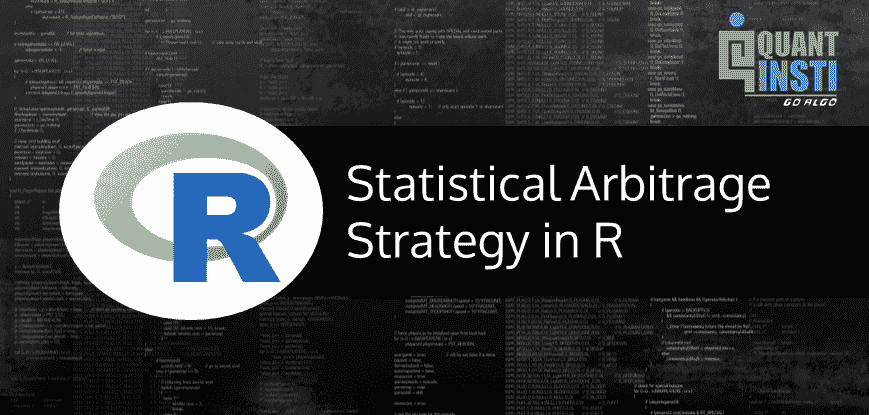
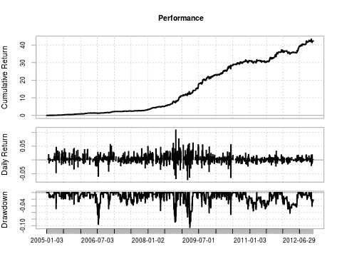
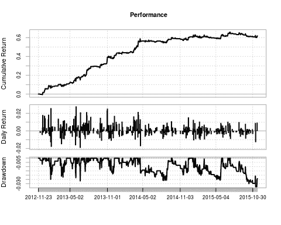
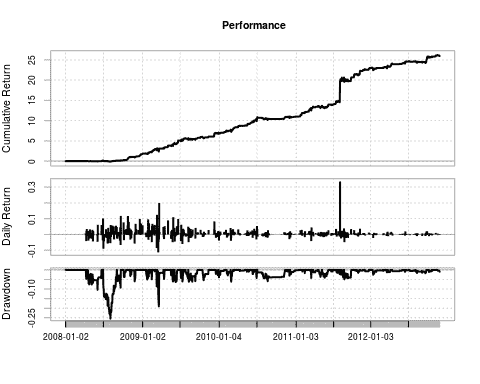
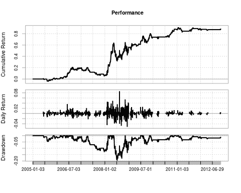
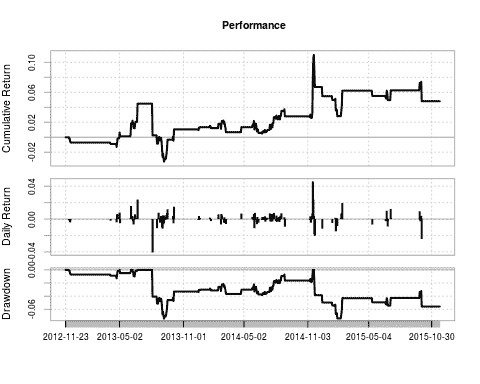
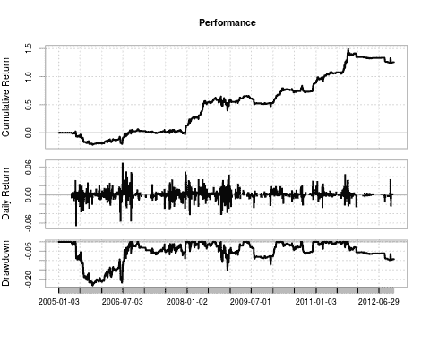
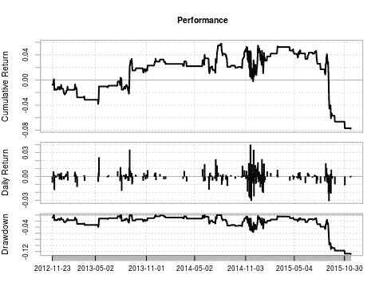
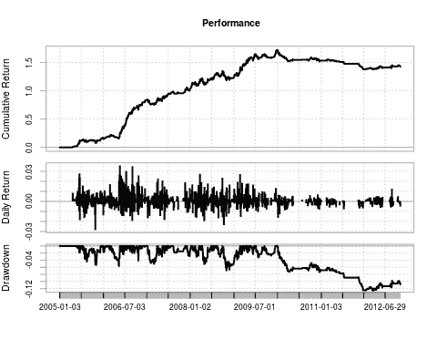
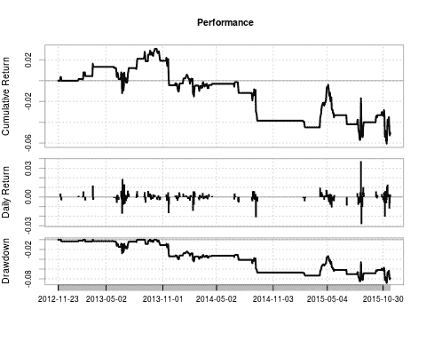

# 雅克·儒贝尔的 R -中的统计套利策略[EPAT 项目]

> 原文：<https://blog.quantinsti.com/epat-project-jacques-statistical-arbitrage/>



由雅克·儒贝尔

本文是作者提交的最后一个项目，作为他在 QuantInsti[算法交易(EPAT)](https://www.quantinsti.com/epat/) 高管课程的一部分。请务必查看我们的项目[页面](https://www.quantinsti.com/category/project-work-epat/)，看看我们的学生正在构建什么。

### **背景**

过去 6 个月一直关注我博客的人会知道，我参加了 QuantInsti 提供的算法交易的[管理课程。](https://www.quantinsti.com/courses/epat/)

这是一个旅程，这篇文章是我关于统计套利的期末项目的报告，用 r 语言编写。这篇文章是我的课堂笔记和源代码的结合。

为了欢迎读者贡献、改进、使用或参与这个项目，我把所有东西都上传到了 GitHub。它也将成为我在博客 QuantsPortal 上的[开源对冲基金项目](http://www.quantsportal.com/open-source-hedge-fund/)的一部分

我要特别感谢 QuantInsti 的团队。谢谢你为我的期末项目所做的所有修改，谢谢你不厌其烦地帮助我学习，谢谢你高水平的客户服务。

### **统计套利的历史**

由摩根许仁杰的农齐奥·塔尔塔利亚的量化小组在 20 世纪 80 年代中期首次开发和使用。

*   配对交易是一种“反向策略”，旨在利用配对比率的均值回复行为
*   大卫·肖，D.E .肖公司的创始人，离开摩根士丹利，在 20 世纪 80 年代后期创立了自己的“量化”交易公司，主要从事配对交易

### 什么是配对交易？

众所周知，统计套利交易或配对交易被定义为交易一种金融工具或一篮子金融工具，在大多数情况下是为了创造一个价值中立的篮子。

它的想法是，协整合对在本质上是平均回复。这些工具之间存在价差，偏离均值越远，反转的可能性就越大。

然而请注意，统计套利并不是一种无风险的策略。比方说，你已经为一对投资者建立了头寸，然后价差出现了趋势，而不是均值回归。

#### **概念**

**第一步**:找到 2 只相关证券

找到两种属于同一行业的证券，它们应该有相似的市值和平均交易量。

这方面的一个例子是盎格鲁黄金和和谐黄金。

**第二步**:计算价差

在接下来的代码中，我使用了线对比率来表示分布。就是简单的资产 A 的价格/资产 b 的价格。

**步骤 3** :计算配对比率/扩散的平均值、标准偏差和 z 值。

**步骤 4** :协整测试

在接下来的代码中，我使用扩展的 Dicky Fuller 检验(ADF 检验)来检验协整性。我设置了三个测试，每个测试都有不同数量的观察值(120，90，60)，所有三个测试都必须拒绝两者不协整的无效假设。

**第五步**:生成交易信号

交易信号是基于 z 值的，假设它们通过了协整测试。在我的项目中，我使用的 z 值为 1，因为我注意到与我竞争的其他算法使用的参数非常低。(我更希望 z 值为 2，因为它更符合文献，但是它的利润更低)

**第六步**:根据信号处理交易

**第 7 步**:汇报

### 我的项目的 **R** 降价

 **#### **导入包并设置目录**

第一步总是导入所需的包。

```py
#Imports
 require(tseries)
 require(urca) #Used for the ADF Test
 require(PerformanceAnalytics)
```

这一战略将适用于在约翰内斯堡证券交易所(JSE)上市的股票；因此，我不会使用 quantmod 包从 yahoo finance 中提取数据，相反，我已经获取并清理了存储在 SQL 数据库中的数据，并将其移动到桌面上的 CSV 文件中。

我将策略中使用的所有对添加到一个文件夹中，现在我将该文件夹设置为工作目录。

```py
##Change this to match where you stored the csv files folder name FullList
 setwd("~/R/QuantInsti-Final-Project-Statistical-Arbitrage/database/FullList")
```

#### **将从其他函数中调用的函数(无用户交互)**

下一步:创建所有需要的函数。下面的函数将从其他函数中调用，所以您不需要担心参数。

##### **添加列**

AddColumns 函数用于将存储变量所需的列添加到数据框中。

```py
#Add Columns to csvDataframe
 AddColumns
```

##### **准备数据**

PrepareData 函数计算对比率和对的 log10 价格。它还调用其中的 AddColumns 函数。

```py
PrepareData
```

##### **GenerateRowValue**

GenerateRowValue 函数计算数据框中给定行的平均值、标准差和 z 得分。

```py
#Calculate mean, stdDev, and z-score for the given Row [end]
 GenerateRowValue
```

##### **生成信号**

GenerateSignal 函数基于 z 得分创建一个多头、空头或收盘信号。您可以手动更改 z 值。对于进场信号，我将它设置为 1 和-1，任何介于 0.5 和-0.5 之间的 z 值都会产生一个收盘/出场信号。

```py
GenerateSignal  trigger)
 csvData$signal[counter]  -close)
 csvData$signal[counter]
```

##### **生成交易**

GenerateTransactions 函数负责为创建一对所需的多头和空头头寸分别设置进场和出场价格。

注意:QuantInsti 教了我们一个非常具体的交易策略回溯测试方法。他们使用 excel 来教授策略，当我编写这个策略时，我使用了很大一部分 excel 方法。

然而，展望未来，我将探索存储变量的其他方法。这种方法的一大好处是，你可以提取整个数据框架，分析交易的原因和所有相关细节。

```py
#Transactions based on trade signal
 #Following the framework set out initially by QuantInsti (Note: this can be coded better) 
 GenerateTransactions
```

##### **get returns day**

GetReturnsDaily 计算每个头寸的日收益，然后计算总收益并加上滑点。

```py
#Calculate daily returns generated 
 #Add implementation shortfall / slippage at close of trade
 GetReturnsDaily 0){csvData$LongReturn[end] 0){csvData$ShortReturn[end]
```

##### **生成报告**

接下来的两个参数用于生成报告。报告包括以下内容:制图:1 .权益曲线 2。下降曲线 3。每日回报条形图

统计:1。年度回报 2。年度夏普比率 3。最大水位下降

表:1。前 5 名提款及其持续时间

注意:如果你有一些额外的时间，那么你可以进一步将这个函数分解成更小的函数，以减少代码行，提高可用性。更少的代码=更少的错误

```py
#Returns an equity curve, annualized return, annualized sharpe ratio, and max drawdown
 GenerateReport  0){
 positiveTrades
```

#### **用户将参数传递给**的函数

接下来的两个函数是用户应该摆弄的唯一函数。

##### **回溯测试对**

当您想要对交易对(通过 CSV 文件传递的交易对)运行回溯测试时，使用回溯测试对

函数参数:

*   pair data = CSV 文件日期
*   平均值=用于计算分布平均值的观察次数。
*   滑点=充当经纪和滑点的基点数量
*   adfTest =布尔值—如果回溯测试应该测试协整
*   Critical Value = ADF 测试中用于测试协整的临界值
*   generateReport =布尔值-如果必须生成报告

```py
#The function that will be called by the user to backtest a pair
 BacktestPair  130){
 begin = mean){
 #Generate Row values
 pairData
```

##### **回溯测试组合**

BacktestPortfolio 接受一个 CSV 文件向量，然后生成一个权重相等的投资组合。

函数参数:

*   names = CSV 文件名的原子向量，例如:c('DsyLib.csv '，' OldSanlam.csv ')
*   平均值=用于计算分布平均值的观察次数。
*   杠杆=你想在投资组合中应用多少杠杆

```py
#An equally weighted portfolio of shares
 BacktestPortfolio
```

### **运行回溯测试**

现在我们可以开始使用我们的代码测试策略了。

#### **JSE 的纯套利**

当开始这个项目时，主要关注的是使用统计套利来寻找共同整合的股票对，然后进行交易，但是，我很快意识到，可以使用相同的代码来交易在同一交易所既有其主要上市又有其次要上市的股票。

如果两个上市都是在同一个交易所发现的，这就为纯粹的套利策略打开了大门，因为两个上市都是指同一种资产。因此，你不需要测试协整。

JSE 有两个非常明显的例子。

##### **第一个例子 Investec**

主要= Investec 有限公司:次要= Investec 有限公司

###### **Investec 样品内测试(2005-01-01 - 2012-11-23)**

测试以下参数

*   Investec 有限公司/ plc 对
*   平均值= 35
*   设置 adfTest = F(不测试协整)
*   x3 的杠杆作用

```py
#Investec
 leverage
```



```py
## [1] "Annual Returns: 0.619853087807437"
 ## [1] "Annualized Sharpe: 3.29778431709924"
 ## [1] "Max Drawdown: 0.105016628973292"
 ## From Trough To Depth Length To Trough Recovery
 ## 1 2009-03-19 2009-03-25 2009-05-04 -0.1050 28 5 23
 ## 2 2006-06-08 2006-07-13 2006-08-14 -0.0955 46 25 21
 ## 3 2008-10-03 2008-10-17 2008-10-24 -0.0887 16 11 5
 ## 4 2009-03-02 2009-03-02 2009-03-06 -0.0733 5 1 4
 ## 5 2008-10-27 2008-10-27 2008-11-05 -0.0697 8 1 7
```

###### **Investec 样本外测试(2012-11-23 - 2015-11-23)**

注意:如果你增加滑点，你很快就会和利润吻别。

```py
GenerateReport.xts(investec.returns, startDate = '2012-11-23', endDate = '2015-11-23')
```



```py
## [1] "Annual Returns: 0.1754103210963"
 ## [1] "Annualized Sharpe: 2.20385429706265"
 ## [1] "Max Drawdown: 0.0335642102186873"
 ## From Trough To Depth Length To Trough Recovery
 ## 1 2015-07-10 2015-11-13  -0.0336 96 89 NA
 ## 2 2013-06-18 2013-06-21 2013-07-01 -0.0267 10 4 6
 ## 3 2014-04-16 2014-08-13 2014-09-19 -0.0262 107 80 27
 ## 4 2015-01-20 2015-05-25 2015-06-01 -0.0258 91 86 5
 ## 5 2013-01-18 2013-01-24 2013-01-25 -0.0249 6 5 1
```

##### **第二个例子蒙迪**

主要= Mondi 有限公司:次要= Mondi 有限公司

###### **蒙迪样品内测试(2008-01-01 - 2012-11-23)**

测试以下参数

*   Mondi 有限公司/ plc 对
*   平均值= 35
*   设置 adfTest = F(不测试协整)
*   x3 的杠杆作用

世界日期

```py
mondi.returns
```



```py
## [1] "Annual Returns: 0.973552250431717"
 ## [1] "Annualized Sharpe: 2.88672185296756"
 ## [1] "Max Drawdown: 0.254688711989788"
 ## From Trough To Depth Length To Trough Recovery
 ## 1 2008-07-01 2008-08-01 2008-09-01 -0.2547 45 24 21
 ## 2 2009-03-11 2009-03-18 2009-04-08 -0.1906 21 6 15
 ## 3 2008-04-16 2008-06-03 2008-06-23 -0.1040 45 32 13
 ## 4 2008-09-02 2008-09-17 2008-09-18 -0.0926 13 12 1
 ## 5 2009-03-09 2009-03-09 2009-03-10 -0.0864 2 1 1
```

###### **蒙迪样本外检验(2012-11-23 - 2015-11-23)**

注意:在我所有的测试中，我发现我的数据越靠后，就越难从当天的数据中获利。我用当天的数据测试了同样的策略，它有更高的回报。

```py
GenerateReport.xts(mondi.returns, startDate = '2012-11-23', endDate = '2015-11-23')
```


```py
## [1] "Annual Returns: 0.0809094579019469"
 ## [1] "Annualized Sharpe: 1.25785312960412"
 ## [1] "Max Drawdown: 0.0385234269750542"
 ## From Trough To Depth Length To Trough Recovery
 ## 1 2013-12-19 2014-10-13 2015-01-26 -0.0385 273 202 71
 ## 2 2015-06-05 2015-08-14  -0.0313 120 49 NA
 ## 3 2015-01-27 2015-04-22 2015-04-28 -0.0245 63 60 3
 ## 4 2013-05-29 2013-05-30 2013-06-14 -0.0179 13 2 11
 ## 5 2013-11-08 2013-11-18 2013-12-18 -0.0175 28 7 21
```

### **JSE 的统计套利**

接下来，我们将看一看配对交易策略。

通常，一对包含 2 个部分，它们是:

*   分享一个市场领域
*   有相似的市值
*   相似的商业模式和客户
*   是相互整合的

在下面的所有投资组合中，我使用 3 倍杠杆

#### **建筑组合**

##### **入样测试(2005-01-01 - 2012-11-01)**

```py
names
```



```py
[1] "Annual Returns: 0.0848959306632411"
 ## [1] "Annualized Sharpe: 0.733688101181479"
 ## [1] "Max Drawdown: 0.193914686702112"
 ## From Trough To Depth Length To Trough Recovery
 ## 1 2008-05-19 2008-07-08 2008-11-03 -0.1939 119 36 83
 ## 2 2008-11-04 2008-12-03 2009-06-29 -0.1345 160 22 138
 ## 3 2006-08-25 2007-12-19 2008-02-19 -0.1272 372 331 41
 ## 4 2009-08-04 2009-10-01 2009-11-10 -0.0701 69 41 28
 ## 5 2009-11-25 2010-03-10 2010-09-29 -0.0486 211 73 138
```

##### **样本外检验(2012-11-23 - 2015-11-23)**

```py
GenerateReport.xts(ReturnSeries, startDate = '2012-11-23', endDate = '2015-11-23')
```



```py
## [1] "Annual Returns: 0.0159094762396512"
 ## [1] "Annualized Sharpe: 0.268766025866724"
 ## [1] "Max Drawdown: 0.0741426720423424"
 ## From Trough To Depth Length To Trough Recovery
 ## 1 2013-08-05 2013-09-06 2014-11-17 -0.0741 322 24 298
 ## 2 2014-11-20 2015-01-29  -0.0737 253 47 NA
 ## 3 2012-11-30 2013-04-23 2013-05-02 -0.0129 102 96 6
 ## 4 2013-06-10 2013-06-13 2013-06-24 -0.0100 10 4 6
 ## 5 2013-05-03 2013-05-03 2013-06-04 -0.0050 23 1 22
```

#### **保险组合**

##### **入样测试(2005-01-01 - 2012-11-01)**

```py
names
```



```py
## [1] "Annual Returns: 0.110600985165525"
 ## [1] "Annualized Sharpe: 0.791920916349154"
 ## [1] "Max Drawdown: 0.233251846760865"
 ## From Trough To Depth Length To Trough Recovery
 ## 1 2005-05-26 2005-10-14 2006-08-31 -0.2333 318 100 218
 ## 2 2008-10-15 2008-12-05 2009-04-30 -0.1513 134 38 96
 ## 3 2009-06-10 2009-12-10 2010-01-29 -0.1223 162 129 33
 ## 4 2011-10-04 2012-10-09  -0.0991 267 249 NA
 ## 5 2006-11-08 2007-12-11 2007-12-14 -0.0894 277 274 3
```

##### **样本外检验(2012-11-23 - 2015-11-23)**

```py
GenerateReport.xts(ReturnSeries, startDate = '2012-11-23', endDate = '2015-11-23')
```



```py
## [1] "Annual Returns: -0.0265926093350092"
 ## [1] "Annualized Sharpe: -0.319582293135835"
 ## [1] "Max Drawdown: 0.128061204573991"
 ## From Trough To Depth Length To Trough Recovery
 ## 1 2014-08-08 2015-11-20  -0.1281 326 324 NA
 ## 2 2012-11-28 2013-05-13 2013-07-31 -0.0393 167 111 56
 ## 3 2014-06-10 2014-06-26 2014-07-23 -0.0284 31 12 19
 ## 4 2013-08-01 2013-08-30 2013-09-03 -0.0255 23 21 2
 ## 5 2013-09-11 2013-10-22 2013-12-04 -0.0209 60 29 31
```

#### **一般零售组合**

##### **入样测试(2005-01-01 - 2012-11-01)**

```py
names
```



```py
## [1] "Annual Returns: 0.120956981644048"
 ## [1] "Annualized Sharpe: 1.4694780839876"
 ## [1] "Max Drawdown: 0.125406256082082"
 ## From Trough To Depth Length To Trough Recovery
 ## 1 2010-01-05 2012-01-17  -0.1254 705 504 NA
 ## 2 2008-09-29 2008-10-29 2009-02-20 -0.0690 101 23 78
 ## 3 2006-03-06 2006-05-15 2006-05-23 -0.0568 52 46 6
 ## 4 2005-07-18 2005-11-01 2005-12-06 -0.0538 101 76 25
 ## 5 2008-04-11 2008-04-29 2008-06-26 -0.0512 51 12 39
```

##### **样本外检验(2012-11-23 - 2015-11-23)**

```py
GenerateReport.xts(ReturnSeries, startDate = '2012-11-23', endDate = '2015-11-23')
```



```py
[1] "Annual Returns: -0.0171898953593881"
 ## [1] "Annualized Sharpe: -0.336265418351652"
 ## [1] "Max Drawdown: 0.0884145115767888"
 ## From Trough To Depth Length To Trough Recovery
 ## 1 2013-10-15 2015-11-11  -0.0884 528 519 NA
 ## 2 2013-03-18 2013-06-24 2013-08-12 -0.0279 100 66 34
 ## 3 2013-09-05 2013-09-06 2013-09-20 -0.0088 12 2 10
 ## 4 2013-09-23 2013-10-02 2013-10-08 -0.0049 11 7 4
 ## 5 2013-02-20 2013-02-20 2013-03-15 -0.0037 18 1 17
```

#### **结论**

在我所有的测试结束时，相信我——我做的测试比这份报告中的多得多，我得出的结论是，纯套利策略很有希望被用作使用真实资金的策略，但对特定行业股票组合的配对交易策略很紧张，不太可能以目前的形式用于生产。

我认为可以添加许多东西来提高性能。接下来，我将使用卡尔曼滤波器进行研究。

##### **更上一层楼[纯套利交易](https://quantra.quantinsti.com/course/statistical-arbitrage-trading)策略**

我只发现两只股票在同一个交易所同时上市；这意味着我们不能为该战略分配大量资金，因为它会产生很大的市场影响，但是，我们可以使用多个交易所，并增加使用的股票数量。

##### **关于配对交易策略的更多信息**

1.  ADF 测试中使用的观测值数量很大。问题是，必须进行协整检验，才能提出统计套利的要求，然而，通过使用 120、90 和 60 作为三个检验的参数，很难找到符合标准的配对，并且在不久的将来会以这种形式继续下去。(卡尔曼滤波在这里可能有用)
2.  我没有花太多时间去改变不同的参数，比如平均值计算中的观察次数。(这需要进一步探索)
3.  从上述行业投资组合中，我们可以看到，最初几年是非常有利可图的，但随着时间的推移，回报越来越低。我和业内的一些人以及我在开普敦大学做 stat arb 项目的朋友聊过，当地的传说是，2009 年高盛打开了他们的 stat arb 包，关于 JSE 上市的证券。
4.  同样的情况也出现在其他投资组合中，我没有把它们包括在这个报告中，但是它们在 R 代码文件中。
5.  我认为，这是由于大型机构使用相同的面包和黄油策略。你会注意到(如果你花足够的时间测试所有的策略),在 2009 年，数据似乎突然转向低回报。
6.  我觉得我使用的日末数据限制了我，如果我用日内数据测试策略，利润会更高。(我对 Mondi 的日内数据进行了一次测试，结果要高得多，但我仍要对行业投资组合进行测试)
7.  这是一种更简单的统计套利策略，我相信，如果我们改进计算价差的方法，并改变一些进场和出场规则，这种策略将变得更有利可图。

如果你看到了这篇文章的结尾，我感谢你，并希望它能增加一些价值。这是我第一次使用 Github，所以我很期待看到这个项目是否有新的贡献者。

Github 资源库:[https://github . com/jackal 08/quantin STI-Final-Project-Statistical-Arbitrage](https://github.com/Jackal08/QuantInsti-Final-Project-Statistical-Arbitrage)

在这篇关于[算法交易策略范例](/algorithmic-trading-strategies/)的文章中阅读其他策略。如果你想学习算法交易，那么[点击这里](https://www.quantinsti.com/epat)。

**更新** - *我们注意到一些用户在从雅虎和谷歌金融平台下载市场数据时面临挑战。如果你正在寻找市场数据的替代来源，你可以使用 [Quandl](https://www.quandl.com/) 来获得同样的信息。***