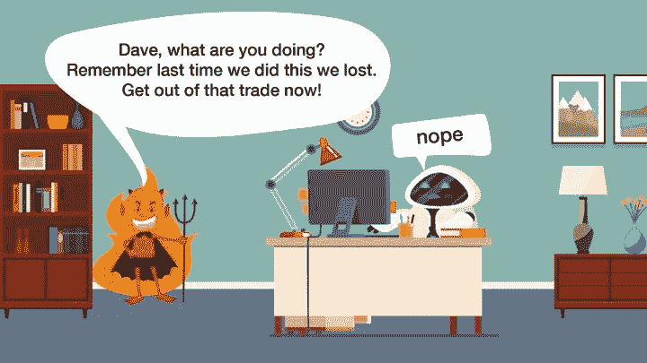
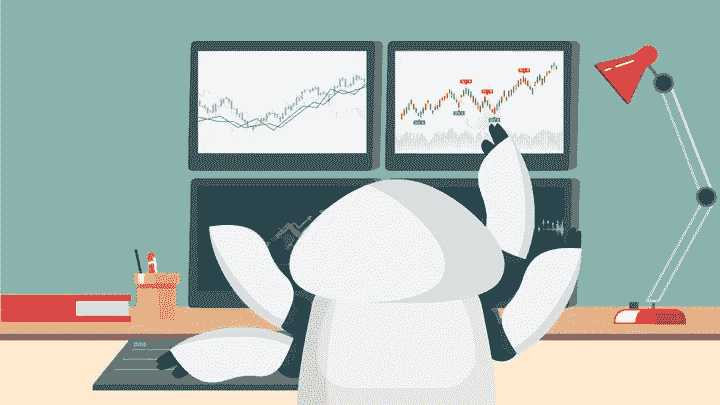

# 这几天大家都在学习算法交易的 5 个原因！

> 原文：<https://blog.quantinsti.com/everyone-learning-algorithmic-trading/>

由[查尼卡·塔卡](https://www.linkedin.com/in/chainika-bahl-thakar-b32971155/)

算法交易是当今最受欢迎的交易形式，比人工交易更有利，因为它能实现更快更准确的交易实践。

*[全球算法交易市场](https://www.businesswire.com/news/home/20210722005454/en/Global-Algorithmic-Trading-Market-2021-2026-Industry-Trends-Share-Size-Growth-Opportunity-and-Forecasts---ResearchAndMarkets.com)预计在预测期内(2021-2026 年)以 10%左右的 CAGR 增长。*

因此，无论是数据分析师、散户交易员还是 T4 工程师，几乎每个人都在努力学习算法交易。让我们讨论一下学习算法交易的 5 个原因，它们是:

*   [在不断增长的金融科技领域获得一份理想的工作](#to-get-a-dream-job-in-the-growing-fintech-domain)
*   [开发更加数据驱动的交易方法](#to-develop-a-more-data-driven-approach-to-trading)
*   [建立自己的 algo 交易平台或咨询公司](#to-set-up-ones-own-algo-trading-desk-or-consultancy-firm)
*   [减少交易中与人工相关的障碍](#to-reduce-manual-related-obstacles-in-trading)
*   [更好、更方便地管理风险](#to-manage-risks-better-and-with-convenience)

* * *

## 在不断增长的金融科技领域获得理想的工作

由于快速、准确和安全的方法，金融科技领域是世界上增长最快的领域。算法交易是金融科技领域的一部分，它吸引了那些希望赚取丰厚薪水和奖金的个人。

由于这个众所周知的事实，许多人渴望学习算法交易，但他们必须记住，有各种各样的工作角色，如[量化分析师](/quantitative-analyst/#educational-requirements-to-become-a-quantitative-analyst)、[量化开发员](/quantitative-developer/)等。

不管你选择什么角色，在算法交易中你都需要学习不同的方面，这些方面是:

*   程序设计语言
*   金融市场经验
*   数据管理
*   定量分析

* * *

## 开发一个更加数据驱动的交易方法

数据驱动的交易更准确，遭受损失的机会更少。借助数据，您可以:

*   [研究历史市场数据](/historical-market-data-python-api/)
*   [回溯测试你的交易策略](/backtesting/)
*   [同时监控金融市场，寻找最佳交易](/financial-markets-introduction/)

数据是算法交易过程中最重要的部分。分析数据可以揭示金融市场的趋势，为所有的交易想法和策略创造奠定基础。因此，数据是金融市场交易的燃料。

此外，它通常是关于“一个能快速获取交易数据的人”。不仅快速访问有效，您还需要了解关于[数据管理](/data-engineering/)的知识，因为这两者都是不可或缺的。

因此，通过快速访问数据、良好的数据管理以及正确的数据实施，一个人可以在金融市场中先于他人进行交易并获得优势。

在人工智能或机器学习的帮助下，可以更快地提取数据，并将其转化为有用的信息。

5 种不同类型的数据产品是:

*   实时数据(1 级、2 级、3 级和逐节拍数据)
*   快照数据
*   一天结束(EOD)的数据
*   公司数据
*   史料

* * *

## 建立自己的交易平台或咨询公司

为了[建立自己的交易平台](/setting-up-an-algo-trading-desk/)或咨询公司，你需要掌握算法交易的必要知识，没有这些知识就不可能前进。

一旦你很好地理解了算法交易，你将能够以最有效的方式遵循这个过程。交易台有助于给你一个优势，因为它是一种有着美好未来的业务。

随着算法交易在全球范围内的快速增长，拥有一个交易平台或一家咨询公司可能会非常有益和成功。就像任何其他业务一样，建立自己的交易平台或咨询公司需要资金、奉献精神和丰富的知识。

此外，由于交易员的专业知识和表现，他们依赖于交易台。

* * *

## 减少交易中与人工相关的障碍

谈到[算法交易](/why-you-should-be-doing-algorithmic-trading/)优于传统交易，已经证明通过算法进行交易更快更准确，没有可能导致错误的人类情绪。此外，交易成本降低，因为算法只按指示的方式执行。

让我们看看算法交易扫除了什么障碍:

### 恐惧、贪婪或过度兴奋等情绪不会占上风

在算法交易中，人们可以确信不会被情绪所驱使，这种情绪会导致在制定交易策略或执行交易时做出错误的决策。算法交易完全建立在逻辑的基础上，以最佳回报为目标。

<figure class="kg-card kg-image-card kg-card-hascaption">

<figcaption>No human emotions</figcaption>

</figure>

### 降低交易中的交易成本

在算法交易的帮助下，交易成本被降至最低，因为算法不会因受情绪影响而在短时间内跳到不同的交易。因此，算法按照指示的方式工作。

<figure class="kg-card kg-image-card kg-card-hascaption">

<figcaption>Less transaction costs </figcaption>

</figure>

### 交易时的时间效率

说到节省时间，算法交易效果最好，因为它在不同的金融市场同时监控和交易。算法基于不断变化的市场条件、[趋势](/predict-trends-stock-markets-webinar-5-september-2019/)和止损、止损限制等指令来执行交易。

<figure class="kg-card kg-image-card kg-card-hascaption">

<figcaption>Time efficient</figcaption>

</figure>

### 帮助为未来做好准备

算法交易是一个为未来做好准备的强大工具，因为我们已经在开始讨论了算法交易者是如何随着时间变得越来越强大的。

<figure class="kg-card kg-image-card kg-card-hascaption">

<figcaption>Future ready </figcaption>

</figure>

* * *

## 更好、更方便地管理风险

交易中的风险管理对于避免承担因[股市](/stock-market-data-analysis-python/)交易而产生的损失风险至关重要。风险管理涉及风险的识别、评估和缓解，这些风险通常在市场走势与预期相反时出现。

因此，在对市场进行彻底分析的基础上，在预测所有风险之后，设定你的预期是非常重要的。

借助算法交易，以下是风险管理的措施:

### 投资组合优化

投资组合优化意味着分析不同投资比例的投资组合。通过计算每个投资组合的风险和回报，可以实现投资的最优化。

例如，可以使用[夏普比率](https://quantra.quantinsti.com/glossary/Sharpe-Ratio#:~:text=The%20Sharpe%20ratio%20measures%20the,taking%20to%20earn%20additional%20returns.)来分析一个投资组合，利用该比率可以找到投资组合中每项投资的超额收益与额外风险的比率。

因此，可以优化投资组合，使夏普比率较高的股票多于夏普比率较低的股票。

### 对冲

对冲是一种投资策略，旨在抵消潜在的损失，或者换句话说，未来预期的价格波动。对于套期保值，金融工具如保险、[期货合约](https://quantra.quantinsti.com/glossary/Futures)、[掉期](https://quantra.quantinsti.com/glossary/Swap)、[期权](https://quantra.quantinsti.com/glossary/Option)等。可以用来对冲。

例如，A 级大米的期货在商品交易所交易，每份合约的价格是 100 公斤。Mani 希望在该月的最后一周购买 5000 公斤 A 级大米，而 Russell 希望在该月的最后一周出售 5000 公斤 A 级大米。

现在，期货合约对双方都合适，因为双方可以在交易所执行 50 份合约的交易。

### 1%法则和 2%投资法则

交易中的 1%和 2%原则意味着每笔交易中可行的最大风险应该是 1%或 2%。这有助于你避免否则可能发生的过度损失。

例如，通过使用衡量波动性的 [Beta](/asset-beta-market-beta-python/) ，如果投资一只股票的风险超过 2%,就可以避免交易。

### 利用先进技术监控金融市场

应该使用机器学习等人工智能来监控交易，以便找到最佳的交易机会。例如，通过利用机器学习技术，算法监控不同的金融市场以及金融资产，以找到最有利的交易机会。

### 避免不明确的交易设置

如果你使用均线、均线等移动指标。其中一个指标显示了清晰的交易设置，但与其他指标的交易设置不一致，这就造成了混乱。

在这种情况下，最好等待合适的交易，不要在不确定的时候做任何决定。例如，如果均线不符合均线，在沉迷交易之前，必须耐心等待合适的交易场景。

### 止损

止损是当股票价格达到被称为止损价格的特定价格时触发的买入或卖出指令。这有助于交易者避免持续监控市场。

例如，如果你以每股 50 美元的价格买入 XYZ 股票，而你担心它会下跌，你可以使用止损单。止损单可以指示在价格跌破某个价位时卖出。比方说，你决定把价格定为每股 45 美元，如果低于这个价格，算法就会卖出股票，以避免更大的损失。

* * *

## 结论

这篇文章旨在简要提及算法交易成为趋势的 5 个最重要的原因。此外，这篇文章旨在帮助你了解这种先进的交易技术与传统的手工交易的区别。

如果你想开始学习算法交易，你可以报名参加[算法交易入门课程！](https://quantra.quantinsti.com/course/getting-started-with-algorithmic-trading)从头开始。

* * *

*<small>免责声明:本文提供的所有数据和信息仅供参考。QuantInsti 对本文中任何信息的准确性、完整性、现时性、适用性或有效性不做任何陈述，也不对这些信息中的任何错误、遗漏或延迟或因其显示或使用而导致的任何损失、伤害或损害负责。所有信息均按原样提供。</small>*